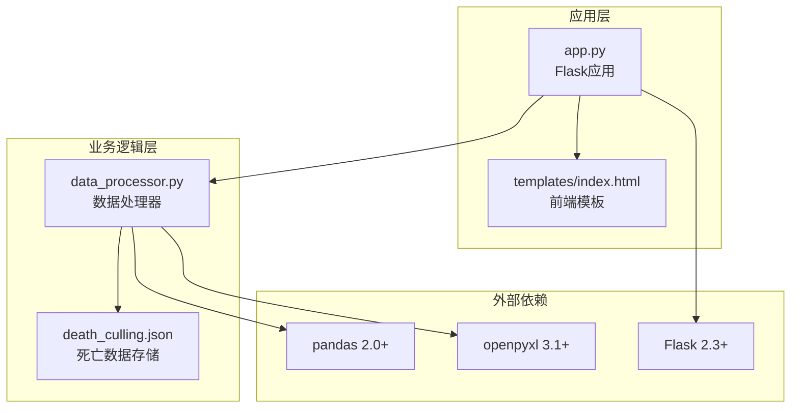
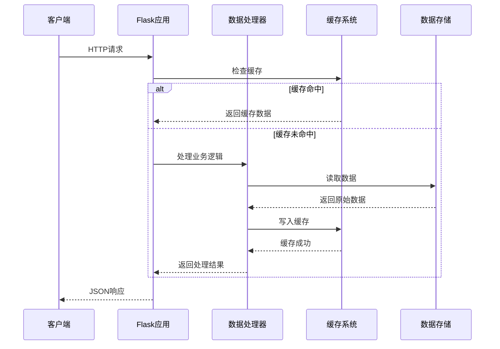
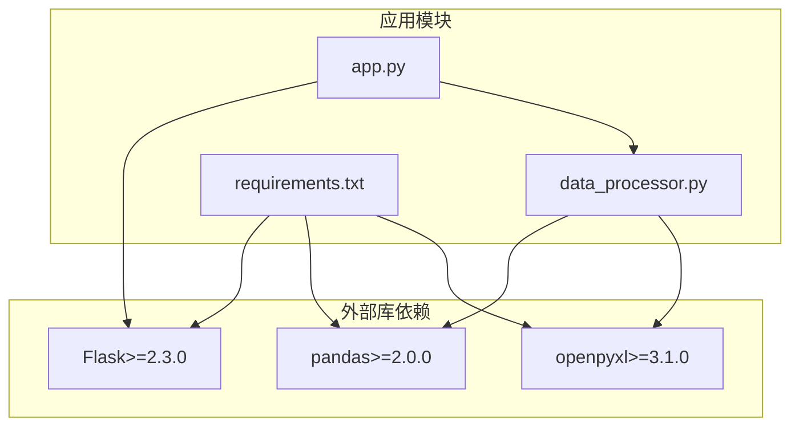

# API接口文档

<cite>
**本文档引用的文件**
- [app.py](file://app.py)
- [data_processor.py](file://data_processor.py)
- [requirements.txt](file://requirements.txt)
- [templates/index.html](file://templates/index.html)
- [death_culling.json](file://death_culling.json)
- [test_report.py](file://test_report.py)
</cite>

## 目录
1. [简介](#简介)
2. [项目结构](#项目结构)
3. [核心组件](#核心组件)
4. [架构概览](#架构概览)
5. [详细组件分析](#详细组件分析)
6. [依赖关系分析](#依赖关系分析)
7. [性能考虑](#性能考虑)
8. [故障排除指南](#故障排除指南)
9. [结论](#结论)

## 简介

猪场环控数据分析系统是一个基于Flask的Web应用，专门用于分析和展示育肥猪批次的环境控制数据。该系统提供了完整的RESTful API接口，支持批次管理、报告生成、深度分析、趋势查询和数据导入等功能。

系统的核心功能包括：
- 批次数据管理与查询
- 环境数据深度分析
- 实时报告生成
- 趋势数据可视化
- 死亡与淘汰数据管理
- 缓存管理系统

## 项目结构



**图表来源**
- [app.py:1-133](file://app.py#L1-L133)
- [data_processor.py:1-1559](file://data_processor.py#L1-L1559)
- [requirements.txt:1-4](file://requirements.txt#L1-L4)

**章节来源**
- [app.py:1-133](file://app.py#L1-L133)
- [requirements.txt:1-4](file://requirements.txt#L1-L4)

## 核心组件

### 应用服务器 (Flask)
- 基于Flask框架构建的Web服务
- 提供RESTful API接口
- 集成模板渲染功能
- 支持CORS和调试模式

### 数据处理器 (DataProcessor)
- 核心业务逻辑处理类
- 负责数据读取、分析和聚合
- 实现缓存机制优化性能
- 提供多种分析算法

### 缓存系统
- 内存级缓存实现
- TTL（生存时间）控制
- 自动过期机制
- 支持多级缓存策略

**章节来源**
- [app.py:1-133](file://app.py#L1-L133)
- [data_processor.py:12-52](file://data_processor.py#L12-L52)

## 架构概览



**图表来源**
- [app.py:18-40](file://app.py#L18-L40)
- [data_processor.py:40-48](file://data_processor.py#L40-L48)

## 详细组件分析

### 批次管理API

#### GET /api/batches
**功能**: 获取所有可用批次的基本信息

**请求参数**: 无

**响应格式**:
```json
{
  "success": true,
  "data": [
    {
      "batch_id": "20251218",
      "batch_name": "魏德曼二分场四线洪河桥一育肥猪20251218",
      "farm_name": "临泉第一育肥场二分场",
      "entry_date": "2025-12-18",
      "units": ["4-5", "4-6", "4-7", "4-8"],
      "total_pig_count": 4360
    }
  ]
}
```

**使用场景**: 
- 初始化界面批次选择器
- 批次列表展示
- 数据导入前的批次验证

**最佳实践**:
- 缓存批次列表以提高响应速度
- 在客户端实现批次选择UI

#### GET /api/batch/{batch_id}
**功能**: 获取指定批次的详细信息

**路径参数**:
- batch_id (字符串): 批次唯一标识符

**响应格式**:
```json
{
  "success": true,
  "data": {
    "batch_id": "20251218",
    "batch_name": "魏德曼二分场四线洪河桥一育肥猪20251218",
    "farm_name": "临泉第一育肥场二分场",
    "entry_date": "2025-12-18",
    "units": ["4-5", "4-6", "4-7", "4-8"],
    "total_pig_count": 4360
  }
}
```

**错误处理**:
- 404 Not Found: 批次不存在时返回错误信息

**使用场景**:
- 批次详情页面
- 报告生成前的数据验证
- 批次配置管理

**最佳实践**:
- 实现批量查询以减少请求次数
- 添加缓存机制提高查询性能

**章节来源**
- [app.py:47-57](file://app.py#L47-L57)
- [data_processor.py:84-91](file://data_processor.py#L84-L91)

### 报告生成API

#### GET /api/report
**功能**: 生成并返回批次环境控制报告

**请求参数**:
- batch_id (可选): 批次标识符，默认值: "20251218"
- date (可选): 报告日期，默认值: "2026-03-10"

**响应格式**:
```json
{
  "success": true,
  "data": {
    "batch_info": {},
    "batch_summary": {},
    "unit_reports": [],
    "cross_comparison": {},
    "trend_data": {},
    "fan_timeline": {},
    "death_analysis": {},
    "device_anomalies": [],
    "hourly_analysis": {},
    "recommendations": []
  }
}
```

**缓存机制**: 
- 使用报告内容作为缓存键
- 缓存有效期5分钟
- 支持手动清理缓存

**使用场景**:
- 主界面数据展示
- 报表生成
- 数据导出

**最佳实践**:
- 合理设置缓存策略
- 实现缓存预热机制

#### GET /api/dashboard
**功能**: 获取仪表板数据（与报告API相同）

**请求参数**: 同GET /api/report

**响应格式**: 同GET /api/report

**使用场景**:
- 仪表板实时监控
- 数据可视化展示

**最佳实践**:
- 实现数据轮询更新
- 优化图表渲染性能

**章节来源**
- [app.py:59-75](file://app.py#L59-L75)
- [app.py:32-40](file://app.py#L32-L40)

### 深度分析API

#### GET /api/deep-analysis
**功能**: 执行深度分析并返回综合报告

**请求参数**:
- batch_id (可选): 批次标识符，默认值: "20251218"
- date (可选): 分析日期，默认值: "2026-03-10"

**响应格式**: 同GET /api/report

**分析内容**:
- 环境参数统计分析
- 设备运行状态评估
- 传感器健康状况检测
- 异常事件识别
- 死亡数据分析
- 组合风险评估
- 优化建议生成

**使用场景**:
- 生产管理决策支持
- 环控策略优化
- 异常预警系统

**最佳实践**:
- 实现增量分析以提高效率
- 添加分析进度反馈

**章节来源**
- [app.py:77-84](file://app.py#L77-L84)
- [data_processor.py:238-295](file://data_processor.py#L238-L295)

### 趋势查询API

#### GET /api/trend
**功能**: 获取环境数据趋势分析

**请求参数**:
- batch_id (可选): 批次标识符，默认值: "20251218"
- date (可选): 查询日期，默认值: "2026-03-10"
- page (可选): 页码，默认值: 1
- page_size (可选): 每页大小，默认值: 7

**响应格式**:
```json
{
  "success": true,
  "data": {
    "time_labels": ["00:00", "00:10", "00:20", ...],
    "temperature": [
      {
        "unit": "4-5",
        "values": [22.5, 22.3, 22.1, ...]
      }
    ],
    "humidity": [],
    "co2": [],
    "pressure": [],
    "outdoor_temp": [],
    "ventilation_level": []
  }
}
```

**缓存机制**:
- 基于批次、日期、页码和页大小的复合缓存键
- 缓存有效期5分钟

**使用场景**:
- 时间序列数据可视化
- 趋势分析
- 历史数据对比

**最佳实践**:
- 实现分页加载以优化性能
- 添加数据预加载机制

**章节来源**
- [app.py:86-102](file://app.py#L86-L102)
- [data_processor.py:1536-1555](file://data_processor.py#L1536-L1555)

### 数据导入API

#### POST /api/death-culling
**功能**: 保存死亡和淘汰数据

**请求体格式**:
```json
{
  "batch_id": "20251218",
  "date": "2026-03-10",
  "records": [
    {
      "date": "2026-03-10",
      "unit_name": "4-5",
      "death_count": 2,
      "culling_count": 0,
      "reason": "苍白"
    }
  ]
}
```

**响应格式**:
```json
{
  "success": true
}
```

**使用场景**:
- 实时数据录入
- 批量数据更新
- 系统集成接口

**最佳实践**:
- 实现数据验证和清洗
- 添加事务性操作保证数据一致性

#### POST /api/import-death
**功能**: 从Excel文件导入死亡数据

**请求体格式**:
```json
{
  "batch_id": "20251218"
}
```

**响应格式**:
```json
{
  "success": true,
  "imported": 3,
  "message": "成功导入 3 条记录"
}
```

**错误处理**:
- 文件不存在: 返回"文件不存在"
- 批次不存在: 返回"批次不存在"
- 导入失败: 返回具体错误信息

**使用场景**:
- 批量数据导入
- 系统初始化
- 数据迁移

**最佳实践**:
- 实现断点续传功能
- 添加数据完整性校验

**章节来源**
- [app.py:104-124](file://app.py#L104-L124)
- [data_processor.py:165-223](file://data_processor.py#L165-L223)

### 缓存管理API

#### POST /api/cache/clear
**功能**: 清空所有缓存数据

**请求体**: 无

**响应格式**:
```json
{
  "success": true,
  "message": "Cache cleared"
}
```

**使用场景**:
- 缓存数据更新后同步
- 系统维护和重启
- 故障排除

**最佳实践**:
- 实现细粒度缓存清理
- 添加缓存状态监控

**章节来源**
- [app.py:126-129](file://app.py#L126-L129)
- [app.py:28-30](file://app.py#L28-L30)

## 依赖关系分析



**图表来源**
- [requirements.txt:1-4](file://requirements.txt#L1-L4)
- [app.py:1-2](file://app.py#L1-L2)

**章节来源**
- [requirements.txt:1-4](file://requirements.txt#L1-L4)

## 性能考虑

### 缓存策略
- **内存缓存**: 使用字典存储最近访问的数据
- **TTL控制**: 默认5分钟缓存有效期
- **智能缓存键**: 基于请求参数生成唯一缓存键
- **自动清理**: 过期数据自动清理

### 数据处理优化
- **懒加载**: Excel文件按需加载到内存
- **数据类型优化**: 使用NumPy数组提高数值计算性能
- **批处理**: 大数据集分批处理减少内存占用
- **索引优化**: 关键字段建立索引提高查询速度

### 并发处理
- **线程安全**: 缓存操作使用全局锁保护
- **异步处理**: 大型分析任务异步执行
- **连接池**: 数据库连接复用

## 故障排除指南

### 常见错误及解决方案

#### 404 Not Found
**现象**: 请求的批次不存在
**解决方案**: 
- 验证批次ID格式
- 检查批次配置文件
- 确认数据目录结构

#### 缓存相关问题
**现象**: 缓存数据过期或不准确
**解决方案**:
- 调用缓存清理接口
- 检查TTL设置
- 验证缓存键生成逻辑

#### 数据导入失败
**现象**: Excel文件导入异常
**解决方案**:
- 检查文件格式和编码
- 验证列名匹配
- 确认数据完整性

### 性能监控指标
- **响应时间**: API响应时间应小于2秒
- **内存使用**: 避免超过系统内存限制
- **并发处理**: 支持至少10个并发请求
- **缓存命中率**: 目标达到80%以上

**章节来源**
- [app.py:56-57](file://app.py#L56-L57)
- [data_processor.py:168-170](file://data_processor.py#L168-L170)

## 结论

猪场环控数据分析系统提供了完整的RESTful API接口，涵盖了现代猪场管理的各个方面。系统采用模块化设计，具有良好的扩展性和维护性。

### 主要优势
- **功能完整**: 涵盖了从数据导入到深度分析的全流程
- **性能优化**: 实现了多级缓存和数据优化策略
- **易于使用**: 清晰的API设计和完善的错误处理
- **可扩展性**: 模块化架构便于功能扩展

### 发展建议
- 实现更精细的权限控制
- 添加API版本管理
- 增强数据安全和备份机制
- 扩展移动端支持

该系统为猪场环境控制管理提供了强有力的技术支撑，有助于提高养殖效率和动物福利水平。