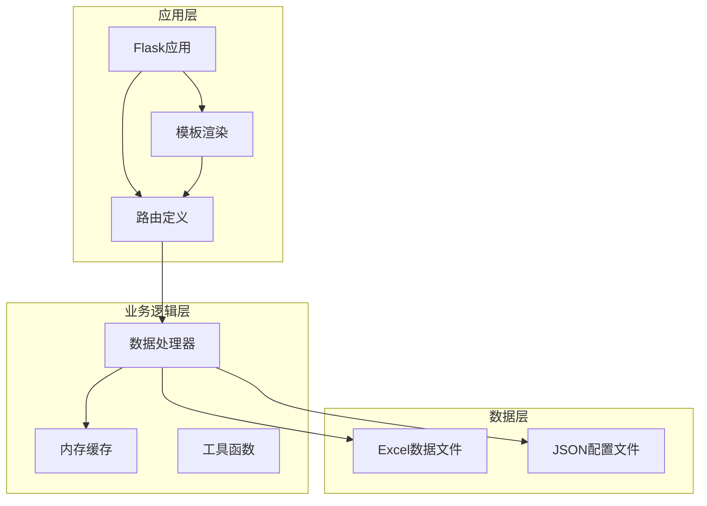
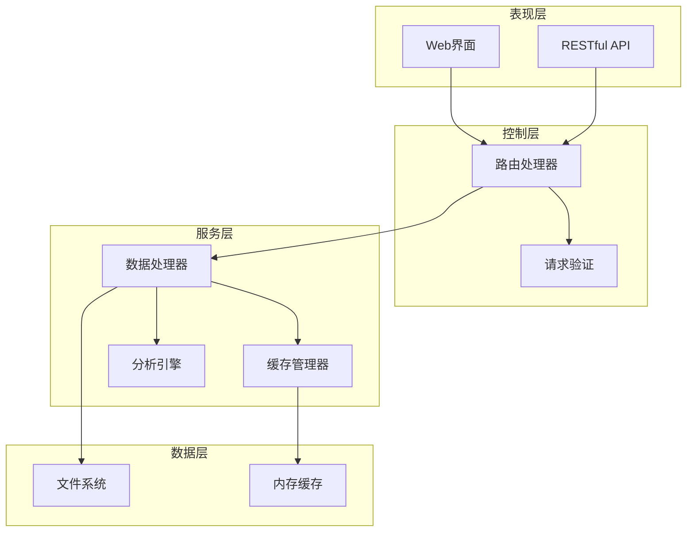
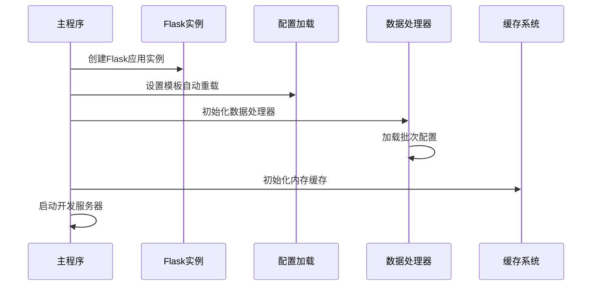
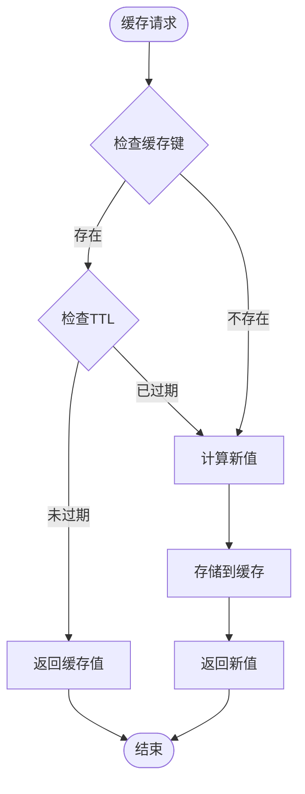
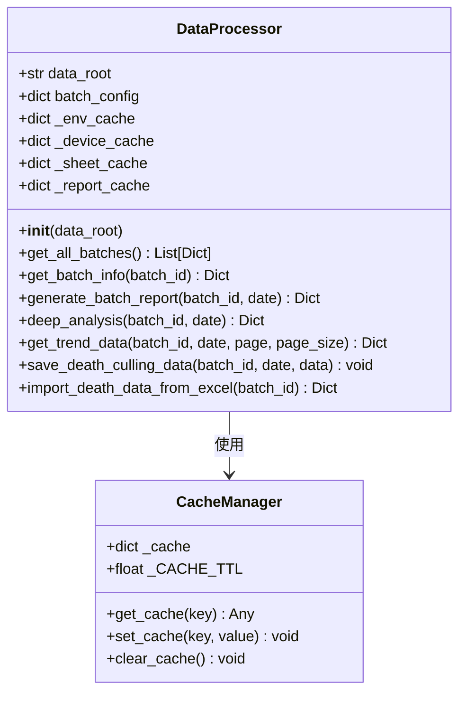
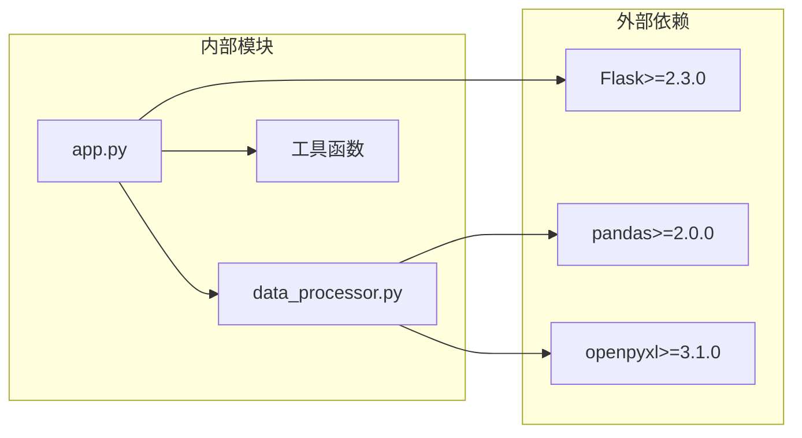

# Flask应用架构

<cite>
**本文档引用的文件**
- [app.py](file://app.py)
- [data_processor.py](file://data_processor.py)
- [analyze_units.py](file://analyze_units.py)
- [test_report.py](file://test_report.py)
- [requirements.txt](file://requirements.txt)
- [templates/index.html](file://templates/index.html)
- [death_culling.json](file://death_culling.json)
</cite>

## 目录
1. [简介](#简介)
2. [项目结构](#项目结构)
3. [核心组件](#核心组件)
4. [架构总览](#架构总览)
5. [详细组件分析](#详细组件分析)
6. [依赖关系分析](#依赖关系分析)
7. [性能考虑](#性能考虑)
8. [故障排除指南](#故障排除指南)
9. [结论](#结论)
10. [附录](#附录)

## 简介
本项目是一个基于Flask的育肥猪批次环境控制与设备运行深度分析系统。应用通过Web界面展示批次级别的环境数据分析、设备运行状态、异常检测、趋势分析以及死亡/淘汰数据关联分析。系统采用内存缓存机制提升数据访问性能，并提供RESTful API接口供前端调用。

## 项目结构
项目采用典型的Flask应用目录结构，主要包含以下模块：
- 应用入口：app.py
- 数据处理核心：data_processor.py
- 工具脚本：analyze_units.py、test_report.py
- 配置文件：requirements.txt、death_culling.json
- 模板文件：templates/index.html
- 数据文件：Excel格式的环境数据和设备数据

**图表来源**
- [app.py:1-133](file://app.py#L1-L133)
- [data_processor.py:1-800](file://data_processor.py#L1-L800)

**章节来源**
- [app.py:1-133](file://app.py#L1-L133)
- [requirements.txt:1-4](file://requirements.txt#L1-L4)

## 核心组件
本节详细介绍Flask应用的核心组件及其职责分工。

### Flask应用实例
应用通过Flask类创建主应用实例，并启用模板自动重载功能，便于开发调试。

### 路由系统
应用定义了完整的RESTful API路由体系，包括：
- 批次管理：获取所有批次、获取特定批次信息
- 报表生成：生成综合报表、仪表板数据
- 深度分析：趋势数据、异常检测
- 数据操作：保存死亡/淘汰数据、导入Excel数据
- 缓存管理：清除缓存

### 数据处理器
DataProcessor类是应用的核心业务逻辑组件，负责：
- 批次配置管理
- Excel数据文件解析
- 综合报表生成
- 异常检测算法
- 设备逻辑分析

### 内存缓存系统
实现了轻量级的内存缓存机制，支持TTL（Time-To-Live）过期控制，用于提升重复数据访问的性能。

**章节来源**
- [app.py:6-133](file://app.py#L6-L133)
- [data_processor.py:54-800](file://data_processor.py#L54-L800)

## 架构总览
应用采用分层架构设计，各层职责清晰分离，便于维护和扩展。

**图表来源**
- [app.py:42-133](file://app.py#L42-L133)
- [data_processor.py:54-800](file://data_processor.py#L54-L800)

## 详细组件分析

### 应用初始化流程
应用启动时执行以下初始化步骤：

**图表来源**
- [app.py:6-11](file://app.py#L6-L11)
- [data_processor.py:63-82](file://data_processor.py#L63-L82)

### 路由设计原则
应用遵循RESTful设计原则，路由命名规范如下：
- 使用名词复数形式表示资源集合
- 使用路径参数标识具体资源
- 使用查询参数传递过滤条件
- 返回标准化的JSON响应格式

### 请求处理机制
每个路由的请求处理流程包括：
1. 参数提取和验证
2. 缓存命中检查
3. 业务逻辑处理
4. 数据清理和格式化
5. 响应返回

### 模板系统配置
应用使用Jinja2模板引擎，配置特点：
- 启用模板自动重载
- 支持Chart.js可视化库
- 响应式CSS样式设计
- 多Tab页面导航结构

**章节来源**
- [app.py:42-133](file://app.py#L42-L133)
- [templates/index.html:1-800](file://templates/index.html#L1-L800)

### 缓存系统实现
缓存系统采用内存字典存储，具有以下特性：

**图表来源**
- [app.py:18-40](file://app.py#L18-L40)
- [data_processor.py:40-48](file://data_processor.py#L40-L48)

缓存实现细节：
- TTL默认5分钟（300秒）
- 缓存键格式：`report:{batch_id}:{date}` 或 `trend:{batch_id}:{date}:{page}:{page_size}`
- 支持全局缓存清理
- 自动清理过期数据

### 数据处理器集成
DataProcessor类提供了完整的数据处理能力：

**图表来源**
- [data_processor.py:54-800](file://data_processor.py#L54-L800)

**章节来源**
- [data_processor.py:54-800](file://data_processor.py#L54-L800)

### 静态资源管理策略
应用采用以下静态资源管理策略：
- 模板文件集中管理在templates目录
- CSS样式采用CSS变量实现主题定制
- JavaScript图表库通过CDN引入
- 响应式布局适配多端设备

## 依赖关系分析

**图表来源**
- [requirements.txt:1-4](file://requirements.txt#L1-L4)
- [app.py:1-3](file://app.py#L1-L3)

**章节来源**
- [requirements.txt:1-4](file://requirements.txt#L1-L4)

## 性能考虑
基于代码分析，应用在性能方面有以下特点：

### 缓存策略
- 内存缓存减少重复数据处理开销
- TTL机制确保数据新鲜度
- 分级缓存：应用层缓存和处理器层缓存

### 数据处理优化
- Excel文件缓存避免重复读取
- 批次配置缓存
- 数值计算结果缓存

### 建议的性能优化措施
1. 实现分布式缓存（如Redis）
2. 添加数据库持久化层
3. 实现异步任务处理大数据分析
4. 添加请求限流机制
5. 实现CDN加速静态资源

## 故障排除指南

### 常见问题及解决方案

#### Excel文件读取失败
**症状**：API返回错误或空数据
**原因**：Excel文件格式不正确或路径错误
**解决**：检查文件命名规范和路径配置

#### 缓存数据过期
**症状**：显示陈旧数据
**解决**：调用缓存清理API或等待TTL过期

#### 死亡数据导入失败
**症状**：导入后数据未更新
**解决**：确认Excel文件格式符合要求，检查JSON文件写入权限

**章节来源**
- [app.py:104-124](file://app.py#L104-L124)
- [data_processor.py:165-223](file://data_processor.py#L165-L223)

## 结论
本Flask应用架构设计合理，层次清晰，功能完整。通过内存缓存机制有效提升了数据访问性能，通过RESTful API提供了良好的前后端分离架构。建议后续引入更完善的缓存策略、数据库持久化和异步处理机制，以进一步提升系统的可扩展性和性能表现。

## 附录

### API接口定义
应用提供以下主要API接口：

| 接口 | 方法 | 功能描述 |
|------|------|----------|
| `/` | GET | 主页路由，渲染批次选择界面 |
| `/api/batches` | GET | 获取所有批次列表 |
| `/api/batch/<batch_id>` | GET | 获取指定批次信息 |
| `/api/report` | GET | 获取综合报表数据 |
| `/api/dashboard` | GET | 获取仪表板数据 |
| `/api/deep-analysis` | GET | 获取深度分析数据 |
| `/api/trend` | GET | 获取趋势分析数据 |
| `/api/death-culling` | POST | 保存死亡/淘汰数据 |
| `/api/import-death` | POST | 导入Excel死亡数据 |
| `/api/cache/clear` | POST | 清除缓存 |

### 配置选项
应用配置主要包括：
- TEMPLATES_AUTO_RELOAD：模板自动重载
- 缓存TTL：默认300秒
- 默认批次配置：内置默认批次信息

### 最佳实践建议
1. 在生产环境中禁用模板自动重载
2. 实现更严格的输入验证和错误处理
3. 添加日志记录机制
4. 考虑添加用户认证和授权机制
5. 实现数据备份和恢复机制