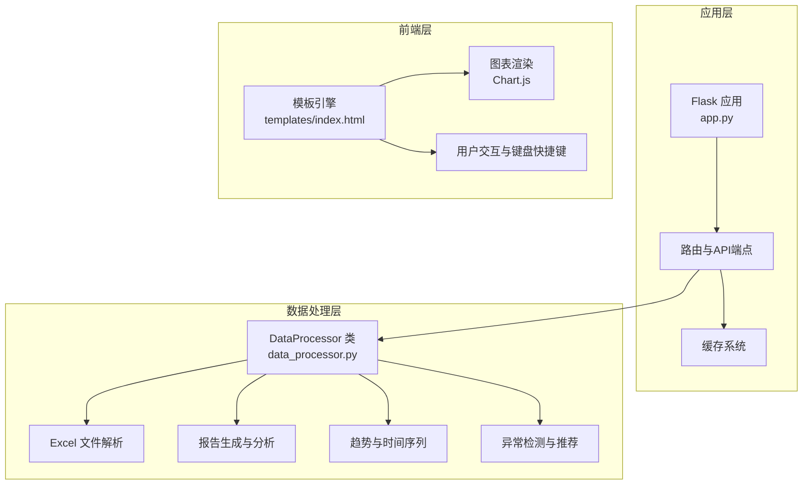
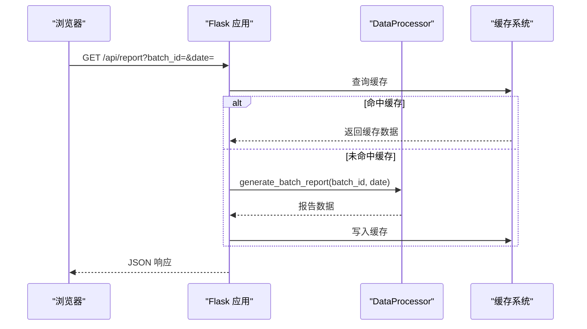
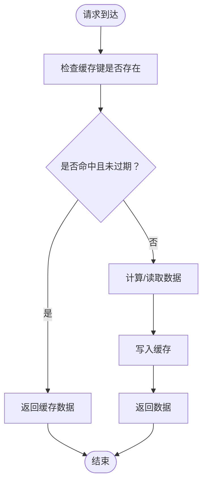
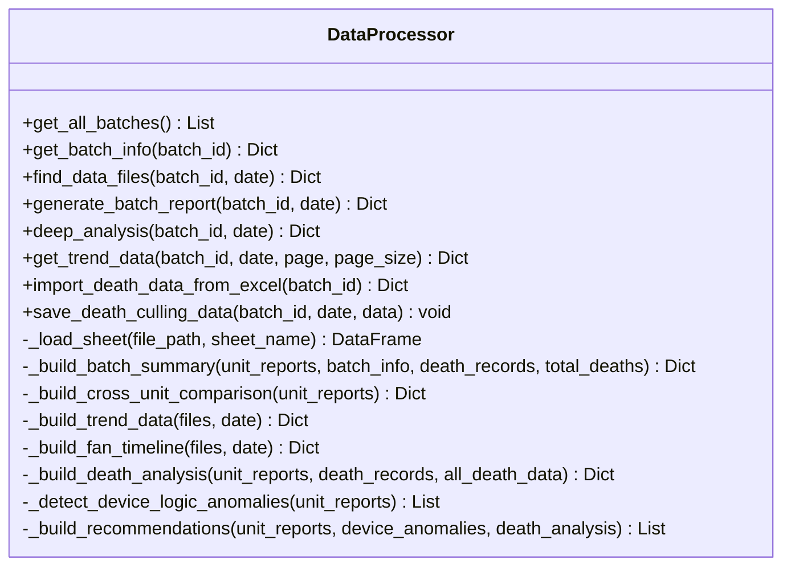
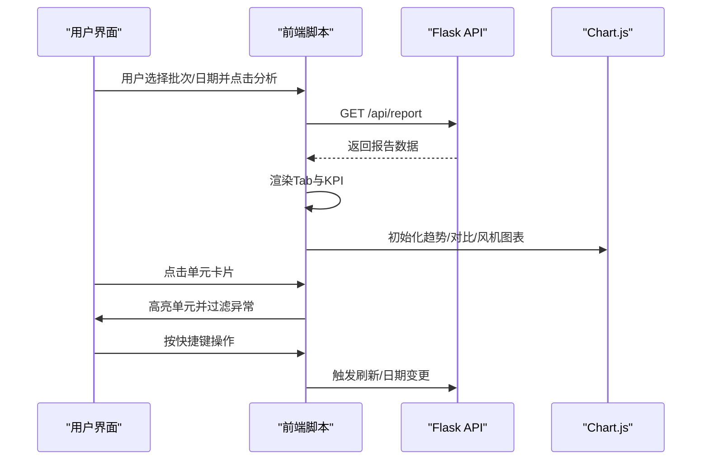
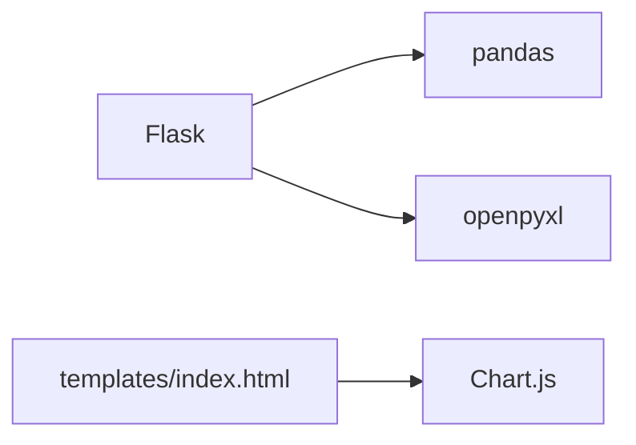

# Web界面与API

<cite>
**本文档引用的文件**
- [app.py](file://app.py)
- [data_processor.py](file://data_processor.py)
- [templates/index.html](file://templates/index.html)
- [requirements.txt](file://requirements.txt)
- [test_report.py](file://test_report.py)
- [analyze_units.py](file://analyze_units.py)
</cite>

## 目录
1. [简介](#简介)
2. [项目结构](#项目结构)
3. [核心组件](#核心组件)
4. [架构总览](#架构总览)
5. [详细组件分析](#详细组件分析)
6. [依赖关系分析](#依赖关系分析)
7. [性能考虑](#性能考虑)
8. [故障排除指南](#故障排除指南)
9. [结论](#结论)
10. [附录](#附录)

## 简介
本项目是一个面向猪场环控数据分析的Web应用，基于Flask框架构建，提供：
- Web界面：交互式报表与可视化展示
- API接口：批次管理、报告生成、深度分析、趋势查询、数据导入、缓存管理等

系统通过Excel数据文件解析，生成批次维度的环境控制与设备运行深度分析报告，并支持按单元维度的对比、趋势分析、设备运行逻辑异常检测、死亡关联分析以及优先处置建议。

## 项目结构
项目采用“应用层 + 数据处理层 + 模板层”的分层架构，主要文件与职责如下：
- app.py：Flask应用入口，定义路由与API端点，集成缓存系统
- data_processor.py：核心数据处理类，负责Excel文件解析、报告生成、趋势分析、异常检测、推荐建议等
- templates/index.html：前端模板，包含完整的报表页面与交互逻辑
- requirements.txt：Python依赖声明
- test_report.py：本地测试脚本，验证报告生成逻辑
- analyze_units.py：单元级分析示例脚本

**图表来源**
- [app.py:1-133](file://app.py#L1-L133)
- [data_processor.py:54-1559](file://data_processor.py#L54-L1559)
- [templates/index.html:1-1983](file://templates/index.html#L1-L1983)

**章节来源**
- [app.py:1-133](file://app.py#L1-L133)
- [data_processor.py:54-1559](file://data_processor.py#L54-L1559)
- [templates/index.html:1-1983](file://templates/index.html#L1-L1983)
- [requirements.txt:1-4](file://requirements.txt#L1-L4)

## 核心组件
- Flask应用与路由
  - 提供静态路由“/”渲染首页模板
  - 提供RESTful API端点，返回JSON响应
- 缓存系统
  - 内存级缓存，支持TTL过期控制
  - 支持报告与趋势数据的缓存
- 数据处理器(DataProcessor)
  - 批次配置加载与校验
  - Excel文件扫描与解析
  - 报告生成：批次汇总、单元详情、交叉对比、趋势、设备运行、死亡关联、异常与推荐
  - 趋势分析：时间序列聚合、历史数据分页
  - 异常检测：动态阈值、组合风险、设备逻辑异常
  - 推荐建议：优先级排序与预期效果
- 前端模板与交互
  - 使用Chart.js绘制多类图表
  - 支持Tab切换、单元过滤、键盘快捷键
  - 响应式布局与打印优化

**章节来源**
- [app.py:12-40](file://app.py#L12-L40)
- [app.py:42-133](file://app.py#L42-L133)
- [data_processor.py:54-1559](file://data_processor.py#L54-L1559)
- [templates/index.html:838-1983](file://templates/index.html#L838-L1983)

## 架构总览
系统采用前后端分离的Web架构：
- 后端：Flask提供API，DataProcessor负责业务逻辑与数据处理
- 前端：Jinja2模板渲染页面，JavaScript调用API并渲染图表
- 数据源：Excel文件（环境数据、设备数据、死亡数据）

**图表来源**
- [app.py:32-66](file://app.py#L32-L66)
- [data_processor.py:238-295](file://data_processor.py#L238-L295)

## 详细组件分析

### Flask应用与路由设计
- 静态路由
  - “/”：渲染首页模板，传入批次列表
- API路由
  - 批次管理
    - GET /api/batches：获取全部批次列表
    - GET /api/batch/<batch_id>：获取指定批次详情
  - 报告与仪表板
    - GET /api/report：生成并返回深度分析报告
    - GET /api/dashboard：返回仪表板数据（与报告相同）
  - 深度分析
    - GET /api/deep-analysis：返回深度分析结果（与报告相同）
  - 趋势查询
    - GET /api/trend：返回趋势数据，支持分页参数page/page_size
  - 数据导入
    - POST /api/death-culling：保存死亡/淘汰数据
    - POST /api/import-death：从Excel导入死亡数据
  - 缓存管理
    - POST /api/cache/clear：清空缓存

请求处理机制
- 参数获取：通过request.args或request.json获取查询参数或请求体
- 错误处理：对未找到批次返回404
- 响应格式：统一返回{"success": true/false, ...}结构
- 缓存策略：报告与趋势数据均支持缓存，缓存TTL为300秒

**章节来源**
- [app.py:42-133](file://app.py#L42-L133)

### 缓存系统
- 结构：字典存储(key, (timestamp, value))
- TTL：默认300秒
- 命中策略：若未过期则直接返回
- 清空策略：POST /api/cache/clear触发全局清空

**图表来源**
- [app.py:18-31](file://app.py#L18-L31)
- [app.py:32-40](file://app.py#L32-L40)

**章节来源**
- [app.py:18-31](file://app.py#L18-L31)
- [app.py:126-129](file://app.py#L126-L129)

### 数据处理器(DataProcessor)
职责与能力
- 批次配置管理：加载/默认化批次配置，提供批次列表与详情查询
- 文件扫描与解析：根据批次ID与日期扫描环境/设备Excel文件，解析单元信息、明细表等
- 报告生成：构建批次汇总、单元详情、交叉对比、趋势、设备运行、死亡关联、异常与推荐
- 趋势分析：按时间步长聚合温度、湿度、CO2、压差、通风等级等
- 异常检测：动态阈值（随日龄变化）、组合风险、设备逻辑异常、告警阈值一致性
- 推荐建议：基于异常与死亡关联分析生成优先级建议

关键方法与复杂度
- generate_batch_report：O(N)（N为单元数），涉及多次Excel读取与统计
- _build_trend_data：O(M)（M为时间序列长度），按步长采样
- _detect_device_logic_anomalies：O(U×F)（U为单元数，F为风机数）
- _build_recommendations：O(A)（A为异常数），排序与去重

**图表来源**
- [data_processor.py:54-1559](file://data_processor.py#L54-L1559)

**章节来源**
- [data_processor.py:54-1559](file://data_processor.py#L54-L1559)

### 前端模板与交互逻辑
页面结构与功能
- 页面头部：批次选择下拉框、日期输入框、分析按钮
- 主体区域：加载动画、Tab导航（异常分析、单元详情、单元对比、趋势分析、设备运行、死亡关联、处置建议）
- 图表：温度/湿度/CO2/压差趋势图、单元对比柱状图、风机频率时间线
- 交互：单元点击过滤、键盘快捷键（R/D/N/T/?）、Toast提示

JavaScript关键流程
- 加载报告：fetch /api/report，渲染KPI卡片、Tab内容
- 初始化图表：Chart.js按数据集绘制折线/柱状图
- 单元过滤：点击单元卡片高亮，过滤异常与明细
- 快捷键：R刷新、D前一天、N后一天、T回到今天、?显示帮助

**图表来源**
- [templates/index.html:951-1099](file://templates/index.html#L951-L1099)
- [templates/index.html:1517-1624](file://templates/index.html#L1517-L1624)

**章节来源**
- [templates/index.html:838-1983](file://templates/index.html#L838-L1983)

## 依赖关系分析
外部依赖
- Flask：Web框架
- pandas/openpyxl：Excel读取与数据处理
- Chart.js：前端图表渲染

**图表来源**
- [requirements.txt:1-4](file://requirements.txt#L1-L4)
- [templates/index.html:8](file://templates/index.html#L8)

**章节来源**
- [requirements.txt:1-4](file://requirements.txt#L1-L4)

## 性能考虑
- 缓存策略：报告与趋势数据缓存，TTL 300秒，显著降低重复请求的计算与IO开销
- Excel读取优化：Sheet级缓存，避免重复打开同一文件
- 时间序列采样：按步长采样，限制图表数据点数量，提升渲染性能
- 分页趋势：历史趋势数据分页，避免一次性传输大量数据
- 前端虚拟滚动：在大量单元场景下减少DOM节点数量

[本节为通用指导，无需特定文件引用]

## 故障排除指南
常见问题与解决
- 报告为空或异常
  - 检查Excel文件路径与命名是否符合预期（包含“环境数据/设备数据”关键字）
  - 确认批次ID与日期正确，且对应目录存在
- 404错误（批次不存在）
  - 确认批次配置文件存在或使用默认配置
- 图表不显示
  - 检查网络请求是否成功，确认API返回数据结构
  - 确认Chart.js资源加载正常
- 缓存导致数据不更新
  - 调用POST /api/cache/clear清空缓存
- 死亡数据导入失败
  - 确认Excel文件存在且包含“批次猪死亡”工作表
  - 检查批次名称与Excel中的批次号匹配

**章节来源**
- [app.py:52-57](file://app.py#L52-L57)
- [data_processor.py:165-223](file://data_processor.py#L165-L223)

## 结论
本项目通过Flask与前端模板的结合，实现了猪场环控数据的深度分析与可视化展示。核心优势包括：
- 全面的分析维度：环境、设备、传感器、死亡关联、组合风险与推荐
- 高效的数据处理：Excel解析、缓存与趋势采样
- 友好的交互体验：图表化展示、单元过滤、键盘快捷键

建议后续扩展方向：
- 增加权限控制与登录认证
- 支持更多图表类型与导出功能
- 增强异常检测算法与阈值自适应
- 提供批量数据导入与历史回放

[本节为总结性内容，无需特定文件引用]

## 附录

### API接口规范

- 获取批次列表
  - 方法：GET
  - URL：/api/batches
  - 请求参数：无
  - 响应：{"success": true, "data": [...]}
  - 错误码：无

- 获取批次详情
  - 方法：GET
  - URL：/api/batch/<batch_id>
  - 请求参数：batch_id（路径参数）
  - 响应：{"success": true, "data": {...}} 或 {"success": false, "message": "..."}（404）
  - 错误码：404

- 生成分析报告
  - 方法：GET
  - URL：/api/report
  - 请求参数：batch_id（默认20251218），date（默认2026-03-10）
  - 响应：{"success": true, "data": {...}}
  - 缓存：启用，键为report:{batch_id}:{date}

- 仪表板数据
  - 方法：GET
  - URL：/api/dashboard
  - 请求参数：batch_id（默认20251218），date（默认2026-03-10）
  - 响应：{"success": true, "data": {...}}

- 深度分析
  - 方法：GET
  - URL：/api/deep-analysis
  - 请求参数：batch_id（默认20251218），date（默认2026-03-10）
  - 响应：{"success": true, "data": {...}}

- 趋势查询
  - 方法：GET
  - URL：/api/trend
  - 请求参数：batch_id（默认20251218），date（默认2026-03-10），page（默认1），page_size（默认7）
  - 响应：{"success": true, "data": {...}}（含分页信息）

- 保存死亡/淘汰数据
  - 方法：POST
  - URL：/api/death-culling
  - 请求体：{"batch_id": "...", "date": "...", "records": [...]}
  - 响应：{"success": true}
  - 行为：写入death_culling.json，清空缓存

- 导入死亡数据
  - 方法：POST
  - URL：/api/import-death
  - 请求体：{"batch_id": "..."}
  - 响应：{"success": true/false, "imported": N, "message": "..."}
  - 行为：从Excel读取并写入death_culling.json，清空缓存

- 清空缓存
  - 方法：POST
  - URL：/api/cache/clear
  - 请求体：无
  - 响应：{"success": true, "message": "..."}

**章节来源**
- [app.py:47-129](file://app.py#L47-L129)

### 数据模型与字段说明
- 批次配置
  - 字段：batch_id、batch_name、farm_name、entry_date、units、total_pig_count
- 报告数据
  - batch_info：批次基本信息
  - batch_summary：批次汇总（均温、均湿、风险等级、异常数、死亡数等）
  - unit_reports：单元级报告列表
  - cross_comparison：单元对比（最佳/最差单元、关键差异）
  - trend_data：时间序列（温度、湿度、CO2、压差、通风等级、室外温度）
  - fan_timeline：风机频率时间线
  - death_analysis：死亡关联分析（当日摘要、风险因子）
  - device_anomalies：设备逻辑异常
  - recommendations：处置建议
- 单元报告
  - basic_info：基础信息（装猪数量、体重、日龄、目标温度/湿度、通风季节/模式）
  - environment：环境指标（温度、湿度、CO2、压差、室外温度、温差、通风等级）
  - device_operation：设备运行（变频/定速风机、设备信息、安装配置、传感器配置、进风幕帘、水帘）
  - sensor_health：传感器健康（在线/离线状态）
  - anomalies：异常列表（类别、类型、严重程度、描述、影响）
  - risk_level/risk_score：风险等级与分数
  - death_info：当日死亡信息（数量、原因、可能的环境关联）

**章节来源**
- [data_processor.py:238-1559](file://data_processor.py#L238-L1559)

### 前端交互与可视化
- Tab导航：异常分析、单元详情、单元对比、趋势分析、设备运行、死亡关联、处置建议
- 图表类型：折线图（趋势）、柱状图（对比）、时间线（风机频率）
- 交互特性：单元过滤、键盘快捷键（R/D/N/T/?）、Toast提示、响应式布局

**章节来源**
- [templates/index.html:1029-1099](file://templates/index.html#L1029-L1099)
- [templates/index.html:1517-1624](file://templates/index.html#L1517-L1624)
- [templates/index.html:1880-1974](file://templates/index.html#L1880-L1974)

### 测试与验证
- test_report.py：本地生成报告并打印关键指标，便于快速验证
- analyze_units.py：单元级分析示例，展示如何读取Excel并输出统计信息

**章节来源**
- [test_report.py:1-48](file://test_report.py#L1-L48)
- [analyze_units.py:1-105](file://analyze_units.py#L1-L105)