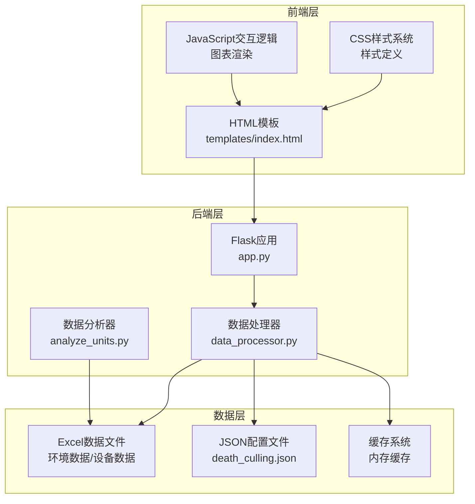
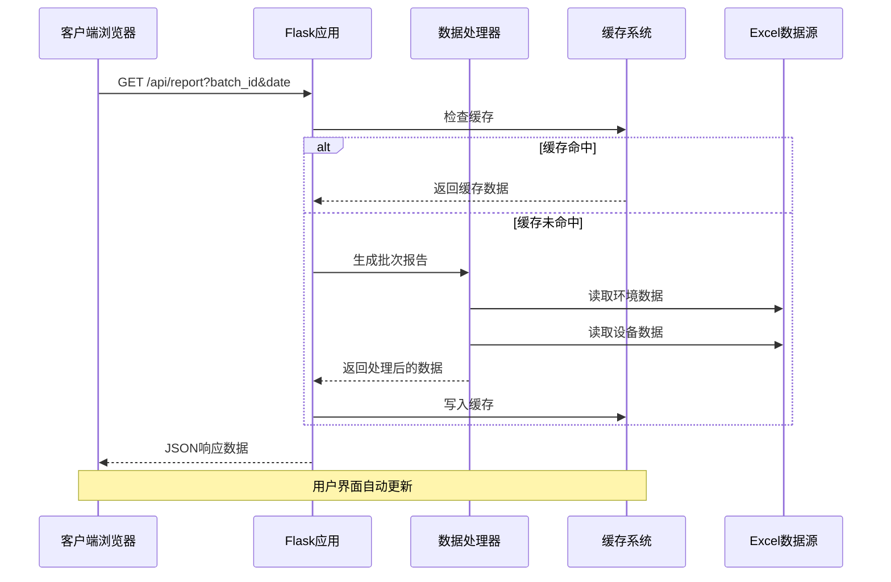
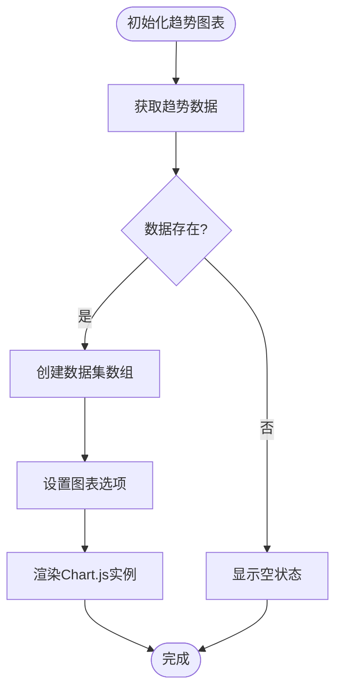
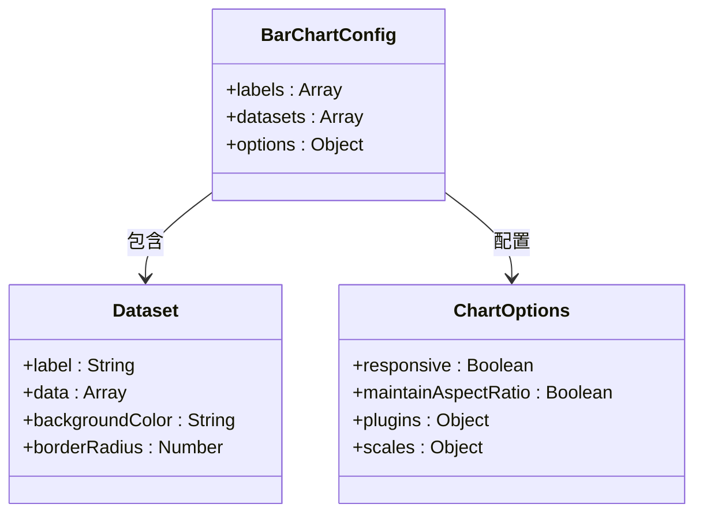
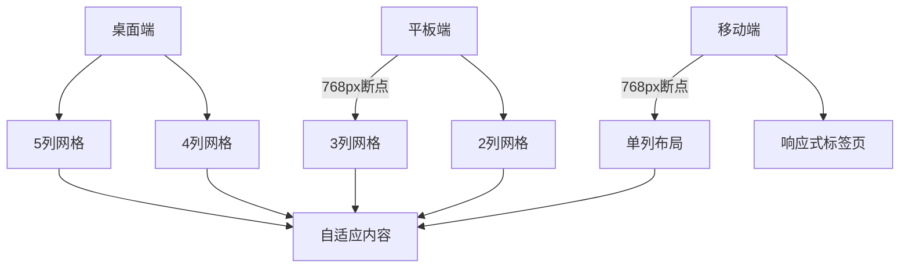
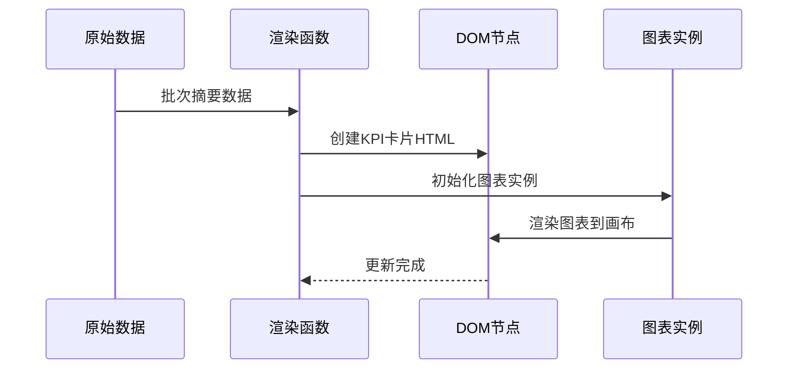
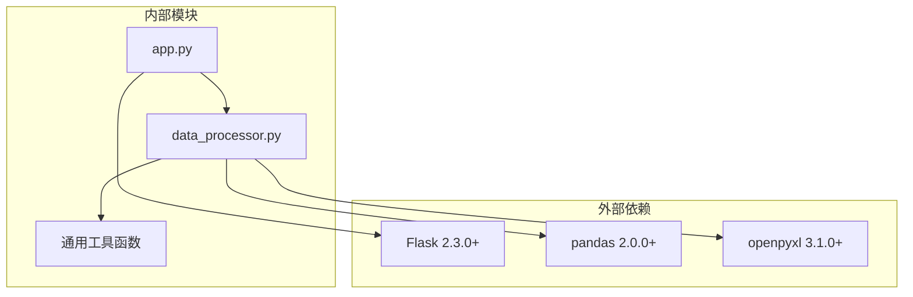
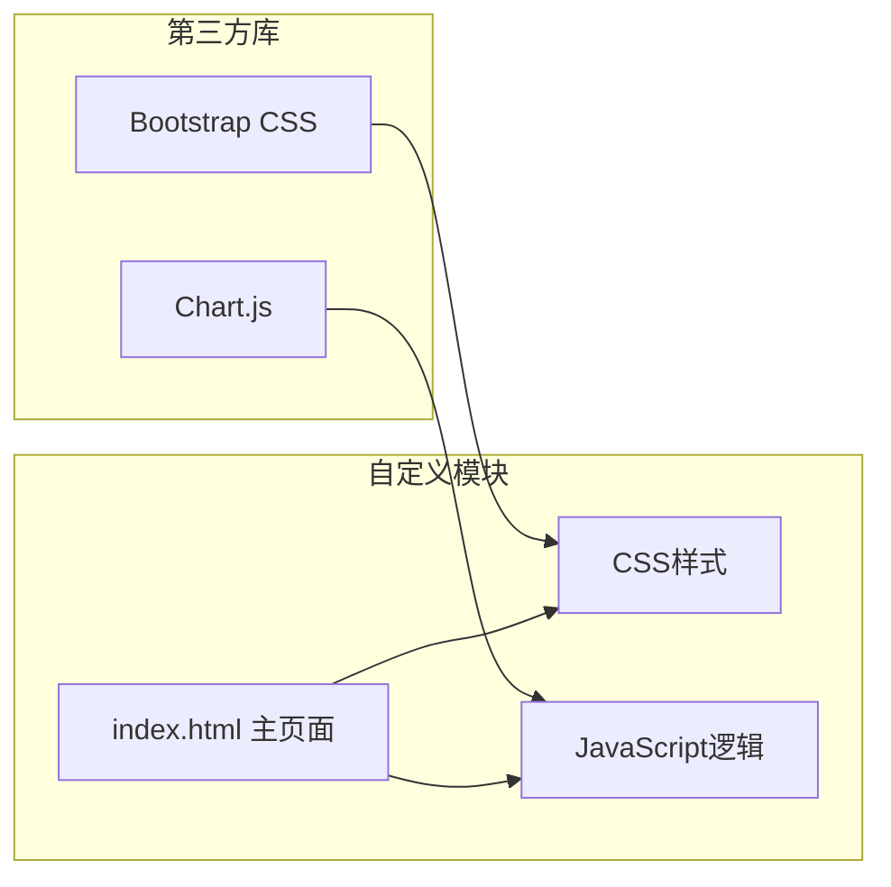

# 可视化与前端

<cite>
**本文档引用的文件**
- [index.html](file://templates/index.html)
- [app.py](file://app.py)
- [data_processor.py](file://data_processor.py)
- [requirements.txt](file://requirements.txt)
- [test_report.py](file://test_report.py)
- [death_culling.json](file://death_culling.json)
</cite>

## 目录
1. [简介](#简介)
2. [项目结构](#项目结构)
3. [核心组件](#核心组件)
4. [架构概览](#架构概览)
5. [详细组件分析](#详细组件分析)
6. [依赖关系分析](#依赖关系分析)
7. [性能考虑](#性能考虑)
8. [故障排除指南](#故障排除指南)
9. [结论](#结论)

## 简介

本项目是一个专为猪场环控数据分析设计的可视化系统，旨在为育肥猪批次环境控制与设备运行提供深度分析报表。该系统通过Flask后端提供数据处理和API服务，前端采用Chart.js图表库实现丰富的数据可视化功能，支持多种图表类型和交互式分析界面。

系统的核心目标是：
- 提供批次维度的环境控制与生产成绩关联分析
- 实现多维度的数据可视化展示
- 支持实时数据更新和历史趋势分析
- 提供智能异常检测和处置建议

## 项目结构

该项目采用前后端分离的架构设计，主要由以下模块组成：

**图表来源**
- [index.html:1-836](file://templates/index.html#L1-L836)
- [app.py:1-133](file://app.py#L1-L133)
- [data_processor.py:1-1559](file://data_processor.py#L1-L1559)

**章节来源**
- [index.html:1-836](file://templates/index.html#L1-L836)
- [app.py:1-133](file://app.py#L1-L133)
- [requirements.txt:1-4](file://requirements.txt#L1-L4)

## 核心组件

### HTML模板设计

系统采用语义化的HTML5结构，结合现代CSS Grid布局系统，实现了响应式设计和良好的可访问性。

**主要特性：**
- 使用CSS自定义属性实现主题化设计
- 基于CSS Grid的灵活布局系统
- 移动端优先的响应式设计
- 无障碍友好的语义化标记

**章节来源**
- [index.html:1-836](file://templates/index.html#L1-L836)

### CSS样式系统

系统采用现代化的CSS架构，基于CSS自定义属性的主题系统提供了统一的设计语言。

**设计系统特点：**
- **色彩系统**：基于蓝、绿、红、橙、紫、青六色主题
- **间距系统**：使用12px为主间距单位
- **字体系统**：采用系统字体栈，支持中文显示
- **阴影系统**：统一的投影效果，营造层次感

**响应式设计：**
- 移动端断点：768px
- 平板断点：1200px
- 自适应网格布局

**章节来源**
- [index.html:12-836](file://templates/index.html#L12-L836)

### JavaScript交互逻辑

前端JavaScript实现了完整的数据驱动界面，包括图表渲染、数据过滤、实时更新等功能。

**核心功能模块：**
- **数据加载与缓存**：异步数据获取和本地缓存管理
- **图表渲染**：基于Chart.js的多种图表类型
- **交互控制**：标签页切换、单元过滤、实时更新
- **虚拟滚动**：大数据集的性能优化

**章节来源**
- [index.html:872-1599](file://templates/index.html#L872-L1599)

## 架构概览

系统采用三层架构设计，实现了清晰的职责分离：

**图表来源**
- [app.py:32-40](file://app.py#L32-L40)
- [data_processor.py:238-295](file://data_processor.py#L238-L295)

**章节来源**
- [app.py:1-133](file://app.py#L1-L133)
- [data_processor.py:1-1559](file://data_processor.py#L1-L1559)

## 详细组件分析

### Chart.js图表集成

系统集成了Chart.js图表库，支持多种图表类型以满足不同的数据可视化需求。

#### 折线图实现

温度、湿度、CO2浓度等时间序列数据使用折线图展示：

**图表来源**
- [index.html:1556-1599](file://templates/index.html#L1556-L1599)

#### 柱状图实现

单元对比分析使用柱状图展示关键指标差异：

**图表来源**
- [index.html:1484-1512](file://templates/index.html#L1484-L1512)

#### 仪表盘组件

风险评分和关键指标使用仪表盘形式展示：

**章节来源**
- [index.html:1131-1158](file://templates/index.html#L1131-L1158)

### 数据可视化设计原则

#### 颜色方案设计

系统采用基于业务含义的颜色编码系统：

| 颜色类别 | 颜色值 | 用途 | 视觉含义 |
|---------|--------|------|----------|
| 成功 | `#059669` | 良好状态 | 绿色表示健康、正常 |
| 警告 | `#ea580c` | 中等风险 | 橙色表示需要注意 |
| 危险 | `#dc2626` | 高风险 | 红色表示紧急 |
| 主题蓝 | `#2563eb` | 强调色 | 蓝色表示重要信息 |

#### 图表布局策略

**网格系统**：基于CSS Grid的响应式布局，支持2-5列自适应排列

**卡片式设计**：每个图表和指标都封装在独立的卡片容器中，具有统一的视觉风格

**对比分析**：使用颜色区分不同单元的指标，便于快速识别差异

#### 响应式设计实现

系统实现了多层次的响应式适配：

**章节来源**
- [index.html:772-784](file://templates/index.html#L772-L784)

### 前端组件使用示例

#### 数据绑定机制

系统采用数据驱动的渲染方式，所有UI元素都通过JavaScript动态生成：

**KPI卡片渲染流程：**

**图表初始化流程：**
- 动态创建Canvas元素
- 配置Chart.js选项
- 设置响应式行为
- 绑定交互事件

#### 事件处理机制

系统实现了完整的事件处理体系：

**标签页切换事件：**
- 使用事件委托提高性能
- 支持键盘导航
- 平滑的动画过渡效果

**单元过滤事件：**
- 点击单元卡片激活筛选
- 实时更新异常列表
- 筛选状态持久化

**数据刷新事件：**
- 自动缓存失效
- 错误状态恢复
- 加载状态指示

#### 实时更新机制

系统实现了智能的实时数据更新策略：

**缓存管理：**
- 5分钟TTL的内存缓存
- 请求去重避免重复请求
- 手动缓存清理接口

**增量更新：**
- 局部DOM更新
- 图表实例复用
- 数据格式标准化

**章节来源**
- [index.html:872-1100](file://templates/index.html#L872-L1100)

## 依赖关系分析

### 后端依赖关系

**图表来源**
- [requirements.txt:1-4](file://requirements.txt#L1-L4)
- [app.py:1-10](file://app.py#L1-L10)
- [data_processor.py:1-11](file://data_processor.py#L1-L11)

### 前端依赖关系

**图表来源**
- [index.html:8-8](file://templates/index.html#L8-L8)
- [app.py:1-10](file://app.py#L1-L10)

**章节来源**
- [requirements.txt:1-4](file://requirements.txt#L1-L4)
- [app.py:1-10](file://app.py#L1-L10)

## 性能考虑

### 前端性能优化

**图表性能优化：**
- Chart.js实例复用，避免重复创建
- 响应式配置减少不必要的重绘
- 数据集合并减少DOM操作

**内存管理：**
- 图表实例销毁机制
- 事件监听器清理
- 大数据集的虚拟滚动

**网络性能：**
- 5分钟缓存策略
- 请求去重机制
- 分页加载趋势数据

### 后端性能优化

**数据处理优化：**
- Excel文件缓存机制
- 批量数据处理
- 内存高效的DataFrame操作

**API性能：**
- JSON序列化优化
- 错误处理缓存
- 异步数据处理

## 故障排除指南

### 常见问题诊断

**数据加载失败：**
1. 检查Excel文件路径是否正确
2. 验证文件权限和格式
3. 确认数据完整性

**图表渲染异常：**
1. 检查Chart.js库加载状态
2. 验证Canvas元素可用性
3. 确认数据格式正确

**缓存问题：**
1. 使用`/api/cache/clear`清理缓存
2. 检查内存使用情况
3. 验证TTL设置

### 调试工具

**浏览器开发者工具：**
- Network面板监控API请求
- Console面板查看错误信息
- Elements面板检查DOM结构

**后端调试：**
- Flask调试模式启用
- 日志输出配置
- 数据验证检查

**章节来源**
- [app.py:126-129](file://app.py#L126-L129)
- [test_report.py:1-48](file://test_report.py#L1-L48)

## 结论

本猪场环控数据分析系统通过精心设计的前端可视化界面和强大的后端数据处理能力，为养殖场管理者提供了全面的环境监控和分析工具。系统的主要优势包括：

**技术优势：**
- 基于Chart.js的专业图表库集成
- 响应式设计确保多设备兼容
- 智能缓存机制提升性能
- 数据驱动的动态渲染

**业务价值：**
- 实时监控环境质量
- 智能异常检测和预警
- 历史趋势分析支持决策
- 个性化处置建议指导改进

**扩展性：**
- 模块化架构便于功能扩展
- 标准化的API接口支持集成
- 灵活的数据处理管道
- 可配置的主题和样式系统

该系统为现代智慧养殖提供了坚实的技术基础，能够有效提升养殖效率和动物福利水平。