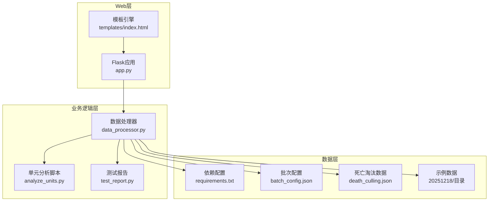
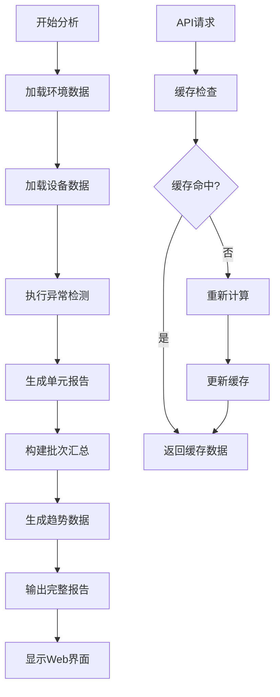
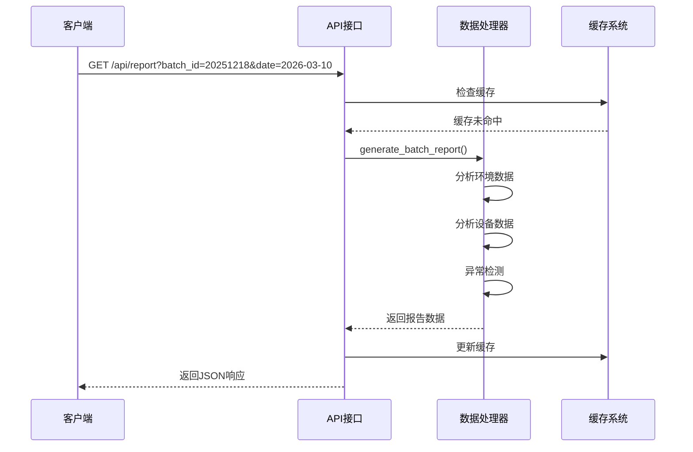
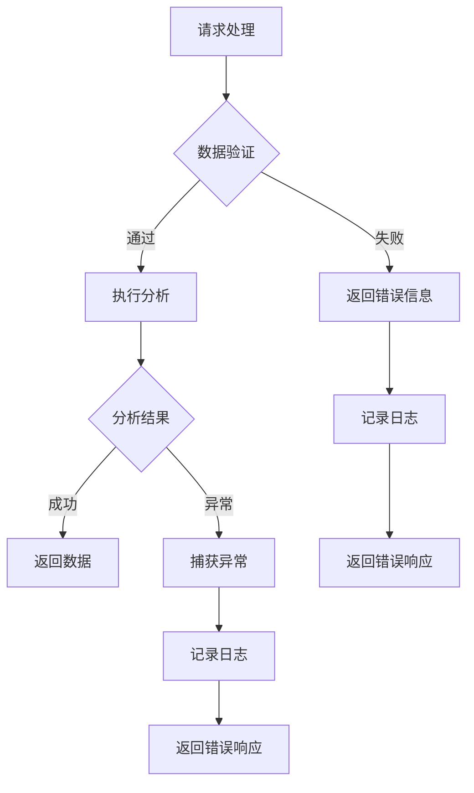

# 快速开始

<cite>
**本文档引用的文件**
- [requirements.txt](file://requirements.txt)
- [app.py](file://app.py)
- [data_processor.py](file://data_processor.py)
- [analyze_units.py](file://analyze_units.py)
- [test_report.py](file://test_report.py)
- [templates/index.html](file://templates/index.html)
- [20251218/环控数据导出字段清单.md](file://20251218/环控数据导出字段清单.md)
- [death_culling.json](file://death_culling.json)
</cite>

## 目录
1. [简介](#简介)
2. [项目结构](#项目结构)
3. [环境搭建](#环境搭建)
4. [Excel数据准备](#excel数据准备)
5. [系统启动](#系统启动)
6. [第一个批次数据导入](#第一个批次数据导入)
7. [报告生成步骤](#报告生成步骤)
8. [API接口说明](#api接口说明)
9. [常见问题解决](#常见问题解决)
10. [故障排除指南](#故障排除指南)
11. [总结](#总结)

## 简介

猪场环控数据分析系统是一个基于Python开发的Web应用，专门用于分析育肥猪批次的环境控制数据。该系统通过Flask框架提供Web界面，支持实时数据可视化、异常检测、设备运行分析等功能，帮助用户快速识别环控问题并提供优化建议。

系统主要功能包括：
- 批次级环控数据分析
- 设备运行状态监控
- 环境参数异常检测
- 死亡/淘汰数据关联分析
- 动态阈值调整算法
- 实时趋势图表展示

## 项目结构

系统采用模块化设计，主要包含以下核心组件：



**图表来源**
- [app.py:1-133](file://app.py#L1-L133)
- [data_processor.py:54-98](file://data_processor.py#L54-L98)

**章节来源**
- [app.py:1-133](file://app.py#L1-L133)
- [data_processor.py:54-98](file://data_processor.py#L54-L98)

## 环境搭建

### Python版本要求

系统需要Python 3.7及以上版本。建议使用Python 3.8或更高版本以获得最佳兼容性。

### 创建虚拟环境

1. **创建项目目录**
   ```bash
   mkdir pici_daily_newspaper
   cd pici_daily_newspaper
   ```

2. **创建虚拟环境**
   ```bash
   # Windows
   python -m venv venv
   
   # macOS/Linux
   python3 -m venv venv
   ```

3. **激活虚拟环境**
   ```bash
   # Windows
   venv\Scripts\activate
   
   # macOS/Linux
   source venv/bin/activate
   ```

### 安装依赖包

1. **升级pip**
   ```bash
   pip install --upgrade pip
   ```

2. **安装依赖**
   ```bash
   pip install -r requirements.txt
   ```

3. **验证安装**
   ```bash
   pip list
   ```

**章节来源**
- [requirements.txt:1-4](file://requirements.txt#L1-L4)

## Excel数据准备

### 标准数据格式

系统支持两种标准Excel文件格式：

#### 环境数据Excel文件
包含多个工作表，每个工作表都有特定的数据结构：

**单元信息工作表**
| 字段名称 | 数据类型 | 必填 | 说明 |
|---------|---------|------|------|
| 装猪数量 | int | 是 | 当前单元装载的猪只数量 |
| 猪只体重(Kg) | float | 是 | 猪只平均体重 |
| 日龄 | int | 是 | 猪只当前日龄 |
| 目标温度(℃) | float | 是 | 环控器设定的目标温度 |
| 目标湿度(%) | float | 是 | 环控器设定的目标湿度 |
| 通风季节 | string | 是 | 冬季/夏季/过渡季 |
| 通风模式 | string | 是 | 横向通风/纵向通风 |
| 工作模式 | string | 是 | 自动/手动 |
| 舍内温度(℃) | float | 是 | 当日舍内平均温度 |
| 舍内湿度(%) | float | 是 | 当日舍内平均湿度 |
| 二氧化碳均值(ppm) | float | 是 | 当日CO2平均浓度 |
| 压差均值(pa) | float | 是 | 舍内外压差平均值 |
| 通风等级 | int | 是 | 当前通风等级 |

**设备数据Excel文件**
| 字段名称 | 数据类型 | 必填 | 说明 |
|---------|---------|------|------|
| 设备型号 | string | 是 | 环控器设备型号 |
| 设备IP地址 | string | 是 | 环控器网络IP地址 |
| 固件版本 | string | 是 | 设备固件版本号 |
| 内存使用率 | int | 是 | 设备内存使用百分比 |
| 累计运行时长 | string | 是 | 设备累计运行时长 |
| 安装日期 | string | 是 | 设备安装日期 |

### 数据质量要求

1. **时间粒度**：环境数据建议按1分钟间隔导出
2. **文件命名**：`{场名}{舍名} {日期} 00_00_00 至 {日期} 23_59_59 环境数据.xlsx`
3. **编码**：UTF-8编码
4. **空值处理**：空值请留空，不要填写"NA"、"null"等字符串

### 示例数据结构

系统提供了完整的示例数据，位于`20251218/`目录下，包含：
- 环控数据导出字段清单
- 死亡淘汰数据示例
- 设备运行配置示例

**章节来源**
- [20251218/环控数据导出字段清单.md:1-140](file://20251218/环控数据导出字段清单.md#L1-L140)

## 系统启动

### 命令行启动方式

1. **激活虚拟环境**
   ```bash
   # Windows
   venv\Scripts\activate
   
   # macOS/Linux
   source venv/bin/activate
   ```

2. **启动Web服务**
   ```bash
   python app.py
   ```

3. **访问系统**
   打开浏览器访问：`http://localhost:5000`

### Web界面功能

系统提供完整的Web界面，包含以下功能模块：

- **批次选择**：选择要分析的猪场批次
- **日期选择**：选择具体分析日期
- **实时数据展示**：温度、湿度、CO2等环境参数
- **设备运行状态**：风机、水帘等设备运行情况
- **异常检测结果**：环境参数异常和设备问题
- **趋势图表**：历史数据趋势分析
- **优化建议**：基于数据分析的改进建议

### 基本功能测试

1. **启动后页面加载**
   - 访问`http://localhost:5000`
   - 页面应显示批次列表和选择界面

2. **API接口测试**
   ```bash
   # 获取所有批次
   curl http://localhost:5000/api/batches
   
   # 获取指定批次信息
   curl http://localhost:5000/api/batch/20251218
   
   # 生成报告
   curl "http://localhost:5000/api/report?batch_id=20251218&date=2026-03-10"
   ```

**章节来源**
- [app.py:42-133](file://app.py#L42-L133)
- [templates/index.html:1-800](file://templates/index.html#L1-L800)

## 第一个批次数据导入

### 准备示例数据

系统已提供完整的示例数据，位于`20251218/`目录：

1. **环境数据文件**
   ```
   20251218/临泉第一育肥场二分场育肥舍4-5 2026-03-10 00_00_00 至 2026-03-10 23_59_59 环境数据.xlsx
   20251218/临泉第一育肥场二分场育肥舍4-6 2026-03-10 00_00_00 至 2026-03-10 23_59_59 环境数据.xlsx
   20251218/临泉第一育肥场二分场育肥舍4-7 2026-03-10 00_00_00 至 2026-03-10 23_59_59 环境数据.xlsx
   ```

2. **设备数据文件**
   ```
   20251218/临泉第一育肥场二分场育肥舍4-5 2026-03-10 00_00_00 至 2026-03-10 23_59_59 设备数据.xlsx
   20251218/临泉第一育肥场二分场育肥舍4-6 2026-03-10 00_00_00 至 2026-03-10 23_59_59 设备数据.xlsx
   20251218/临泉第一育肥场二分场育肥舍4-7 2026-03-10 00_00_00 至 2026-03-10 23_59_59 设备数据.xlsx
   ```

3. **死亡淘汰数据**
   ```
   20251218/批次猪死亡导出-20260311.xlsx
   ```

### 导入流程

1. **确认数据文件位置**
   将上述文件放置在项目根目录下的对应批次文件夹中

2. **验证数据完整性**
   使用单元分析脚本验证数据：
   ```bash
   python analyze_units.py
   ```

3. **生成综合报告**
   ```bash
   python test_report.py
   ```

### 数据验证

系统会自动验证以下内容：
- 文件命名是否符合规范
- 关键字段是否存在
- 数据格式是否正确
- 传感器配置是否完整

**章节来源**
- [analyze_units.py:1-105](file://analyze_units.py#L1-L105)
- [test_report.py:1-48](file://test_report.py#L1-L48)

## 报告生成步骤

### 自动生成报告

系统提供多种报告生成方式：

#### 方法一：Web界面生成
1. 访问`http://localhost:5000`
2. 选择批次：20251218
3. 选择日期：2026-03-10
4. 点击"生成报告"按钮

#### 方法二：API接口调用
```bash
curl "http://localhost:5000/api/report?batch_id=20251218&date=2026-03-10"
```

#### 方法三：命令行生成
```bash
python test_report.py
```

### 报告内容结构

生成的报告包含以下主要部分：

1. **批次摘要**：整体环境状况概述
2. **单元分析**：各单元详细分析结果
3. **异常检测**：环境参数和设备问题识别
4. **趋势分析**：历史数据变化趋势
5. **优化建议**：基于数据的改进建议
6. **死亡关联分析**：死亡数据与环境因素关联

### 报告输出示例



**图表来源**
- [data_processor.py:238-295](file://data_processor.py#L238-L295)
- [app.py:32-40](file://app.py#L32-L40)

**章节来源**
- [data_processor.py:238-295](file://data_processor.py#L238-L295)
- [app.py:59-102](file://app.py#L59-L102)

## API接口说明

系统提供RESTful API接口，支持程序化访问：

### 基础接口

| 接口 | 方法 | 参数 | 描述 |
|------|------|------|------|
| `/` | GET | 无 | 主页 |
| `/api/batches` | GET | 无 | 获取所有批次列表 |
| `/api/batch/<batch_id>` | GET | batch_id | 获取指定批次信息 |
| `/api/report` | GET | batch_id, date | 生成综合报告 |
| `/api/dashboard` | GET | batch_id, date | 获取仪表板数据 |
| `/api/deep-analysis` | GET | batch_id, date | 获取深度分析 |
| `/api/trend` | GET | batch_id, date, page, page_size | 获取趋势数据 |
| `/api/death-culling` | POST | JSON数据 | 保存死亡淘汰数据 |
| `/api/import-death` | POST | batch_id | 从Excel导入死亡数据 |
| `/api/cache/clear` | POST | 无 | 清除缓存 |

### 接口调用示例



**图表来源**
- [app.py:59-102](file://app.py#L59-L102)
- [data_processor.py:238-295](file://data_processor.py#L238-L295)

**章节来源**
- [app.py:47-129](file://app.py#L47-L129)

## 常见问题解决

### 环境搭建问题

**问题1：Python版本不兼容**
- **症状**：安装依赖时报错
- **解决方案**：升级到Python 3.7+
- **验证方法**：`python --version`

**问题2：虚拟环境激活失败**
- **症状**：Windows显示权限错误
- **解决方案**：运行`Set-ExecutionPolicy -ExecutionPolicy RemoteSigned -Scope CurrentUser`
- **验证方法**：`python -c "import sys; print(sys.executable)"`

**问题3：依赖安装失败**
- **症状**：pip安装报错
- **解决方案**：升级pip并使用国内镜像源
- **命令**：`pip install --upgrade pip -i https://pypi.tuna.tsinghua.edu.cn/simple/`

### 数据导入问题

**问题4：Excel文件读取失败**
- **症状**：提示文件不存在或格式错误
- **解决方案**：检查文件路径和编码格式
- **验证方法**：确认文件编码为UTF-8

**问题5：数据字段缺失**
- **症状**：分析结果显示关键字段为空
- **解决方案**：检查Excel文件的工作表结构
- **参考**：字段清单文档

**问题6：批次数据不匹配**
- **症状**：系统无法找到对应的批次数据
- **解决方案**：确认批次ID与文件夹名称一致
- **默认批次**：20251218

### Web界面问题

**问题7：页面加载失败**
- **症状**：浏览器显示连接被拒绝
- **解决方案**：检查端口占用和防火墙设置
- **默认端口**：5000

**问题8：样式显示异常**
- **症状**：页面布局错乱
- **解决方案**：清除浏览器缓存或更换浏览器

**章节来源**
- [requirements.txt:1-4](file://requirements.txt#L1-L4)
- [20251218/环控数据导出字段清单.md:133-140](file://20251218/环控数据导出字段清单.md#L133-L140)

## 故障排除指南

### 系统诊断工具

1. **检查依赖完整性**
   ```bash
   pip check
   ```

2. **验证数据文件**
   ```bash
   python analyze_units.py
   ```

3. **测试API接口**
   ```bash
   curl http://localhost:5000/api/batches
   ```

### 性能优化

1. **缓存机制**
   - 默认缓存有效期：300秒
   - 支持手动清空缓存
   - 缓存键值结构：`report:{batch_id}:{date}`

2. **内存管理**
   - 大文件自动清理
   - 临时数据定期清理
   - 内存使用监控

### 错误处理

系统提供完善的错误处理机制：



**图表来源**
- [data_processor.py:130-140](file://data_processor.py#L130-L140)
- [app.py:18-30](file://app.py#L18-L30)

### 调试模式

启用调试模式查看详细错误信息：
```bash
set FLASK_ENV=development
python app.py
```

**章节来源**
- [app.py:18-30](file://app.py#L18-L30)
- [data_processor.py:130-140](file://data_processor.py#L130-L140)

## 总结

通过本快速开始指南，您应该能够：

1. **完成环境搭建**：成功安装Python、创建虚拟环境、安装依赖包
2. **准备数据文件**：按照标准格式准备Excel数据文件
3. **启动系统**：通过命令行或Web界面启动系统
4. **导入数据**：完成第一个批次数据的导入和验证
5. **生成报告**：自动生成并查看分析报告
6. **解决问题**：处理常见的安装和使用问题

### 时间安排建议

- **第1-5分钟**：环境搭建和依赖安装
- **第6-10分钟**：数据文件准备和验证
- **第11-15分钟**：系统启动和界面访问
- **第16-25分钟**：数据导入和报告生成
- **第26-30分钟**：结果分析和问题排查

### 后续步骤

1. **扩展数据**：添加更多批次和日期的数据
2. **定制分析**：根据实际需求调整分析参数
3. **集成部署**：考虑生产环境的部署方案
4. **自动化**：建立数据自动导入和报告生成流程

系统提供了完整的批处理分析能力，能够帮助您快速识别环控问题并制定改进措施。如有任何技术问题，请参考故障排除指南或联系技术支持。