# API接口扩展

<cite>
**本文档引用的文件**
- [app.py](file://app.py)
- [data_processor.py](file://data_processor.py)
- [requirements.txt](file://requirements.txt)
- [templates/index.html](file://templates/index.html)
- [test_report.py](file://test_report.py)
- [analyze_units.py](file://analyze_units.py)
</cite>

## 目录
1. [简介](#简介)
2. [项目结构](#项目结构)
3. [核心组件](#核心组件)
4. [架构概览](#架构概览)
5. [详细组件分析](#详细组件分析)
6. [API扩展指南](#api扩展指南)
7. [API版本管理策略](#api版本管理策略)
8. [认证与授权机制](#认证与授权机制)
9. [性能优化与安全防护](#性能优化与安全防护)
10. [测试与文档](#测试与文档)
11. [故障排除指南](#故障排除指南)
12. [结论](#结论)

## 简介

本指南面向猪场环控数据分析系统的API接口扩展，提供从基础RESTful API设计到高级功能实现的完整指导。该系统基于Flask框架构建，专门用于分析育肥猪批次的环境控制数据，通过Excel文件解析和深度分析生成环控报告。

系统当前提供以下核心API端点：
- 批次列表查询
- 批次详情查询  
- 环控报告生成
- 仪表板数据
- 深度分析
- 趋势数据
- 死淘数据管理
- 缓存管理

## 项目结构

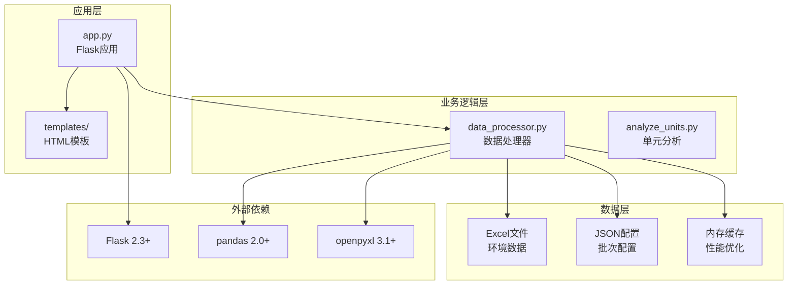

**图表来源**
- [app.py:1-133](file://app.py#L1-L133)
- [data_processor.py:1-1559](file://data_processor.py#L1-L1559)
- [requirements.txt:1-4](file://requirements.txt#L1-L4)

**章节来源**
- [app.py:1-133](file://app.py#L1-L133)
- [data_processor.py:1-1559](file://data_processor.py#L1-L1559)
- [requirements.txt:1-4](file://requirements.txt#L1-L4)

## 核心组件

### Flask应用架构

系统采用Flask微服务架构，主要组件包括：

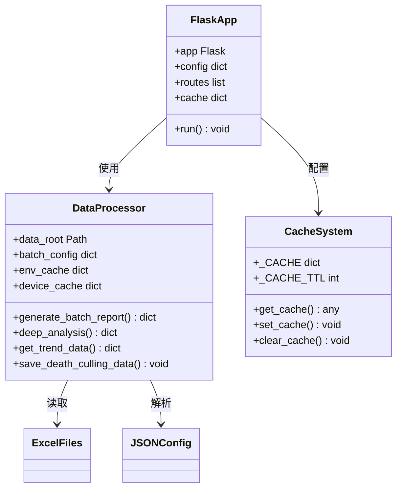

**图表来源**
- [app.py:6-40](file://app.py#L6-L40)
- [data_processor.py:54-62](file://data_processor.py#L54-L62)

### 数据处理流程

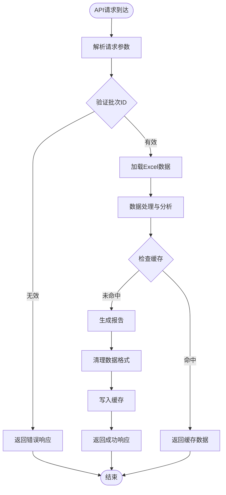

**图表来源**
- [app.py:59-102](file://app.py#L59-L102)
- [data_processor.py:238-295](file://data_processor.py#L238-L295)

**章节来源**
- [app.py:1-133](file://app.py#L1-L133)
- [data_processor.py:1-1559](file://data_processor.py#L1-L1559)

## 架构概览

系统采用分层架构设计，确保职责分离和可扩展性：

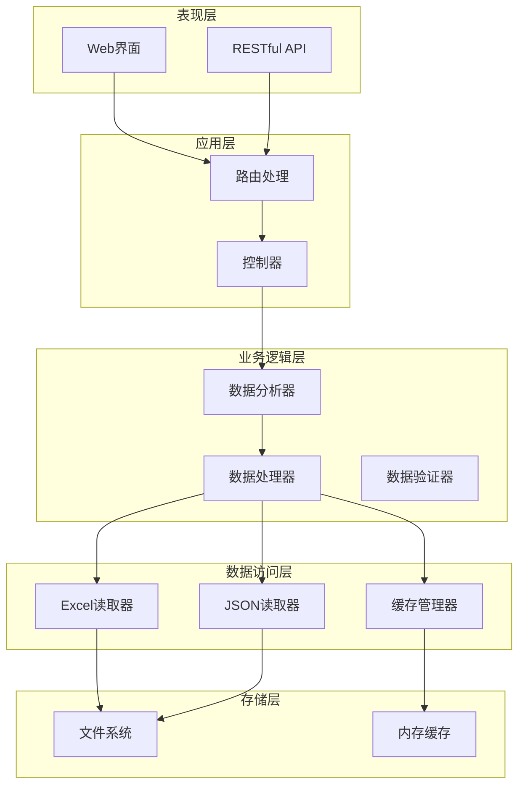

**图表来源**
- [app.py:42-133](file://app.py#L42-L133)
- [data_processor.py:54-1559](file://data_processor.py#L54-L1559)

## 详细组件分析

### 应用入口组件

应用入口负责路由定义和中间件配置：

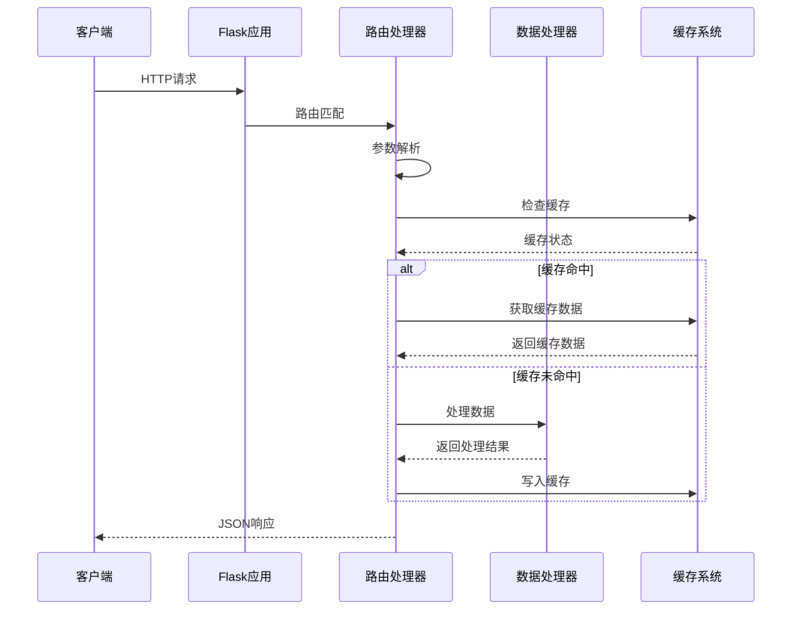

**图表来源**
- [app.py:47-102](file://app.py#L47-L102)
- [app.py:18-40](file://app.py#L18-L40)

### 数据处理器组件

数据处理器是系统的核心业务逻辑组件：

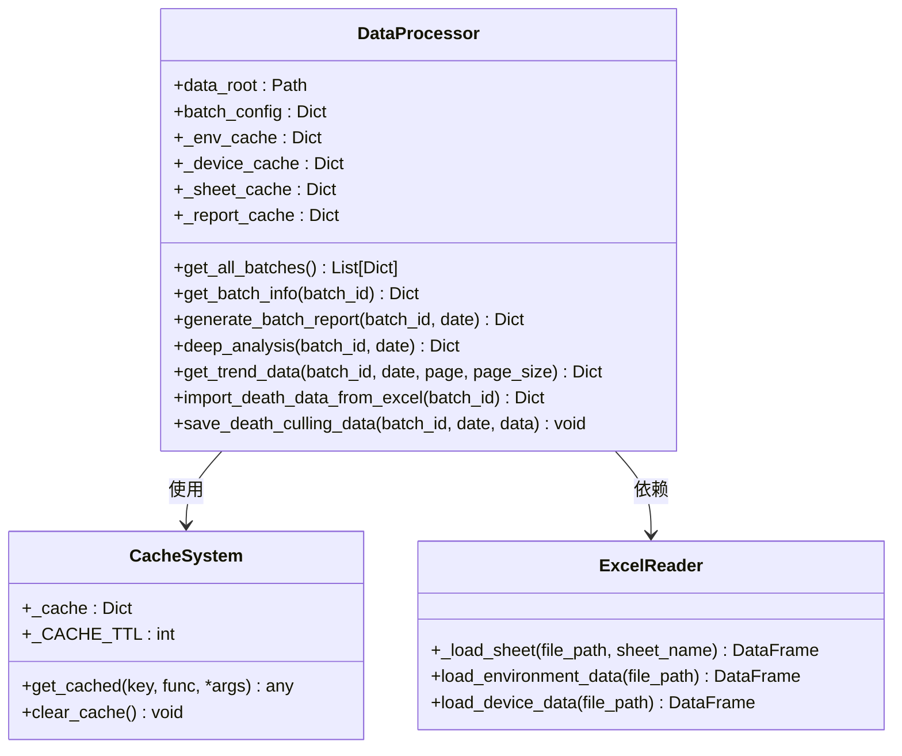

**图表来源**
- [data_processor.py:54-1559](file://data_processor.py#L54-L1559)

**章节来源**
- [app.py:1-133](file://app.py#L1-L133)
- [data_processor.py:1-1559](file://data_processor.py#L1-L1559)

## API扩展指南

### 新端点开发流程

#### 1. 路由定义

在`app.py`中添加新的路由：

```python
@app.route('/api/new-endpoint', methods=['GET', 'POST'])
def new_endpoint():
    # 参数解析
    param1 = request.args.get('param1', 'default')
    param2 = request.json.get('param2') if request.method == 'POST' else None
    
    # 业务逻辑处理
    result = processor.new_business_logic(param1, param2)
    
    # 响应格式化
    return jsonify({
        "success": True,
        "data": result,
        "timestamp": time.time()
    })
```

#### 2. 业务逻辑实现

在`data_processor.py`中添加相应的方法：

```python
def new_business_logic(self, param1: str, param2: Any) -> Dict[str, Any]:
    """新业务逻辑实现"""
    # 数据验证
    if not self.validate_input(param1, param2):
        raise ValueError("Invalid input parameters")
    
    # 数据处理
    processed_data = self.process_data(param1, param2)
    
    # 结果封装
    return {
        "processed_data": processed_data,
        "metadata": {
            "processing_time": time.time(),
            "batch_id": param1
        }
    }
```

#### 3. 错误处理

实现统一的错误处理机制：

```python
@app.errorhandler(Exception)
def handle_exception(e):
    return jsonify({
        "success": False,
        "error": str(e),
        "timestamp": time.time()
    }), 500

@app.errorhandler(404)
def handle_not_found(e):
    return jsonify({
        "success": False,
        "message": "Resource not found",
        "timestamp": time.time()
    }), 404
```

### 请求参数处理

#### 查询参数处理

```python
@app.route('/api/search')
def search_endpoint():
    # 基础参数
    page = int(request.args.get('page', 1))
    page_size = int(request.args.get('page_size', 50))
    
    # 过滤参数
    filters = {
        'batch_id': request.args.get('batch_id'),
        'date_range': {
            'start': request.args.get('start_date'),
            'end': request.args.get('end_date')
        },
        'status': request.args.get('status', 'active')
    }
    
    # 分页计算
    offset = (page - 1) * page_size
    
    # 数据查询
    results = processor.search_data(filters, offset, page_size)
    
    return jsonify({
        "success": True,
        "data": results,
        "pagination": {
            "page": page,
            "page_size": page_size,
            "total": processor.count_search_results(filters)
        }
    })
```

#### 表单数据处理

```python
@app.route('/api/upload', methods=['POST'])
def upload_endpoint():
    # 文件上传处理
    if 'file' not in request.files:
        return jsonify({
            "success": False,
            "message": "No file provided"
        }), 400
    
    file = request.files['file']
    if file.filename == '':
        return jsonify({
            "success": False,
            "message": "No file selected"
        }), 400
    
    # 文件类型验证
    if not allowed_file(file.filename):
        return jsonify({
            "success": False,
            "message": "File type not allowed"
        }), 400
    
    # 文件保存和处理
    filename = secure_filename(file.filename)
    file_path = os.path.join(app.config['UPLOAD_FOLDER'], filename)
    file.save(file_path)
    
    # 数据处理
    processor.process_uploaded_file(file_path)
    
    return jsonify({
        "success": True,
        "message": "File uploaded successfully",
        "filename": filename
    })
```

### 响应格式定义

系统采用统一的响应格式：

```python
class APIResponse:
    """API响应格式定义"""
    
    @staticmethod
    def success(data: Any, message: str = "Operation successful") -> Dict[str, Any]:
        return {
            "success": True,
            "message": message,
            "data": data,
            "timestamp": time.time()
        }
    
    @staticmethod
    def error(error_code: str, message: str, status_code: int = 400) -> Dict[str, Any]:
        return {
            "success": False,
            "error_code": error_code,
            "message": message,
            "timestamp": time.time()
        }
    
    @staticmethod
    def pagination(data: Any, total: int, page: int, page_size: int) -> Dict[str, Any]:
        return {
            "success": True,
            "data": data,
            "pagination": {
                "total": total,
                "page": page,
                "page_size": page_size,
                "total_pages": (total + page_size - 1) // page_size
            },
            "timestamp": time.time()
        }
```

**章节来源**
- [app.py:47-133](file://app.py#L47-L133)
- [data_processor.py:1-1559](file://data_processor.py#L1-L1559)

## API版本管理策略

### 版本控制架构

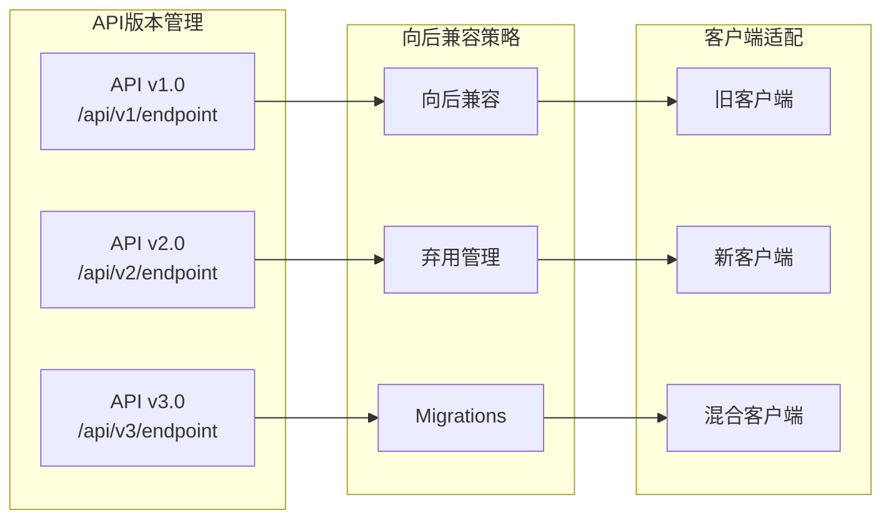

### 版本迁移策略

#### 1. 语义化版本控制

遵循语义化版本控制规范：
- 主版本：破坏性变更
- 次版本：向后兼容功能新增
- 修订版本：向后兼容问题修复

#### 2. 弃用策略

```python
def deprecated_endpoint():
    """弃用端点示例"""
    return jsonify({
        "success": False,
        "message": "This endpoint is deprecated",
        "alternative": "/api/v2/new-endpoint",
        "deprecation_date": "2026-12-31",
        "support_period": "6 months"
    }), 410
```

#### 3. 版本检测

```python
@app.before_request
def check_api_version():
    """API版本检测中间件"""
    api_version = request.headers.get('X-API-Version', '1.0')
    
    if api_version == '1.0':
        # 兼容旧版本逻辑
        pass
    elif api_version == '2.0':
        # 新版本逻辑
        pass
    else:
        return jsonify({
            "success": False,
            "message": "Unsupported API version"
        }), 400
```

### 向后兼容性保证

#### 1. 数据格式兼容

```python
def maintain_backward_compatibility():
    """保持向后兼容性的数据格式转换"""
    
    # 新版本数据结构
    new_format = {
        "id": "batch_001",
        "name": "Batch Name",
        "metrics": {
            "temperature": {"avg": 24.5, "min": 22.1, "max": 26.8},
            "humidity": {"avg": 65.2, "min": 60.0, "max": 70.5}
        }
    }
    
    # 向后兼容格式
    old_format = {
        "batch_id": "batch_001",
        "batch_name": "Batch Name",
        "avg_temp": 24.5,
        "avg_humidity": 65.2,
        "min_temp": 22.1,
        "max_temp": 26.8,
        "min_humidity": 60.0,
        "max_humidity": 70.5
    }
    
    return old_format  # 返回兼容格式
```

#### 2. 错误码兼容

```python
def maintain_error_code_compatibility():
    """保持错误码兼容性"""
    
    # 新版本错误码映射
    error_mapping = {
        "INVALID_INPUT": "invalid_input",
        "RESOURCE_NOT_FOUND": "resource_not_found",
        "PERMISSION_DENIED": "permission_denied",
        "INTERNAL_ERROR": "internal_error"
    }
    
    return error_mapping
```

**章节来源**
- [app.py:1-133](file://app.py#L1-L133)
- [data_processor.py:1-1559](file://data_processor.py#L1-L1559)

## 认证与授权机制

### JWT令牌认证

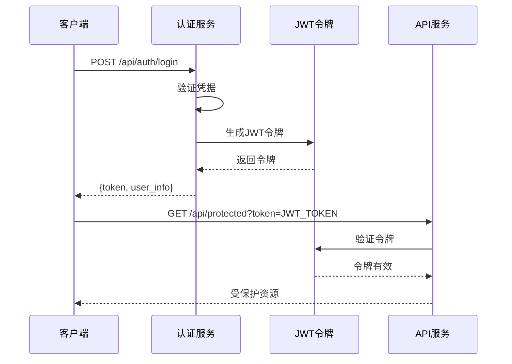

#### 1. JWT配置

```python
from datetime import datetime, timedelta
import jwt

class JWTManager:
    """JWT管理器"""
    
    def __init__(self, secret_key: str):
        self.secret_key = secret_key
        self.algorithm = 'HS256'
        self.token_expiry = timedelta(hours=24)
    
    def create_token(self, user_id: str, role: str) -> str:
        """创建JWT令牌"""
        payload = {
            'user_id': user_id,
            'role': role,
            'exp': datetime.utcnow() + self.token_expiry,
            'iat': datetime.utcnow()
        }
        return jwt.encode(payload, self.secret_key, algorithm=self.algorithm)
    
    def verify_token(self, token: str) -> dict:
        """验证JWT令牌"""
        try:
            payload = jwt.decode(token, self.secret_key, algorithms=[self.algorithm])
            return payload
        except jwt.ExpiredSignatureError:
            raise Exception("Token expired")
        except jwt.InvalidTokenError:
            raise Exception("Invalid token")
```

#### 2. 中间件实现

```python
def jwt_required(f):
    """JWT认证装饰器"""
    @wraps(f)
    def decorated_function(*args, **kwargs):
        token = request.headers.get('Authorization')
        
        if not token:
            return jsonify({
                "success": False,
                "message": "Authorization token required"
            }), 401
        
        if not token.startswith('Bearer '):
            return jsonify({
                "success": False,
                "message": "Invalid token format"
            }), 401
        
        try:
            jwt_manager = JWTManager(current_app.config['SECRET_KEY'])
            payload = jwt_manager.verify_token(token[7:])
            request.user = payload
            return f(*args, **kwargs)
        except Exception as e:
            return jsonify({
                "success": False,
                "message": str(e)
            }), 401
    
    return decorated_function

# 在路由中使用
@app.route('/api/protected')
@jwt_required
def protected_endpoint():
    return jsonify({
        "success": True,
        "message": f"Hello {request.user['user_id']}",
        "role": request.user['role']
    })
```

### OAuth集成

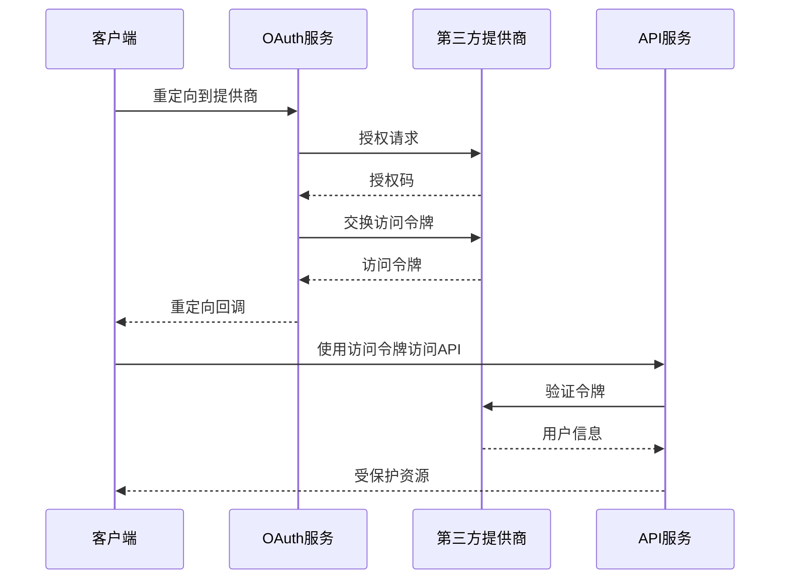

#### 1. OAuth配置

```python
from flask_oauthlib.client import OAuth

oauth = OAuth()

# Google OAuth配置
google = oauth.remote_app(
    'google',
    consumer_key='YOUR_GOOGLE_CLIENT_ID',
    consumer_secret='YOUR_GOOGLE_CLIENT_SECRET',
    request_token_params={
        'scope': 'email profile'
    },
    base_url='https://www.googleapis.com/oauth2/v1/',
    request_token_url=None,
    access_token_method='POST',
    access_token_url='https://accounts.google.com/o/oauth2/token',
    authorize_url='https://accounts.google.com/o/oauth2/auth',
)

@app.route('/api/auth/google')
def google_login():
    """Google OAuth登录"""
    return google.authorize(callback=url_for('google_authorized', _external=True))

@app.route('/api/auth/google/authorized')
@google.authorized_handler
def google_authorized(resp):
    """Google授权回调"""
    access_token = resp['access_token']
    google_user = google.get('userinfo')
    
    # 处理用户信息
    user_info = google_user.data
    jwt_token = create_jwt_token(user_info['sub'], user_info['email'])
    
    return jsonify({
        "success": True,
        "token": jwt_token,
        "user": user_info
    })
```

### 权限控制

#### 1. 角色基础访问控制(RBAC)

```python
class RBAC:
    """角色基础访问控制"""
    
    def __init__(self):
        self.permissions = {
            'admin': ['read', 'write', 'delete', 'manage_users'],
            'operator': ['read', 'write'],
            'viewer': ['read']
        }
        
        self.role_hierarchy = {
            'admin': 3,
            'operator': 2,
            'viewer': 1
        }
    
    def check_permission(self, user_role: str, required_permission: str) -> bool:
        """检查用户权限"""
        user_level = self.role_hierarchy.get(user_role, 0)
        required_level = self.role_hierarchy.get('viewer', 1)
        
        return user_level >= required_level
    
    def require_permission(self, permission: str):
        """权限装饰器"""
        def decorator(f):
            @wraps(f)
            def decorated_function(*args, **kwargs):
                user_role = request.user.get('role', 'viewer')
                if not self.check_permission(user_role, permission):
                    return jsonify({
                        "success": False,
                        "message": "Permission denied"
                    }), 403
                return f(*args, **kwargs)
            return decorated_function
        return decorator
```

#### 2. 资源级权限

```python
def resource_permission_check(resource_id: str, user_id: str) -> bool:
    """检查用户对特定资源的权限"""
    
    # 检查用户是否拥有该资源的访问权限
    allowed_resources = get_user_resources(user_id)
    return resource_id in allowed_resources

@app.route('/api/batch/<batch_id>')
@jwt_required
def get_batch(batch_id: str):
    """获取批次信息"""
    
    # 检查用户权限
    if not resource_permission_check(batch_id, request.user['user_id']):
        return jsonify({
            "success": False,
            "message": "Access denied to this batch"
        }), 403
    
    # 获取批次数据
    batch_data = processor.get_batch_info(batch_id)
    
    return jsonify({
        "success": True,
        "data": batch_data
    })
```

**章节来源**
- [app.py:1-133](file://app.py#L1-L133)
- [data_processor.py:1-1559](file://data_processor.py#L1-L1559)

## 性能优化与安全防护

### 缓存策略

#### 1. 多层缓存架构

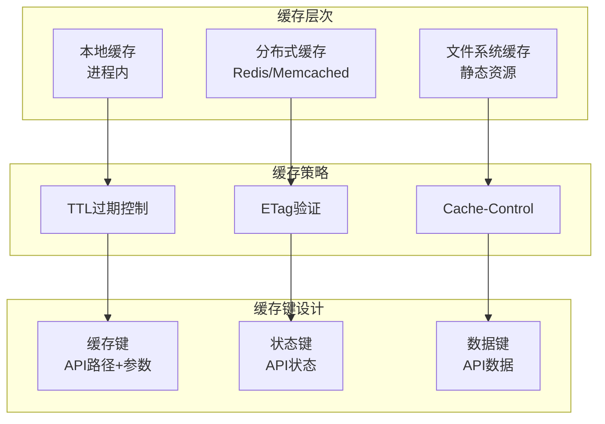

#### 2. 实现细节

```python
class CacheManager:
    """缓存管理器"""
    
    def __init__(self):
        self.local_cache = {}
        self.ttl = 300  # 5分钟
        self.cache_stats = {
            'hits': 0,
            'misses': 0,
            'evictions': 0
        }
    
    def get(self, key: str) -> Any:
        """获取缓存数据"""
        if key in self.local_cache:
            cached_time, value = self.local_cache[key]
            if time.time() - cached_time < self.ttl:
                self.cache_stats['hits'] += 1
                return value
            else:
                del self.local_cache[key]
                self.cache_stats['evictions'] += 1
        else:
            self.cache_stats['misses'] += 1
        return None
    
    def set(self, key: str, value: Any) -> None:
        """设置缓存数据"""
        self.local_cache[key] = (time.time(), value)
    
    def clear(self) -> None:
        """清空缓存"""
        self.local_cache.clear()
        self.cache_stats = {
            'hits': 0,
            'misses': 0,
            'evictions': 0
        }
    
    def get_stats(self) -> Dict:
        """获取缓存统计"""
        return self.cache_stats.copy()
```

### 限流控制

#### 1. 基于令牌桶的限流

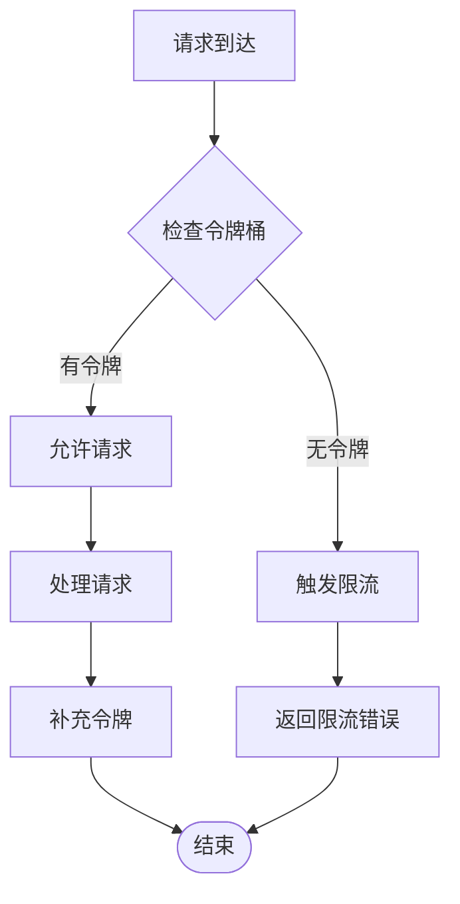

#### 2. 实现方案

```python
from collections import defaultdict
import time

class RateLimiter:
    """速率限制器"""
    
    def __init__(self, max_requests: int = 100, time_window: int = 60):
        self.max_requests = max_requests
        self.time_window = time_window
        self.requests = defaultdict(list)
    
    def is_allowed(self, client_id: str) -> bool:
        """检查请求是否被允许"""
        now = time.time()
        client_requests = self.requests[client_id]
        
        # 清理过期请求
        client_requests = [req_time for req_time in client_requests 
                         if now - req_time < self.time_window]
        
        # 更新请求记录
        self.requests[client_id] = client_requests
        
        # 检查是否超过限制
        return len(client_requests) < self.max_requests
    
    def add_request(self, client_id: str) -> None:
        """记录一次请求"""
        self.requests[client_id].append(time.time())

# 使用装饰器
def rate_limit(max_requests: int = 100, time_window: int = 60):
    """速率限制装饰器"""
    limiter = RateLimiter(max_requests, time_window)
    
    def decorator(f):
        @wraps(f)
        def decorated_function(*args, **kwargs):
            client_id = request.remote_addr
            if not limiter.is_allowed(client_id):
                return jsonify({
                    "success": False,
                    "message": "Too many requests"
                }), 429
            limiter.add_request(client_id)
            return f(*args, **kwargs)
        return decorated_function
    return decorator

# 在路由中使用
@app.route('/api/rate-limited')
@rate_limit(max_requests=10, time_window=60)
def rate_limited_endpoint():
    return jsonify({"success": True, "message": "Request processed"})
```

### CORS配置

```python
from flask_cors import CORS

# 允许所有域名访问
CORS(app)

# 或者精确配置
cors = CORS(app, resources={
    r"/api/*": {
        "origins": ["https://yourdomain.com", "https://*.yourdomain.com"],
        "methods": ["GET", "POST", "PUT", "DELETE"],
        "allow_headers": ["Content-Type", "Authorization"],
        "credentials": True
    }
})

# 动态CORS配置
@app.after_request
def after_request(response):
    """动态设置CORS头"""
    origin = request.headers.get('Origin')
    if origin:
        response.headers['Access-Control-Allow-Origin'] = origin
    response.headers['Access-Control-Allow-Methods'] = 'GET, POST, PUT, DELETE, OPTIONS'
    response.headers['Access-Control-Allow-Headers'] = 'Content-Type, Authorization'
    response.headers['Access-Control-Allow-Credentials'] = 'true'
    return response
```

### SQL注入防护

虽然系统使用Excel文件而非数据库，但为了完整性，这里提供通用的防护策略：

```python
import re
from urllib.parse import quote_plus

class SecurityValidator:
    """安全验证器"""
    
    @staticmethod
    def sanitize_input(user_input: str) -> str:
        """清理用户输入"""
        if not isinstance(user_input, str):
            return str(user_input)
        
        # 移除危险字符
        dangerous_chars = [';', '--', '/*', '*/', "'", '"', '\\']
        sanitized = user_input
        for char in dangerous_chars:
            sanitized = sanitized.replace(char, '')
        
        return sanitized
    
    @staticmethod
    def validate_batch_id(batch_id: str) -> bool:
        """验证批次ID格式"""
        pattern = r'^[a-zA-Z0-9_-]+$'
        return bool(re.match(pattern, batch_id))
    
    @staticmethod
    def validate_date_format(date_str: str) -> bool:
        """验证日期格式"""
        pattern = r'^\d{4}-\d{2}-\d{2}$'
        return bool(re.match(pattern, date_str))
    
    @staticmethod
    def escape_sql_like(value: str) -> str:
        """转义LIKE查询中的特殊字符"""
        if not isinstance(value, str):
            return str(value)
        
        escape_chars = ['%', '_', '\\']
        escaped = value
        for char in escape_chars:
            escaped = escaped.replace(char, f'\\{char}')
        
        return escaped
```

### 输入验证

```python
from functools import wraps
from marshmallow import Schema, fields, ValidationError

class APISchema(Schema):
    """API参数验证模式"""
    
    batch_id = fields.Str(required=True, validate=lambda x: len(x) > 0)
    date = fields.Date(required=True)
    page = fields.Int(missing=1, validate=lambda x: x > 0)
    page_size = fields.Int(missing=50, validate=lambda x: 1 <= x <= 1000)

def validate_api_params(schema_class: Schema):
    """API参数验证装饰器"""
    def decorator(f):
        @wraps(f)
        def decorated_function(*args, **kwargs):
            try:
                schema = schema_class()
                validated_data = schema.load(request.args.to_dict())
                request.validated_params = validated_data
                return f(*args, **kwargs)
            except ValidationError as e:
                return jsonify({
                    "success": False,
                    "message": "Validation failed",
                    "errors": e.messages
                }), 400
        return decorated_function
    return decorator

# 使用示例
@app.route('/api/validated-endpoint')
@validate_api_params(APISchema)
def validated_endpoint():
    params = request.validated_params
    return jsonify({
        "success": True,
        "data": f"Processed {params['batch_id']} for {params['date']}"
    })
```

**章节来源**
- [app.py:1-133](file://app.py#L1-L133)
- [data_processor.py:1-1559](file://data_processor.py#L1-L1559)

## 测试与文档

### Swagger集成

#### 1. Flask-RESTPlus集成

```python
from flask_restplus import Api, Resource, fields

# 创建API实例
api = Api(app, 
          version='1.0',
          title='猪场环控API',
          description='猪场环境控制数据分析API',
          doc='/docs/')

# 定义模型
batch_model = api.model('Batch', {
    'batch_id': fields.String(required=True, description='批次ID'),
    'batch_name': fields.String(description='批次名称'),
    'farm_name': fields.String(description='农场名称'),
    'entry_date': fields.Date(description='入场日期'),
    'units': fields.List(fields.String, description='单元列表'),
    'total_pig_count': fields.Integer(description='总猪数')
})

report_model = api.model('Report', {
    'batch_info': fields.Nested(batch_model),
    'batch_summary': fields.Raw(description='批次摘要'),
    'unit_reports': fields.List(fields.Raw, description='单元报告'),
    'trend_data': fields.Raw(description='趋势数据')
})

# API端点定义
@api.route('/api/batches')
class Batches(Resource):
    @api.marshal_list_with(batch_model)
    @api.doc('获取批次列表')
    def get(self):
        """获取所有批次信息"""
        return processor.get_all_batches()

@api.route('/api/report')
class Report(Resource):
    @api.marshal_with(report_model)
    @api.doc('获取环控报告')
    @api.expect(api.parser().add_argument('batch_id', type=str, required=True, location='args'))
    @api.expect(api.parser().add_argument('date', type=str, required=True, location='args'))
    def get(self):
        """获取环控报告"""
        parser = api.parser()
        parser.add_argument('batch_id', type=str, required=True, location='args')
        parser.add_argument('date', type=str, required=True, location='args')
        args = parser.parse_args()
        
        return processor.generate_batch_report(args['batch_id'], args['date'])

if __name__ == '__main__':
    app.run(debug=True)
```

#### 2. 自定义Swagger文档

```python
from flask_swagger_ui import get_swaggerui_blueprint

SWAGGER_URL = '/api/docs'
API_URL = '/static/swagger.json'

swaggerui_blueprint = get_swaggerui_blueprint(
    SWAGGER_URL,
    API_URL,
    config={
        'app_name': "猪场环控API"
    }
)

app.register_blueprint(swaggerui_blueprint, url_prefix=SWAGGER_URL)
```

### Postman测试

#### 1. 测试集合结构

```json
{
    "info": {
        "name": "猪场环控API测试",
        "schema": "https://schema.getpostman.com/json/collection/v2.1.0/collection.json"
    },
    "item": [
        {
            "name": "获取批次列表",
            "request": {
                "method": "GET",
                "url": {
                    "raw": "{{baseUrl}}/api/batches",
                    "host": ["{{baseUrl}}"],
                    "path": ["api", "batches"],
                    "query": []
                }
            }
        },
        {
            "name": "获取环控报告",
            "request": {
                "method": "GET",
                "url": {
                    "raw": "{{baseUrl}}/api/report?batch_id=20251218&date=2026-03-10",
                    "host": ["{{baseUrl}}"],
                    "path": ["api", "report"],
                    "query": [
                        {
                            "key": "batch_id",
                            "value": "20251218"
                        },
                        {
                            "key": "date",
                            "value": "2026-03-10"
                        }
                    ]
                }
            }
        }
    ]
}
```

#### 2. 环境变量配置

```json
{
    "values": [
        {
            "key": "baseUrl",
            "value": "http://localhost:5000",
            "enabled": true
        },
        {
            "key": "apiKey",
            "value": "",
            "enabled": false
        }
    ]
}
```

### 自动化测试

#### 1. 单元测试

```python
import unittest
from app import app
from data_processor import DataProcessor

class APITestCase(unittest.TestCase):
    def setUp(self):
        self.app = app.test_client()
        self.app_context = app.app_context()
        self.app_context.push()
        
    def tearDown(self):
        self.app_context.pop()
    
    def test_get_batches(self):
        """测试获取批次列表"""
        response = self.app.get('/api/batches')
        self.assertEqual(response.status_code, 200)
        data = response.get_json()
        self.assertTrue(data['success'])
        self.assertIn('data', data)
    
    def test_get_report_success(self):
        """测试获取报告成功"""
        response = self.app.get('/api/report?batch_id=20251218&date=2026-03-10')
        self.assertEqual(response.status_code, 200)
        data = response.get_json()
        self.assertTrue(data['success'])
        self.assertIn('data', data)
    
    def test_get_report_not_found(self):
        """测试获取报告失败"""
        response = self.app.get('/api/report?batch_id=invalid&date=2026-03-10')
        self.assertEqual(response.status_code, 200)
        data = response.get_json()
        self.assertFalse(data['success'])

if __name__ == '__main__':
    unittest.main()
```

#### 2. 集成测试

```python
import pytest
import json

@pytest.fixture
def client():
    app.config['TESTING'] = True
    with app.test_client() as client:
        yield client

def test_api_endpoints(client):
    """测试所有API端点"""
    
    # 测试批次列表
    response = client.get('/api/batches')
    assert response.status_code == 200
    data = json.loads(response.data)
    assert data['success'] == True
    
    # 测试报告获取
    response = client.get('/api/report?batch_id=20251218&date=2026-03-10')
    assert response.status_code == 200
    data = json.loads(response.data)
    assert data['success'] == True
    
    # 测试深度分析
    response = client.get('/api/deep-analysis?batch_id=20251218&date=2026-03-10')
    assert response.status_code == 200
    data = json.loads(response.data)
    assert data['success'] == True

def test_cache_functionality(client):
    """测试缓存功能"""
    
    # 第一次请求
    response1 = client.get('/api/report?batch_id=20251218&date=2026-03-10')
    data1 = json.loads(response1.data)
    
    # 第二次请求（应该使用缓存）
    response2 = client.get('/api/report?batch_id=20251218&date=2026-03-10')
    data2 = json.loads(response2.data)
    
    # 验证缓存命中
    assert data1['success'] == True
    assert data2['success'] == True
```

### API文档生成

#### 1. 自动生成文档

```python
from flask import jsonify
import inspect

def generate_api_docs():
    """自动生成API文档"""
    
    routes = []
    for rule in app.url_map.iter_rules():
        if rule.rule.startswith('/api/'):
            route_info = {
                'path': rule.rule,
                'methods': list(rule.methods - {'HEAD', 'OPTIONS'}),
                'endpoint': rule.endpoint,
                'docstring': None
            }
            
            # 获取函数文档
            func = app.view_functions[rule.endpoint]
            if func.__doc__:
                route_info['description'] = func.__doc__
            
            routes.append(route_info)
    
    return routes

@app.route('/api/docs')
def api_docs():
    """API文档页面"""
    docs = generate_api_docs()
    return jsonify({
        "success": True,
        "data": docs,
        "generated_at": time.time()
    })
```

#### 2. 文档模板

```html
<!DOCTYPE html>
<html>
<head>
    <title>API文档</title>
    <style>
        body { font-family: Arial, sans-serif; margin: 20px; }
        .route { border: 1px solid #ddd; margin: 10px 0; padding: 15px; }
        .method { display: inline-block; padding: 2px 8px; margin: 2px; border-radius: 3px; }
        .get { background: #d4edda; }
        .post { background: #fff3cd; }
        .put { background: #d1ecf1; }
        .delete { background: #f8d7da; }
    </style>
</head>
<body>
    <h1>猪场环控API文档</h1>
    <div id="api-routes">
        <!-- 路由信息将通过JavaScript动态生成 -->
    </div>
</body>
</html>
```

**章节来源**
- [app.py:1-133](file://app.py#L1-L133)
- [data_processor.py:1-1559](file://data_processor.py#L1-L1559)

## 故障排除指南

### 常见问题诊断

#### 1. 缓存相关问题

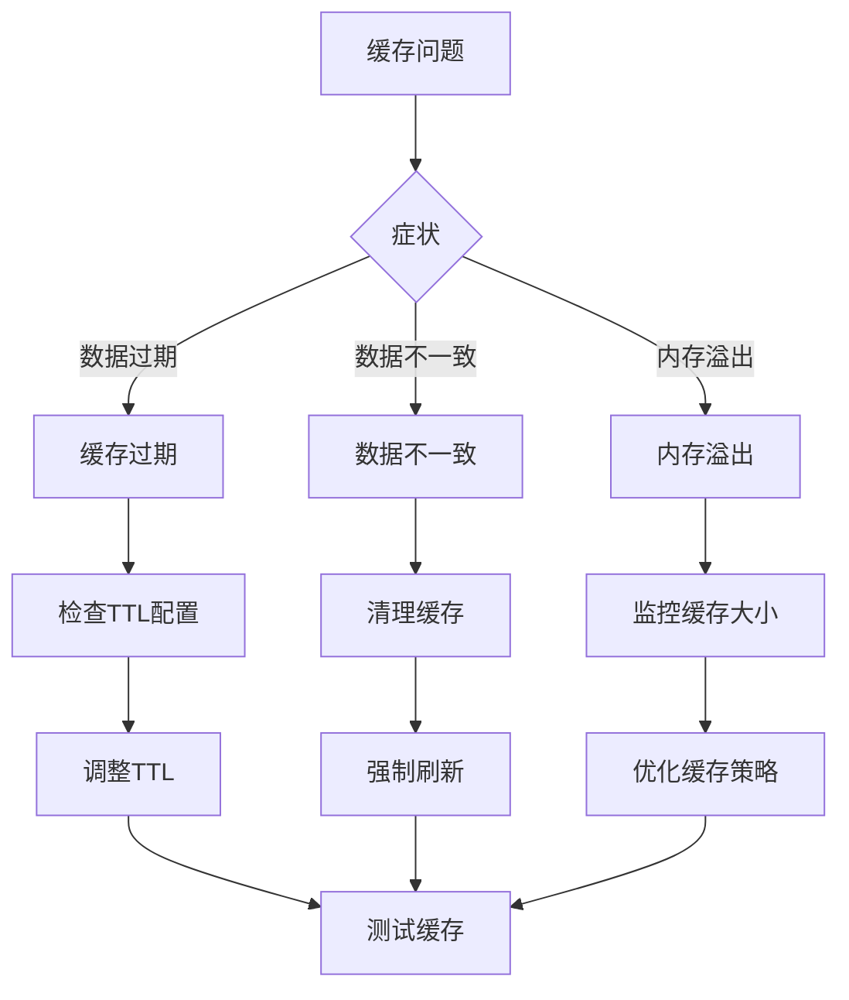

#### 2. 错误处理机制

```python
@app.errorhandler(404)
def not_found(error):
    """处理404错误"""
    return jsonify({
        "success": False,
        "error": "Not Found",
        "message": "The requested resource was not found",
        "timestamp": time.time()
    }), 404

@app.errorhandler(400)
def bad_request(error):
    """处理400错误"""
    return jsonify({
        "success": False,
        "error": "Bad Request",
        "message": "The request was invalid",
        "timestamp": time.time()
    }), 400

@app.errorhandler(500)
def internal_error(error):
    """处理500错误"""
    return jsonify({
        "success": False,
        "error": "Internal Server Error",
        "message": "An internal server error occurred",
        "timestamp": time.time()
    }), 500

@app.errorhandler(Exception)
def handle_exception(e):
    """处理未捕获的异常"""
    # 记录错误日志
    app.logger.error(f"Unhandled exception: {str(e)}")
    
    return jsonify({
        "success": False,
        "error": "Unknown Error",
        "message": "An unexpected error occurred",
        "timestamp": time.time()
    }), 500
```

### 性能监控

#### 1. 性能指标收集

```python
import time
from functools import wraps

class PerformanceMonitor:
    """性能监控器"""
    
    def __init__(self):
        self.metrics = {
            'request_count': 0,
            'total_response_time': 0,
            'slow_requests': 0,
            'error_count': 0
        }
        self.slow_threshold = 1.0  # 1秒
    
    def monitor(self, f):
        """监控装饰器"""
        @wraps(f)
        def decorated_function(*args, **kwargs):
            start_time = time.time()
            
            try:
                result = f(*args, **kwargs)
                return result
            finally:
                end_time = time.time()
                response_time = end_time - start_time
                
                self.metrics['request_count'] += 1
                self.metrics['total_response_time'] += response_time
                
                if response_time > self.slow_threshold:
                    self.metrics['slow_requests'] += 1
                
                # 记录慢请求
                if response_time > self.slow_threshold:
                    app.logger.warning(f"Slow request: {f.__name__} took {response_time:.2f}s")
        
        return decorated_function
    
    def get_metrics(self) -> Dict:
        """获取性能指标"""
        avg_response_time = self.metrics['total_response_time'] / max(self.metrics['request_count'], 1)
        
        return {
            'request_count': self.metrics['request_count'],
            'average_response_time': round(avg_response_time, 3),
            'slow_requests': self.metrics['slow_requests'],
            'error_count': self.metrics['error_count'],
            'slow_request_percentage': round(
                self.metrics['slow_requests'] / max(self.metrics['request_count'], 1) * 100, 2
            )
        }

# 应用监控装饰器
monitor = PerformanceMonitor()

@app.route('/api/performance')
@monitor.monitor
def performance_endpoint():
    """性能监控端点"""
    return jsonify({
        "success": True,
        "metrics": monitor.get_metrics()
    })
```

#### 2. 缓存健康检查

```python
@app.route('/api/cache/health')
def cache_health():
    """缓存健康检查"""
    
    cache_stats = {
        'size': len(_CACHE),
        'ttl': _CACHE_TTL,
        'hits': getattr(get_cache, 'hits', 0),
        'misses': getattr(get_cache, 'misses', 0),
        'evictions': getattr(get_cache, 'evictions', 0)
    }
    
    return jsonify({
        "success": True,
        "data": cache_stats,
        "status": "healthy" if cache_stats['size'] > 0 else "warning"
    })
```

### 调试工具

#### 1. 调试中间件

```python
@app.before_request
def log_request_info():
    """记录请求信息"""
    app.logger.info(f"Request: {request.method} {request.url}")
    app.logger.info(f"Headers: {dict(request.headers)}")
    app.logger.info(f"Args: {request.args.to_dict()}")
    
    if request.method in ['POST', 'PUT']:
        app.logger.info(f"Body: {request.get_json()}")

@app.after_request
def log_response_info(response):
    """记录响应信息"""
    app.logger.info(f"Response: {response.status_code}")
    return response
```

#### 2. 错误追踪

```python
import traceback
from werkzeug.exceptions import HTTPException

@app.errorhandler(Exception)
def handle_exception(e):
    """增强的错误处理"""
    
    # 检查是否为HTTP异常
    if isinstance(e, HTTPException):
        return jsonify({
            "success": False,
            "error_code": e.code,
            "message": e.description,
            "timestamp": time.time()
        }), e.code
    
    # 记录详细错误信息
    app.logger.error(f"Unhandled exception: {str(e)}")
    app.logger.error(traceback.format_exc())
    
    return jsonify({
        "success": False,
        "error_code": 500,
        "message": "Internal server error occurred",
        "timestamp": time.time(),
        "traceback": traceback.format_exc() if app.debug else None
    }), 500
```

**章节来源**
- [app.py:1-133](file://app.py#L1-L133)
- [data_processor.py:1-1559](file://data_processor.py#L1-L1559)

## 结论

本指南提供了猪场环控数据分析系统API接口扩展的完整解决方案。通过遵循本文档的架构设计原则、安全最佳实践和性能优化策略，开发者可以：

1. **快速扩展API功能**：利用现有的路由架构和数据处理模式，轻松添加新的API端点
2. **确保系统稳定性**：通过完善的错误处理、缓存策略和性能监控机制
3. **维护向后兼容性**：采用渐进式版本管理策略，平滑过渡到新版本
4. **强化安全防护**：实施多层次的安全措施，包括认证授权、输入验证和防护攻击
5. **提升开发效率**：通过标准化的开发流程、测试策略和文档管理

建议在实施过程中：
- 始终遵循RESTful设计原则
- 重视API版本管理和向后兼容性
- 实施全面的安全防护措施
- 建立完善的监控和日志体系
- 制定详细的测试和部署流程

通过这些实践，可以构建一个健壮、可扩展且易于维护的API系统，为猪场环控数据分析提供强有力的技术支撑。