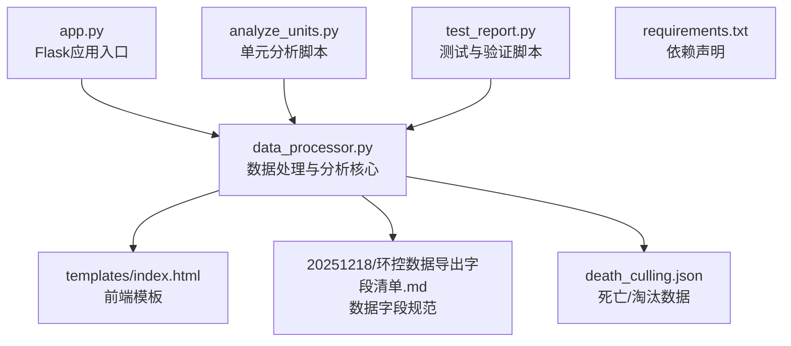
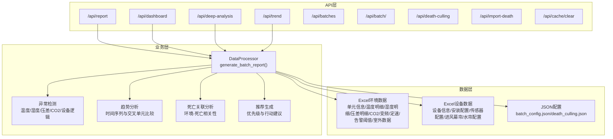
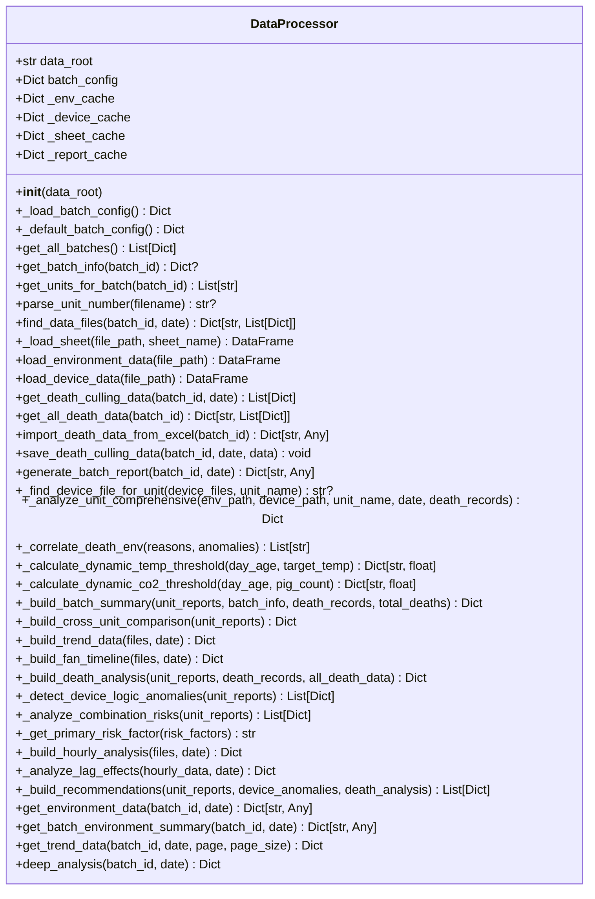
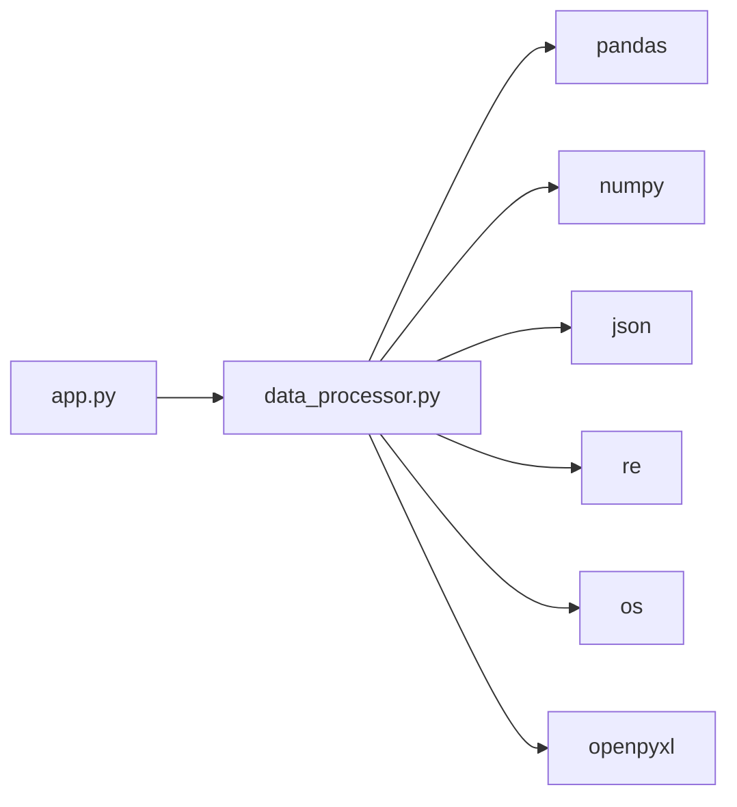

# 扩展与定制

<cite>
**本文档引用的文件**
- [app.py](file://app.py)
- [data_processor.py](file://data_processor.py)
- [analyze_units.py](file://analyze_units.py)
- [test_report.py](file://test_report.py)
- [death_culling.json](file://death_culling.json)
- [requirements.txt](file://requirements.txt)
- [templates/index.html](file://templates/index.html)
- [20251218/环控数据导出字段清单.md](file://20251218/环控数据导出字段清单.md)
</cite>

## 目录
1. [简介](#简介)
2. [项目结构](#项目结构)
3. [核心组件](#核心组件)
4. [架构总览](#架构总览)
5. [详细组件分析](#详细组件分析)
6. [依赖关系分析](#依赖关系分析)
7. [性能考虑](#性能考虑)
8. [故障排除指南](#故障排除指南)
9. [结论](#结论)
10. [附录](#附录)

## 简介
本指南面向需要为猪场环控数据分析系统进行扩展与定制的开发者，涵盖以下主题：
- 新增环境参数分析与异常检测算法
- 扩展设备类型支持与设备逻辑异常检测
- 插件化扩展框架与接口规范
- 报告模板定制与数据处理逻辑修改
- 数据源扩展与配置文件修改
- 代码架构分析、设计模式应用与最佳实践

系统基于Flask提供REST API，使用pandas进行数据处理，通过Excel文件承载环境与设备数据，前端采用Chart.js渲染可视化图表。

## 项目结构
项目采用“API层-数据处理层-模板层”的分层架构，文件组织清晰，便于扩展与维护。

**图表来源**
- [app.py:1-133](file://app.py#L1-L133)
- [data_processor.py:1-1559](file://data_processor.py#L1-L1559)
- [templates/index.html:1-1983](file://templates/index.html#L1-L1983)
- [20251218/环控数据导出字段清单.md:1-140](file://20251218/环控数据导出字段清单.md#L1-L140)
- [death_culling.json:1-27](file://death_culling.json#L1-L27)
- [analyze_units.py:1-105](file://analyze_units.py#L1-L105)
- [test_report.py:1-48](file://test_report.py#L1-L48)
- [requirements.txt:1-4](file://requirements.txt#L1-L4)

**章节来源**
- [app.py:1-133](file://app.py#L1-L133)
- [data_processor.py:1-1559](file://data_processor.py#L1-L1559)
- [templates/index.html:1-1983](file://templates/index.html#L1-L1983)
- [20251218/环控数据导出字段清单.md:1-140](file://20251218/环控数据导出字段清单.md#L1-L140)
- [death_culling.json:1-27](file://death_culling.json#L1-L27)
- [analyze_units.py:1-105](file://analyze_units.py#L1-L105)
- [test_report.py:1-48](file://test_report.py#L1-L48)
- [requirements.txt:1-4](file://requirements.txt#L1-L4)

## 核心组件
- Flask应用层：提供REST API端点，负责请求路由、缓存与响应封装。
- 数据处理层：核心业务逻辑，负责数据加载、清洗、分析与报告生成。
- 模板层：前端HTML模板，用于展示分析结果与交互界面。
- 配置与数据：批次配置、死亡/淘汰数据、Excel字段规范。

关键职责与边界：
- app.py：路由与缓存控制，调用DataProcessor生成报告。
- data_processor.py：数据加载、异常检测、趋势分析、推荐生成等。
- templates/index.html：前端展示与图表渲染。
- 配置文件：batch_config.json（默认在data_processor中定义）、death_culling.json。

**章节来源**
- [app.py:1-133](file://app.py#L1-L133)
- [data_processor.py:54-1559](file://data_processor.py#L54-L1559)
- [templates/index.html:1-1983](file://templates/index.html#L1-L1983)

## 架构总览
系统采用分层架构，API层与业务层解耦，便于扩展新的分析算法与设备类型。

**图表来源**
- [app.py:47-129](file://app.py#L47-L129)
- [data_processor.py:238-295](file://data_processor.py#L238-L295)
- [data_processor.py:639-838](file://data_processor.py#L639-L838)
- [data_processor.py:1026-1114](file://data_processor.py#L1026-L1114)
- [data_processor.py:1116-1192](file://data_processor.py#L1116-L1192)
- [data_processor.py:1426-1497](file://data_processor.py#L1426-L1497)

## 详细组件分析

### 组件A：Flask应用与缓存
- 路由设计：提供批次列表、批次详情、报告、仪表盘、深度分析、趋势、死亡/淘汰导入与缓存清理等端点。
- 缓存策略：全局字典缓存，TTL为5分钟，支持按批号+日期键缓存报告与趋势数据。
- 请求参数：支持batch_id、date、page、page_size等查询参数。
- 响应封装：统一返回success与data字段，使用clean_dict处理NaN/Inf等特殊值。

扩展建议：
- 新增端点：在app.py中添加新路由，调用DataProcessor对应方法。
- 缓存策略：可替换为Redis/本地磁盘缓存，支持跨进程共享与持久化。
- 参数校验：在app.py中增加输入参数校验与错误处理。

**章节来源**
- [app.py:18-40](file://app.py#L18-L40)
- [app.py:47-129](file://app.py#L47-L129)
- [app.py:131-133](file://app.py#L131-L133)

### 组件B：DataProcessor核心分析引擎
职责与能力：
- 数据加载：根据批号与日期查找环境与设备Excel文件，按Sheet读取并缓存。
- 批次配置：默认批号配置在类内定义，可通过外部JSON覆盖。
- 报告生成：生成批次汇总、单元报告、交叉对比、趋势、风机时间线、死亡关联、设备异常、小时分析与推荐。
- 异常检测：动态阈值（按日龄、密度）检测温度、湿度、压差、CO2异常；设备逻辑异常（风机始终停机、阈值不一致等）。
- 死亡关联：将当日死亡记录与环境异常进行关联分析。
- 推荐生成：基于异常类型与严重程度生成优先级建议。

设计模式与架构要点：
- 面向对象：DataProcessor类封装所有分析逻辑，便于扩展与测试。
- 配置驱动：通过字段清单与阈值函数实现灵活的分析规则。
- 分层设计：各分析模块独立，通过统一的数据结构传递结果。

扩展点与接口规范：
- 新增分析算法：在DataProcessor中新增方法，遵循现有返回结构，注册到generate_batch_report。
- 新增设备类型：在设备操作分析区域新增对应Sheet读取与解析逻辑。
- 新增异常检测：在异常检测区域新增条件分支，更新风险评分与异常列表。
- 新增报告字段：在相应构建函数中追加字段，前端模板同步更新。

**章节来源**
- [data_processor.py:54-1559](file://data_processor.py#L54-L1559)

#### 类图（代码级）

**图表来源**
- [data_processor.py:54-1559](file://data_processor.py#L54-L1559)

### 组件C：前端模板与可视化
- 模板：index.html提供响应式布局、图表容器、标签页与交互元素。
- 图表：使用Chart.js渲染温度、湿度、CO2、压差、风机时间线等。
- 主题：CSS变量定义颜色体系，支持高/中/低风险视觉反馈。
- 交互：支持批号与日期选择、标签页切换、打印优化。

扩展建议：
- 新增图表：在模板中添加Chart.js实例，通过API端点获取数据。
- 新增标签页：在模板中新增导航与内容区域，绑定JavaScript事件。
- 主题定制：通过CSS变量调整颜色与排版，适配不同品牌风格。

**章节来源**
- [templates/index.html:1-1983](file://templates/index.html#L1-L1983)

### 组件D：数据字段规范与示例
- 字段清单：明确环境数据与设备数据的Sheet与字段含义，便于扩展新字段。
- 示例数据：analyze_units.py演示了如何读取与统计各类指标。
- 导入流程：test_report.py展示了如何生成并输出报告摘要。

扩展建议：
- 新增字段：在字段清单中补充新字段，DataProcessor中新增读取与分析逻辑。
- 新增Sheet：在DataProcessor中新增_sheet_cache与_load_sheet调用。
- 数据校验：在读取阶段增加字段存在性与类型校验。

**章节来源**
- [20251218/环控数据导出字段清单.md:1-140](file://20251218/环控数据导出字段清单.md#L1-L140)
- [analyze_units.py:1-105](file://analyze_units.py#L1-L105)
- [test_report.py:1-48](file://test_report.py#L1-L48)

## 依赖关系分析
- 外部依赖：Flask、pandas、openpyxl。
- 内部依赖：app.py依赖data_processor.py；data_processor.py依赖pandas、numpy、json、re、os等。
- 缓存依赖：app.py与data_processor.py各自维护缓存，存在一致性风险。

**图表来源**
- [app.py:1-5](file://app.py#L1-L5)
- [data_processor.py:1-11](file://data_processor.py#L1-L11)
- [requirements.txt:1-4](file://requirements.txt#L1-L4)

**章节来源**
- [app.py:1-5](file://app.py#L1-L5)
- [data_processor.py:1-11](file://data_processor.py#L1-L11)
- [requirements.txt:1-4](file://requirements.txt#L1-L4)

## 性能考虑
- 缓存策略：全局字典缓存适合小规模部署；建议替换为Redis或分布式缓存，提升并发与持久化能力。
- 数据读取：_sheet_cache与_find_device_file_for_unit提升重复读取效率。
- 数值计算：pandas向量化操作高效；注意NaN/Inf处理，避免影响统计结果。
- 前端渲染：Chart.js渲染大量数据时建议分页或抽样显示。

[本节为通用性能建议，无需特定文件来源]

## 故障排除指南
常见问题与定位：
- 报告为空：检查批号与日期是否正确，确认Excel文件命名与Sheet是否存在。
- 异常检测不生效：检查阈值函数参数（日龄、密度）与字段列名是否匹配。
- 设备异常未识别：确认设备数据Sheet名称与字段是否符合预期。
- 死亡关联异常：检查death_culling.json格式与日期键是否一致。
- 缓存命中异常：确认缓存键拼接规则与TTL设置。

调试工具：
- test_report.py可直接运行生成报告并输出关键字段，便于快速验证。
- 在app.py中调用clear_cache()端点可强制刷新缓存。

**章节来源**
- [test_report.py:1-48](file://test_report.py#L1-L48)
- [app.py:126-129](file://app.py#L126-L129)
- [data_processor.py:1499-1559](file://data_processor.py#L1499-L1559)

## 结论
该系统提供了清晰的分层架构与可扩展的数据处理核心，开发者可在不破坏现有结构的前提下，通过以下路径进行扩展：
- 新增分析算法：在DataProcessor中新增方法并注册到报告生成流程。
- 新增设备类型：在设备操作分析区域扩展对应Sheet读取与解析。
- 新增异常检测：在异常检测区域新增条件分支，完善风险评分与异常列表。
- 报告模板定制：在templates/index.html中新增图表与标签页。
- 数据源扩展：在字段清单中新增字段并在DataProcessor中实现读取与分析。

[本节为总结性内容，无需特定文件来源]

## 附录

### 扩展与定制指南

#### 1. 新增环境参数分析
- 目标：新增如氨气、氧气、光照强度等参数的分析。
- 步骤：
  - 在字段清单中补充新参数字段与Sheet。
  - 在DataProcessor中新增对应Sheet读取与统计逻辑。
  - 在异常检测区域加入动态阈值与风险评分。
  - 在前端模板中新增图表与展示区域。
- 参考位置：
  - 字段清单：[20251218/环控数据导出字段清单.md:1-140](file://20251218/环控数据导出字段清单.md#L1-L140)
  - 异常检测：[data_processor.py:639-838](file://data_processor.py#L639-L838)
  - 报告生成：[data_processor.py:238-295](file://data_processor.py#L238-L295)

#### 2. 新增设备类型支持
- 目标：支持新设备类型（如加热器、喷淋系统）。
- 步骤：
  - 在设备数据字段清单中新增设备配置Sheet与字段。
  - 在DataProcessor中新增对应Sheet读取与解析逻辑。
  - 在设备逻辑异常检测区域新增一致性与运行状态检查。
  - 在前端模板中新增设备状态图表。
- 参考位置：
  - 设备数据字段：[20251218/环控数据导出字段清单.md:87-126](file://20251218/环控数据导出字段清单.md#L87-L126)
  - 设备分析：[data_processor.py:538-609](file://data_processor.py#L538-L609)
  - 设备异常检测：[data_processor.py:1194-1249](file://data_processor.py#L1194-L1249)

#### 3. 新增异常检测算法
- 目标：引入机器学习或统计模型进行异常预测。
- 步骤：
  - 在DataProcessor中新增算法方法，返回异常列表与风险评分。
  - 将新算法集成到generate_batch_report流程中。
  - 在前端模板中展示新算法的可视化结果。
- 参考位置：
  - 报告集成：[data_processor.py:238-295](file://data_processor.py#L238-L295)
  - 异常检测模板：[data_processor.py:639-838](file://data_processor.py#L639-L838)

#### 4. 插件开发框架与接口规范
- 框架建议：
  - 定义统一的分析接口：如analyze_<param>_metrics(env_df, device_df) -> Dict。
  - 定义异常检测接口：如detect_<param>_anomalies(env_df, thresholds) -> List[Dict]。
  - 定义报告字段接口：如build_<param>_report(unit_reports) -> Dict。
- 集成方式：
  - 在DataProcessor中新增插件注册与调用逻辑。
  - 通过配置文件启用/禁用插件。
- 参考位置：
  - 现有分析方法：[data_processor.py:303-838](file://data_processor.py#L303-L838)
  - 报告构建：[data_processor.py:916-1192](file://data_processor.py#L916-L1192)

#### 5. 定制报告模板
- 目标：根据业务需求定制报告内容与样式。
- 步骤：
  - 在templates/index.html中新增图表容器与标签页。
  - 在app.py中新增API端点返回定制数据。
  - 在前端JavaScript中渲染图表与交互。
- 参考位置：
  - 模板结构：[templates/index.html:1-1983](file://templates/index.html#L1-L1983)
  - API端点：[app.py:47-129](file://app.py#L47-L129)

#### 6. 修改数据处理逻辑
- 目标：调整阈值、权重或统计口径。
- 步骤：
  - 在字段清单中明确新逻辑的字段与计算方式。
  - 在DataProcessor中修改对应函数（如阈值计算、统计聚合）。
  - 更新异常检测与推荐生成逻辑。
- 参考位置：
  - 阈值计算：[data_processor.py:865-914](file://data_processor.py#L865-L914)
  - 统计聚合：[data_processor.py:916-1192](file://data_processor.py#L916-L1192)

#### 7. 扩展数据源支持
- 目标：支持除Excel外的其他数据源（如数据库、API）。
- 步骤：
  - 在DataProcessor中新增数据源读取方法。
  - 在find_data_files中扩展文件匹配规则或新增数据源路径。
  - 在缓存策略中考虑数据源的访问频率与延迟。
- 参考位置：
  - 文件查找：[data_processor.py:105-128](file://data_processor.py#L105-L128)
  - Sheet缓存：[data_processor.py:130-140](file://data_processor.py#L130-L140)

#### 8. 配置文件修改
- 目标：动态配置批号、阈值、设备类型等。
- 步骤：
  - 扩展batch_config.json字段，支持更多批次属性。
  - 在DataProcessor中读取并应用新配置。
  - 提供API端点用于更新配置。
- 参考位置：
  - 默认配置：[data_processor.py:70-82](file://data_processor.py#L70-L82)
  - 配置加载：[data_processor.py:63-82](file://data_processor.py#L63-L82)

#### 9. API接口扩展步骤
- 目标：新增自定义分析接口。
- 步骤：
  - 在app.py中新增路由与参数解析。
  - 在DataProcessor中新增对应分析方法。
  - 在前端模板中新增调用与展示逻辑。
- 参考位置：
  - 路由定义：[app.py:47-129](file://app.py#L47-L129)
  - 分析方法：[data_processor.py:238-295](file://data_processor.py#L238-L295)

#### 10. 最佳实践建议
- 保持单一职责：每个分析模块只负责一类指标。
- 统一数据结构：所有分析方法返回标准化字典，便于组合。
- 缓存与一致性：确保缓存键包含所有影响因素，避免脏读。
- 错误处理：在读取与计算过程中捕获异常并记录日志。
- 版本兼容：新增字段时保留向后兼容，避免破坏既有逻辑。

[本节为通用最佳实践，无需特定文件来源]