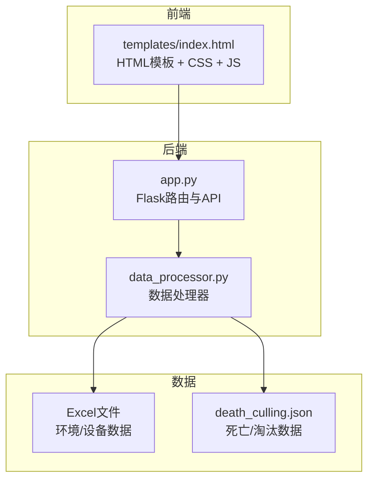
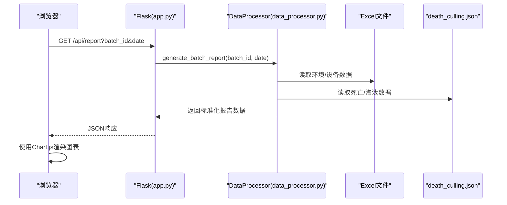
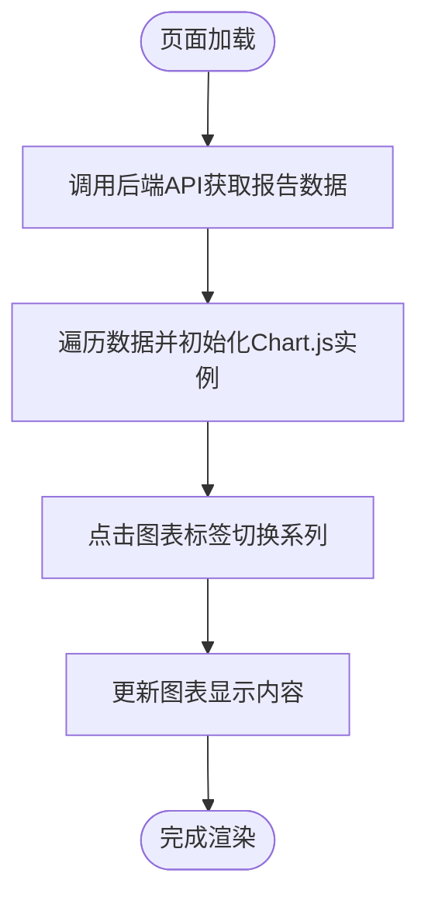
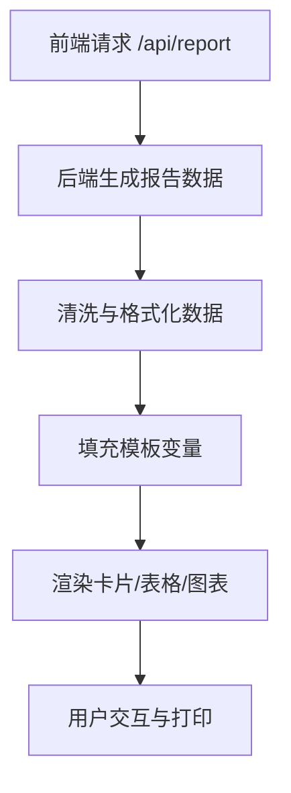
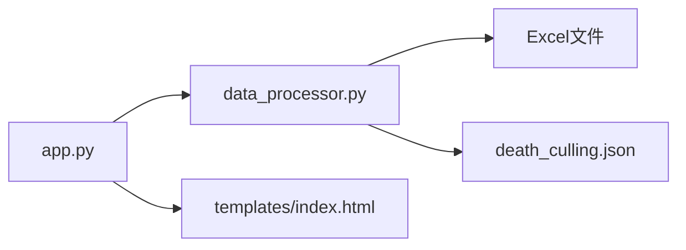

# 报告模板定制

<cite>
**本文引用的文件**
- [templates/index.html](file://templates/index.html)
- [app.py](file://app.py)
- [data_processor.py](file://data_processor.py)
- [test_report.py](file://test_report.py)
- [analyze_units.py](file://analyze_units.py)
- [death_culling.json](file://death_culling.json)
- [20251218/环控数据导出字段清单.md](file://20251218/环控数据导出字段清单.md)
- [requirements.txt](file://requirements.txt)
</cite>

## 目录
1. [简介](#简介)
2. [项目结构](#项目结构)
3. [核心组件](#核心组件)
4. [架构总览](#架构总览)
5. [详细组件分析](#详细组件分析)
6. [依赖关系分析](#依赖关系分析)
7. [性能考量](#性能考量)
8. [故障排查指南](#故障排查指南)
9. [结论](#结论)
10. [附录](#附录)

## 简介
本指南面向“猪场环控数据分析系统”的报告模板定制与扩展，帮助用户在现有HTML模板基础上进行样式调整、交互增强与图表配置，同时提供不同类型的报告模板开发方法（批次报告、单元报告、趋势分析报告等）。文档涵盖模板变量替换、数据绑定、动态内容生成、打印与导出等技术细节，并给出可操作的定制步骤与最佳实践。

## 项目结构
系统采用前后端分离的轻量架构：
- 前端：基于单页HTML模板，内置Chart.js用于可视化，支持响应式布局与打印优化。
- 后端：Flask应用提供REST接口，负责数据加载、缓存与报告生成。
- 数据层：通过Excel文件读取与清洗，输出标准化的报告数据结构。

**图示来源**
- [templates/index.html](file://templates/index.html)
- [app.py](file://app.py)
- [data_processor.py](file://data_processor.py)
- [death_culling.json](file://death_culling.json)

**章节来源**
- [templates/index.html](file://templates/index.html)
- [app.py](file://app.py)
- [data_processor.py](file://data_processor.py)
- [death_culling.json](file://death_culling.json)

## 核心组件
- HTML模板与样式：提供卡片布局、网格系统、KPI展示、风险标签、图表容器、选项卡与响应式设计。
- Chart.js集成：模板内引入Chart.js，提供图表容器与切换标签，支持多指标趋势展示。
- Flask后端：提供批处理、单元详情、深度分析、趋势、缓存清理等API。
- 数据处理器：解析Excel文件、构建批次/单元报告、计算风险评分、生成推荐与异常检测结果。

**章节来源**
- [templates/index.html](file://templates/index.html)
- [app.py](file://app.py)
- [data_processor.py](file://data_processor.py)

## 架构总览
系统通过Flask路由将前端请求转发到数据处理器，后者从Excel文件读取并清洗数据，生成标准化报告结构，再由前端模板渲染为可视化报表。

**图示来源**
- [app.py](file://app.py)
- [data_processor.py](file://data_processor.py)
- [death_culling.json](file://death_culling.json)

## 详细组件分析

### HTML模板与样式定制
- 结构与布局
  - 头部区域：包含批次信息、筛选控件与按钮。
  - 主体区域：卡片化布局，网格系统支持多列排布。
  - 图表区域：提供Chart.js容器与图表切换标签。
  - 表格与推荐：用于展示明细与建议。
- 样式体系
  - CSS变量：主题色、阴影、圆角、字体等统一管理。
  - 组件类：卡片、KPI、风险标签、异常卡片、单位卡片、风扇条形图、传感器健康、表格、推荐卡片等。
  - 响应式：媒体查询适配桌面与移动端。
  - 打印优化：隐藏按钮与标签页，强制展开标签内容。
- 可定制点
  - 修改颜色变量与主题风格。
  - 调整网格列数与卡片间距。
  - 新增或替换图表容器与切换标签。
  - 扩展表格列与推荐卡片样式。

**章节来源**
- [templates/index.html](file://templates/index.html)

### Chart.js配置与图表显示
- 引入方式：模板头部引入Chart.js CDN。
- 图表容器：提供固定高度的容器与图表标签切换。
- 切换逻辑：通过标签页切换不同指标系列。
- 响应式布局：图表随容器尺寸变化而自适应。
- 可扩展性：可在脚本中根据后端返回的数据动态生成多系列折线图、柱状图等。

**图示来源**
- [templates/index.html](file://templates/index.html)
- [app.py](file://app.py)
- [data_processor.py](file://data_processor.py)

**章节来源**
- [templates/index.html](file://templates/index.html)
- [app.py](file://app.py)
- [data_processor.py](file://data_processor.py)

### 报告数据绑定与渲染
- 数据来源
  - 批次报告：包含批次汇总、单元报告、交叉对比、趋势、风扇时间线、死亡分析、设备异常、小时分析与推荐。
  - 深度分析：与批次报告相同，便于前端切换展示。
  - 趋势数据：按时间序列聚合，支持分页。
- 数据绑定流程
  - 前端发起API请求，后端返回JSON。
  - 前端将数据填充到模板变量占位符，渲染卡片、表格与图表。
  - 动态内容：根据风险评分与严重程度高亮显示，异常卡片按级别着色。
- 数据格式转换
  - 数值清洗：NaN/Inf转为None，布尔与数值类型规范化。
  - 时间序列：按约10分钟步长抽样，确保图表性能与可读性。

**图示来源**
- [app.py](file://app.py)
- [data_processor.py](file://data_processor.py)
- [test_report.py](file://test_report.py)

**章节来源**
- [app.py](file://app.py)
- [data_processor.py](file://data_processor.py)
- [test_report.py](file://test_report.py)

### 不同类型报告模板开发方法
- 批次报告模板
  - 关注整体环境质量、风险水平、异常统计与推荐。
  - 建议：保留批次汇总卡片、风险评分进度条、异常列表与推荐卡片。
- 单元报告模板
  - 聚焦单个单元的环境参数、设备运行、传感器健康与风扇使用。
  - 建议：突出温度均匀性、CO2分布、压差稳定性与风扇运行状态。
- 趋势分析报告模板
  - 展示时间序列趋势与滞后效应分析。
  - 建议：提供多指标并行对比、滞后窗口分析与夜间/白天对比。
- 死亡关联分析模板
  - 将当日死亡与环境异常进行关联评估。
  - 建议：按原因分类展示关联结论与风险因子汇总。

**章节来源**
- [data_processor.py](file://data_processor.py)
- [templates/index.html](file://templates/index.html)

### 自定义图表显示与交互逻辑
- Chart.js配置要点
  - 数据结构：series数组包含unit与values，labels为时间标签。
  - 标签页：点击切换不同系列，支持多指标叠加。
  - 性能：对长序列进行抽样，避免渲染卡顿。
- 交互增强
  - 鼠标悬停提示、点击选择、缩放与平移。
  - 响应式尺寸监听，自动重绘。
  - 导出为图片：利用Chart.js导出API保存为PNG。

**章节来源**
- [templates/index.html](file://templates/index.html)
- [data_processor.py](file://data_processor.py)

### 报告打印与导出
- 打印优化
  - 模板内提供@media print规则，隐藏按钮与标签页，强制展开标签内容，提升打印可读性。
- 导出能力
  - 图片导出：通过Chart.js导出为PNG。
  - PDF导出：可借助浏览器打印到PDF功能或第三方库（如WeasyPrint）。
  - Excel导出：后端可扩展接口返回原始趋势数据，前端或服务端生成Excel文件。
- 注意事项
  - 大图表建议先抽样再渲染，避免打印时溢出。
  - 打印前确保所有标签页内容已渲染完成。

**章节来源**
- [templates/index.html](file://templates/index.html)
- [app.py](file://app.py)

## 依赖关系分析
- 外部依赖
  - Flask：Web框架与路由。
  - pandas/openpyxl：Excel读取与数据处理。
- 内部模块
  - app.py：路由与缓存管理。
  - data_processor.py：数据加载、清洗、报告生成与分析。
  - templates/index.html：前端模板与样式。
  - death_culling.json：死亡/淘汰数据持久化。
  - 20251218/环控数据导出字段清单.md：数据字段规范与命名约定。

**图示来源**
- [app.py](file://app.py)
- [data_processor.py](file://data_processor.py)
- [templates/index.html](file://templates/index.html)
- [death_culling.json](file://death_culling.json)

**章节来源**
- [app.py](file://app.py)
- [data_processor.py](file://data_processor.py)
- [requirements.txt](file://requirements.txt)

## 性能考量
- 缓存策略
  - 前端与后端均提供缓存：后端按批日期缓存报告与趋势数据，前端按批日期缓存图表数据。
  - TTL默认5分钟，可通过API清空缓存。
- 数据抽样
  - 时间序列按约10分钟步长抽样，减少渲染压力。
- 响应式与懒加载
  - 移动端布局优化，图表容器固定高度，避免抖动。
- I/O优化
  - Excel文件读取使用缓存，避免重复解析。

**章节来源**
- [app.py](file://app.py)
- [data_processor.py](file://data_processor.py)

## 故障排查指南
- 常见问题
  - 报表空白或报错：检查Excel文件是否存在、字段是否符合规范。
  - 图表不显示：确认Chart.js已正确加载，数据结构与标签页切换逻辑正常。
  - 缓存导致旧数据：调用清空缓存API后刷新页面。
- 排查步骤
  - 使用测试脚本验证数据结构与关键字段。
  - 检查后端日志与错误响应。
  - 在浏览器开发者工具中查看网络请求与Console错误。
- 数据一致性
  - 确保死亡/淘汰数据与批次配置一致，避免键缺失导致渲染异常。

**章节来源**
- [test_report.py](file://test_report.py)
- [app.py](file://app.py)
- [data_processor.py](file://data_processor.py)
- [death_culling.json](file://death_culling.json)

## 结论
本系统提供了完整的环控数据分析与可视化能力。通过模板定制与Chart.js配置，用户可以灵活开发多种报告模板，满足批次、单元与趋势分析等场景需求。结合缓存与数据抽样策略，系统在保证性能的同时提供了良好的用户体验。建议在定制过程中遵循字段规范与数据结构约定，确保模板与后端数据的一致性。

## 附录

### 模板开发示例路径
- 修改现有模板
  - 调整CSS变量与主题色：[templates/index.html](file://templates/index.html)
  - 替换图表容器与标签页：[templates/index.html](file://templates/index.html)
- 创建全新模板
  - 基于现有结构新增页面，复用API接口：[app.py](file://app.py)
  - 在数据处理器中扩展报告字段：[data_processor.py](file://data_processor.py)
- 集成第三方可视化库
  - 在模板中引入新库并替换Chart.js初始化逻辑：[templates/index.html](file://templates/index.html)

### 报告数据字段参考
- 字段清单与命名规范：[20251218/环控数据导出字段清单.md](file://20251218/环控数据导出字段清单.md)
- 死亡/淘汰数据结构：[death_culling.json](file://death_culling.json)