# 插件开发框架

<cite>
**本文档引用的文件**
- [app.py](file://app.py)
- [data_processor.py](file://data_processor.py)
- [analyze_units.py](file://analyze_units.py)
- [test_report.py](file://test_report.py)
- [requirements.txt](file://requirements.txt)
- [templates/index.html](file://templates/index.html)
- [death_culling.json](file://death_culling.json)
</cite>

## 目录
1. [简介](#简介)
2. [项目结构](#项目结构)
3. [核心组件](#核心组件)
4. [架构概览](#架构概览)
5. [详细组件分析](#详细组件分析)
6. [插件开发框架设计](#插件开发框架设计)
7. [插件接口规范](#插件接口规范)
8. [插件注册机制](#插件注册机制)
9. [插件生命周期管理](#插件生命周期管理)
10. [插件开发流程](#插件开发流程)
11. [插件类型与实现](#插件类型与实现)
12. [插件测试与调试](#插件测试与调试)
13. [插件部署与管理](#插件部署与管理)
14. [依赖分析](#依赖分析)
15. [性能考虑](#性能考虑)
16. [故障排除指南](#故障排除指南)
17. [结论](#结论)

## 简介

本指南为猪场环控数据分析系统创建了一个完整的插件开发框架。该系统是一个基于Flask的Web应用，专门用于分析育肥猪批次的环境控制数据。系统通过Excel文件收集环境数据、设备数据和死亡数据，然后生成详细的分析报告。

该框架支持多种类型的插件开发，包括自定义分析模块、数据处理插件、报告生成插件等，为用户提供了高度可扩展的数据分析能力。

## 项目结构

系统采用清晰的分层架构，主要包含以下组件：

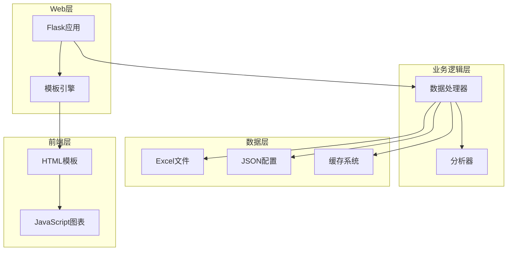
```mermaid
graph TB
subgraph "Web层"
A[Flask应用]
B[模板引擎]
end
subgraph "业务逻辑层"
C[数据处理器]
D[分析器]
end
subgraph "数据层"
E[Excel文件]
F[JSON配置]
G[缓存系统]
end
subgraph "前端层"
H[HTML模板]
I[JavaScript图表]
end
A --> C
C --> D
C --> E
C --> F
C --> G
A --> B
B --> H
H --> I
```

**图表来源**
- [app.py:1-133](file://app.py#L1-L133)
- [data_processor.py:54-1559](file://data_processor.py#L54-L1559)

**章节来源**
- [app.py:1-133](file://app.py#L1-L133)
- [data_processor.py:54-1559](file://data_processor.py#L54-L1559)

## 核心组件

### 数据处理器(DataProcessor)

数据处理器是系统的核心组件，负责：
- 数据文件的发现和加载
- 批次数据的综合分析
- 报告生成和缓存管理
- 死亡数据的处理和关联分析

### Flask Web应用

Web应用提供RESTful API接口：
- 批次数据查询
- 实时报告生成
- 趋势数据获取
- 缓存管理

### HTML模板系统

基于Jinja2模板引擎，提供：
- 批次环境分析仪表板
- 详细的报告页面
- 交互式图表展示

**章节来源**
- [data_processor.py:54-1559](file://data_processor.py#L54-L1559)
- [app.py:1-133](file://app.py#L1-L133)
- [templates/index.html:1-800](file://templates/index.html#L1-L800)

## 架构概览

系统采用模块化架构设计，支持插件化的功能扩展：

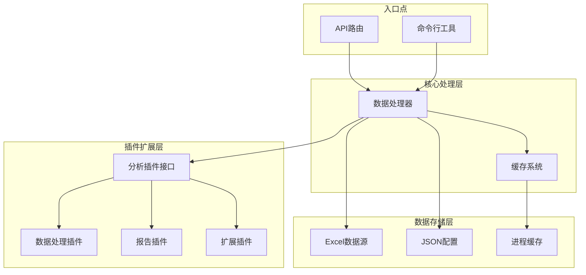
```mermaid
graph TB
subgraph "入口点"
API[API路由]
CLI[命令行工具]
end
subgraph "核心处理层"
DP[数据处理器]
CA[缓存系统]
end
subgraph "插件扩展层"
AI[分析插件接口]
DPX[数据处理插件]
RP[报告插件]
EP[扩展插件]
end
subgraph "数据存储层"
EX[Excel数据源]
JS[JSON配置]
PC[进程缓存]
end
API --> DP
CLI --> DP
DP --> CA
DP --> AI
AI --> DPX
AI --> RP
AI --> EP
DP --> EX
DP --> JS
CA --> PC
```

**图表来源**
- [app.py:42-133](file://app.py#L42-L133)
- [data_processor.py:54-1559](file://data_processor.py#L54-L1559)

## 详细组件分析

### 数据处理器类结构

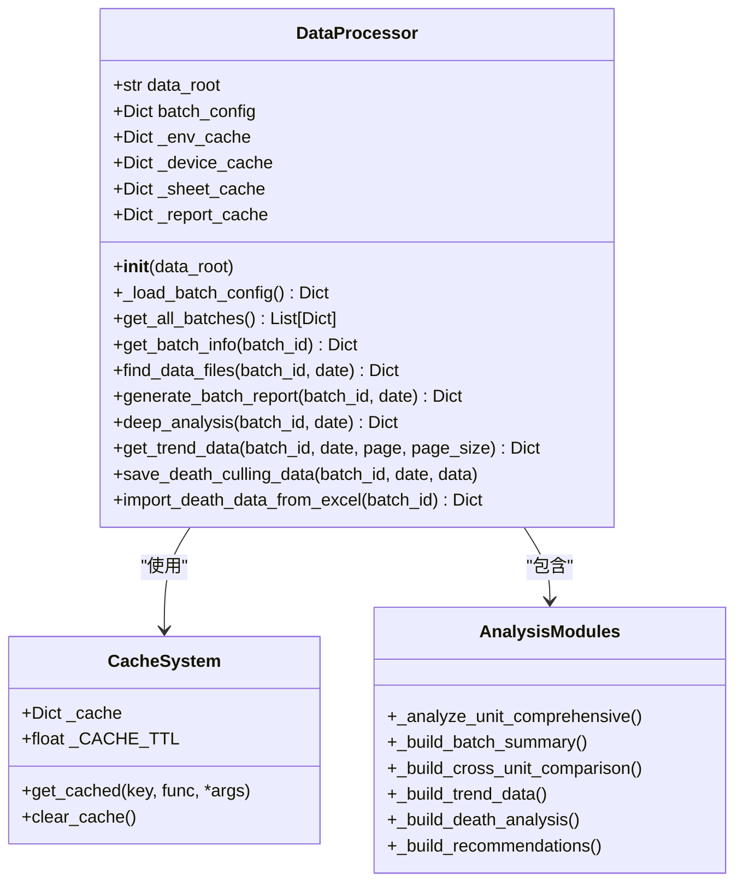
```mermaid
classDiagram
class DataProcessor {
+str data_root
+Dict batch_config
+Dict _env_cache
+Dict _device_cache
+Dict _sheet_cache
+Dict _report_cache
+__init__(data_root)
+_load_batch_config() Dict
+get_all_batches() List[Dict]
+get_batch_info(batch_id) Dict
+find_data_files(batch_id, date) Dict
+generate_batch_report(batch_id, date) Dict
+deep_analysis(batch_id, date) Dict
+get_trend_data(batch_id, date, page, page_size) Dict
+save_death_culling_data(batch_id, date, data)
+import_death_data_from_excel(batch_id) Dict
}
class CacheSystem {
+Dict _cache
+float _CACHE_TTL
+get_cached(key, func, *args)
+clear_cache()
}
class AnalysisModules {
+_analyze_unit_comprehensive()
+_build_batch_summary()
+_build_cross_unit_comparison()
+_build_trend_data()
+_build_death_analysis()
+_build_recommendations()
}
DataProcessor --> CacheSystem : "使用"
DataProcessor --> AnalysisModules : "包含"
```

**图表来源**
- [data_processor.py:54-1559](file://data_processor.py#L54-L1559)

### API路由架构

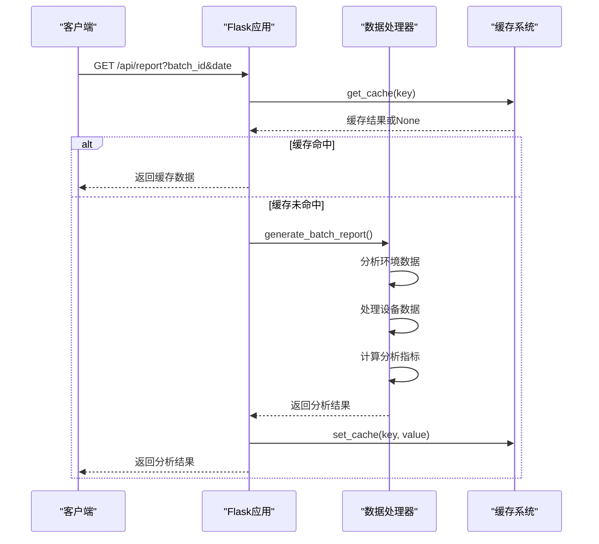
```mermaid
sequenceDiagram
participant Client as "客户端"
participant Flask as "Flask应用"
participant Processor as "数据处理器"
participant Cache as "缓存系统"
Client->>Flask : GET /api/report?batch_id&date
Flask->>Cache : get_cache(key)
Cache-->>Flask : 缓存结果或None
alt 缓存命中
Flask-->>Client : 返回缓存数据
else 缓存未命中
Flask->>Processor : generate_batch_report()
Processor->>Processor : 分析环境数据
Processor->>Processor : 处理设备数据
Processor->>Processor : 计算分析指标
Processor-->>Flask : 返回分析结果
Flask->>Cache : set_cache(key, value)
Flask-->>Client : 返回分析结果
end
```

**图表来源**
- [app.py:59-84](file://app.py#L59-L84)
- [data_processor.py:238-295](file://data_processor.py#L238-L295)

**章节来源**
- [data_processor.py:54-1559](file://data_processor.py#L54-L1559)
- [app.py:1-133](file://app.py#L1-L133)

## 插件开发框架设计

### 插件架构设计原则

1. **模块化设计**: 插件应独立于主系统，通过明确定义的接口与系统交互
2. **可扩展性**: 支持动态加载和卸载插件
3. **标准化接口**: 提供统一的插件接口规范
4. **生命周期管理**: 完整的插件生命周期控制
5. **错误处理**: 健壮的错误处理和恢复机制

### 插件分类体系

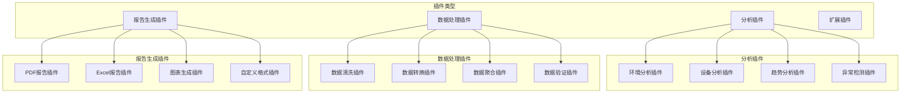
```mermaid
graph TB
subgraph "插件类型"
P1[分析插件]
P2[数据处理插件]
P3[报告生成插件]
P4[扩展插件]
end
subgraph "分析插件"
A1[环境分析插件]
A2[设备分析插件]
A3[趋势分析插件]
A4[异常检测插件]
end
subgraph "数据处理插件"
D1[数据清洗插件]
D2[数据转换插件]
D3[数据聚合插件]
D4[数据验证插件]
end
subgraph "报告生成插件"
R1[PDF报告插件]
R2[Excel报告插件]
R3[图表生成插件]
R4[自定义格式插件]
end
P1 --> A1
P1 --> A2
P1 --> A3
P1 --> A4
P2 --> D1
P2 --> D2
P2 --> D3
P2 --> D4
P3 --> R1
P3 --> R2
P3 --> R3
P3 --> R4
```

## 插件接口规范

### 基础插件接口

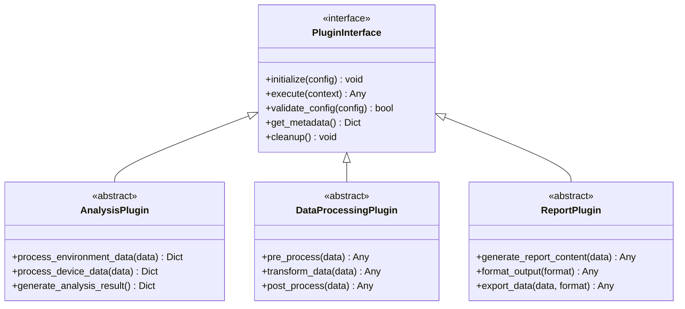
```mermaid
classDiagram
class PluginInterface {
<<interface>>
+initialize(config) void
+execute(context) Any
+validate_config(config) bool
+get_metadata() Dict
+cleanup() void
}
class AnalysisPlugin {
<<abstract>>
+process_environment_data(data) Dict
+process_device_data(data) Dict
+generate_analysis_result() Dict
}
class DataProcessingPlugin {
<<abstract>>
+pre_process(data) Any
+transform_data(data) Any
+post_process(data) Any
}
class ReportPlugin {
<<abstract>>
+generate_report_content(data) Any
+format_output(format) Any
+export_data(data, format) Any
}
PluginInterface <|-- AnalysisPlugin
PluginInterface <|-- DataProcessingPlugin
PluginInterface <|-- ReportPlugin
```

**图表来源**
- [data_processor.py:54-1559](file://data_processor.py#L54-L1559)

### 插件配置规范

每个插件需要遵循以下配置规范：

| 配置项 | 类型 | 必需 | 描述 |
|--------|------|------|------|
| plugin_id | string | 是 | 插件唯一标识符 |
| name | string | 是 | 插件显示名称 |
| version | string | 是 | 插件版本号 |
| author | string | 否 | 插件作者 |
| description | string | 否 | 插件功能描述 |
| enabled | boolean | 是 | 是否启用插件 |
| priority | integer | 否 | 插件执行优先级 |
| timeout | integer | 否 | 插件执行超时时间(秒) |

### 插件上下文接口

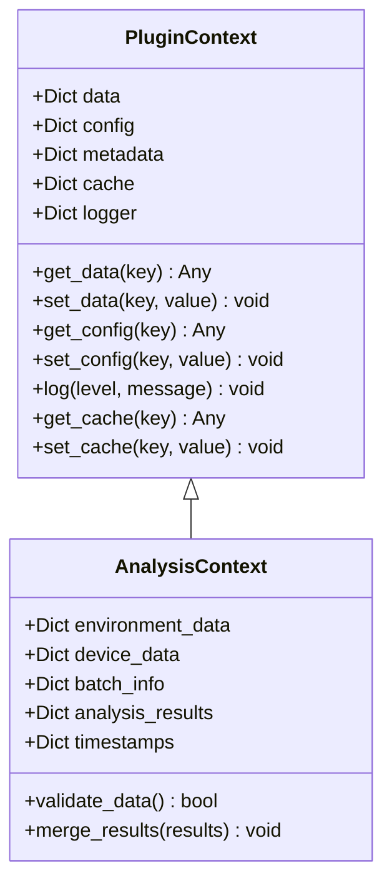
```mermaid
classDiagram
class PluginContext {
+Dict data
+Dict config
+Dict metadata
+Dict cache
+Dict logger
+get_data(key) Any
+set_data(key, value) void
+get_config(key) Any
+set_config(key, value) void
+log(level, message) void
+get_cache(key) Any
+set_cache(key, value) void
}
class AnalysisContext {
+Dict environment_data
+Dict device_data
+Dict batch_info
+Dict analysis_results
+Dict timestamps
+validate_data() bool
+merge_results(results) void
}
PluginContext <|-- AnalysisContext
```

**图表来源**
- [data_processor.py:54-1559](file://data_processor.py#L54-L1559)

## 插件注册机制

### 动态插件发现

系统支持自动发现和注册插件：

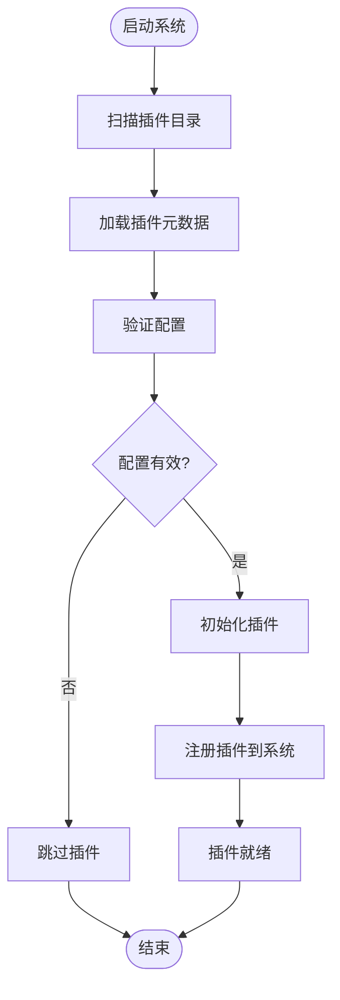
```mermaid
flowchart TD
Start([启动系统]) --> ScanDir["扫描插件目录"]
ScanDir --> LoadMeta["加载插件元数据"]
LoadMeta --> ValidateConfig["验证配置"]
ValidateConfig --> ConfigValid{"配置有效?"}
ConfigValid --> |是| InitPlugin["初始化插件"]
ConfigValid --> |否| SkipPlugin["跳过插件"]
InitPlugin --> RegisterPlugin["注册插件到系统"]
RegisterPlugin --> Ready["插件就绪"]
SkipPlugin --> End([结束])
Ready --> End
```

**图表来源**
- [data_processor.py:63-82](file://data_processor.py#L63-L82)

### 插件注册表

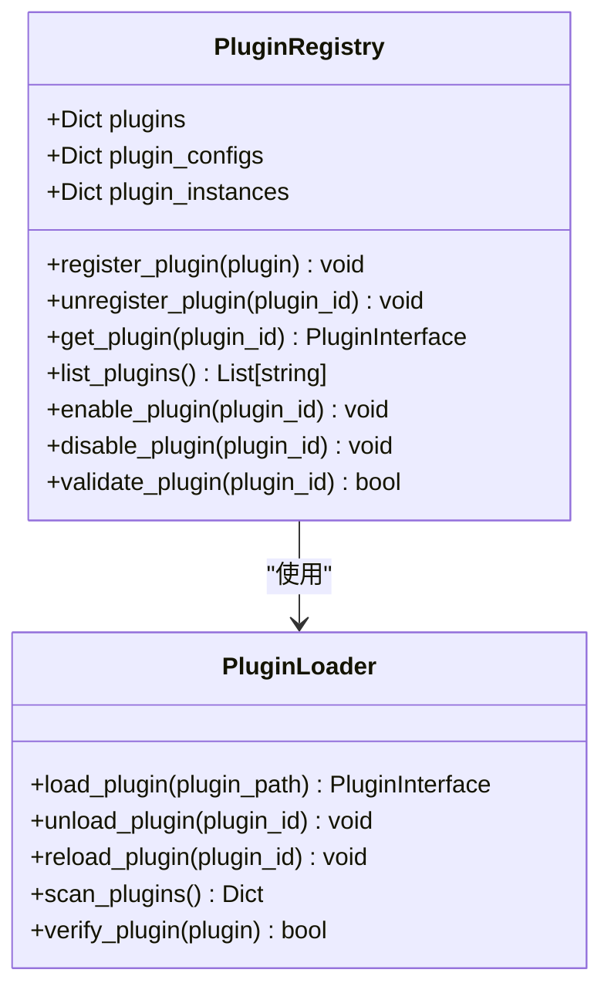
```mermaid
classDiagram
class PluginRegistry {
+Dict plugins
+Dict plugin_configs
+Dict plugin_instances
+register_plugin(plugin) void
+unregister_plugin(plugin_id) void
+get_plugin(plugin_id) PluginInterface
+list_plugins() List[string]
+enable_plugin(plugin_id) void
+disable_plugin(plugin_id) void
+validate_plugin(plugin_id) bool
}
class PluginLoader {
+load_plugin(plugin_path) PluginInterface
+unload_plugin(plugin_id) void
+reload_plugin(plugin_id) void
+scan_plugins() Dict
+verify_plugin(plugin) bool
}
PluginRegistry --> PluginLoader : "使用"
```

**图表来源**
- [data_processor.py:54-1559](file://data_processor.py#L54-L1559)

**章节来源**
- [data_processor.py:63-82](file://data_processor.py#L63-L82)

## 插件生命周期管理

### 生命周期阶段

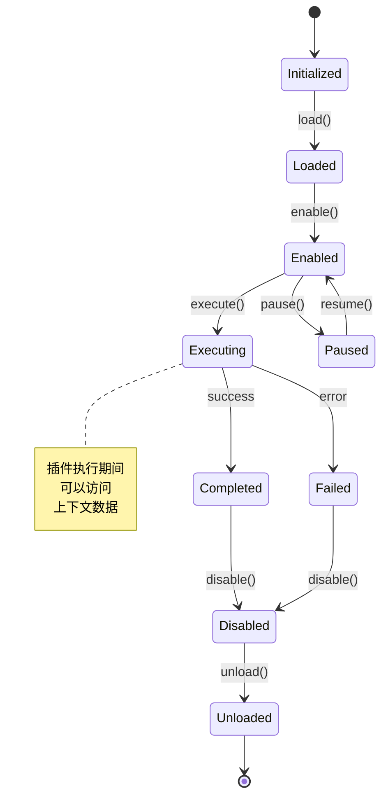
```mermaid
stateDiagram-v2
[*] --> Initialized
Initialized --> Loaded : load()
Loaded --> Enabled : enable()
Enabled --> Executing : execute()
Executing --> Completed : success
Executing --> Failed : error
Completed --> Disabled : disable()
Failed --> Disabled : disable()
Disabled --> Unloaded : unload()
Unloaded --> [*]
Enabled --> Paused : pause()
Paused --> Enabled : resume()
note right of Executing
插件执行期间
可以访问
上下文数据
end note
```

### 生命周期钩子

每个插件可以实现以下生命周期钩子：

| 钩子名称 | 调用时机 | 参数 | 返回值 | 用途 |
|----------|----------|------|--------|------|
| initialize | 插件加载后 | config: Dict | void | 初始化资源 |
| validate_config | 插件启用前 | config: Dict | bool | 验证配置有效性 |
| pre_execute | 插件执行前 | context: PluginContext | void | 准备执行环境 |
| execute | 插件执行中 | context: PluginContext | Any | 主要业务逻辑 |
| post_execute | 插件执行后 | context: PluginContext | void | 清理执行结果 |
| cleanup | 插件卸载时 | void | void | 释放资源 |
| handle_error | 发生错误时 | error: Exception | void | 错误处理 |

**章节来源**
- [data_processor.py:54-1559](file://data_processor.py#L54-L1559)

## 插件开发流程

### 开发步骤

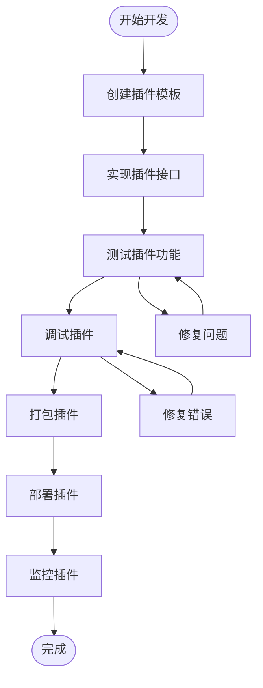
```mermaid
flowchart TD
Start([开始开发]) --> CreateTemplate["创建插件模板"]
CreateTemplate --> ImplementInterface["实现插件接口"]
ImplementInterface --> TestPlugin["测试插件功能"]
TestPlugin --> DebugPlugin["调试插件"]
DebugPlugin --> PackagePlugin["打包插件"]
PackagePlugin --> DeployPlugin["部署插件"]
DeployPlugin --> MonitorPlugin["监控插件"]
MonitorPlugin --> End([完成])
TestPlugin --> FixIssues["修复问题"]
FixIssues --> TestPlugin
DebugPlugin --> FixErrors["修复错误"]
FixErrors --> DebugPlugin
```

### 插件模板创建

#### 分析插件模板

```python
# 分析插件模板示例
class AnalysisPluginTemplate:
    def __init__(self, config):
        self.config = config
        self.plugin_id = config.get('plugin_id', 'analysis-plugin')
        self.name = config.get('name', '分析插件模板')
        self.version = config.get('version', '1.0.0')
        
    def initialize(self, config):
        """初始化插件"""
        # 加载配置文件
        self.load_config(config)
        # 初始化数据库连接
        self.init_database()
        # 初始化缓存
        self.init_cache()
        
    def execute(self, context):
        """执行分析逻辑"""
        try:
            # 获取输入数据
            data = context.get_data('input_data')
            
            # 执行分析
            result = self.analyze_data(data)
            
            # 设置输出数据
            context.set_data('analysis_result', result)
            
            return result
            
        except Exception as e:
            context.log('error', f'分析失败: {str(e)}')
            raise e
            
    def analyze_data(self, data):
        """具体分析逻辑"""
        # 实现具体的分析算法
        pass
        
    def cleanup(self):
        """清理资源"""
        # 关闭数据库连接
        if hasattr(self, 'db_connection'):
            self.db_connection.close()
        # 清理缓存
        if hasattr(self, 'cache'):
            self.cache.clear()
```

#### 数据处理插件模板

```python
# 数据处理插件模板示例
class DataProcessingPluginTemplate:
    def __init__(self, config):
        self.config = config
        
    def pre_process(self, data):
        """数据预处理"""
        # 数据清洗
        cleaned_data = self.clean_data(data)
        # 数据验证
        validated_data = self.validate_data(cleaned_data)
        return validated_data
        
    def transform_data(self, data):
        """数据转换"""
        # 数据格式转换
        transformed_data = self.convert_format(data)
        # 数据聚合
        aggregated_data = self.aggregate_data(transformed_data)
        return aggregated_data
        
    def post_process(self, data):
        """数据后处理"""
        # 数据标准化
        normalized_data = self.normalize_data(data)
        # 数据质量检查
        quality_checked_data = self.check_quality(normalized_data)
        return quality_checked_data
```

#### 报告插件模板

```python
# 报告插件模板示例
class ReportPluginTemplate:
    def __init__(self, config):
        self.config = config
        
    def generate_report_content(self, data):
        """生成报告内容"""
        # 生成HTML内容
        html_content = self.generate_html(data)
        # 生成Markdown内容
        md_content = self.generate_markdown(data)
        # 生成JSON内容
        json_content = self.generate_json(data)
        
        return {
            'html': html_content,
            'markdown': md_content,
            'json': json_content
        }
        
    def format_output(self, format_type, data):
        """格式化输出"""
        if format_type == 'html':
            return self.format_html(data)
        elif format_type == 'pdf':
            return self.format_pdf(data)
        elif format_type == 'excel':
            return self.format_excel(data)
        else:
            return self.format_default(data)
            
    def export_data(self, data, format_type):
        """导出数据"""
        formatted_data = self.format_output(format_type, data)
        # 写入文件
        return self.write_file(formatted_data, format_type)
```

**章节来源**
- [data_processor.py:54-1559](file://data_processor.py#L54-L1559)

## 插件类型与实现

### 自定义分析模块插件

#### 环境参数分析插件

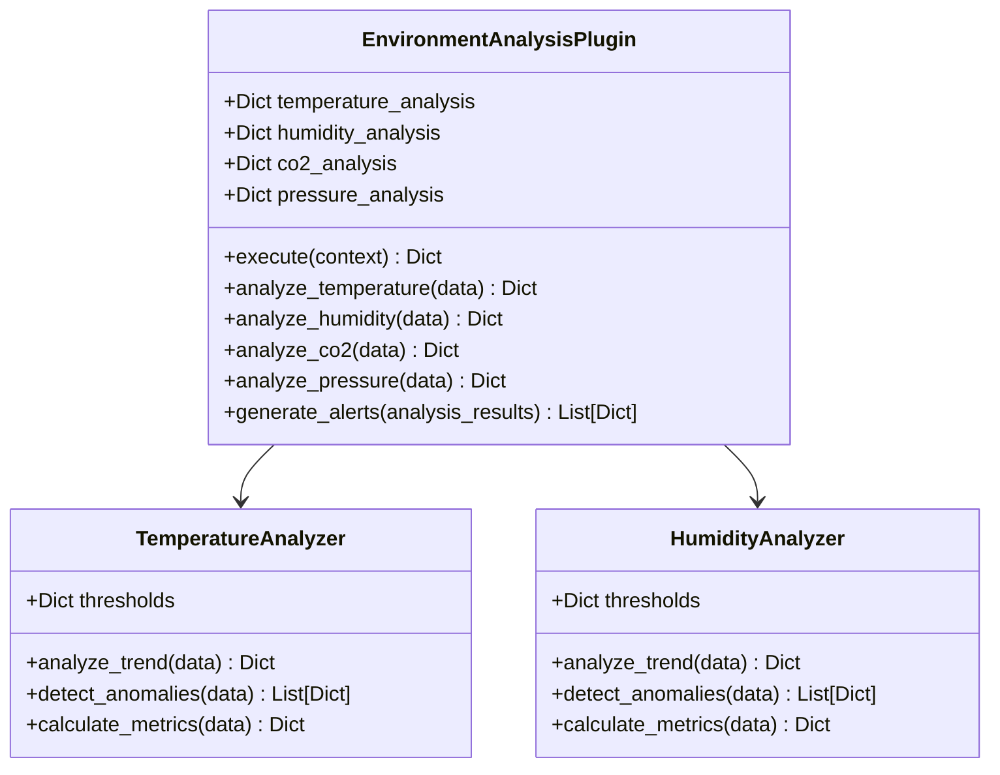
```mermaid
classDiagram
class EnvironmentAnalysisPlugin {
+Dict temperature_analysis
+Dict humidity_analysis
+Dict co2_analysis
+Dict pressure_analysis
+execute(context) Dict
+analyze_temperature(data) Dict
+analyze_humidity(data) Dict
+analyze_co2(data) Dict
+analyze_pressure(data) Dict
+generate_alerts(analysis_results) List[Dict]
}
class TemperatureAnalyzer {
+Dict thresholds
+analyze_trend(data) Dict
+detect_anomalies(data) List[Dict]
+calculate_metrics(data) Dict
}
class HumidityAnalyzer {
+Dict thresholds
+analyze_trend(data) Dict
+detect_anomalies(data) List[Dict]
+calculate_metrics(data) Dict
}
EnvironmentAnalysisPlugin --> TemperatureAnalyzer
EnvironmentAnalysisPlugin --> HumidityAnalyzer
```

**图表来源**
- [data_processor.py:349-492](file://data_processor.py#L349-L492)

#### 设备运行分析插件

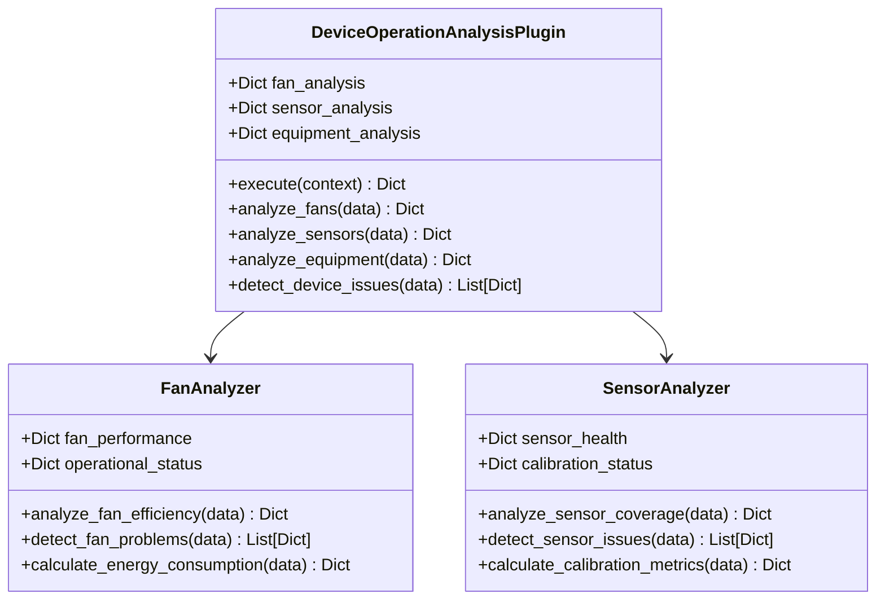
```mermaid
classDiagram
class DeviceOperationAnalysisPlugin {
+Dict fan_analysis
+Dict sensor_analysis
+Dict equipment_analysis
+execute(context) Dict
+analyze_fans(data) Dict
+analyze_sensors(data) Dict
+analyze_equipment(data) Dict
+detect_device_issues(data) List[Dict]
}
class FanAnalyzer {
+Dict fan_performance
+Dict operational_status
+analyze_fan_efficiency(data) Dict
+detect_fan_problems(data) List[Dict]
+calculate_energy_consumption(data) Dict
}
class SensorAnalyzer {
+Dict sensor_health
+Dict calibration_status
+analyze_sensor_coverage(data) Dict
+detect_sensor_issues(data) List[Dict]
+calculate_calibration_metrics(data) Dict
}
DeviceOperationAnalysisPlugin --> FanAnalyzer
DeviceOperationAnalysisPlugin --> SensorAnalyzer
```

**图表来源**
- [data_processor.py:494-609](file://data_processor.py#L494-L609)

### 数据处理插件

#### 数据清洗插件

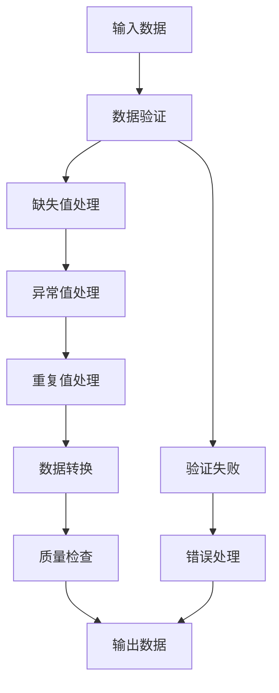
```mermaid
flowchart TD
InputData["输入数据"] --> ValidateData["数据验证"]
ValidateData --> CleanMissing["缺失值处理"]
CleanMissing --> CleanOutliers["异常值处理"]
CleanOutliers --> CleanDuplicates["重复值处理"]
CleanDuplicates --> TransformData["数据转换"]
TransformData --> QualityCheck["质量检查"]
QualityCheck --> OutputData["输出数据"]
ValidateData --> ValidationFailed["验证失败"]
ValidationFailed --> ErrorHandling["错误处理"]
ErrorHandling --> OutputData
```

**图表来源**
- [data_processor.py:15-39](file://data_processor.py#L15-L39)

#### 数据聚合插件

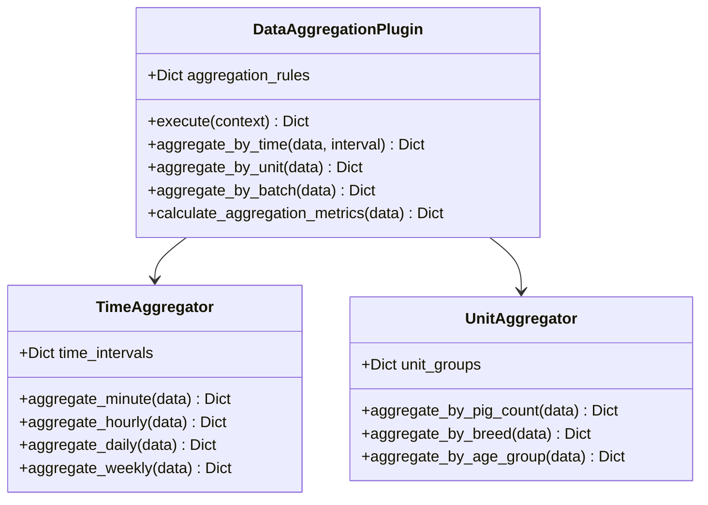
```mermaid
classDiagram
class DataAggregationPlugin {
+Dict aggregation_rules
+execute(context) Dict
+aggregate_by_time(data, interval) Dict
+aggregate_by_unit(data) Dict
+aggregate_by_batch(data) Dict
+calculate_aggregation_metrics(data) Dict
}
class TimeAggregator {
+Dict time_intervals
+aggregate_minute(data) Dict
+aggregate_hourly(data) Dict
+aggregate_daily(data) Dict
+aggregate_weekly(data) Dict
}
class UnitAggregator {
+Dict unit_groups
+aggregate_by_pig_count(data) Dict
+aggregate_by_breed(data) Dict
+aggregate_by_age_group(data) Dict
}
DataAggregationPlugin --> TimeAggregator
DataAggregationPlugin --> UnitAggregator
```

**图表来源**
- [data_processor.py:1026-1080](file://data_processor.py#L1026-L1080)

### 报告生成插件

#### 图表生成插件

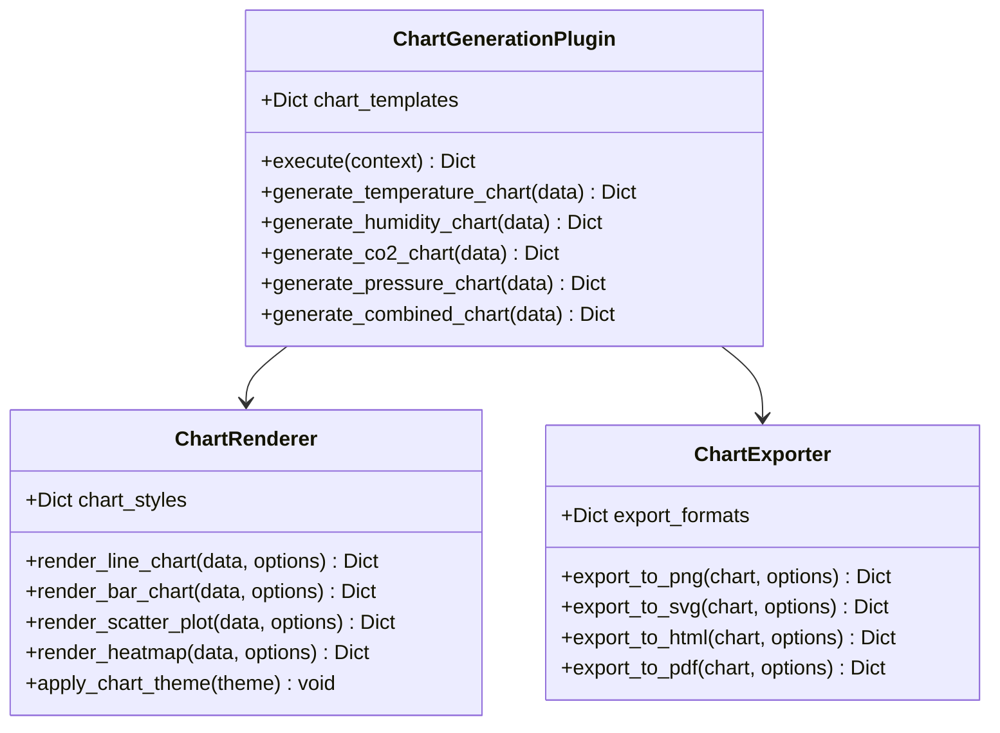
```mermaid
classDiagram
class ChartGenerationPlugin {
+Dict chart_templates
+execute(context) Dict
+generate_temperature_chart(data) Dict
+generate_humidity_chart(data) Dict
+generate_co2_chart(data) Dict
+generate_pressure_chart(data) Dict
+generate_combined_chart(data) Dict
}
class ChartRenderer {
+Dict chart_styles
+render_line_chart(data, options) Dict
+render_bar_chart(data, options) Dict
+render_scatter_plot(data, options) Dict
+render_heatmap(data, options) Dict
+apply_chart_theme(theme) void
}
class ChartExporter {
+Dict export_formats
+export_to_png(chart, options) Dict
+export_to_svg(chart, options) Dict
+export_to_html(chart, options) Dict
+export_to_pdf(chart, options) Dict
}
ChartGenerationPlugin --> ChartRenderer
ChartGenerationPlugin --> ChartExporter
```

**图表来源**
- [templates/index.html:608-714](file://templates/index.html#L608-L714)

**章节来源**
- [data_processor.py:349-492](file://data_processor.py#L349-L492)
- [data_processor.py:494-609](file://data_processor.py#L494-L609)
- [data_processor.py:1026-1080](file://data_processor.py#L1026-L1080)
- [templates/index.html:608-714](file://templates/index.html#L608-L714)

## 插件测试与调试

### 单元测试框架

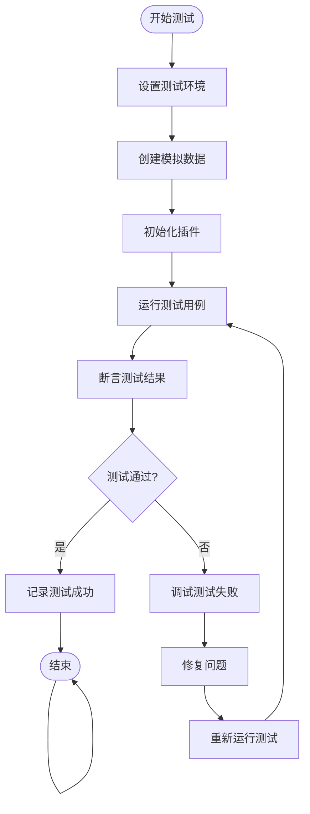
```mermaid
flowchart TD
Start([开始测试]) --> SetupTest["设置测试环境"]
SetupTest --> CreateMockData["创建模拟数据"]
CreateMockData --> InitializePlugin["初始化插件"]
InitializePlugin --> RunTestCase["运行测试用例"]
RunTestCase --> AssertResults["断言测试结果"]
AssertResults --> TestPassed{"测试通过?"}
TestPassed --> |是| RecordSuccess["记录测试成功"]
TestPassed --> |否| DebugTest["调试测试失败"]
DebugTest --> FixIssue["修复问题"]
FixIssue --> ReRunTest["重新运行测试"]
ReRunTest --> RunTestCase
RecordSuccess --> End([结束])
End --> End
```

### 测试用例设计

#### 分析插件测试

```python
# 分析插件测试示例
def test_analysis_plugin():
    # 创建测试插件实例
    plugin = AnalysisPluginTemplate(test_config)
    
    # 准备测试数据
    test_data = create_test_environment_data()
    
    # 创建测试上下文
    context = PluginContext()
    context.set_data('input_data', test_data)
    
    # 执行插件
    result = plugin.execute(context)
    
    # 验证结果
    assert result is not None
    assert 'analysis_result' in result
    assert isinstance(result['analysis_result'], dict)
    
    # 验证关键指标
    assert 'temperature_analysis' in result['analysis_result']
    assert 'humidity_analysis' in result['analysis_result']
    assert 'co2_analysis' in result['analysis_result']
```

#### 数据处理插件测试

```python
# 数据处理插件测试示例
def test_data_processing_plugin():
    # 创建测试插件实例
    plugin = DataProcessingPluginTemplate(test_config)
    
    # 准备测试数据
    raw_data = create_raw_test_data()
    
    # 测试预处理
    pre_processed = plugin.pre_process(raw_data)
    assert pre_processed is not None
    
    # 测试转换
    transformed = plugin.transform_data(pre_processed)
    assert transformed is not None
    
    # 测试后处理
    post_processed = plugin.post_process(transformed)
    assert post_processed is not None
    
    # 验证数据质量
    assert validate_data_quality(post_processed)
```

#### 报告插件测试

```python
# 报告插件测试示例
def test_report_plugin():
    # 创建测试插件实例
    plugin = ReportPluginTemplate(test_config)
    
    # 准备测试数据
    analysis_results = create_test_analysis_results()
    
    # 生成报告内容
    report_content = plugin.generate_report_content(analysis_results)
    
    # 验证HTML内容
    assert 'html' in report_content
    assert '<div' in report_content['html']
    
    # 验证Markdown内容
    assert 'markdown' in report_content
    assert '# ' in report_content['markdown']
    
    # 验证JSON内容
    assert 'json' in report_content
    assert isinstance(report_content['json'], dict)
```

### 集成测试

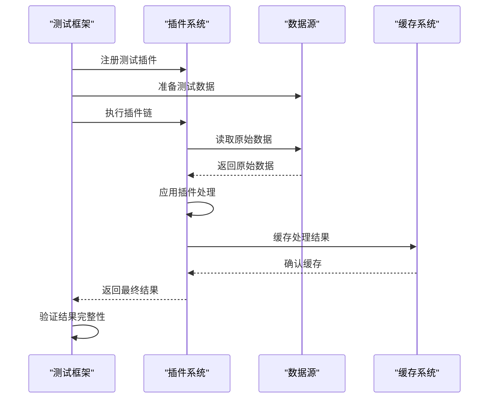
```mermaid
sequenceDiagram
participant Test as "测试框架"
participant Plugin as "插件系统"
participant Data as "数据源"
participant Cache as "缓存系统"
Test->>Plugin : 注册测试插件
Test->>Data : 准备测试数据
Test->>Plugin : 执行插件链
Plugin->>Data : 读取原始数据
Data-->>Plugin : 返回原始数据
Plugin->>Plugin : 应用插件处理
Plugin->>Cache : 缓存处理结果
Cache-->>Plugin : 确认缓存
Plugin-->>Test : 返回最终结果
Test->>Test : 验证结果完整性
```

### 性能测试

#### 压力测试

```python
# 性能测试示例
def test_plugin_performance():
    # 创建大量测试数据
    large_dataset = generate_large_test_dataset()
    
    # 测试插件执行时间
    start_time = time.time()
    plugin = PerformanceTestPlugin()
    result = plugin.execute(large_dataset)
    end_time = time.time()
    
    execution_time = end_time - start_time
    
    # 验证性能要求
    assert execution_time < MAX_EXECUTION_TIME
    assert result is not None
    
    # 测试内存使用
    memory_usage = get_memory_usage()
    assert memory_usage < MAX_MEMORY_USAGE
```

#### 并发测试

```python
# 并发测试示例
def test_concurrent_plugin_execution():
    # 创建多个插件实例
    plugins = [AnalysisPluginTemplate(config) for _ in range(CONCURRENT_THREADS)]
    
    # 并发执行插件
    with ThreadPoolExecutor(max_workers=CONCURRENT_THREADS) as executor:
        futures = [executor.submit(plugin.execute, test_data) for plugin in plugins]
        results = [future.result() for future in futures]
    
    # 验证所有结果
    for result in results:
        assert result is not None
        assert validate_plugin_result(result)
```

**章节来源**
- [data_processor.py:15-39](file://data_processor.py#L15-L39)
- [data_processor.py:1026-1080](file://data_processor.py#L1026-L1080)

## 插件部署与管理

### 插件部署架构

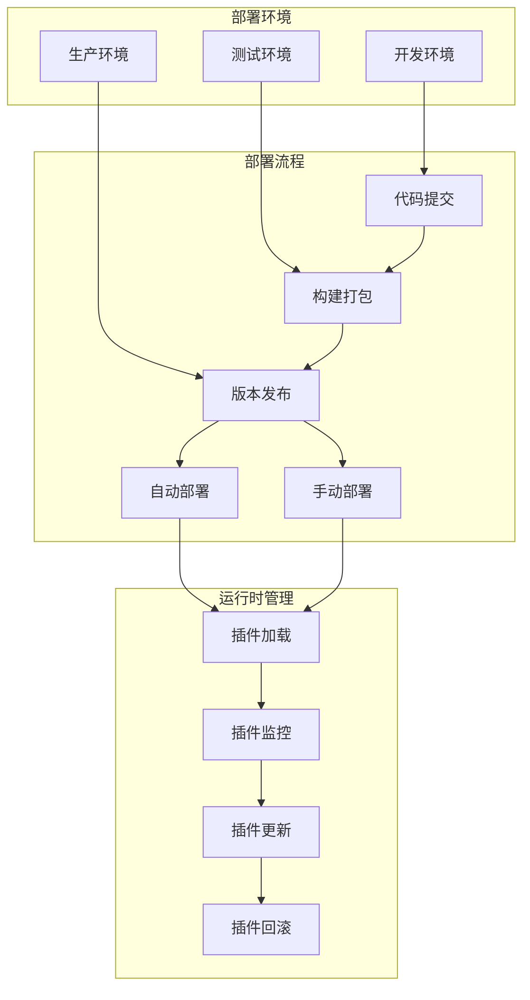
```mermaid
graph TB
subgraph "部署环境"
A[开发环境]
B[测试环境]
C[生产环境]
end
subgraph "部署流程"
D[代码提交]
E[构建打包]
F[版本发布]
G[自动部署]
H[手动部署]
end
subgraph "运行时管理"
I[插件加载]
J[插件监控]
K[插件更新]
L[插件回滚]
end
A --> D
B --> E
C --> F
D --> E
E --> F
F --> G
F --> H
G --> I
H --> I
I --> J
J --> K
K --> L
```

### 版本管理策略

#### Semantic Versioning

插件采用语义化版本控制：

```
MAJOR.MINOR.PATCH
```

- **MAJOR**: 不兼容的API变更
- **MINOR**: 向后兼容的功能新增
- **PATCH**: 向后兼容的问题修正

#### 版本兼容性检查

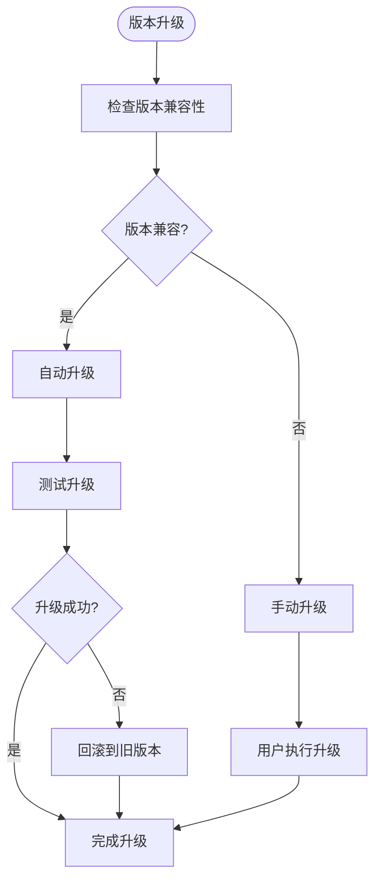
```mermaid
flowchart TD
Start([版本升级]) --> CheckCompatibility["检查版本兼容性"]
CheckCompatibility --> Compatible{"版本兼容?"}
Compatible --> |是| AutoUpgrade["自动升级"]
Compatible --> |否| ManualUpgrade["手动升级"]
AutoUpgrade --> TestUpgrade["测试升级"]
TestUpgrade --> UpgradeSuccess{"升级成功?"}
UpgradeSuccess --> |是| CompleteUpgrade["完成升级"]
UpgradeSuccess --> |否| Rollback["回滚到旧版本"]
ManualUpgrade --> UserAction["用户执行升级"]
UserAction --> CompleteUpgrade
Rollback --> CompleteUpgrade
```

### 插件管理API

```mermaid
classDiagram
class PluginManager {
+Dict plugin_registry
+List active_plugins
+load_plugin(plugin_path) bool
+unload_plugin(plugin_id) bool
+enable_plugin(plugin_id) bool
+disable_plugin(plugin_id) bool
+reload_plugin(plugin_id) bool
+get_plugin_status(plugin_id) Dict
+list_plugins() List[Dict]
+update_plugin(plugin_id, new_version) bool
+backup_plugin(plugin_id) bool
+restore_plugin(plugin_id) bool
}
class PluginInstaller {
+install_plugin(package_url) bool
+uninstall_plugin(plugin_id) bool
+update_plugin(plugin_id) bool
+check_updates() List[Dict]
+download_plugin(package_url) bool
+verify_plugin_integrity(plugin) bool
}
PluginManager --> PluginInstaller : "使用"
```

**图表来源**
- [data_processor.py:54-1559](file://data_processor.py#L54-L1559)

**章节来源**
- [data_processor.py:54-1559](file://data_processor.py#L54-L1559)

## 依赖分析

### 外部依赖

系统依赖以下主要Python包：

```mermaid
graph TB
subgraph "核心依赖"
Flask[Flask >= 2.3.0]
Pandas[pandas >= 2.0.0]
OpenPyXL[openpyxl >= 3.1.0]
end
subgraph "开发依赖"
NumPy[numpy]
PyTest[pytest]
Coverage[coverage]
Black[black]
Flake8[flake8]
end
subgraph "运行时依赖"
Jinja2[jinja2]
MarkupSafe[markupsafe]
Click[click]
Werkzeug[werkzeug]
ItsDangerous[itsdangerous]
end
Flask --> Jinja2
Flask --> Werkzeug
Pandas --> NumPy
```

**图表来源**
- [requirements.txt:1-4](file://requirements.txt#L1-L4)

### 内部依赖关系

```mermaid
graph TD
App[app.py] --> Processor[data_processor.py]
Processor --> Templates[templates/index.html]
Processor --> Config[death_culling.json]
Test[test_report.py] --> Processor
subgraph "数据处理依赖"
Processor --> Pandas[pandas]
Processor --> Numpy[numpy]
Processor --> OpenPyXL[openpyxl]
end
subgraph "Web服务依赖"
App --> Flask[flask]
App --> Jinja2[jinja2]
end
```

**图表来源**
- [app.py:1-10](file://app.py#L1-L10)
- [data_processor.py:1-11](file://data_processor.py#L1-L11)

**章节来源**
- [requirements.txt:1-4](file://requirements.txt#L1-L4)
- [app.py:1-10](file://app.py#L1-L10)
- [data_processor.py:1-11](file://data_processor.py#L1-L11)

## 性能考虑

### 缓存策略

系统实现了多层次的缓存机制：

```mermaid
graph TB
subgraph "缓存层次"
A[进程内缓存]
B[文件系统缓存]
C[数据库缓存]
end
subgraph "缓存键"
K1[报告缓存键]
K2[数据缓存键]
K3[配置缓存键]
end
subgraph "缓存策略"
S1[TTL缓存]
S2[LRU缓存]
S3[智能缓存]
end
A --> K1
A --> K2
A --> K3
A --> S1
A --> S2
A --> S3
```

### 性能优化技术

#### 数据处理优化

```python
# 性能优化示例
class OptimizedDataProcessor:
    def __init__(self):
        self.cache = {}
        self.cache_ttl = 300  # 5分钟缓存
        
    def get_cached(self, key, func, *args):
        """带TTL的缓存机制"""
        now = time.time()
        if key in self.cache:
            cached_time, cached_value = self.cache[key]
            if now - cached_time < self.cache_ttl:
                return cached_value
        result = func(*args)
        self.cache[key] = (now, result)
        return result
        
    def process_large_dataset(self, data):
        """大数据集处理优化"""
        # 使用向量化操作
        vectorized_result = self.vectorized_calculation(data)
        
        # 分块处理
        chunk_size = 1000
        results = []
        for i in range(0, len(data), chunk_size):
            chunk = data[i:i + chunk_size]
            chunk_result = self.process_chunk(chunk)
            results.append(chunk_result)
            
        return self.merge_results(results)
```

#### 内存管理

```python
# 内存优化示例
class MemoryEfficientProcessor:
    def __init__(self):
        self.memory_limit = 1024 * 1024 * 1024  # 1GB
        self.current_memory = 0
        
    def process_with_memory_limit(self, data):
        """内存限制处理"""
        for item in data:
            if self.current_memory > self.memory_limit:
                self.gc.collect()  # 触发垃圾回收
                
            processed_item = self.process_item(item)
            self.current_memory += len(processed_item)
            
            yield processed_item
            
    def cleanup_resources(self):
        """清理资源"""
        self.cache.clear()
        self.current_memory = 0
        gc.collect()
```

## 故障排除指南

### 常见问题诊断

```mermaid
flowchart TD
Start([问题出现]) --> IdentifyProblem["识别问题类型"]
IdentifyProblem --> CheckLogs["检查日志"]
CheckLogs --> AnalyzeError["分析错误信息"]
AnalyzeError --> DetermineCause["确定问题原因"]
DetermineCause --> ApplySolution["应用解决方案"]
ApplySolution --> VerifyFix["验证修复效果"]
VerifyFix --> ProblemResolved{"问题解决?"}
ProblemResolved --> |是| CloseTicket["关闭工单"]
ProblemResolved --> |否| Escalate["升级处理"]
CheckLogs --> NoLogs["无日志记录"]
NoLogs --> EnableLogging["启用详细日志"]
EnableLogging --> CheckLogs
```

### 错误处理机制

#### 异常处理策略

```python
# 异常处理示例
class RobustPlugin:
    def execute_with_error_handling(self, context):
        try:
            # 执行插件逻辑
            result = self.execute(context)
            return result
            
        except PluginInitializationError as e:
            # 插件初始化错误
            self.handle_initialization_error(e)
            raise e
            
        except DataProcessingError as e:
            # 数据处理错误
            self.handle_data_processing_error(e)
            return self.create_fallback_result()
            
        except PluginExecutionError as e:
            # 插件执行错误
            self.handle_execution_error(e)
            return self.create_error_result(e)
            
        except Exception as e:
            # 未预期错误
            self.handle_unexpected_error(e)
            return self.create_unexpected_error_result(e)
```

#### 监控和告警

```python
# 监控示例
class MonitoredPlugin:
    def __init__(self):
        self.metrics = {
            'execution_count': 0,
            'execution_time': [],
            'error_count': 0,
            'success_rate': 1.0
        }
        
    def monitor_execution(self, context):
        """监控插件执行"""
        start_time = time.time()
        
        try:
            result = self.execute(context)
            
            # 更新指标
            execution_time = time.time() - start_time
            self.update_metrics(execution_time, True)
            
            return result
            
        except Exception as e:
            # 更新错误指标
            self.update_metrics(0, False)
            raise e
            
    def update_metrics(self, execution_time, success):
        """更新性能指标"""
        self.metrics['execution_count'] += 1
        if success:
            self.metrics['execution_time'].append(execution_time)
            self.metrics['success_rate'] = (
                self.metrics['execution_count'] - self.metrics['error_count']
            ) / self.metrics['execution_count']
        else:
            self.metrics['error_count'] += 1
```

**章节来源**
- [data_processor.py:15-39](file://data_processor.py#L15-L39)
- [data_processor.py:54-1559](file://data_processor.py#L54-L1559)

## 结论

本插件开发框架为猪场环控数据分析系统提供了一个完整、可扩展的插件生态系统。通过标准化的接口规范、完善的生命周期管理和强大的测试调试机制，开发者可以轻松创建各种类型的插件来增强系统的功能。

### 主要优势

1. **模块化设计**: 插件独立性强，便于维护和扩展
2. **标准化接口**: 统一的插件接口简化了开发流程
3. **完善的生命周期管理**: 从加载到卸载的完整生命周期控制
4. **强大的测试支持**: 全面的测试框架确保插件质量
5. **灵活的部署管理**: 支持自动和手动部署方式

### 未来发展方向

1. **插件市场**: 建立官方插件市场，方便插件分享和分发
2. **插件商店**: 提供插件搜索、评价和推荐功能
3. **插件模板库**: 提供更多样化的插件模板
4. **插件自动化**: 支持插件的自动更新和版本管理
5. **插件安全**: 增强插件安全验证和权限控制

该框架为猪场环控数据分析系统的持续发展奠定了坚实的基础，为用户提供了一个强大而灵活的分析平台。