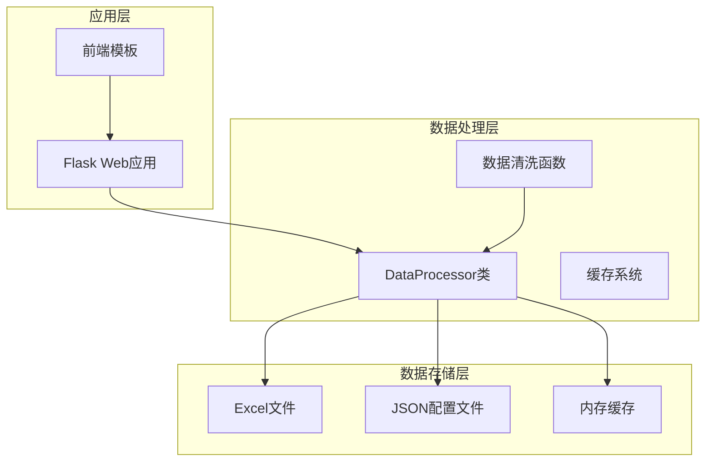
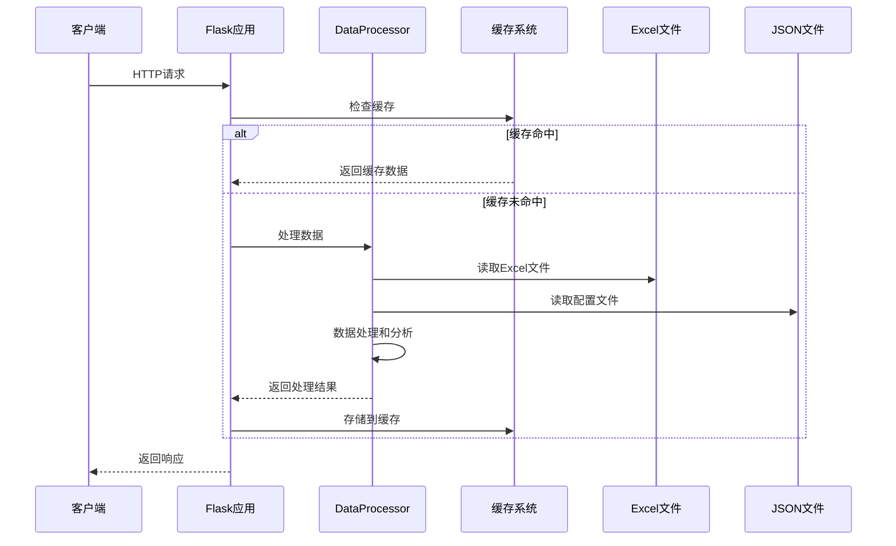
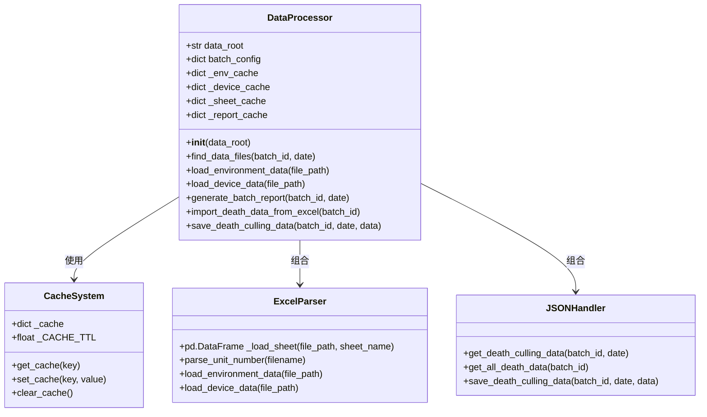
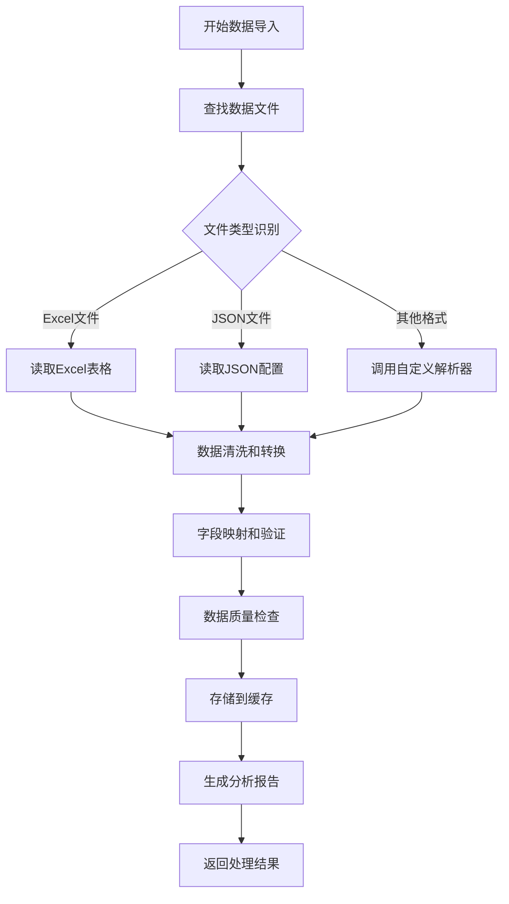
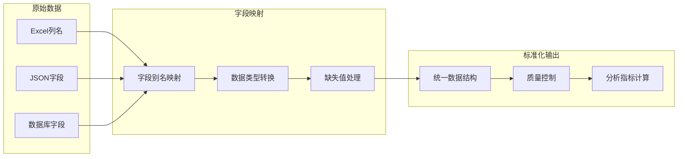
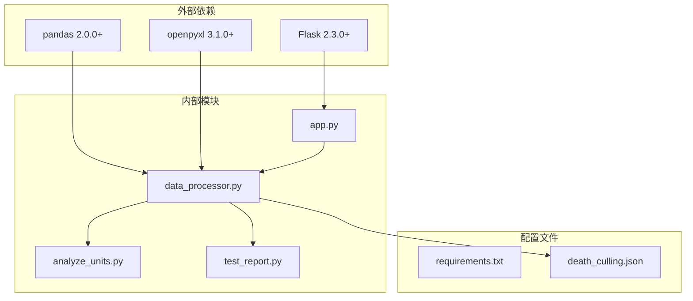
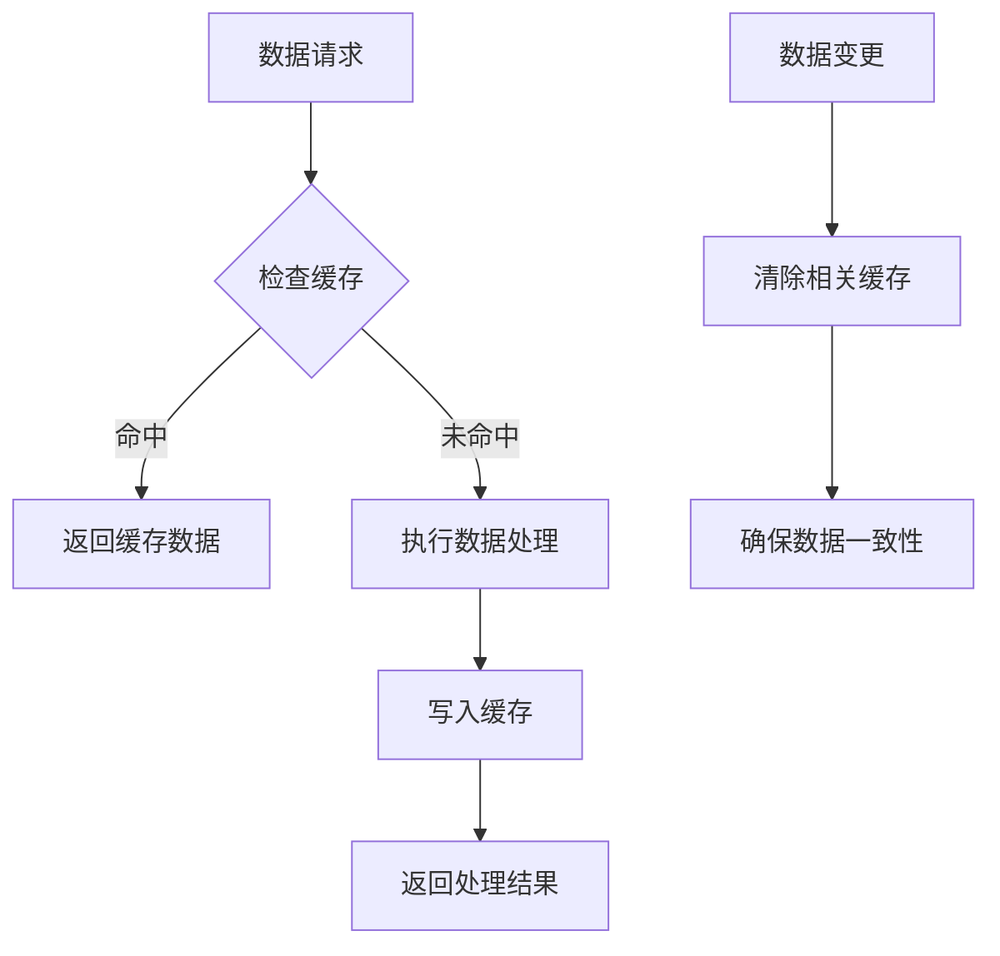

# 数据源扩展

<cite>
**本文档引用的文件**
- [app.py](file://app.py)
- [data_processor.py](file://data_processor.py)
- [analyze_units.py](file://analyze_units.py)
- [test_report.py](file://test_report.py)
- [death_culling.json](file://death_culling.json)
- [templates/index.html](file://templates/index.html)
- [requirements.txt](file://requirements.txt)
</cite>

## 目录
1. [简介](#简介)
2. [项目结构](#项目结构)
3. [核心组件](#核心组件)
4. [架构概览](#架构概览)
5. [详细组件分析](#详细组件分析)
6. [依赖关系分析](#依赖关系分析)
7. [性能考虑](#性能考虑)
8. [故障排除指南](#故障排除指南)
9. [结论](#结论)
10. [附录](#附录)

## 简介

本指南面向猪场环控数据分析系统的数据源扩展需求，详细说明如何扩展系统支持的数据源类型，包括新的Excel文件格式、数据库连接、API接口等。系统基于Python Flask框架构建，使用pandas进行数据处理，通过Excel文件提供环控数据和设备运行数据。

系统目前支持的数据源类型：
- Excel文件（.xlsx/.xls）
- JSON配置文件
- 死亡数据导入（Excel到JSON）

## 项目结构

**图表来源**
- [app.py:1-133](file://app.py#L1-L133)
- [data_processor.py:54-1559](file://data_processor.py#L54-L1559)

**章节来源**
- [app.py:1-133](file://app.py#L1-L133)
- [data_processor.py:1-800](file://data_processor.py#L1-L800)

## 核心组件

### DataProcessor类
系统的核心数据处理器，负责：
- Excel文件读取和解析
- 数据清洗和转换
- 报告生成和分析
- 缓存管理

### 缓存系统
内置两级缓存机制：
- 内存缓存：用于数据处理结果缓存
- HTTP缓存：用于API响应缓存

### 数据验证和质量控制
- 数据类型转换和清理
- 缺失值处理
- 异常值检测
- 数据完整性检查

**章节来源**
- [data_processor.py:54-1559](file://data_processor.py#L54-L1559)
- [app.py:15-40](file://app.py#L15-L40)

## 架构概览

**图表来源**
- [app.py:32-40](file://app.py#L32-L40)
- [data_processor.py:40-48](file://data_processor.py#L40-L48)

## 详细组件分析

### 数据源扩展架构

**图表来源**
- [data_processor.py:54-1559](file://data_processor.py#L54-L1559)

### 数据导入流程

**图表来源**
- [data_processor.py:105-128](file://data_processor.py#L105-L128)
- [data_processor.py:165-223](file://data_processor.py#L165-L223)

**章节来源**
- [data_processor.py:105-223](file://data_processor.py#L105-L223)

### 字段映射和数据转换

系统实现了灵活的字段映射机制：

**图表来源**
- [data_processor.py:315-347](file://data_processor.py#L315-L347)
- [data_processor.py:494-609](file://data_processor.py#L494-L609)

**章节来源**
- [data_processor.py:315-609](file://data_processor.py#L315-L609)

## 依赖关系分析

**图表来源**
- [requirements.txt:1-4](file://requirements.txt#L1-L4)
- [app.py:1-5](file://app.py#L1-L5)

**章节来源**
- [requirements.txt:1-4](file://requirements.txt#L1-L4)
- [app.py:1-10](file://app.py#L1-L10)

## 性能考虑

### 缓存策略

系统实现了多层次的缓存机制：

1. **Sheet缓存**：针对Excel表格的缓存
2. **报告缓存**：针对完整报告的缓存  
3. **HTTP缓存**：针对API响应的缓存

**图表来源**
- [app.py:18-30](file://app.py#L18-L30)
- [data_processor.py:40-52](file://data_processor.py#L40-L52)

### 批量处理优化

- Excel文件读取使用缓存避免重复IO
- 数据处理采用向量化操作
- 内存管理优化，避免大数据集内存溢出

**章节来源**
- [app.py:15-40](file://app.py#L15-L40)
- [data_processor.py:13-13](file://data_processor.py#L13-L13)

## 故障排除指南

### 常见问题诊断

1. **Excel文件读取失败**
   - 检查文件路径和权限
   - 验证Excel文件格式兼容性
   - 确认openpyxl引擎可用

2. **数据解析错误**
   - 检查字段名称匹配
   - 验证数据类型转换
   - 确认缺失值处理逻辑

3. **缓存问题**
   - 清除缓存后重试
   - 检查缓存TTL设置
   - 验证缓存键生成逻辑

### 调试工具

系统提供了测试脚本用于调试：

**图表来源**
- [test_report.py:1-48](file://test_report.py#L1-L48)

**章节来源**
- [test_report.py:1-48](file://test_report.py#L1-L48)

## 结论

本指南详细介绍了猪场环控数据分析系统的数据源扩展方法。系统具有良好的可扩展性，支持多种数据源类型的集成。通过理解现有的数据处理架构、缓存机制和质量控制流程，可以有效地扩展系统以支持新的数据源类型。

关键扩展点包括：
- Excel文件格式扩展
- 自定义解析器实现
- 字段映射和数据转换
- 缓存策略优化
- 数据质量控制

## 附录

### 扩展步骤清单

1. **分析现有数据源**
   - 研究Excel文件结构
   - 分析JSON配置格式
   - 理解数据处理流程

2. **设计新数据源适配器**
   - 定义数据结构映射
   - 实现数据转换逻辑
   - 设计错误处理机制

3. **集成到系统架构**
   - 修改DataProcessor类
   - 更新缓存策略
   - 添加单元测试

4. **性能优化**
   - 实现批量处理
   - 优化内存使用
   - 添加索引和查询优化

5. **质量保证**
   - 数据完整性检查
   - 异常值检测
   - 一致性验证

### 最佳实践

- **数据标准化**：确保所有数据源输出统一的数据结构
- **错误处理**：实现健壮的异常处理和回退机制
- **性能监控**：监控数据处理时间和内存使用
- **版本控制**：跟踪数据格式变更和兼容性
- **文档维护**：保持扩展文档的及时更新