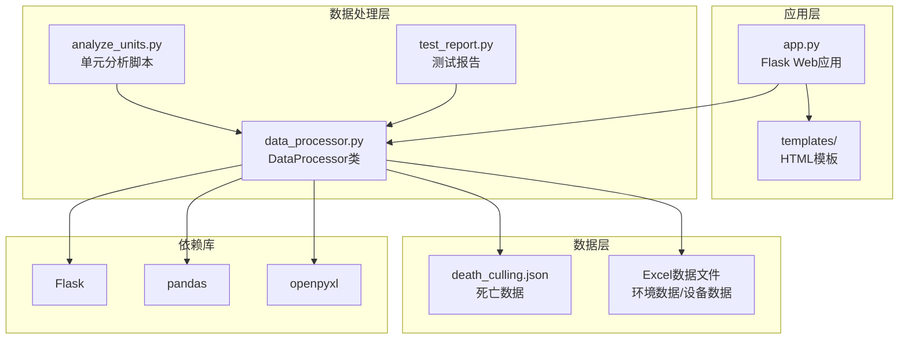
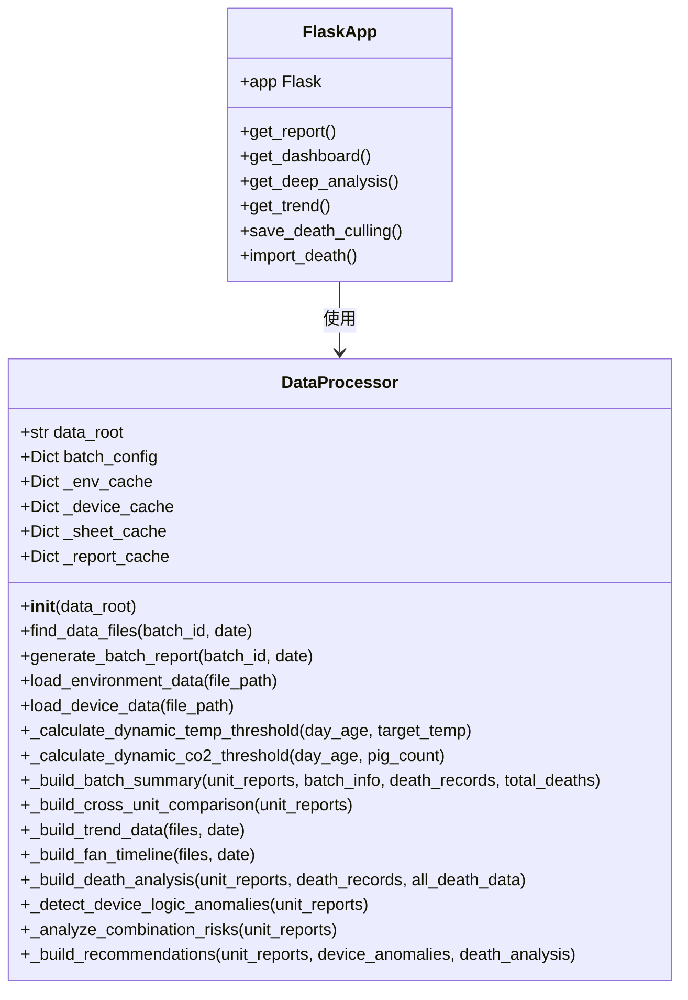
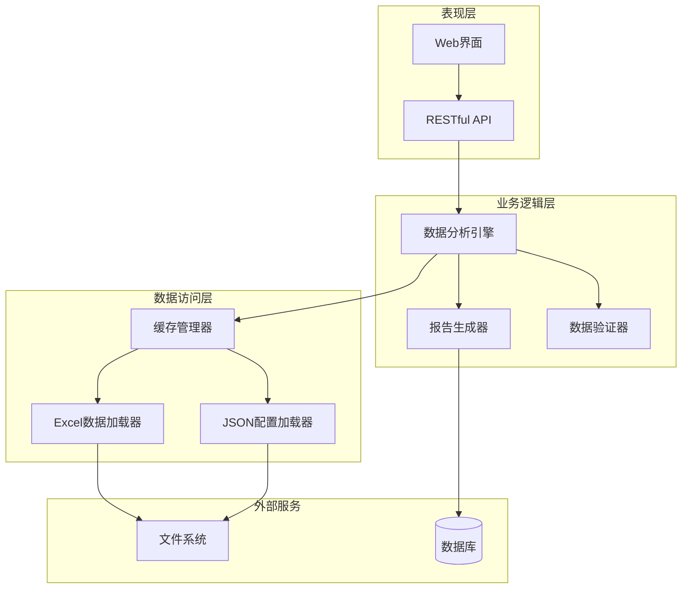
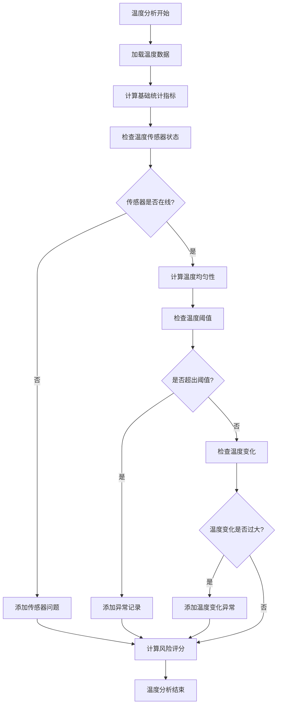
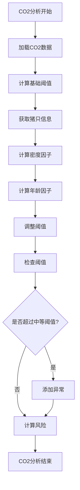
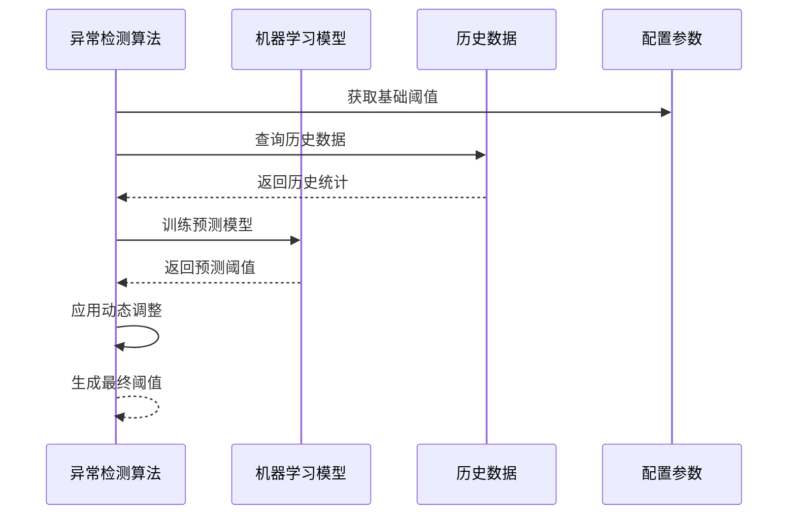
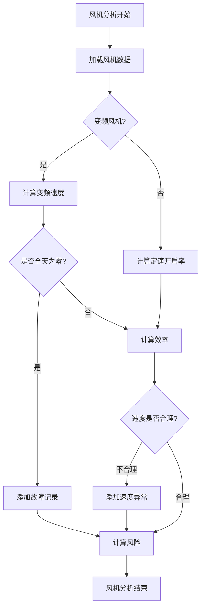
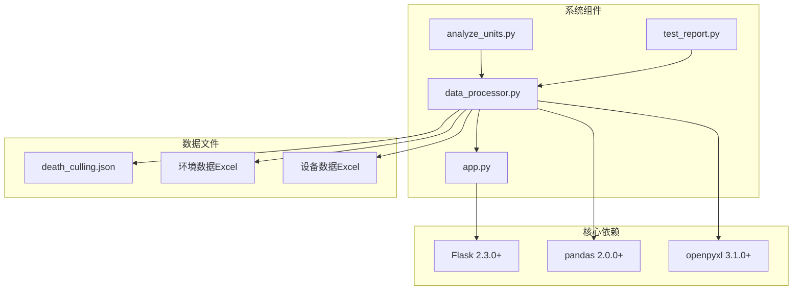
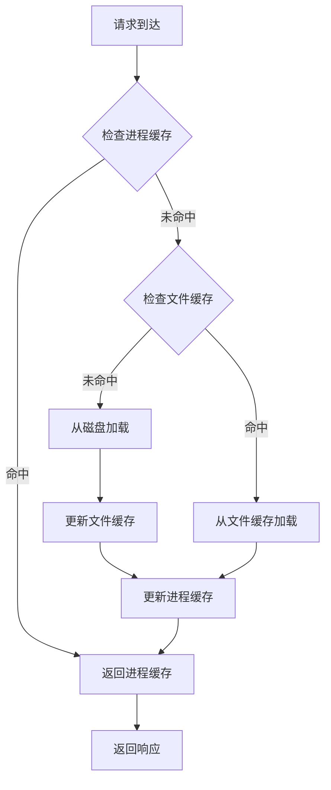
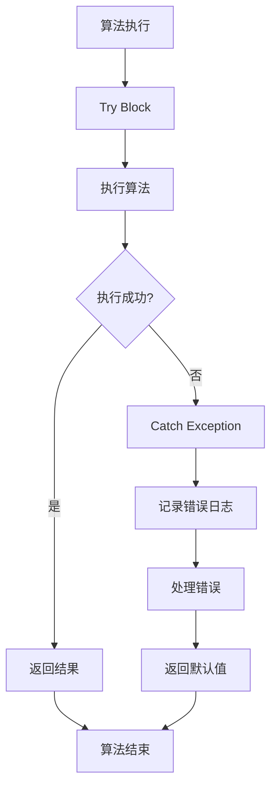

# 算法扩展开发

<cite>
**本文档引用的文件**
- [app.py](file://app.py)
- [data_processor.py](file://data_processor.py)
- [analyze_units.py](file://analyze_units.py)
- [test_report.py](file://test_report.py)
- [death_culling.json](file://death_culling.json)
- [requirements.txt](file://requirements.txt)
- [templates/index.html](file://templates/index.html)
</cite>

## 目录
1. [简介](#简介)
2. [项目结构](#项目结构)
3. [核心组件](#核心组件)
4. [架构概览](#架构概览)
5. [详细组件分析](#详细组件分析)
6. [依赖关系分析](#依赖关系分析)
7. [性能考虑](#性能考虑)
8. [故障排除指南](#故障排除指南)
9. [结论](#结论)
10. [附录](#附录)

## 简介

本指南面向猪场环控数据分析系统的算法扩展开发者，详细说明如何扩展现有的环境参数分析算法、异常检测算法和设备运行分析算法。该系统基于Python构建，使用Flask作为Web框架，pandas进行数据处理，支持Excel数据格式的读取和分析。

系统主要功能包括：
- 环境参数分析：温度、湿度、CO2浓度、压差等指标的统计分析
- 异常检测：基于动态阈值的环境异常识别
- 设备运行分析：风机效率、能耗、设备健康度评估
- 死亡数据分析：环境因素与死亡事件的相关性分析
- 实时趋势监控：历史数据的趋势分析和可视化

## 项目结构

**图表来源**
- [app.py:1-133](file://app.py#L1-L133)
- [data_processor.py:54-1559](file://data_processor.py#L54-L1559)

**章节来源**
- [app.py:1-133](file://app.py#L1-L133)
- [data_processor.py:54-1559](file://data_processor.py#L54-L1559)
- [requirements.txt:1-4](file://requirements.txt#L1-L4)

## 核心组件

### DataProcessor类架构

DataProcessor是系统的核心数据处理类，负责所有数据分析逻辑的实现。其主要职责包括：

- **数据加载与缓存**：管理Excel文件的读取和缓存机制
- **环境参数分析**：温度、湿度、CO2、压差等指标的统计分析
- **异常检测**：基于动态阈值的异常识别算法
- **设备运行分析**：风机效率、能耗、设备健康度评估
- **报告生成**：综合分析结果的构建和输出

**图表来源**
- [data_processor.py:54-1559](file://data_processor.py#L54-L1559)
- [app.py:1-133](file://app.py#L1-L133)

**章节来源**
- [data_processor.py:54-1559](file://data_processor.py#L54-L1559)
- [app.py:1-133](file://app.py#L1-L133)

## 架构概览

系统采用分层架构设计，确保了良好的可扩展性和维护性：

**图表来源**
- [app.py:42-133](file://app.py#L42-L133)
- [data_processor.py:54-1559](file://data_processor.py#L54-L1559)

## 详细组件分析

### 环境参数分析算法

#### 温度分析算法

温度分析是系统中最复杂的分析模块之一，实现了多层次的温度监控和分析：

**图表来源**
- [data_processor.py:352-401](file://data_processor.py#L352-L401)
- [data_processor.py:648-678](file://data_processor.py#L648-L678)

##### 动态阈值调整算法

系统实现了基于猪只日龄的动态温度阈值调整机制：

| 阶段 | 年龄范围 | 高温阈值 | 严重点阈值 | 日内变化阈值 |
|------|----------|----------|------------|--------------|
| 保育期 | ≤30天 | 2.5°C | 4°C | 4°C |
| 生长期 | 31-60天 | 2.8°C | 4.5°C | 4.5°C |
| 育肥期 | 61-120天 | 3.2°C | 5.5°C | 5.5°C |
| 成猪期 | >120天 | 3.5°C | 6°C | 6°C |

**章节来源**
- [data_processor.py:865-891](file://data_processor.py#L865-L891)
- [data_processor.py:643-678](file://data_processor.py#L643-L678)

#### 湿度分析算法

湿度分析采用固定阈值策略，主要关注湿度偏离目标值的情况：

- **目标湿度偏差**：超过±15%即视为异常
- **湿度分布统计**：计算平均值、最大值、最小值
- **异常检测**：基于湿度阈值的简单比较

**章节来源**
- [data_processor.py:679-696](file://data_processor.py#L679-L696)

#### CO2浓度分析算法

CO2分析实现了基于日龄和猪只密度的动态阈值调整：

**图表来源**
- [data_processor.py:893-914](file://data_processor.py#L893-L914)
- [data_processor.py:725-742](file://data_processor.py#L725-L742)

**章节来源**
- [data_processor.py:893-914](file://data_processor.py#L893-L914)

#### 压差分析算法

压差分析重点关注负压事件和稳定性：

- **负压事件检测**：超过10%的负压时段即视为异常
- **稳定性评估**：基于标准差的稳定性分类
- **波动性分析**：极不稳定状态的识别

**章节来源**
- [data_processor.py:697-724](file://data_processor.py#L697-L724)

### 异常检测算法扩展

#### 动态阈值调整扩展

要实现更复杂的动态阈值调整，可以在现有基础上添加以下功能：

1. **机器学习阈值预测**
2. **历史数据自适应调整**
3. **季节性因素考虑**
4. **设备老化系数**

**图表来源**
- [data_processor.py:865-914](file://data_processor.py#L865-L914)

#### 统计分析扩展

系统现有的统计分析包括：
- 基础统计指标（均值、标准差、范围）
- 分布统计（百分位数）
- 相关性分析
- 趋势分析

**章节来源**
- [data_processor.py:352-401](file://data_processor.py#L352-L401)
- [data_processor.py:1026-1080](file://data_processor.py#L1026-L1080)

### 设备运行分析算法

#### 风机效率计算

风机效率分析包括变频风机和定速风机的不同处理方式：

**图表来源**
- [data_processor.py:497-536](file://data_processor.py#L497-L536)
- [data_processor.py:743-774](file://data_processor.py#L743-L774)

**章节来源**
- [data_processor.py:497-536](file://data_processor.py#L497-L536)

#### 能耗分析算法

能耗分析目前主要基于设备运行状态的间接估算，可以扩展为：

1. **直接能耗测量**：通过设备功率数据计算
2. **效率模型**：基于设备特性的能耗估算
3. **成本分析**：结合电价的成本计算
4. **优化建议**：基于能耗数据的节能建议

**章节来源**
- [data_processor.py:538-608](file://data_processor.py#L538-L608)

#### 设备健康度评估

设备健康度评估基于多种指标：
- 传感器在线率
- 设备故障记录
- 维护保养状态
- 性能退化趋势

**章节来源**
- [data_processor.py:611-637](file://data_processor.py#L611-L637)

## 依赖关系分析

系统的主要依赖关系如下：

**图表来源**
- [requirements.txt:1-4](file://requirements.txt#L1-L4)
- [app.py:1-5](file://app.py#L1-L5)
- [data_processor.py:1-11](file://data_processor.py#L1-L11)

**章节来源**
- [requirements.txt:1-4](file://requirements.txt#L1-L4)
- [app.py:1-5](file://app.py#L1-L5)
- [data_processor.py:1-11](file://data_processor.py#L1-L11)

## 性能考虑

### 缓存策略

系统实现了多层级缓存机制：

1. **进程内缓存**：内存中的临时缓存
2. **文件系统缓存**：Excel数据的缓存
3. **HTTP缓存**：API响应的缓存

**图表来源**
- [app.py:18-40](file://app.py#L18-L40)
- [data_processor.py:40-52](file://data_processor.py#L40-L52)

### 内存管理

系统采用以下内存管理策略：
- **延迟加载**：按需加载Excel数据
- **数据类型优化**：使用合适的数据类型减少内存占用
- **缓存清理**：定期清理过期缓存

**章节来源**
- [app.py:18-40](file://app.py#L18-L40)
- [data_processor.py:40-52](file://data_processor.py#L40-L52)

## 故障排除指南

### 数据加载问题

常见数据加载问题及解决方案：

1. **Excel文件读取失败**
   - 检查文件路径和权限
   - 验证Excel文件格式完整性
   - 确认openpyxl库版本兼容性

2. **数据解析错误**
   - 检查列名匹配
   - 验证数据类型转换
   - 处理缺失值和异常值

3. **内存不足**
   - 实施分块读取
   - 优化数据类型
   - 启用缓存清理

**章节来源**
- [data_processor.py:130-141](file://data_processor.py#L130-L141)
- [data_processor.py:165-223](file://data_processor.py#L165-L223)

### 算法异常处理

系统提供了完善的异常处理机制：

**图表来源**
- [data_processor.py:134-140](file://data_processor.py#L134-L140)

**章节来源**
- [data_processor.py:134-140](file://data_processor.py#L134-L140)

## 结论

本指南详细介绍了猪场环控数据分析系统的算法扩展开发方法。系统具有以下特点：

1. **模块化设计**：清晰的组件分离便于扩展
2. **动态阈值**：基于猪只生命周期的自适应调整
3. **多层次分析**：从单一指标到组合风险的全面分析
4. **实时监控**：支持历史数据和实时数据的分析
5. **可视化支持**：完整的前端展示框架

扩展开发建议：
- 保持算法的可解释性
- 实现渐进式部署
- 建立完善的测试体系
- 注重性能优化
- 提供详细的文档和示例

## 附录

### 开发最佳实践

#### 代码组织原则
- 遵循单一职责原则
- 保持函数简洁
- 使用有意义的变量命名
- 添加必要的注释和文档

#### 测试策略
- 单元测试：针对每个算法函数
- 集成测试：测试组件间的交互
- 性能测试：验证大数据量处理能力
- 回归测试：确保修改不影响现有功能

#### 性能优化技巧
- 使用向量化操作替代循环
- 合理使用缓存机制
- 优化数据结构选择
- 实施内存池管理

#### 错误处理规范
- 明确的异常类型定义
- 详细的错误日志记录
- 用户友好的错误提示
- 完善的回滚机制