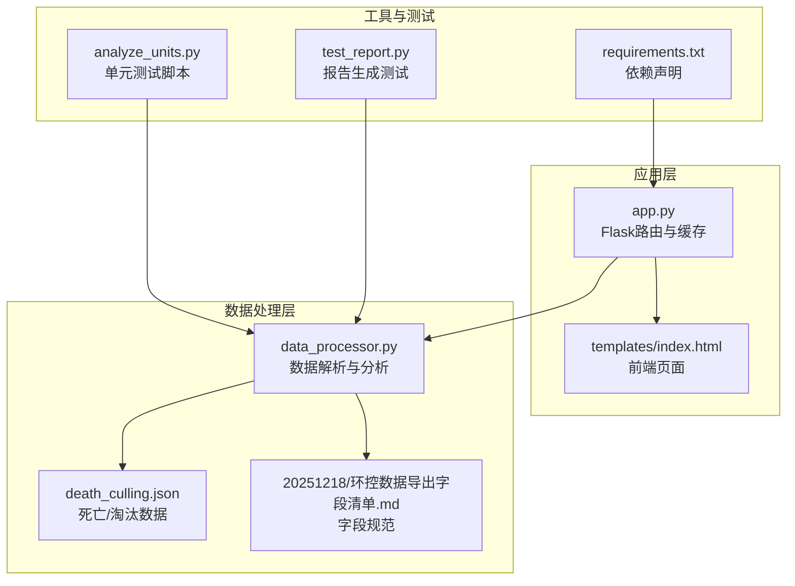
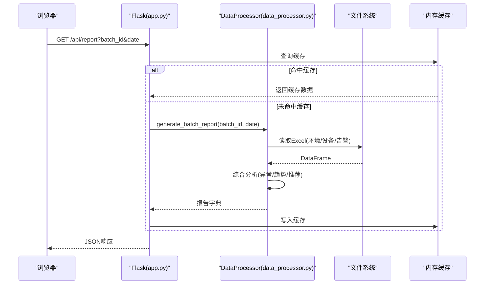
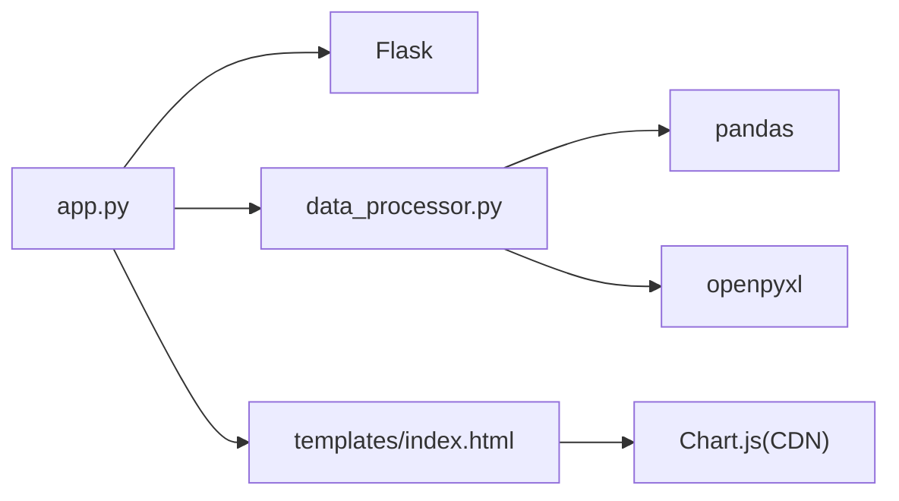

# 故障排除与FAQ

<cite>
**本文引用的文件**
- [app.py](file://app.py)
- [data_processor.py](file://data_processor.py)
- [analyze_units.py](file://analyze_units.py)
- [test_report.py](file://test_report.py)
- [death_culling.json](file://death_culling.json)
- [requirements.txt](file://requirements.txt)
- [templates/index.html](file://templates/index.html)
- [20251218/环控数据导出字段清单.md](file://20251218/环控数据导出字段清单.md)
</cite>

## 目录
1. [简介](#简介)
2. [项目结构](#项目结构)
3. [核心组件](#核心组件)
4. [架构总览](#架构总览)
5. [详细组件分析](#详细组件分析)
6. [依赖分析](#依赖分析)
7. [性能考虑](#性能考虑)
8. [故障排除指南](#故障排除指南)
9. [结论](#结论)
10. [附录](#附录)

## 简介
本文件面向使用“猪场环控数据分析系统”的用户与运维人员，提供系统在使用过程中常见的问题诊断、错误原因分析、解决方案与预防措施。内容涵盖数据导入失败、分析结果异常、系统性能问题、API调用错误等场景，并配套系统日志分析方法、调试工具使用、性能瓶颈识别、常见错误代码与消息解释、最佳实践与注意事项、版本兼容性说明等实用信息。

## 项目结构
系统由Web应用层（Flask路由与模板）、数据处理层（Excel解析与综合分析）、前端展示层（HTML模板与图表）构成，辅以测试脚本与配置文件。

**图示来源**
- [app.py:1-133](file://app.py#L1-L133)
- [data_processor.py:1-1559](file://data_processor.py#L1-L1559)
- [templates/index.html:1-1983](file://templates/index.html#L1-L1983)
- [death_culling.json:1-27](file://death_culling.json#L1-L27)
- [20251218/环控数据导出字段清单.md:1-140](file://20251218/环控数据导出字段清单.md#L1-L140)
- [requirements.txt:1-4](file://requirements.txt#L1-L4)

**章节来源**
- [app.py:1-133](file://app.py#L1-L133)
- [data_processor.py:1-1559](file://data_processor.py#L1-L1559)
- [templates/index.html:1-1983](file://templates/index.html#L1-L1983)
- [requirements.txt:1-4](file://requirements.txt#L1-L4)

## 核心组件
- Web应用与路由
  - 提供首页、批次列表、报告、仪表盘、趋势、深度分析、死亡/淘汰导入与缓存清理等接口。
  - 支持GET查询参数与POST JSON请求体。
- 数据处理器
  - 解析Excel文件（环境数据、设备数据、告警阈值等），构建单位级与批次级综合分析报告。
  - 包含缓存机制、异常检测、设备逻辑异常检测、死亡相关性分析、组合风险分析等。
- 死亡/淘汰数据
  - 通过JSON文件存储，支持导入与保存。
- 前端模板
  - 使用Chart.js渲染图表，响应式布局，Tab切换与加载状态提示。
- 测试与工具
  - 单元测试脚本用于快速验证分析流程。
  - 报告测试脚本输出关键指标与异常统计。

**章节来源**
- [app.py:42-133](file://app.py#L42-L133)
- [data_processor.py:54-838](file://data_processor.py#L54-L838)
- [death_culling.json:1-27](file://death_culling.json#L1-L27)
- [templates/index.html:1-1983](file://templates/index.html#L1-L1983)
- [analyze_units.py:1-105](file://analyze_units.py#L1-L105)
- [test_report.py:1-48](file://test_report.py#L1-L48)

## 架构总览
系统采用前后端分离的轻量架构：
- 前端通过HTTP请求调用后端API，后端返回JSON数据，前端使用Chart.js绘制图表。
- 后端对Excel文件进行解析与缓存，避免重复I/O。
- 死亡/淘汰数据通过独立JSON文件管理，支持导入与编辑。

**图示来源**
- [app.py:59-66](file://app.py#L59-L66)
- [app.py:32-40](file://app.py#L32-L40)
- [data_processor.py:238-295](file://data_processor.py#L238-L295)

## 详细组件分析

### Web应用与路由（app.py）
- 路由设计
  - 首页与批次列表：渲染模板与返回批次列表。
  - 报告与仪表盘：返回综合分析报告。
  - 深度分析：返回更详细的分析结果。
  - 趋势：返回时间序列数据，带分页缓存。
  - 死亡/淘汰：支持导入Excel与保存JSON。
  - 缓存：全局内存缓存，TTL 5分钟。
- 错误处理
  - 批次不存在时返回404与消息。
  - 导入失败时返回错误消息。
- 性能特性
  - 多处接口启用缓存，减少重复计算与I/O。
  - POST修改数据后主动清空缓存，保证一致性。

**章节来源**
- [app.py:42-133](file://app.py#L42-L133)
- [app.py:18-31](file://app.py#L18-L31)

### 数据处理器（data_processor.py）
- 数据解析
  - 通过openpyxl读取Excel指定Sheet，缓存Sheet以提升性能。
  - 对缺失或异常值进行清洗，确保数值与NaN/Inf安全。
- 分析模块
  - 单位级：温度、湿度、CO2、压差、传感器健康、设备运行、异常检测、风险评分。
  - 批次级：汇总、跨单元对比、趋势、风扇时间线、死亡相关性、设备逻辑异常、小时聚合、滞后效应、推荐。
  - 动态阈值：根据日龄与密度动态调整温度与CO2阈值。
- 缓存与一致性
  - 全局缓存与接口缓存双重机制，修改数据后清空缓存。
- 异常与告警
  - 温度/湿度/压差/CO2异常检测。
  - 设备逻辑异常（如变频风机始终为0）。
  - 告警阈值不一致与配置问题。
  - 死亡记录与环境相关性分析。

**章节来源**
- [data_processor.py:130-141](file://data_processor.py#L130-L141)
- [data_processor.py:238-838](file://data_processor.py#L238-L838)
- [data_processor.py:865-914](file://data_processor.py#L865-L914)
- [data_processor.py:1194-1249](file://data_processor.py#L1194-L1249)

### 死亡/淘汰数据管理（death_culling.json）
- 结构
  - 以批次ID为键，日期为键，记录死亡/淘汰数量与原因。
- 导入
  - 从Excel批量导入，按批次名过滤，按日期与单元聚合。
- 保存
  - 通过API保存，写回JSON文件。

**章节来源**
- [death_culling.json:1-27](file://death_culling.json#L1-L27)
- [data_processor.py:165-223](file://data_processor.py#L165-L223)
- [data_processor.py:225-236](file://data_processor.py#L225-L236)

### 前端模板（templates/index.html）
- 特性
  - 使用Chart.js绘制温度/湿度/CO2/压差趋势与风扇时间线。
  - 响应式布局，Tab切换，加载动画，风险等级可视化。
  - 推荐卡片与异常卡片分级显示。

**章节来源**
- [templates/index.html:1-1983](file://templates/index.html#L1-L1983)

### 测试与工具
- analyze_units.py
  - 逐单元读取Excel并打印关键指标，便于快速验证数据质量。
- test_report.py
  - 生成并打印批次汇总、单位异常、设备异常、推荐、死亡分析与趋势点数。

**章节来源**
- [analyze_units.py:1-105](file://analyze_units.py#L1-L105)
- [test_report.py:1-48](file://test_report.py#L1-L48)

## 依赖分析
- Python依赖
  - Flask：Web框架。
  - pandas：数据处理与分析。
  - openpyxl：Excel读取。
- 版本兼容性
  - Flask>=2.3.0，pandas>=2.0.0，openpyxl>=3.1.0。
- 外部集成
  - 前端使用CDN引入Chart.js。

**图示来源**
- [requirements.txt:1-4](file://requirements.txt#L1-L4)
- [app.py:1-10](file://app.py#L1-L10)
- [data_processor.py:1-11](file://data_processor.py#L1-L11)
- [templates/index.html:8](file://templates/index.html#L8)

**章节来源**
- [requirements.txt:1-4](file://requirements.txt#L1-L4)

## 性能考虑
- 缓存策略
  - 全局内存缓存（TTL 5分钟）与接口级缓存（报告、趋势）显著降低重复计算与I/O。
  - 修改数据后主动清空缓存，避免脏数据。
- 数据读取优化
  - Sheet缓存避免重复读取同一文件的同一Sheet。
  - 数值清洗与NaN/Inf处理减少后续计算开销。
- 并发与资源
  - 默认开发服务器为单进程，生产部署建议使用WSGI容器与多进程/多线程。
- 前端渲染
  - Chart.js按需渲染，建议在大数据量时进行采样或分页。

**章节来源**
- [app.py:18-40](file://app.py#L18-L40)
- [data_processor.py:130-141](file://data_processor.py#L130-L141)
- [data_processor.py:40-48](file://data_processor.py#L40-L48)

## 故障排除指南

### 一、数据导入失败
- 症状
  - 导入接口返回错误消息或导入数量为0。
- 常见原因
  - Excel文件不存在或路径不正确。
  - Excel表头与预期不符（如“批次号”列缺失）。
  - 批次不存在或批次名不匹配。
  - 文件编码或空值处理不符合规范。
- 诊断步骤
  - 检查Excel文件是否存在且命名符合规范。
  - 使用单元测试脚本逐单元读取，确认关键列存在。
  - 查看后端日志中的异常堆栈（开发模式下会打印）。
- 解决方案
  - 按字段清单修正Excel表头与内容。
  - 确保批次配置中包含对应批次信息。
  - 使用提供的字段清单校验数据完整性。
- 预防措施
  - 在导入前先执行单元测试脚本验证数据。
  - 统一Excel导出模板与命名规则。

**章节来源**
- [data_processor.py:165-223](file://data_processor.py#L165-L223)
- [20251218/环控数据导出字段清单.md:1-140](file://20251218/环控数据导出字段清单.md#L1-L140)
- [analyze_units.py:1-105](file://analyze_units.py#L1-L105)

### 二、分析结果异常
- 症状
  - 温度/湿度/CO2/压差异常检测结果与现场不符。
  - 风扇运行状态与实际不符。
  - 风险评分异常或推荐不合理。
- 常见原因
  - Excel列名不匹配或缺失。
  - 传感器配置与实际安装不一致。
  - 告警阈值设置过高或不统一。
  - 数据缺失或异常值未清洗。
- 诊断步骤
  - 使用单元测试脚本打印关键指标，核对列名与数值。
  - 检查设备安装配置与传感器配置是否齐全。
  - 查看告警阈值是否合理。
- 解决方案
  - 修正Excel列名与内容，确保与字段清单一致。
  - 更新设备与传感器配置。
  - 调整告警阈值到合理范围。
- 预防措施
  - 导入前先执行单元测试脚本。
  - 统一阈值与配置标准。

**章节来源**
- [data_processor.py:315-838](file://data_processor.py#L315-L838)
- [20251218/环控数据导出字段清单.md:1-140](file://20251218/环控数据导出字段清单.md#L1-L140)

### 三、系统性能问题
- 症状
  - 页面加载缓慢、图表渲染卡顿。
- 常见原因
  - Excel文件过大或Sheet过多。
  - 未命中缓存导致重复计算。
  - 前端一次性渲染大量数据点。
- 诊断步骤
  - 查看接口响应时间与缓存命中率。
  - 检查趋势数据点数量与采样步长。
- 解决方案
  - 合理分页与采样，减少前端渲染压力。
  - 确保缓存生效，避免频繁刷新。
  - 优化Excel文件结构，减少冗余列。
- 预防措施
  - 生产环境使用WSGI容器与多进程部署。
  - 控制单次请求的数据量，必要时分页。

**章节来源**
- [app.py:93-102](file://app.py#L93-L102)
- [data_processor.py:1026-1080](file://data_processor.py#L1026-L1080)

### 四、API调用错误
- 常见错误
  - 批次不存在：返回404与消息。
  - 参数缺失：默认参数覆盖，但建议显式传参。
  - 缓存未更新：修改数据后需清空缓存。
- 诊断步骤
  - 检查请求URL与查询参数。
  - 查看响应JSON中的success与message字段。
  - 如需最新数据，调用缓存清理接口。
- 解决方案
  - 确认batch_id与date参数正确。
  - 修改数据后调用缓存清理接口。
- 预防措施
  - 前端在数据变更后主动触发缓存清理。

**章节来源**
- [app.py:52-57](file://app.py#L52-L57)
- [app.py:126-129](file://app.py#L126-L129)

### 五、系统日志分析方法
- 开发模式日志
  - 启动时开启debug，后端会打印异常堆栈与错误信息。
- 关键日志点
  - Excel读取异常（Sheet加载失败）。
  - 死亡数据导入异常（文件不存在、批次不存在、解析异常）。
- 调试建议
  - 使用单元测试脚本与报告测试脚本快速定位问题。
  - 在关键函数入口与出口添加日志（如需要）。

**章节来源**
- [app.py:131-133](file://app.py#L131-L133)
- [data_processor.py:134-140](file://data_processor.py#L134-L140)
- [data_processor.py:221-223](file://data_processor.py#L221-L223)

### 六、调试工具使用
- 单元测试脚本
  - analyze_units.py：逐单元读取Excel并打印关键指标，便于快速验证。
- 报告测试脚本
  - test_report.py：生成报告并打印关键指标与异常统计。
- 建议
  - 将这两个脚本作为日常验证工具，导入前先跑一遍。

**章节来源**
- [analyze_units.py:1-105](file://analyze_units.py#L1-L105)
- [test_report.py:1-48](file://test_report.py#L1-L48)

### 七、性能瓶颈识别
- 瓶颈类型
  - I/O瓶颈：Excel文件过大或Sheet过多。
  - 计算瓶颈：复杂分析与阈值计算。
  - 缓存失效：频繁修改导致缓存命中率低。
- 识别方法
  - 观察接口响应时间与缓存命中率。
  - 分析趋势数据点数量与渲染耗时。
- 优化建议
  - 采样与分页，减少一次性渲染数据量。
  - 合理利用缓存，避免重复计算。
  - 生产环境使用多进程/多线程部署。

**章节来源**
- [app.py:18-40](file://app.py#L18-L40)
- [data_processor.py:1026-1080](file://data_processor.py#L1026-L1080)

### 八、常见错误代码与消息解释
- 批次不存在
  - 现象：返回404与消息。
  - 原因：batch_id不在配置中。
  - 处理：检查批次配置或传参。
- 文件不存在
  - 现象：导入接口返回“文件不存在”。
  - 原因：Excel文件路径不正确或命名不规范。
  - 处理：按字段清单修正文件命名与路径。
- 导入异常
  - 现象：导入返回错误消息。
  - 原因：Excel表头不匹配或解析异常。
  - 处理：对照字段清单修正表头与内容。

**章节来源**
- [app.py:52-57](file://app.py#L52-L57)
- [data_processor.py:168-170](file://data_processor.py#L168-L170)
- [data_processor.py:221-223](file://data_processor.py#L221-L223)

### 九、最佳实践与注意事项
- 数据准备
  - 严格遵循字段清单与命名规范，避免列名差异。
  - 空值请留空，不要填写“NA”、“null”等字符串。
- 配置管理
  - 统一告警阈值与设备配置，避免跨单元不一致。
  - 定期检查传感器在线情况与设备运行状态。
- 使用建议
  - 导入前先执行单元测试脚本与报告测试脚本。
  - 修改数据后调用缓存清理接口，确保前端看到最新结果。
- 版本兼容
  - 使用requirements.txt声明的最低版本，避免新旧版本差异导致的兼容问题。

**章节来源**
- [20251218/环控数据导出字段清单.md:133-140](file://20251218/环控数据导出字段清单.md#L133-L140)
- [requirements.txt:1-4](file://requirements.txt#L1-L4)

## 结论
本系统通过清晰的分层架构、完善的缓存机制与严格的字段规范，实现了对猪场环控数据的高效分析与可视化展示。针对常见问题，建议用户在导入前进行数据校验与单元测试，出现问题时结合日志与测试脚本快速定位，并依据本文提供的解决方案与最佳实践进行修复与优化。生产部署时建议使用多进程/多线程与合理的缓存策略，以获得更佳的性能与稳定性。

## 附录

### A. API参考（摘要）
- 获取批次列表
  - 方法：GET
  - 路径：/api/batches
  - 返回：success与data（批次列表）
- 获取批次详情
  - 方法：GET
  - 路径：/api/batch/{batch_id}
  - 返回：success与data（批次信息），或404与message
- 获取报告
  - 方法：GET
  - 路径：/api/report?batch_id&date
  - 返回：success与data（综合报告）
- 获取仪表盘
  - 方法：GET
  - 路径：/api/dashboard?batch_id&date
  - 返回：success与data（综合报告）
- 深度分析
  - 方法：GET
  - 路径：/api/deep-analysis?batch_id&date
  - 返回：success与data（深度分析）
- 趋势
  - 方法：GET
  - 路径：/api/trend?batch_id&date&page&page_size
  - 返回：success与data（时间序列）
- 保存死亡/淘汰
  - 方法：POST
  - 路径：/api/death-culling
  - 请求体：batch_id、date、records
  - 返回：success
- 导入死亡Excel
  - 方法：POST
  - 路径：/api/import-death
  - 请求体：batch_id
  - 返回：success、imported、message
- 清空缓存
  - 方法：POST
  - 路径：/api/cache/clear
  - 返回：success与message

**章节来源**
- [app.py:47-129](file://app.py#L47-L129)

### B. 字段清单要点（节选）
- 环境数据
  - 单元信息：装猪数量、猪只体重、日龄、目标温度、目标湿度、通风季节、通风模式、工作模式、舍内温度、舍内湿度、二氧化碳均值、压差均值、通风等级、料肉比、日增重、日采食量、时间。
  - 变频/定速风机：风机组N状态（百分比|类型|模式）、通风等级、时间。
  - 告警阈值：温度低限、温度高限、湿度高限、二氧化碳高限。
- 设备数据
  - 设备信息：设备型号、设备IP地址、固件版本、内存使用率、累计运行时长、安装日期。
  - 设备安装配置：变频风机/定速风机/进风幕帘/水帘安装情况。
  - 传感器配置：温度/湿度/CO2传感器实际安装数量。
  - 进风幕帘配置：当前开度、目标开度。
  - 水帘配置：水帘工作模式、工作状态。

**章节来源**
- [20251218/环控数据导出字段清单.md:5-140](file://20251218/环控数据导出字段清单.md#L5-L140)