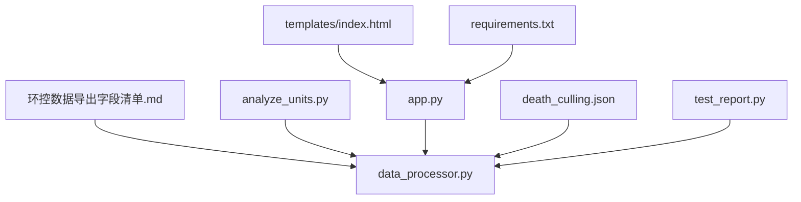
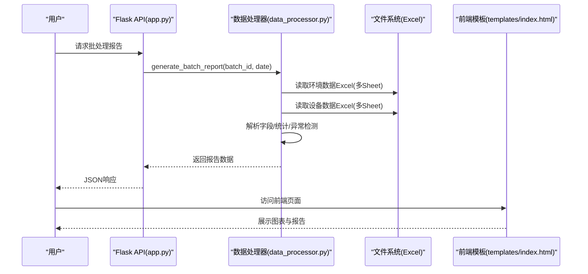
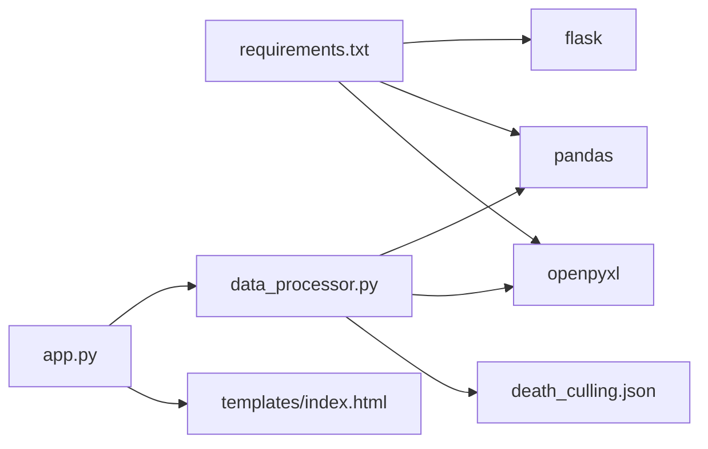
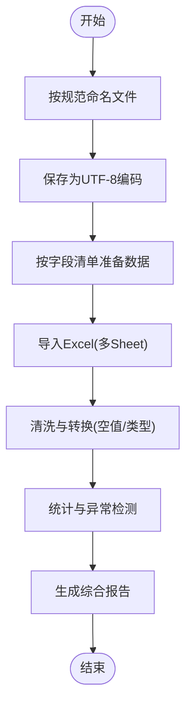

# Excel数据格式规范

<cite>
**本文引用的文件**
- [环控数据导出字段清单.md](file://20251218/环控数据导出字段清单.md)
- [analyze_units.py](file://analyze_units.py)
- [data_processor.py](file://data_processor.py)
- [app.py](file://app.py)
- [requirements.txt](file://requirements.txt)
- [death_culling.json](file://death_culling.json)
- [test_report.py](file://test_report.py)
- [templates/index.html](file://templates/index.html)
</cite>

## 目录
1. [简介](#简介)
2. [项目结构](#项目结构)
3. [核心组件](#核心组件)
4. [架构总览](#架构总览)
5. [详细组件分析](#详细组件分析)
6. [依赖分析](#依赖分析)
7. [性能考虑](#性能考虑)
8. [故障排查指南](#故障排查指南)
9. [结论](#结论)
10. [附录](#附录)

## 简介
本规范面向“猪场环控数据分析系统”的数据准备与导出，明确两类Excel文件的字段定义、数据类型、必填要求与业务含义，并给出数据导出要求（时间粒度、文件命名、编码、空值处理）。同时提供字段对照表与数据字典，帮助用户准确理解并准备数据，确保后续分析与报表生成的准确性与一致性。

## 项目结构
本仓库包含用于解析与展示环控数据的Python应用与相关配置文件：
- 环控数据导出字段清单：定义了环境数据与设备数据各工作表的字段规范
- 数据处理模块：负责加载Excel、清洗与聚合分析
- Web应用入口：提供API接口与前端页面
- 死亡与淘汰数据：用于与环控数据联动分析
- 前端模板：用于可视化展示分析结果

图表来源
- [环控数据导出字段清单.md:1-140](file://20251218/环控数据导出字段清单.md#L1-L140)
- [data_processor.py:1-1559](file://data_processor.py#L1-L1559)
- [app.py:1-133](file://app.py#L1-L133)
- [death_culling.json:1-27](file://death_culling.json#L1-L27)
- [templates/index.html:1-1983](file://templates/index.html#L1-L1983)
- [requirements.txt:1-4](file://requirements.txt#L1-L4)
- [test_report.py:1-48](file://test_report.py#L1-L48)

章节来源
- [环控数据导出字段清单.md:1-140](file://20251218/环控数据导出字段清单.md#L1-L140)
- [data_processor.py:1-1559](file://data_processor.py#L1-L1559)
- [app.py:1-133](file://app.py#L1-L133)
- [death_culling.json:1-27](file://death_culling.json#L1-L27)
- [templates/index.html:1-1983](file://templates/index.html#L1-L1983)
- [requirements.txt:1-4](file://requirements.txt#L1-L4)
- [test_report.py:1-48](file://test_report.py#L1-L48)

## 核心组件
- 环境数据Excel文件：包含单元信息、温度明细、湿度明细、压差明细、二氧化碳、室外数据、变频风机、定速风机、告警阈值等Sheet
- 设备数据Excel文件：包含设备信息、设备安装配置、传感器配置、进风幕帘配置、水帘配置等Sheet
- 数据处理模块：负责读取Excel、解析字段、计算统计指标、构建异常与风险评估、生成综合报告
- Web应用：提供批处理查询、趋势分析、仪表盘等接口
- 死亡与淘汰数据：用于与环控数据联动分析，辅助评估环境因素对生产的影响

章节来源
- [环控数据导出字段清单.md:3-140](file://20251218/环控数据导出字段清单.md#L3-L140)
- [data_processor.py:130-610](file://data_processor.py#L130-L610)
- [app.py:42-133](file://app.py#L42-L133)
- [death_culling.json:1-27](file://death_culling.json#L1-L27)

## 架构总览
系统采用“数据准备—数据解析—分析计算—结果输出”的分层架构。前端通过API请求获取分析结果，后端基于Excel字段规范进行解析与聚合，最终输出综合报告。

图表来源
- [app.py:59-84](file://app.py#L59-L84)
- [data_processor.py:238-295](file://data_processor.py#L238-L295)
- [templates/index.html:1-1983](file://templates/index.html#L1-L1983)

## 详细组件分析

### 环境数据Excel文件规范
- 单元信息
  - 字段：装猪数量、猪只体重(Kg)、日龄、目标温度(℃)、目标湿度(%)、通风季节、通风模式、工作模式、舍内温度(℃)、舍内湿度(%)、二氧化碳均值(ppm)、压差均值(pa)、通风等级、料肉比、日增重(Kg)、日采食量(Kg)、时间(datetime)
  - 数据类型：整数、浮点、字符串、日期时间
  - 必填：除标注“否”外均为必填
  - 业务含义：反映单元当日整体环境与生产性能指标
- 温度明细
  - 字段：温度传感器1(℃)、温度传感器2(℃)、温度传感器3(℃)、温度传感器4(℃)、时间
  - 数据类型：浮点、日期时间
  - 必填：是
  - 业务含义：逐点温度数据，支持温度均匀性分析
- 湿度明细
  - 字段：湿度传感器1、湿度传感器2、时间
  - 数据类型：浮点、日期时间
  - 必填：是
  - 业务含义：逐点湿度数据
- 压差明细
  - 字段：压差均值(pa)、时间
  - 数据类型：浮点、日期时间
  - 必填：是
  - 业务含义：逐点压差数据
- 二氧化碳
  - 字段：二氧化碳传感器(ppm)、时间
  - 数据类型：浮点、日期时间
  - 必填：是
  - 业务含义：逐点CO2浓度数据
- 室外数据
  - 字段：温度、湿度、时间
  - 数据类型：浮点、日期时间
  - 必填：是
  - 业务含义：逐点室外环境数据
- 变频风机
  - 字段：风机组1、风机组2、风机组3(可选)、通风等级、时间
  - 数据类型：字符串、整数、日期时间
  - 必填：是(风机组1/2必填；风机组3可选)
  - 业务含义：变频风机运行状态，格式示例见字段清单
- 定速风机
  - 字段：风机组1、风机组2(可选)、时间
  - 数据类型：字符串、日期时间
  - 必填：是(风机组1/2必填)
  - 业务含义：定速风机运行状态，格式示例见字段清单
- 告警阈值
  - 字段：温度低限阈值、温度高限阈值、湿度高限阈值、二氧化碳高限阈值
  - 数据类型：浮点
  - 必填：是
  - 业务含义：环境参数告警阈值

章节来源
- [环控数据导出字段清单.md:5-84](file://20251218/环控数据导出字段清单.md#L5-L84)

### 设备数据Excel文件规范
- 设备信息
  - 字段：设备型号、设备IP地址、固件版本、内存使用率、累计运行时长、安装日期
  - 数据类型：字符串、整数
  - 必填：是
  - 业务含义：设备基本信息
- 设备安装配置
  - 字段：变频风机安装情况、定速风机安装情况、进风幕帘安装情况、水帘安装情况、加热器安装情况(可选)
  - 数据类型：字符串(已安装/未安装)
  - 必填：是(前四项必填；加热器可选)
  - 业务含义：设备安装状态
- 传感器配置
  - 字段：温度传感器实际安装、湿度传感器实际安装、CO2传感器实际安装
  - 数据类型：整数
  - 必填：是
  - 业务含义：实际安装的传感器数量
- 进风幕帘配置
  - 字段：当前开度、目标开度
  - 数据类型：浮点
  - 必填：是
  - 业务含义：进风幕帘开度控制
- 水帘配置
  - 字段：水帘工作模式、工作状态
  - 数据类型：字符串
  - 必填：是
  - 业务含义：水帘控制模式与状态

章节来源
- [环控数据导出字段清单.md:87-126](file://20251218/环控数据导出字段清单.md#L87-L126)

### 数据导出要求
- 时间粒度：建议按1分钟间隔导出
- 文件命名：
  - 环境数据：{场名}{舍名} {日期} 00_00_00 至 {日期} 23_59_59 环境数据.xlsx
  - 设备数据：{场名}{舍名} {日期} 00_00_00 至 {日期} 23_59_59 设备数据.xlsx
- 编码：UTF-8
- 空值处理：空值请留空，不要填写 "NA"、"null" 等字符串

章节来源
- [环控数据导出字段清单.md:133-139](file://20251218/环控数据导出字段清单.md#L133-L139)

### 字段对照表与数据字典
以下为关键字段的对照与字典说明，便于数据准备与校验：

- 环境数据
  - 单元信息
    - 装猪数量(int)：当前单元装载的猪只数量
    - 猪只体重(Kg)(float)：猪只平均体重
    - 日龄(int)：猪只当前日龄
    - 目标温度(℃)(float)：环控器设定的目标温度
    - 目标湿度(%)(float)：环控器设定的目标湿度
    - 通风季节(string)：冬季/夏季/过渡季
    - 通风模式(string)：横向通风/纵向通风
    - 工作模式(string)：自动/手动
    - 舍内温度(℃)(float)：当日舍内平均温度
    - 舍内湿度(%)(float)：当日舍内平均湿度
    - 二氧化碳均值(ppm)(float)：当日CO2平均浓度
    - 压差均值(pa)(float)：舍内外压差平均值
    - 通风等级(int)：当前通风等级
    - 料肉比(float)：可选
    - 日增重(Kg)(float)：可选
    - 日采食量(Kg)(float)：可选
    - 时间(datetime)：数据记录时间
  - 温度明细
    - 温度传感器1(℃)(float)至温度传感器N(℃)(float)：逐点温度
    - 时间(datetime)：对应时间点
  - 湿度明细
    - 湿度传感器1(float)至湿度传感器M(float)：逐点湿度
    - 时间(datetime)：对应时间点
  - 压差明细
    - 压差均值(pa)(float)：逐点压差
    - 时间(datetime)：对应时间点
  - 二氧化碳
    - 二氧化碳传感器(ppm)(float)：逐点CO2浓度
    - 时间(datetime)：对应时间点
  - 室外数据
    - 温度(float)：室外环境温度
    - 湿度(float)：室外环境湿度
    - 时间(datetime)：对应时间点
  - 变频风机
    - 风机组1/2/3(string)：格式示例“数值%|类型|模式”，如“75%|变频风机|自动”
    - 通风等级(int)：当前通风等级
    - 时间(datetime)：对应时间点
  - 定速风机
    - 风机组1/2(string)：格式示例“开|定速风机”
    - 时间(datetime)：对应时间点
  - 告警阈值
    - 温度低限阈值(float)、温度高限阈值(float)、湿度高限阈值(float)、二氧化碳高限阈值(float)

- 设备数据
  - 设备信息
    - 设备型号(string)、设备IP地址(string)、固件版本(string)、内存使用率(int)、累计运行时长(string)、安装日期(string)
  - 设备安装配置
    - 变频风机安装情况(string)、定速风机安装情况(string)、进风幕帘安装情况(string)、水帘安装情况(string)、加热器安装情况(string)
  - 传感器配置
    - 温度传感器实际安装(int)、湿度传感器实际安装(int)、CO2传感器实际安装(int)
  - 进风幕帘配置
    - 当前开度(float)、目标开度(float)
  - 水帘配置
    - 水帘工作模式(string)、工作状态(string)

章节来源
- [环控数据导出字段清单.md:5-126](file://20251218/环控数据导出字段清单.md#L5-L126)

## 依赖分析
- 外部库依赖
  - flask：Web框架
  - pandas：数据处理与分析
  - openpyxl：Excel读写
- 应用依赖
  - data_processor.py依赖于pandas与openpyxl进行Excel读取与数据清洗
  - app.py提供REST接口，调用data_processor生成报告
  - templates/index.html作为前端展示层
  - death_culling.json提供与环控数据联动的死亡/淘汰数据

图表来源
- [requirements.txt:1-4](file://requirements.txt#L1-L4)
- [app.py:1-133](file://app.py#L1-L133)
- [data_processor.py:1-1559](file://data_processor.py#L1-L1559)
- [death_culling.json:1-27](file://death_culling.json#L1-L27)

章节来源
- [requirements.txt:1-4](file://requirements.txt#L1-L4)
- [app.py:1-133](file://app.py#L1-L133)
- [data_processor.py:1-1559](file://data_processor.py#L1-L1559)
- [death_culling.json:1-27](file://death_culling.json#L1-L27)

## 性能考虑
- 时间粒度：建议1分钟级，有助于精细化分析与趋势识别
- 缓存策略：后端提供缓存机制，避免重复计算
- 数据清洗：统一NaN/Inf处理，保证统计结果稳定性
- 并行读取：多Sheet并行读取，提升加载效率

章节来源
- [环控数据导出字段清单.md:135-139](file://20251218/环控数据导出字段清单.md#L135-L139)
- [app.py:18-40](file://app.py#L18-L40)
- [data_processor.py:15-48](file://data_processor.py#L15-L48)

## 故障排查指南
- 文件命名错误
  - 症状：找不到环境数据或设备数据文件
  - 排查：确认文件名是否符合“{场名}{舍名} {日期} 00_00_00 至 {日期} 23_59_59 环境数据.xlsx”格式
- 字段缺失或列名不匹配
  - 症状：读取失败或统计为空
  - 排查：核对字段清单，确保所有必填字段存在且列名一致
- 编码问题
  - 症状：中文乱码
  - 排查：确保文件保存为UTF-8编码
- 空值处理
  - 症状：统计异常
  - 排查：空值请留空，不要填入“NA”、“null”等字符串
- 异常检测与风险评分
  - 症状：报告出现大量异常提示
  - 排查：结合动态阈值与设备运行状态，检查传感器覆盖、风机运行与目标设定

章节来源
- [环控数据导出字段清单.md:135-139](file://20251218/环控数据导出字段清单.md#L135-L139)
- [data_processor.py:639-800](file://data_processor.py#L639-L800)

## 结论
本规范明确了环境数据与设备数据的Excel格式要求，提供了字段定义、数据类型、必填与业务含义说明，并给出了导出标准与故障排查要点。遵循此规范可显著提升数据质量与分析准确性，支撑后续的环控优化与生产管理决策。

## 附录
- 示例流程图：从数据准备到报告生成的关键步骤

[本图为概念性流程示意，无需图表来源]