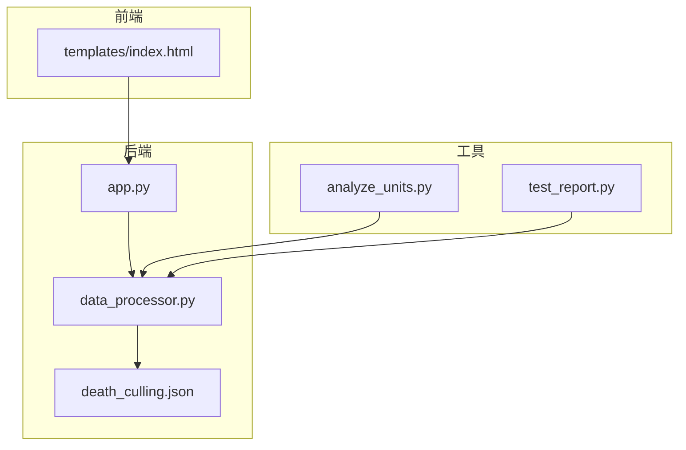
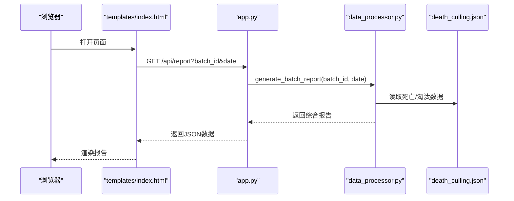
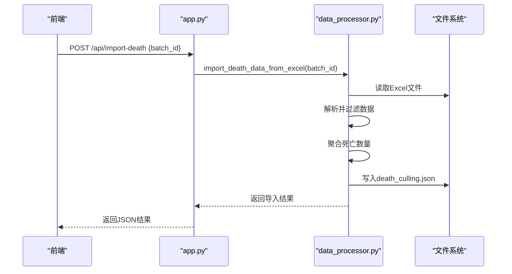
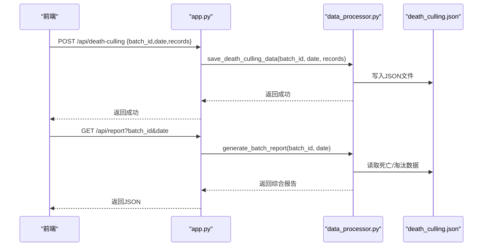

# JSON数据结构说明

<cite>
**本文档引用的文件**
- [death_culling.json](file://death_culling.json)
- [data_processor.py](file://data_processor.py)
- [app.py](file://app.py)
- [analyze_units.py](file://analyze_units.py)
- [test_report.py](file://test_report.py)
- [requirements.txt](file://requirements.txt)
- [templates/index.html](file://templates/index.html)
</cite>

## 目录
1. [简介](#简介)
2. [项目结构](#项目结构)
3. [核心组件](#核心组件)
4. [架构总览](#架构总览)
5. [详细组件分析](#详细组件分析)
6. [依赖分析](#依赖分析)
7. [性能考虑](#性能考虑)
8. [故障排除指南](#故障排除指南)
9. [结论](#结论)
10. [附录](#附录)

## 简介
本文件面向“猪场环控数据分析系统”，聚焦于“死亡淘汰数据”的JSON数据结构规范。文档从数据模型定义、字段含义、数据类型、业务规则、组织方式、嵌套结构、数组格式、JSON Schema定义、数据验证规则、实际样例、字段对照表、导入验证示例以及错误处理等方面进行全面阐述，帮助用户正确准备、校验与导入JSON数据，确保数据的完整性与一致性。

## 项目结构
该项目采用Python后端（Flask）+ 前端HTML模板的架构，围绕“批次”维度对环控数据与生产成绩进行深度分析。与死亡淘汰数据直接相关的核心文件如下：
- 后端服务：app.py 提供REST接口，调用 data_processor.py 的数据处理能力
- 数据处理：data_processor.py 负责读取/写入 death_culling.json，提供导入Excel为JSON、查询、保存等功能
- 示例数据：death_culling.json 展示了实际的JSON组织方式
- 工具脚本：analyze_units.py 展示了如何从Excel环境数据中提取单元信息；test_report.py 展示了如何生成并打印报告
- 前端模板：templates/index.html 展示了前端如何请求后端接口并渲染报告



图表来源
- [app.py:1-133](file://app.py#L1-L133)
- [data_processor.py:1-1559](file://data_processor.py#L1-L1559)
- [death_culling.json:1-27](file://death_culling.json#L1-L27)
- [templates/index.html:1-1983](file://templates/index.html#L1-L1983)

章节来源
- [app.py:1-133](file://app.py#L1-L133)
- [data_processor.py:1-1559](file://data_processor.py#L1-L1559)
- [death_culling.json:1-27](file://death_culling.json#L1-L27)
- [templates/index.html:1-1983](file://templates/index.html#L1-L1983)

## 核心组件
- 死亡淘汰JSON文件：存储按批次与日期组织的死亡/淘汰记录
- 数据处理器：负责读取/写入该JSON文件，支持从Excel导入、按日期查询、批量查询、保存更新
- Web接口：提供REST API用于前端调用，包括获取报告、趋势、深度分析、缓存清理等
- 前端模板：通过AJAX调用后端接口，渲染综合分析报告

章节来源
- [data_processor.py:148-236](file://data_processor.py#L148-L236)
- [app.py:104-124](file://app.py#L104-L124)

## 架构总览
后端通过Flask提供统一入口，前端通过AJAX请求后端接口，后端调用数据处理器读取/写入death_culling.json，最终返回结构化的分析报告。



图表来源
- [app.py:59-66](file://app.py#L59-L66)
- [data_processor.py:238-295](file://data_processor.py#L238-L295)
- [death_culling.json:1-27](file://death_culling.json#L1-L27)

## 详细组件分析

### 死亡淘汰JSON数据结构定义
- 文件位置：death_culling.json
- 组织方式：按批次ID（batch_id）分组，再按日期（YYYY-MM-DD）分组，最后为该日期下各单元的记录数组
- 结构层级：
  - 最外层：对象，键为批次ID字符串
  - 每个批次ID对应一个对象，键为日期字符串
  - 每个日期对应一个数组，数组元素为记录对象
- 记录对象字段：
  - date：字符串，记录日期（YYYY-MM-DD）
  - unit_name：字符串，单元名称（如“4-5”）
  - death_count：整数，当日死亡数量
  - culling_count：整数，当日淘汰数量
  - reason：字符串，死亡原因（如“苍白”、“胀气死”）

章节来源
- [death_culling.json:1-27](file://death_culling.json#L1-L27)

### 字段对照表
- 字段名：date
  - 类型：字符串
  - 含义：记录日期，格式为YYYY-MM-DD
  - 必填：是
  - 示例：2026-03-10
- 字段名：unit_name
  - 类型：字符串
  - 含义：单元编号，如“4-5”
  - 必填：是
  - 示例：4-6
- 字段名：death_count
  - 类型：整数
  - 含义：当日死亡数量
  - 必填：是
  - 示例：1
- 字段名：culling_count
  - 类型：整数
  - 含义：当日淘汰数量
  - 必填：是
  - 示例：0
- 字段名：reason
  - 类型：字符串
  - 含义：死亡原因描述
  - 必填：否（默认可为空或“未知”）
  - 示例：苍白

章节来源
- [death_culling.json:4-24](file://death_culling.json#L4-L24)

### 数据类型与业务规则
- 数据类型
  - batch_id：字符串（作为最外层键）
  - date：字符串（YYYY-MM-DD）
  - unit_name：字符串
  - death_count：整数
  - culling_count：整数
  - reason：字符串
- 业务规则
  - 同一日期同一单元的记录唯一性：由业务逻辑保证，若Excel导入，会按日期、单元、原因聚合死亡数量
  - 数值非负：death_count与culling_count应为非负整数
  - 日期格式：必须符合YYYY-MM-DD
  - 单元命名：建议与批次配置中的单元列表一致
  - 原因字段：建议使用统一的枚举值或标准化描述

章节来源
- [data_processor.py:165-223](file://data_processor.py#L165-L223)

### JSON Schema定义与数据验证规则
以下Schema基于上述字段定义与业务规则制定，用于校验JSON数据的完整性与一致性。Schema以文本形式给出，便于复制到校验工具中使用。

- 根对象
  - 类型：对象
  - 键：batch_id（字符串）
  - 值：对象
- 批次对象
  - 类型：对象
  - 键：date（字符串，YYYY-MM-DD）
  - 值：数组
- 记录数组
  - 类型：数组
  - 元素：对象
  - 对象必含字段：date、unit_name、death_count、culling_count
  - 对象可选字段：reason
- 字段约束
  - date：字符串，符合YYYY-MM-DD格式
  - unit_name：字符串，非空
  - death_count：整数，>=0
  - culling_count：整数，>=0
  - reason：字符串，建议非空且标准化

章节来源
- [death_culling.json:1-27](file://death_culling.json#L1-L27)
- [data_processor.py:165-223](file://data_processor.py#L165-L223)

### 实际JSON数据样本
以下为death_culling.json中的实际样例，展示完整结构与字段取值。

```json
{
  "20251218": {
    "2026-03-10": [
      {
        "date": "2026-03-10",
        "unit_name": "4-5",
        "death_count": 2,
        "culling_count": 0,
        "reason": "苍白"
      },
      {
        "date": "2026-03-10",
        "unit_name": "4-6",
        "death_count": 1,
        "culling_count": 0,
        "reason": "胀气死"
      },
      {
        "date": "2026-03-10",
        "unit_name": "4-7",
        "death_count": 1,
        "culling_count": 0,
        "reason": "苍白"
      }
    ]
  }
}
```

章节来源
- [death_culling.json:1-27](file://death_culling.json#L1-L27)

### 数据导入流程与验证示例
- Excel导入流程
  - 后端接口接收batch_id，读取对应批次目录下的“批次猪死亡导出-YYYYMMDD.xlsx”
  - 读取“批次猪死亡”工作表（跳过标题行），过滤出匹配批次号的记录
  - 从“栋舍”列提取单元号，从“单据日期”列提取日期，从“死亡原因”列提取原因
  - 按日期、单元、原因聚合死亡数量，生成记录数组
  - 将结果写入death_culling.json，覆盖同批次同日期的数据
- 导入验证要点
  - 文件存在性：检查Excel文件是否存在
  - 批次匹配：Excel中的批次名称需与配置一致
  - 列名与格式：确保“栋舍”“单据日期”“死亡原因”等列存在且格式正确
  - 聚合逻辑：相同日期/单元/原因的记录合并，死亡数量累加
  - 输出结果：返回导入是否成功、导入条数、错误信息



图表来源
- [app.py:116-124](file://app.py#L116-L124)
- [data_processor.py:165-223](file://data_processor.py#L165-L223)

章节来源
- [app.py:116-124](file://app.py#L116-L124)
- [data_processor.py:165-223](file://data_processor.py#L165-L223)

### 数据保存与查询接口
- 保存接口
  - 方法：POST /api/death-culling
  - 请求体：包含batch_id、date、records（记录数组）
  - 行为：将records写入death_culling.json对应位置
- 查询接口
  - 方法：GET /api/report 或 /api/dashboard
  - 参数：batch_id、date
  - 行为：读取death_culling.json中的死亡/淘汰数据，结合环境数据生成综合报告



图表来源
- [app.py:104-124](file://app.py#L104-L124)
- [app.py:59-66](file://app.py#L59-L66)
- [data_processor.py:225-236](file://data_processor.py#L225-L236)
- [data_processor.py:148-164](file://data_processor.py#L148-L164)

章节来源
- [app.py:104-124](file://app.py#L104-L124)
- [app.py:59-66](file://app.py#L59-L66)
- [data_processor.py:225-236](file://data_processor.py#L225-L236)
- [data_processor.py:148-164](file://data_processor.py#L148-L164)

### 错误处理与异常情况
- 文件不存在：导入Excel时若文件不存在，返回错误消息
- 批次不存在：导入时若批次配置缺失，返回错误消息
- 日期解析失败：Excel中的日期列若为空或格式不正确，跳过该记录
- 原因缺失：若原因为空，使用默认值“未知”
- 写入失败：保存JSON时若出现异常，返回异常信息
- 缓存一致性：每次导入/保存后清除缓存，确保后续请求读取最新数据

章节来源
- [data_processor.py:165-223](file://data_processor.py#L165-L223)
- [app.py:116-124](file://app.py#L116-L124)

## 依赖分析
- Python依赖
  - flask：Web框架
  - pandas：Excel读取与数据处理
  - openpyxl：Excel读取引擎
- 前端依赖
  - Chart.js：可视化图表
  - Bootstrap：UI样式（在模板中引用CDN）

章节来源
- [requirements.txt:1-4](file://requirements.txt#L1-L4)
- [templates/index.html:8-8](file://templates/index.html#L8-L8)

## 性能考虑
- 缓存机制：后端提供全局缓存与报告缓存，避免重复计算
- 数据清洗：提供通用的NaN/Inf清理函数，确保数值稳定性
- 批量处理：导入时按日期/单元/原因聚合，减少重复写入
- 前端渲染：使用Chart.js进行高效渲染，支持Tab切换与懒加载

章节来源
- [app.py:18-40](file://app.py#L18-L40)
- [data_processor.py:15-48](file://data_processor.py#L15-L48)

## 故障排除指南
- 导入失败
  - 检查Excel文件是否存在且路径正确
  - 确认批次名称与配置一致
  - 检查列名是否正确（栋舍、单据日期、死亡原因）
- 日期格式错误
  - 确保日期列格式为YYYY-MM-DD
  - 若Excel中日期为日期类型，需转换为字符串后再解析
- 原因字段为空
  - 导入逻辑会自动填充为“未知”，不影响整体导入
- 报告不更新
  - 调用缓存清理接口或重启服务，确保缓存失效
- JSON写入异常
  - 检查文件权限与磁盘空间
  - 确保JSON文件未被其他进程占用

章节来源
- [data_processor.py:165-223](file://data_processor.py#L165-L223)
- [app.py:126-129](file://app.py#L126-L129)

## 结论
本文档提供了“死亡淘汰数据”的完整JSON数据结构规范，明确了字段定义、数据类型、业务规则、组织方式、导入流程与验证规则，并给出了Schema与实际样例。通过严格的字段约束与导入验证，可确保数据的完整性与一致性；结合后端缓存与前端可视化，能够高效地生成综合分析报告，辅助生产管理决策。

## 附录
- 相关文件
  - [death_culling.json](file://death_culling.json)
  - [data_processor.py](file://data_processor.py)
  - [app.py](file://app.py)
  - [templates/index.html](file://templates/index.html)
  - [requirements.txt](file://requirements.txt)
  - [analyze_units.py](file://analyze_units.py)
  - [test_report.py](file://test_report.py)