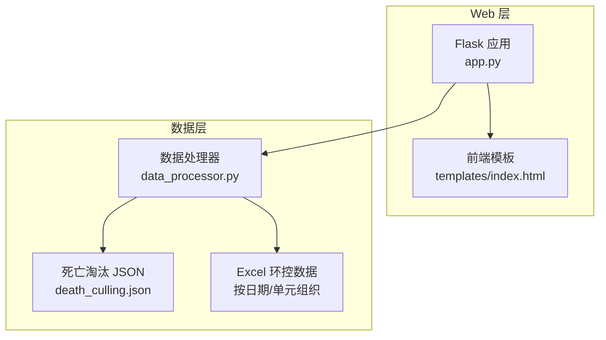
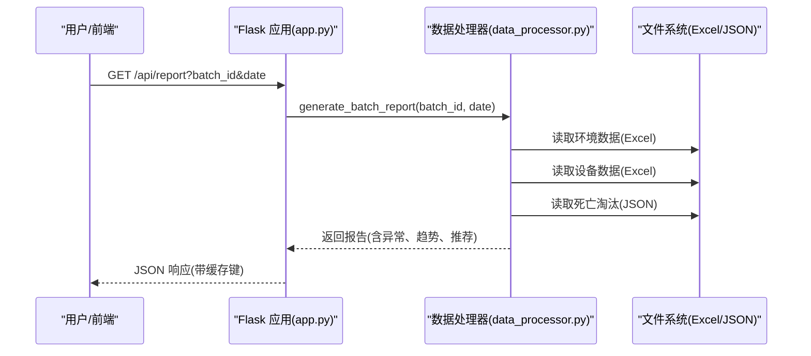
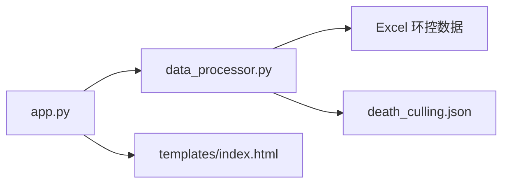

# 数据模型与结构

<cite>
**本文引用的文件**
- [环控数据导出字段清单.md](file://20251218/环控数据导出字段清单.md)
- [death_culling.json](file://death_culling.json)
- [app.py](file://app.py)
- [data_processor.py](file://data_processor.py)
- [analyze_units.py](file://analyze_units.py)
- [index.html](file://templates/index.html)
</cite>

## 目录
1. [简介](#简介)
2. [项目结构](#项目结构)
3. [核心组件](#核心组件)
4. [架构总览](#架构总览)
5. [详细组件分析](#详细组件分析)
6. [依赖关系分析](#依赖关系分析)
7. [性能考量](#性能考量)
8. [故障排查指南](#故障排查指南)
9. [结论](#结论)
10. [附录](#附录)

## 简介
本文件面向“猪场环控数据分析系统”，提供完整数据模型与结构说明，涵盖：
- Excel 环控数据的标准格式与字段定义（温度、湿度、CO2、压差等）
- JSON 死亡淘汰数据结构与业务规则
- 数据字典与字段对照表
- 数据质量检查规则、缺失值处理策略、异常值识别方法
- 实际数据样本与导入验证示例，帮助用户正确准备与导入数据

## 项目结构
系统由 Web 应用与数据处理器组成，负责从 Excel 导入环境数据、从 JSON 导入死亡淘汰数据，并生成批次级深度分析报告。

图表来源
- [app.py:1-133](file://app.py#L1-L133)
- [data_processor.py:54-1559](file://data_processor.py#L54-L1559)
- [index.html:1-800](file://templates/index.html#L1-L800)

章节来源
- [app.py:1-133](file://app.py#L1-L133)
- [data_processor.py:54-1559](file://data_processor.py#L54-L1559)
- [index.html:1-800](file://templates/index.html#L1-L800)

## 核心组件
- Web 应用：提供批号、日期查询接口，返回缓存化报告与趋势数据；支持导入死亡淘汰数据。
- 数据处理器：解析 Excel 环控数据与设备配置，构建单位级与批次级分析，输出异常检测、组合风险、推荐措施等。
- 死亡淘汰数据：支持直接写入 JSON 或从 Excel 导入，按日期聚合统计。

章节来源
- [app.py:42-133](file://app.py#L42-L133)
- [data_processor.py:148-236](file://data_processor.py#L148-L236)
- [death_culling.json:1-27](file://death_culling.json#L1-L27)

## 架构总览
系统通过 Flask 提供 REST 接口，数据处理器封装了对 Excel 的读取、清洗、聚合与分析逻辑，最终输出结构化的分析结果。

图表来源
- [app.py:59-84](file://app.py#L59-L84)
- [data_processor.py:238-295](file://data_processor.py#L238-L295)

## 详细组件分析

### Excel 环控数据模型（标准格式与字段定义）
系统支持多工作表的 Excel 文件，按“单元信息”主表与其他明细表组织。以下为关键字段与业务语义说明（单位、类型、必填、说明）。

- 单元信息（主表）
  - 装猪数量：整数，必填，当前单元装载的猪只数量
  - 猪只体重(Kg)：浮点数，必填，猪只平均体重
  - 日龄：整数，必填，猪只当前日龄
  - 目标温度(℃)：浮点数，必填，环控器设定的目标温度
  - 目标湿度(%)：浮点数，必填，环控器设定的目标湿度
  - 通风季节：字符串，必填，冬季/夏季/过渡季
  - 通风模式：字符串，必填，横向通风/纵向通风
  - 工作模式：字符串，必填，自动/手动
  - 舍内温度(℃)：浮点数，必填，当日舍内平均温度
  - 舍内湿度(%)：浮点数，必填，当日舍内平均湿度
  - 二氧化碳均值(ppm)：浮点数，必填，当日CO2平均浓度
  - 压差均值(pa)：浮点数，必填，舍内外压差平均值
  - 通风等级：整数，必填，当前通风等级
  - 料肉比：浮点数，否，生产性能指标
  - 日增重(Kg)：浮点数，否，日增重
  - 日采食量(Kg)：浮点数，否，日采食量
  - 时间：日期时间，必填，数据记录时间（每条记录一个时间点）

- 温度明细
  - 温度传感器1(℃) 至 温度传感器N(℃)：浮点数，必填，对应温度传感器数据
  - 时间：日期时间，必填，对应时间点

- 湿度明细
  - 湿度传感器1 至 湿度传感器N：浮点数，必填，对应湿度传感器数据（%）
  - 时间：日期时间，必填，对应时间点

- 压差明细
  - 压差均值(pa)：浮点数，必填，舍内外压差平均值
  - 时间：日期时间，必填，对应时间点

- 二氧化碳
  - 二氧化碳传感器(ppm)：浮点数，必填，CO2浓度数据
  - 时间：日期时间，必填，对应时间点

- 室外数据
  - 温度：浮点数，必填，室外环境温度（℃）
  - 湿度：浮点数，必填，室外环境湿度（%）
  - 时间：日期时间，必填，对应时间点

- 变频风机
  - 风机组1 至 风机组N：字符串，必填，格式为 百分比|类型|模式，如 “75%|变频风机|自动”
  - 通风等级：整数，必填，当前通风等级
  - 时间：日期时间，必填，对应时间点

- 定速风机
  - 风机组1 至 风机组N：字符串，必填，格式为 状态|类型，如 “开|定速风机”
  - 时间：日期时间，必填，对应时间点

- 告警阈值
  - 温度低限阈值：浮点数，必填，温度告警下限
  - 温度高限阈值：浮点数，必填，温度告警上限
  - 湿度高限阈值：浮点数，必填，湿度告警上限
  - 二氧化碳高限阈值：浮点数，必填，CO2告警上限

- 设备数据（设备信息）
  - 设备型号：字符串，必填
  - 设备IP地址：字符串，必填
  - 固件版本：字符串，必填
  - 内存使用率：整数，必填，设备内存使用百分比
  - 累计运行时长：字符串，必填
  - 安装日期：字符串，必填

- 设备安装配置
  - 变频风机安装情况：字符串，必填，已安装/未安装
  - 定速风机安装情况：字符串，必填，已安装/未安装
  - 进风幕帘安装情况：字符串，必填，已安装/未安装
  - 水帘安装情况：字符串，必填，已安装/未安装
  - 加热器安装情况：字符串，否，已安装/未安装

- 传感器配置
  - 温度传感器实际安装：整数，必填
  - 湿度传感器实际安装：整数，必填
  - CO2传感器实际安装：整数，必填

- 进风幕帘配置
  - 当前开度：浮点数，必填，进风幕帘当前开度（%）
  - 目标开度：浮点数，必填，进风幕帘目标开度（%）

- 水帘配置
  - 水帘工作模式：字符串，必填，手动/自动/关闭
  - 工作状态：字符串，必填，开启/关闭

数据导出要求
- 时间粒度：建议按 1 分钟 间隔导出
- 文件命名：{场名}{舍名} {日期} 00_00_00 至 {日期} 23_59_59 环境数据.xlsx
- 文件命名：{场名}{舍名} {日期} 00_00_00 至 {日期} 23_59_59 设备数据.xlsx
- 编码：UTF-8
- 空值处理：空值请留空，不要填写 "NA"、"null" 等字符串

章节来源
- [环控数据导出字段清单.md:3-140](file://20251218/环控数据导出字段清单.md#L3-L140)

### JSON 死亡淘汰数据结构
系统支持两种输入方式：
- 直接 POST JSON 到 /api/death-culling
- 从 Excel 导入到 death_culling.json

字段定义
- batch_id：字符串，批次标识
- date：字符串，YYYY-MM-DD
- records：数组，每条记录包含
  - date：字符串，YYYY-MM-DD
  - unit_name：字符串，单元名称（如 4-5）
  - death_count：整数，当日死亡头数
  - culling_count：整数，当日淘汰头数
  - reason：字符串，死亡原因（如 苍白、胀气死）

业务规则
- 同一批次、同一天的记录按单元+原因聚合，死亡头数累加
- 若 Excel 导入，系统会根据“栋舍”列提取单元编号，按单据日期拆分日期

章节来源
- [death_culling.json:1-27](file://death_culling.json#L1-L27)
- [data_processor.py:148-236](file://data_processor.py#L148-L236)

### 数据质量检查规则与缺失值处理策略
- 缺失值处理
  - Excel 中空单元保持为空，不填充特殊字符串
  - 数值列使用 to_numeric(errors='coerce') 转换，NaN 将被丢弃或在聚合时忽略
  - 结果序列化时，NaN/Inf 将被清理为 null

- 异常值识别方法
  - 动态阈值：基于日龄动态计算温度与CO2阈值，考虑不同阶段猪只耐受性差异
  - 统计阈值：温度日内范围、湿度偏离目标、CO2高于阈值比例、压差负压占比与波动性
  - 设备逻辑异常：变频风机全天0%运行、温度超目标且风机未满负荷、告警阈值不一致等
  - 传感器健康：在线传感器数量不足、配置与实际不符
  - 组合风险：多参数同时超阈值、高温高湿、高湿低通风等复合场景

- 数据一致性
  - 同批次单元间告警阈值应统一
  - 通风模式应保持一致
  - 设备安装配置与实际在线传感器数量匹配

章节来源
- [data_processor.py:15-39](file://data_processor.py#L15-L39)
- [data_processor.py:639-826](file://data_processor.py#L639-L826)
- [data_processor.py:1194-1249](file://data_processor.py#L1194-L1249)

### 实际数据样本与导入验证示例
- 死亡淘汰样例
  - 示例路径：[death_culling.json:1-27](file://death_culling.json#L1-L27)
  - 字段对照：date、unit_name、death_count、culling_count、reason

- Excel 环控样例（单元信息）
  - 示例路径：[analyze_units.py:12-34](file://analyze_units.py#L12-L34)
  - 字段对照：装猪数量、猪只体重(Kg)、日龄、目标温度(℃)、目标湿度(%)、通风季节、通风模式、工作模式、舍内温度(℃)、舍内湿度(%)、二氧化碳均值(ppm)、压差均值(pa)、通风等级、料肉比、日增重(Kg)、日采食量(Kg)、时间

- Excel 导入流程（服务端）
  - 接口：POST /api/import-death
  - 输入：batch_id（默认 20251218）
  - 处理：读取 Excel 的“批次猪死亡”工作表，筛选批次名称、提取栋舍、拆分日期、按日期+单元+原因聚合死亡数量
  - 输出：导入结果（成功/失败、导入条数、消息）

章节来源
- [death_culling.json:1-27](file://death_culling.json#L1-L27)
- [analyze_units.py:12-34](file://analyze_units.py#L12-L34)
- [data_processor.py:165-223](file://data_processor.py#L165-L223)

## 依赖关系分析
- Web 应用依赖数据处理器进行数据读取与分析
- 数据处理器依赖 pandas、numpy、openpyxl 读取 Excel，json 处理 JSON
- 前端模板用于展示分析结果与交互

图表来源
- [app.py:1-133](file://app.py#L1-L133)
- [data_processor.py:1-11](file://data_processor.py#L1-L11)
- [index.html:1-800](file://templates/index.html#L1-L800)

章节来源
- [app.py:1-133](file://app.py#L1-L133)
- [data_processor.py:1-11](file://data_processor.py#L1-L11)
- [index.html:1-800](file://templates/index.html#L1-L800)

## 性能考量
- 缓存策略：应用层与处理器层均实现缓存，提升重复请求响应速度
- 数据切片：趋势图按约 10 分钟步长切片，避免图表渲染压力
- 并行读取：Excel 工作表读取使用缓存，避免重复 IO
- NaN/Inf 清理：序列化前统一清理，避免前端渲染异常

章节来源
- [app.py:15-40](file://app.py#L15-L40)
- [data_processor.py:12-48](file://data_processor.py#L12-L48)
- [data_processor.py:15-39](file://data_processor.py#L15-L39)

## 故障排查指南
- Excel 导入失败
  - 检查文件命名是否符合要求（包含日期范围）
  - 确认“批次猪死亡”工作表存在且第二行为表头
  - 确认批次名称与 batch_config.json 中的 batch_name 匹配
- 死亡淘汰导入后未显示
  - 确认 POST /api/death-culling 成功
  - 确认 JSON 结构与字段类型正确
- 报告为空或异常
  - 检查 Excel 是否包含所需工作表与字段
  - 确认时间列格式正确，数值列无异常字符串
  - 查看告警阈值是否合理（如 CO2 高限是否过高）

章节来源
- [data_processor.py:165-223](file://data_processor.py#L165-L223)
- [data_processor.py:225-236](file://data_processor.py#L225-L236)

## 结论
本系统通过标准化的 Excel 字段与严格的异常检测规则，实现了对猪场环控数据的自动化分析与可视化呈现。建议用户严格遵循字段清单与导入规范，确保数据质量与分析准确性。

## 附录

### 数据字典与字段对照表
- 环控数据（单元信息）
  - 字段：装猪数量、猪只体重(Kg)、日龄、目标温度(℃)、目标湿度(%)、通风季节、通风模式、工作模式、舍内温度(℃)、舍内湿度(%)、二氧化碳均值(ppm)、压差均值(pa)、通风等级、料肉比、日增重(Kg)、日采食量(Kg)、时间
  - 类型：整数/浮点数/字符串/日期时间
  - 必填：除料肉比、日增重、日采食量外均为必填

- 环控数据（明细与设备）
  - 温度明细：温度传感器1(℃) 至 N(℃)，时间
  - 湿度明细：湿度传感器1 至 N，时间
  - 压差明细：压差均值(pa)，时间
  - 二氧化碳：二氧化碳传感器(ppm)，时间
  - 室外数据：温度、湿度，时间
  - 变频风机：风机组1 至 N，通风等级，时间
  - 定速风机：风机组1 至 N，时间
  - 告警阈值：温度低限阈值、温度高限阈值、湿度高限阈值、二氧化碳高限阈值

- 设备数据
  - 设备信息：设备型号、设备IP地址、固件版本、内存使用率、累计运行时长、安装日期
  - 设备安装配置：变频风机安装情况、定速风机安装情况、进风幕帘安装情况、水帘安装情况、加热器安装情况
  - 传感器配置：温度传感器实际安装、湿度传感器实际安装、CO2传感器实际安装
  - 进风幕帘配置：当前开度、目标开度
  - 水帘配置：水帘工作模式、工作状态

- 死亡淘汰数据（JSON）
  - 字段：batch_id、date、records[]
  - records[]：date、unit_name、death_count、culling_count、reason

章节来源
- [环控数据导出字段清单.md:3-140](file://20251218/环控数据导出字段清单.md#L3-L140)
- [death_culling.json:1-27](file://death_culling.json#L1-L27)