# 数据处理引擎

<cite>
**本文档引用的文件**
- [data_processor.py](file://data_processor.py)
- [app.py](file://app.py)
- [analyze_units.py](file://analyze_units.py)
- [test_report.py](file://test_report.py)
- [requirements.txt](file://requirements.txt)
- [death_culling.json](file://death_culling.json)
- [templates/index.html](file://templates/index.html)
</cite>

## 目录
1. [简介](#简介)
2. [项目结构](#项目结构)
3. [核心组件](#核心组件)
4. [架构概览](#架构概览)
5. [详细组件分析](#详细组件分析)
6. [依赖关系分析](#依赖关系分析)
7. [性能考虑](#性能考虑)
8. [故障排除指南](#故障排除指南)
9. [结论](#结论)
10. [附录](#附录)

## 简介

数据处理引擎是一个专为育肥猪养殖环境监控设计的数据分析系统，基于Python开发，集成了Flask Web服务框架。该系统的核心是DataProcessor类，负责处理和分析来自Excel文件的环境监控数据，提供深度的环境质量评估、设备运行分析和生产性能关联分析。

系统的主要功能包括：
- 批次级别的环境数据批量处理
- 单元级深度分析报告生成
- 设备运行状态监控和异常检测
- 死亡数据分析与环境因素关联
- 实时趋势数据可视化支持
- 智能化风险评估和建议生成

## 项目结构

该项目采用模块化的文件组织方式，主要包含以下核心文件：

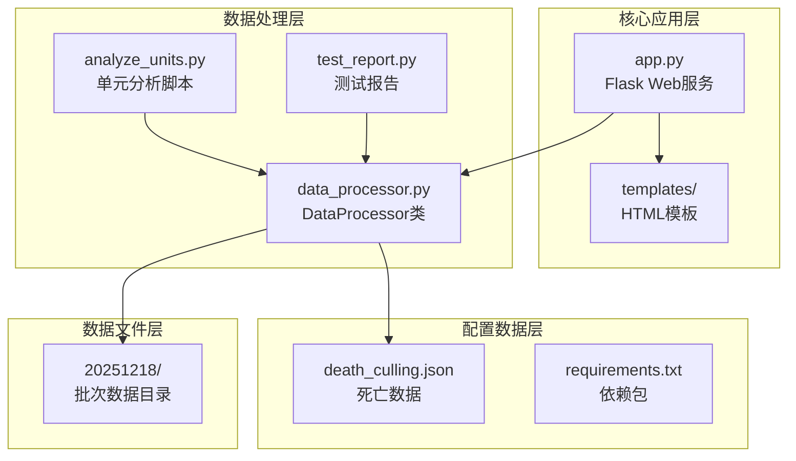

**图表来源**
- [app.py:1-133](file://app.py#L1-L133)
- [data_processor.py:1-1559](file://data_processor.py#L1-L1559)

**章节来源**
- [app.py:1-133](file://app.py#L1-L133)
- [data_processor.py:1-1559](file://data_processor.py#L1-L1559)
- [requirements.txt:1-4](file://requirements.txt#L1-L4)

## 核心组件

### DataProcessor类架构

DataProcessor是整个系统的核心类，采用面向对象设计，提供了完整的数据处理流水线：

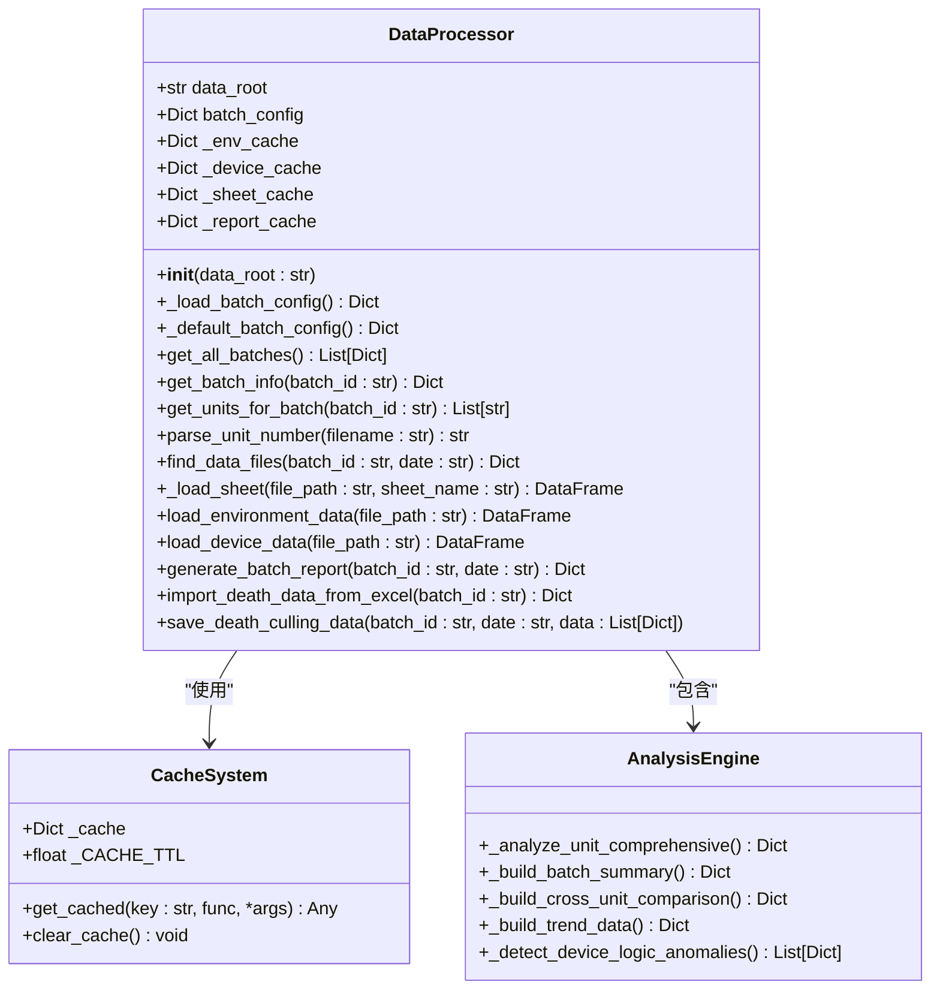

**图表来源**
- [data_processor.py:54-1559](file://data_processor.py#L54-L1559)

### 缓存系统设计

系统实现了多层次的缓存机制来优化性能：

1. **全局缓存**：用于存储计算结果和中间数据
2. **Excel表缓存**：缓存已加载的Excel表格数据
3. **报告缓存**：缓存完整的分析报告
4. **应用级缓存**：在Web服务中实现HTTP响应缓存

**章节来源**
- [data_processor.py:12-53](file://data_processor.py#L12-L53)
- [app.py:15-40](file://app.py#L15-L40)

## 架构概览

系统采用分层架构设计，从底层的数据访问到顶层的用户界面：

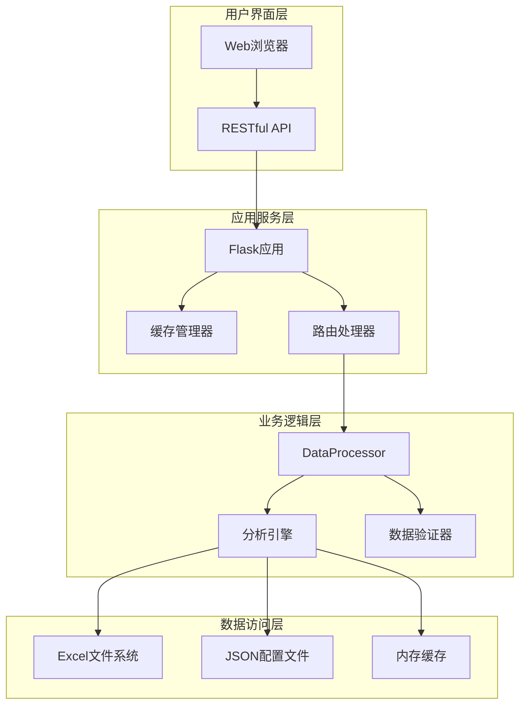

**图表来源**
- [app.py:1-133](file://app.py#L1-L133)
- [data_processor.py:54-1559](file://data_processor.py#L54-L1559)

## 详细组件分析

### 初始化流程

DataProcessor的初始化过程包含多个关键步骤：

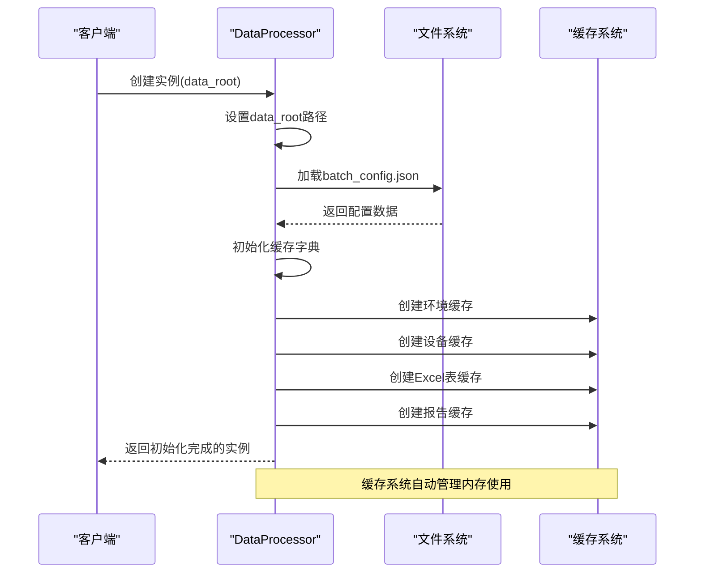

**图表来源**
- [data_processor.py:55-62](file://data_processor.py#L55-L62)

### 数据加载和缓存机制

系统实现了智能的数据加载和缓存策略：

#### Excel文件解析流程

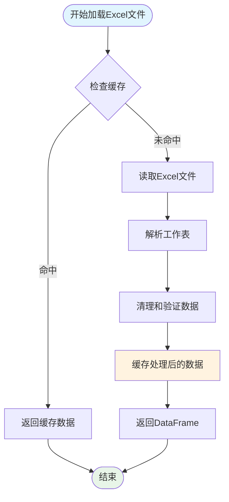

**图表来源**
- [data_processor.py:130-141](file://data_processor.py#L130-L141)

#### 内存缓存策略

系统采用LRU-like的缓存淘汰策略，通过TTL（生存时间）机制管理缓存生命周期：

**章节来源**
- [data_processor.py:130-141](file://data_processor.py#L130-L141)
- [data_processor.py:40-48](file://data_processor.py#L40-L48)

### 批处理配置管理系统

批处理配置管理是系统的核心功能之一，负责管理不同批次的养殖数据：

#### 配置文件结构

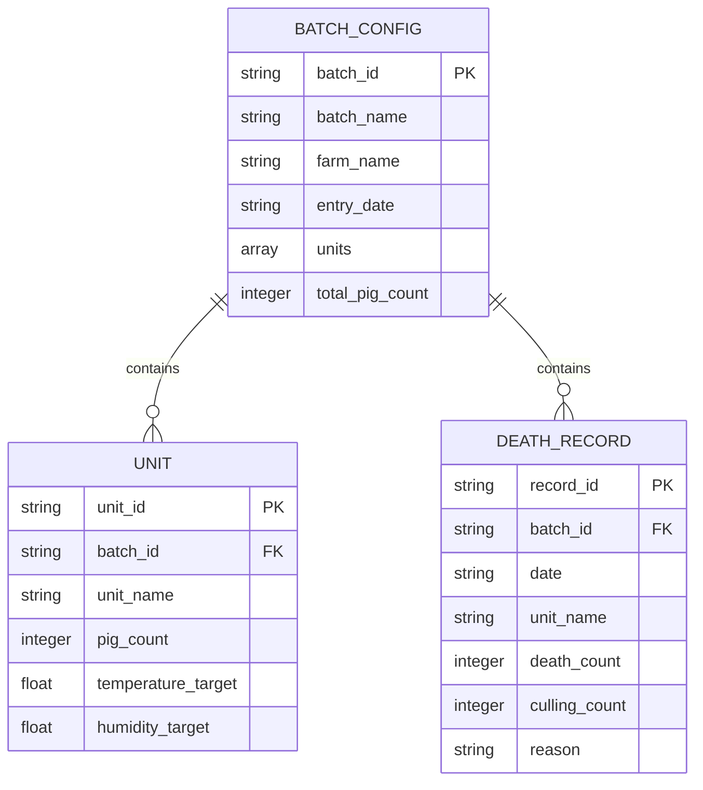

**图表来源**
- [data_processor.py:70-82](file://data_processor.py#L70-L82)
- [death_culling.json:1-27](file://death_culling.json#L1-L27)

#### 单元文件查找和匹配算法

系统实现了智能的文件匹配算法来识别和关联相关的Excel文件：

**章节来源**
- [data_processor.py:99-128](file://data_processor.py#L99-L128)

### 数据处理核心算法

#### 环境数据分析算法

系统实现了复杂的环境数据分析算法，包括：

1. **动态阈值计算**：根据猪只日龄动态调整环境参数的阈值
2. **传感器健康分析**：评估传感器的在线状态和覆盖率
3. **异常检测**：基于统计学方法识别环境异常
4. **风险评分**：综合多种因素计算风险等级

#### 设备运行分析算法

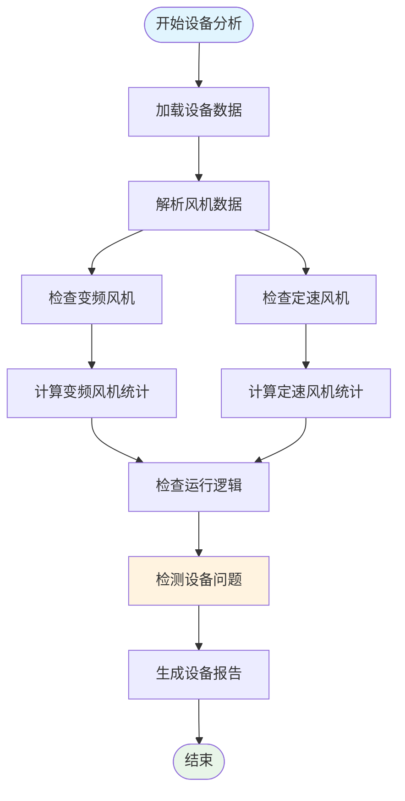

**图表来源**
- [data_processor.py:494-609](file://data_processor.py#L494-L609)

**章节来源**
- [data_processor.py:865-914](file://data_processor.py#L865-L914)
- [data_processor.py:1194-1249](file://data_processor.py#L1194-L1249)

### 报告生成系统

系统提供多层次的报告生成能力：

#### 综合报告结构

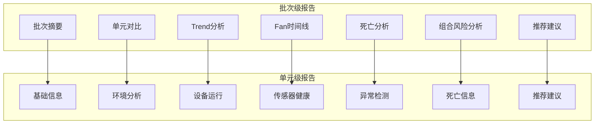

**图表来源**
- [data_processor.py:238-295](file://data_processor.py#L238-L295)

**章节来源**
- [data_processor.py:238-295](file://data_processor.py#L238-L295)

## 依赖关系分析

### 外部依赖

系统依赖于以下关键Python库：

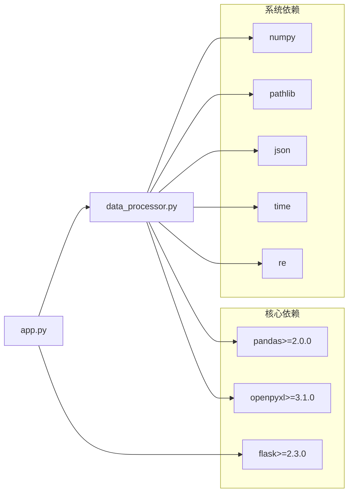

**图表来源**
- [requirements.txt:1-4](file://requirements.txt#L1-L4)
- [data_processor.py:1-10](file://data_processor.py#L1-L10)

### 内部模块依赖

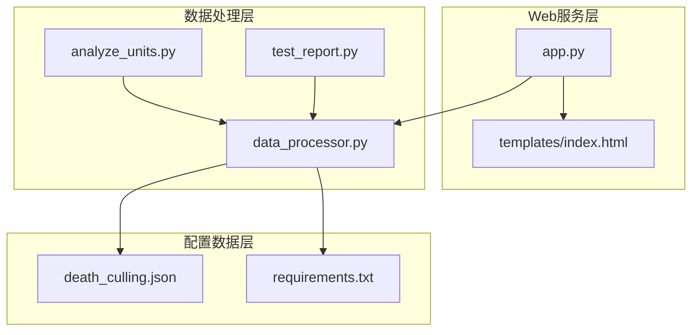

**图表来源**
- [app.py:1-133](file://app.py#L1-L133)
- [data_processor.py:1-1559](file://data_processor.py#L1-L1559)

**章节来源**
- [requirements.txt:1-4](file://requirements.txt#L1-L4)

## 性能考虑

### 缓存优化策略

系统实现了多层次的缓存优化来提升性能：

1. **Excel文件缓存**：避免重复读取相同的Excel文件
2. **Pandas DataFrame缓存**：缓存解析后的数据结构
3. **报告缓存**：缓存完整的分析报告结果
4. **应用级缓存**：在Web服务中缓存HTTP响应

### 内存管理

系统采用智能的内存管理策略：

- **TTL机制**：自动清理过期缓存数据
- **缓存大小限制**：防止内存无限增长
- **延迟加载**：按需加载数据，减少初始内存占用

### 并发处理

Web服务支持并发请求处理，通过以下机制保证性能：

- **异步缓存更新**：后台更新缓存而不阻塞请求
- **连接池管理**：复用数据库连接（如果使用）
- **静态资源缓存**：浏览器端缓存静态资源

## 故障排除指南

### 常见问题诊断

#### Excel文件读取失败

**症状**：系统无法读取Excel文件，返回空DataFrame

**可能原因**：
1. 文件路径错误
2. Excel文件损坏
3. 缺少openpyxl库
4. 文件被其他程序占用

**解决方案**：
1. 验证文件路径是否正确
2. 检查Excel文件完整性
3. 确认openpyxl库已安装
4. 关闭占用文件的程序

#### 数据解析错误

**症状**：环境数据解析出现异常

**可能原因**：
1. Excel工作表名称不匹配
2. 数据格式不符合预期
3. 缺少必要的列

**解决方案**：
1. 检查Excel文件结构
2. 验证数据格式
3. 确认所有必需列都存在

#### 缓存相关问题

**症状**：缓存数据过期或显示错误

**可能原因**：
1. TTL设置不当
2. 缓存键冲突
3. 内存不足

**解决方案**：
1. 调整TTL参数
2. 检查缓存键生成逻辑
3. 清理缓存或增加内存

**章节来源**
- [data_processor.py:138-140](file://data_processor.py#L138-L140)
- [app.py:126-129](file://app.py#L126-L129)

### 错误处理机制

系统实现了完善的错误处理机制：

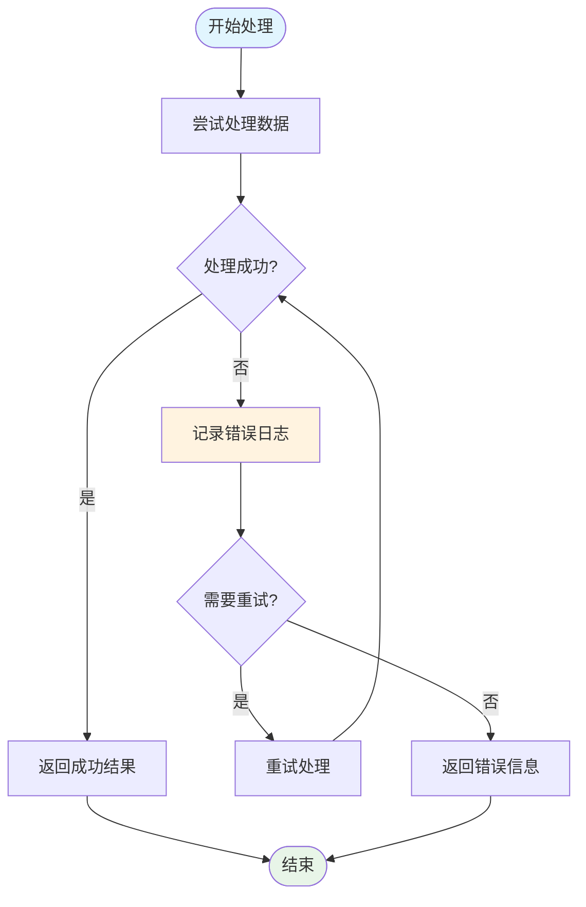

**图表来源**
- [data_processor.py:138-140](file://data_processor.py#L138-L140)

## 结论

数据处理引擎(DataProcessor类)是一个功能完整、架构清晰的养殖环境数据分析系统。其主要特点包括：

### 技术优势

1. **模块化设计**：采用面向对象设计，职责分离明确
2. **智能缓存**：多层次缓存机制显著提升性能
3. **灵活扩展**：易于添加新的分析算法和数据源
4. **错误处理**：完善的异常处理和恢复机制

### 应用价值

1. **决策支持**：为养殖管理提供数据驱动的决策依据
2. **风险预警**：提前发现环境和设备问题
3. **成本优化**：通过数据分析优化养殖效率
4. **质量保证**：确保养殖环境符合标准要求

### 发展建议

1. **性能监控**：添加详细的性能指标监控
2. **扩展性增强**：支持更多类型的传感器数据
3. **机器学习集成**：引入预测性分析功能
4. **移动端支持**：开发移动应用版本

## 附录

### 使用示例

#### 基本数据导入

```python
# 创建DataProcessor实例
processor = DataProcessor('./data')

# 生成批次报告
report = processor.generate_batch_report('20251218', '2026-03-10')

# 访问特定单元数据
unit_reports = report['unit_reports']
```

#### 死亡数据分析

```python
# 导入死亡数据
result = processor.import_death_data_from_excel('20251218')
print(f"导入结果: {result}")

# 获取死亡数据
death_records = processor.get_death_culling_data('20251218', '2026-03-10')
```

#### Web服务集成

```python
# 启动Flask应用
from app import app
app.run(debug=True, host='0.0.0.0', port=5000)
```

### 最佳实践

1. **数据质量**：确保Excel文件结构规范
2. **缓存管理**：定期清理过期缓存数据
3. **错误监控**：建立完善的日志记录机制
4. **性能优化**：根据数据量调整缓存策略
5. **安全考虑**：验证文件输入和权限控制