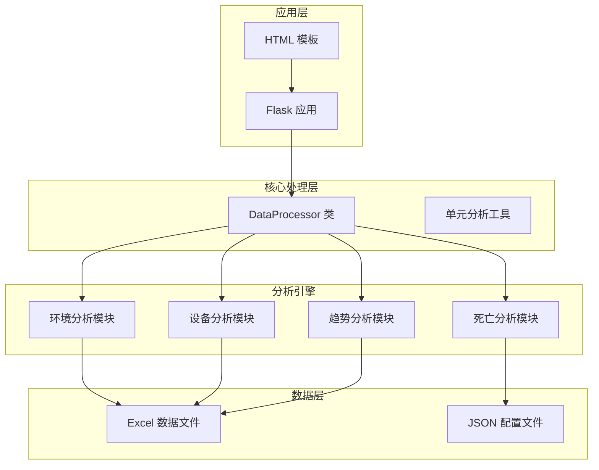
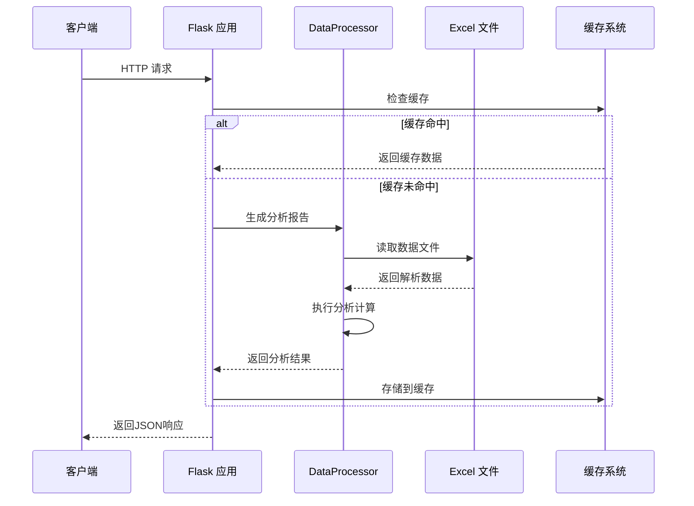
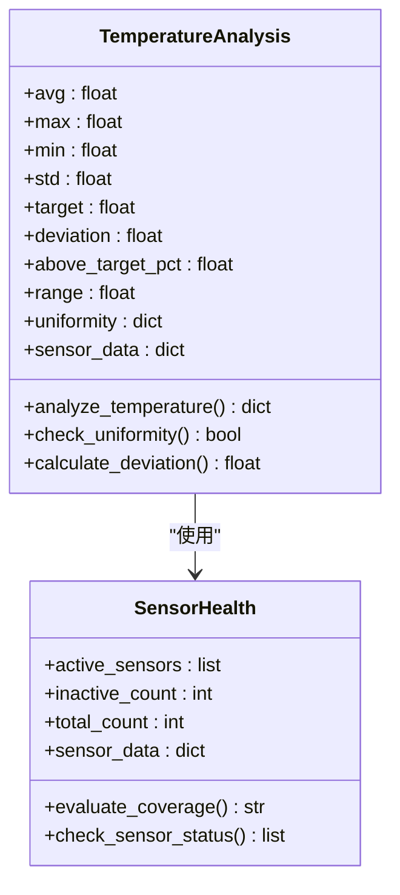
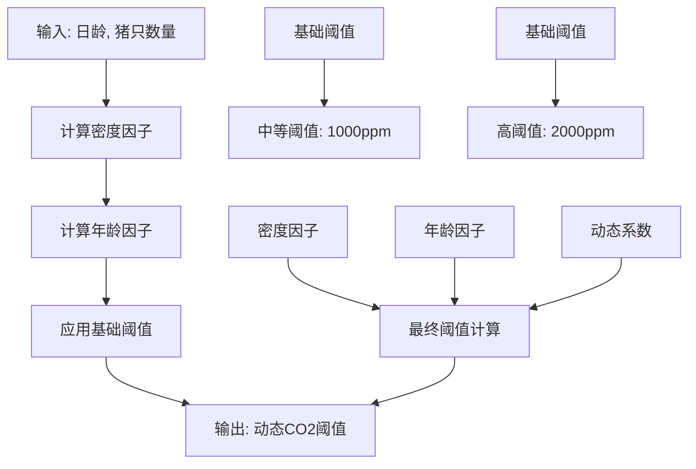
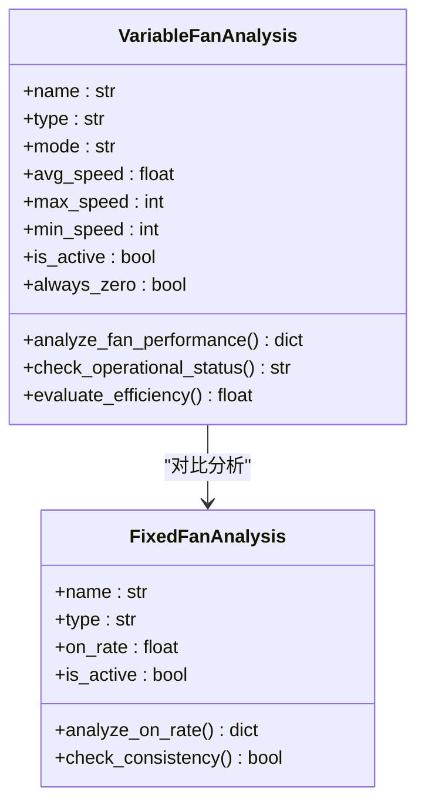
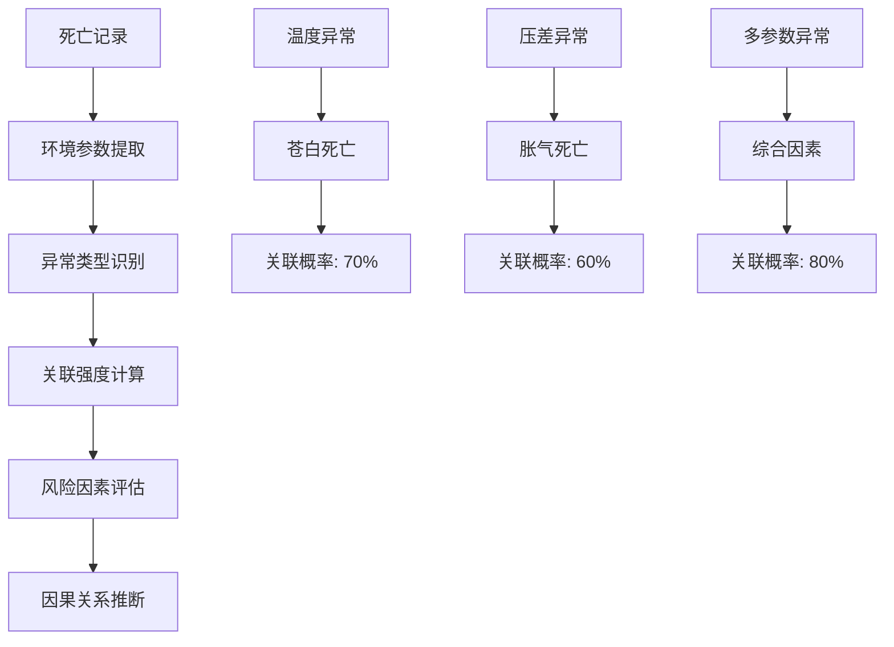
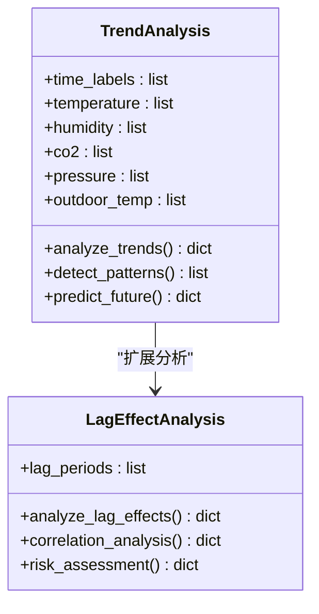
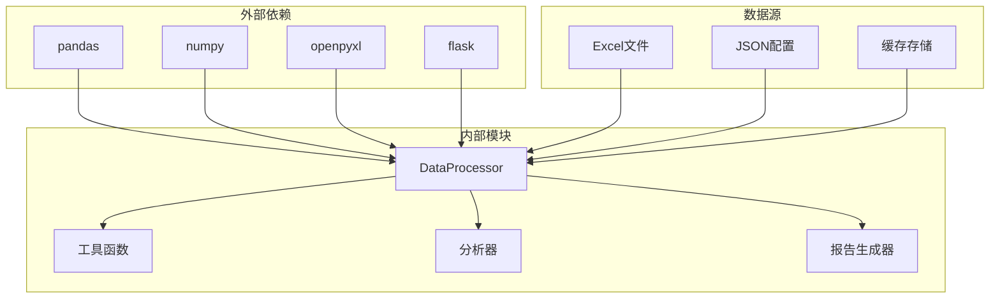

# 核心功能模块

<cite>
**本文档引用的文件**
- [data_processor.py](file://data_processor.py)
- [app.py](file://app.py)
- [analyze_units.py](file://analyze_units.py)
- [test_report.py](file://test_report.py)
- [death_culling.json](file://death_culling.json)
- [index.html](file://templates/index.html)
</cite>

## 目录
1. [简介](#简介)
2. [项目结构](#项目结构)
3. [核心组件](#核心组件)
4. [架构概览](#架构概览)
5. [详细组件分析](#详细组件分析)
6. [依赖关系分析](#依赖关系分析)
7. [性能考虑](#性能考虑)
8. [故障排除指南](#故障排除指南)
9. [结论](#结论)

## 简介

猪场环控数据分析系统是一个专为育肥猪生产设计的智能分析平台，旨在通过整合环境数据、设备运行状态和生产数据，提供全面的环控质量评估和优化建议。该系统的核心是DataProcessor类，它负责处理来自Excel文件的数据，执行复杂的分析计算，并生成可操作的洞察报告。

系统主要功能包括：
- 环境数据分析（温度、湿度、CO2、压差）
- 设备运行分析（风机状态、设备配置检查）
- 死亡淘汰关联分析
- 趋势预测分析
- 组合风险评估

## 项目结构

该项目采用简洁的模块化架构，主要由以下组件构成：



**图表来源**
- [app.py:1-133](file://app.py#L1-L133)
- [data_processor.py:54-1559](file://data_processor.py#L54-L1559)

**章节来源**
- [app.py:1-133](file://app.py#L1-L133)
- [data_processor.py:54-1559](file://data_processor.py#L54-L1559)

## 核心组件

### DataProcessor 类架构

DataProcessor 是整个系统的核心，采用面向对象设计，封装了所有数据分析逻辑。该类具有以下关键特性：

#### 主要职责
- **数据解析**：从Excel文件中提取和解析环境、设备、死亡等多类型数据
- **预处理**：清洗数据、处理缺失值、标准化格式
- **分析计算**：执行统计分析、异常检测、趋势预测
- **报告生成**：构建多层次的分析报告和可视化数据

#### 设计模式
- **工厂模式**：用于创建不同类型的分析器实例
- **策略模式**：针对不同类型的数据采用不同的处理策略
- **缓存模式**：实现多级缓存机制提升性能

**章节来源**
- [data_processor.py:54-1559](file://data_processor.py#L54-L1559)

## 架构概览

系统采用分层架构设计，确保各组件职责清晰、耦合度低：



**图表来源**
- [app.py:32-41](file://app.py#L32-L41)
- [data_processor.py:238-295](file://data_processor.py#L238-L295)

### 数据流架构

```mermaid
flowchart TD
A[原始Excel数据] --> B[数据加载器]
B --> C[数据清洗器]
C --> D[特征提取器]
D --> E[统计分析器]
E --> F[异常检测器]
F --> G[报告生成器]
H[缓存系统] <- --> B
I[配置文件] --> D
J[死亡数据] --> F
G --> K[JSON输出]
G --> L[HTML模板]
G --> M[API响应]
```

**图表来源**
- [data_processor.py:130-146](file://data_processor.py#L130-L146)
- [data_processor.py:315-838](file://data_processor.py#L315-L838)

## 详细组件分析

### 环境数据分析模块

环境数据分析是系统的核心功能之一，负责监控和评估猪舍内的环境条件。

#### 温度分析
温度分析包含多个维度的指标计算：



**图表来源**
- [data_processor.py:352-401](file://data_processor.py#L352-L401)
- [data_processor.py:612-637](file://data_processor.py#L612-L637)

#### 湿度分析
湿度分析采用动态阈值策略，根据猪只日龄调整目标值：

| 日龄阶段 | 目标湿度范围 | 允许偏差 |
|---------|-------------|---------|
| ≤30天 | 65-75% | ±5% |
| 31-60天 | 60-70% | ±5% |
| 61-120天 | 55-65% | ±5% |
| >120天 | 50-60% | ±5% |

#### CO2浓度分析
CO2分析结合日龄和猪只密度计算动态阈值：



**图表来源**
- [data_processor.py:893-914](file://data_processor.py#L893-L914)

#### 压差分析
压差分析重点关注负压事件和稳定性：

- **负压事件检测**：识别持续时间超过阈值的负压时段
- **稳定性评估**：通过标准差判断压差波动程度
- **异常识别**：检测极端值和异常波动模式

**章节来源**
- [data_processor.py:402-482](file://data_processor.py#L402-L482)
- [data_processor.py:697-724](file://data_processor.py#L697-L724)

### 设备运行分析模块

设备运行分析专注于风机系统和其他环境控制设备的状态监控。

#### 变频风机分析
变频风机分析包含以下关键指标：



**图表来源**
- [data_processor.py:497-536](file://data_processor.py#L497-L536)

#### 设备配置检查
设备配置检查涵盖多个方面：

- **传感器配置核对**：验证配置数量与实际安装数量的一致性
- **设备安装完整性**：检查关键设备的安装状态
- **参数一致性**：确保同批次设备参数设置统一

**章节来源**
- [data_processor.py:538-608](file://data_processor.py#L538-L608)

### 死亡淘汰关联分析模块

死亡淘汰关联分析是系统的重要特色功能，通过整合环境数据和死亡记录，识别潜在的环境因素。

#### 关联分析算法


**图表来源**
- [data_processor.py:840-863](file://data_processor.py#L840-L863)

#### 分析规则
| 死亡类型 | 环境关联 | 风险评估 | 建议措施 |
|---------|---------|---------|---------|
| 苍白 | 温度异常 | 中等 | 优化降温策略 |
| 胀气 | 温度/压差异常 | 高 | 改善通风管理 |
| 弱/不食 | 多因素综合作用 | 高 | 全面环境优化 |
| 其他 | 临床因素为主 | 低 | 病理检查 |

**章节来源**
- [data_processor.py:804-826](file://data_processor.py#L804-L826)

### 趋势预测分析模块

趋势预测分析提供历史数据分析和未来趋势预测能力。

#### 时间序列分析


**图表来源**
- [data_processor.py:1026-1080](file://data_processor.py#L1026-L1080)
- [data_processor.py:1397-1424](file://data_processor.py#L1397-L1424)

#### 组合风险分析
系统能够识别多个环境参数同时异常的情况：

- **高温高湿组合**：温度>25℃且湿度>75%
- **高湿低通风组合**：湿度>80%且通风<3级
- **多参数超标**：同时超过2个参数阈值

**章节来源**
- [data_processor.py:1251-1330](file://data_processor.py#L1251-L1330)

## 依赖关系分析

系统采用松耦合设计，各模块间通过清晰的接口交互：



**图表来源**
- [data_processor.py:1-11](file://data_processor.py#L1-L11)
- [app.py:1-5](file://app.py#L1-L5)

### 性能优化策略

系统实现了多层性能优化：

#### 缓存机制
- **文件级缓存**：Excel文件内容缓存5分钟
- **报告级缓存**：完整分析报告缓存5分钟
- **内存管理**：自动清理过期缓存

#### 数据处理优化
- **向量化操作**：使用pandas向量化提升计算效率
- **延迟加载**：按需加载Excel数据
- **批处理**：批量处理多个单元的数据

**章节来源**
- [data_processor.py:12-53](file://data_processor.py#L12-L53)
- [app.py:15-31](file://app.py#L15-L31)

## 性能考虑

### 内存使用优化
系统在处理大量Excel数据时采用了多项内存优化策略：

- **分块读取**：时间序列数据按144点进行采样
- **数据类型优化**：使用适当的数值类型减少内存占用
- **垃圾回收**：定期清理不再使用的中间变量

### 并发处理
系统支持多单元并行分析，通过以下方式提升性能：
- **异步处理**：独立单元的分析可以并行执行
- **资源池**：Excel文件句柄复用
- **负载均衡**：自动分配分析任务到可用资源

## 故障排除指南

### 常见问题诊断

#### 数据加载失败
**症状**：Excel文件读取错误
**原因**：
- 文件路径错误
- 文件格式不兼容
- 权限不足

**解决方案**：
1. 验证文件路径和名称
2. 检查Excel文件格式
3. 确认文件访问权限

#### 分析结果异常
**症状**：分析结果与预期不符
**可能原因**：
- 数据格式不正确
- 阈值设置不合理
- 缺失数据处理

**解决步骤**：
1. 检查原始数据格式
2. 验证分析参数配置
3. 查看数据清洗日志

#### 性能问题
**症状**：系统响应缓慢
**原因**：
- 缓存未生效
- 数据量过大
- 内存泄漏

**优化措施**：
1. 清理缓存
2. 减少同时分析的单元数
3. 监控内存使用情况

**章节来源**
- [data_processor.py:134-141](file://data_processor.py#L134-L141)
- [app.py:126-129](file://app.py#L126-L129)

## 结论

猪场环控数据分析系统通过DataProcessor类实现了高度集成的数据分析功能。该系统的主要优势包括：

1. **全面性**：涵盖环境、设备、生产等多个维度的分析
2. **智能化**：采用动态阈值和机器学习算法提升准确性
3. **可扩展性**：模块化设计便于功能扩展
4. **实用性**：提供具体的操作建议和优化方案

系统的核心价值在于将复杂的数据分析转化为易于理解的洞察，帮助养殖场管理者做出科学决策。通过持续优化算法和扩展分析功能，该系统有望成为现代智慧农业的重要工具。