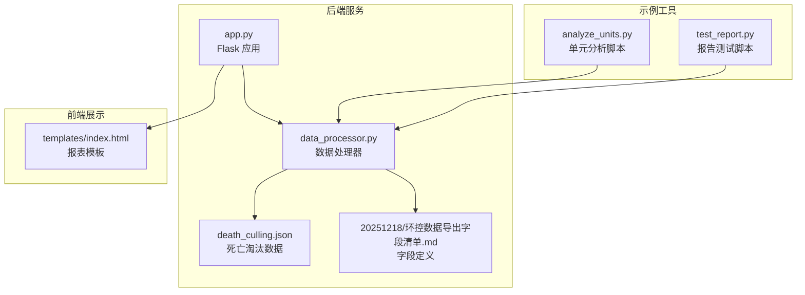
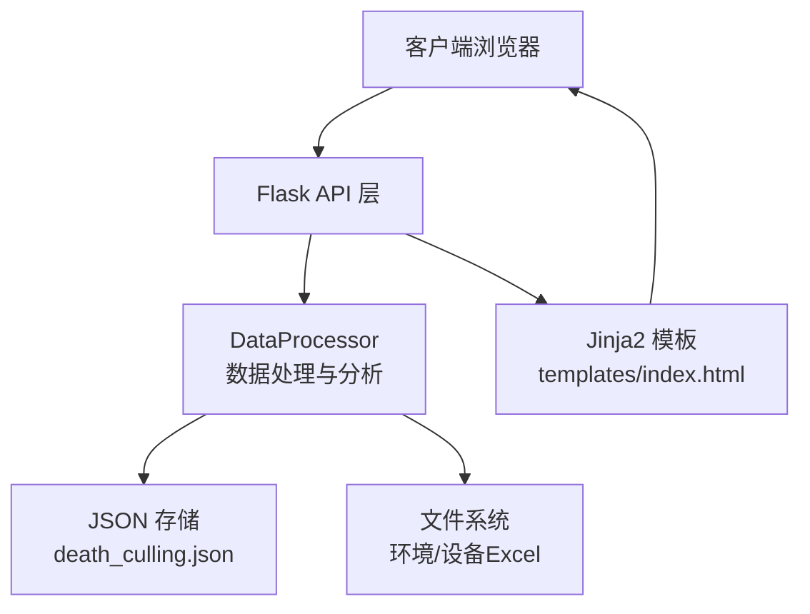
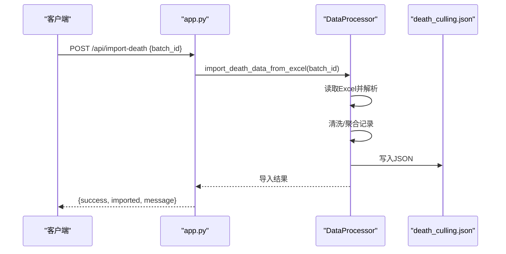
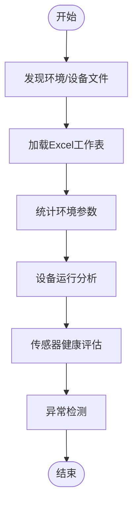
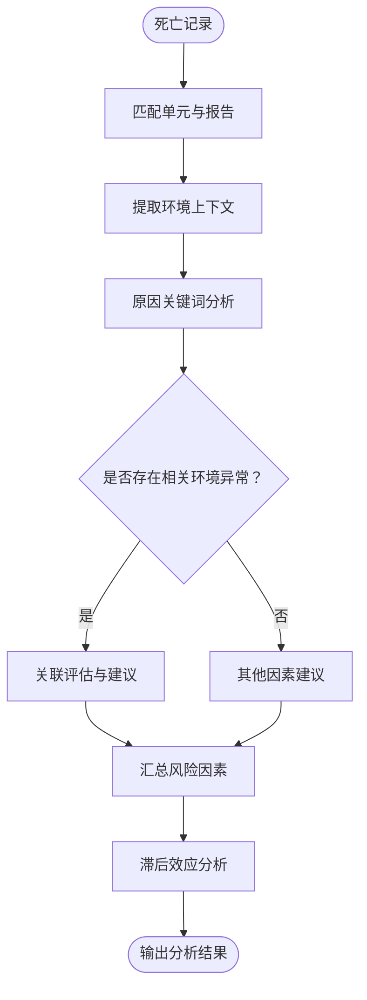
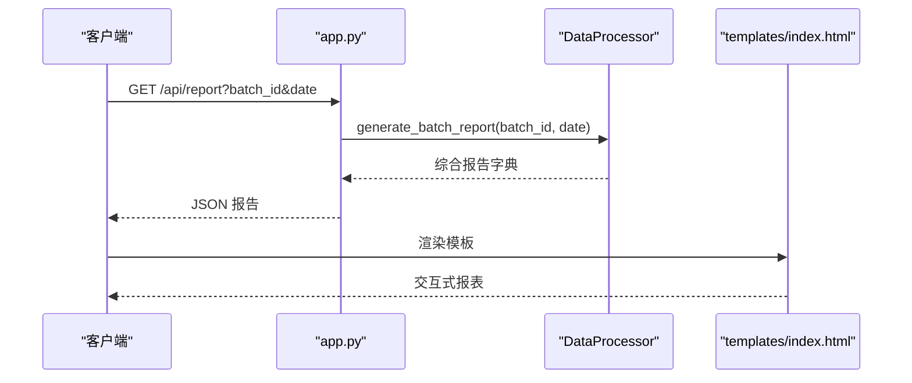
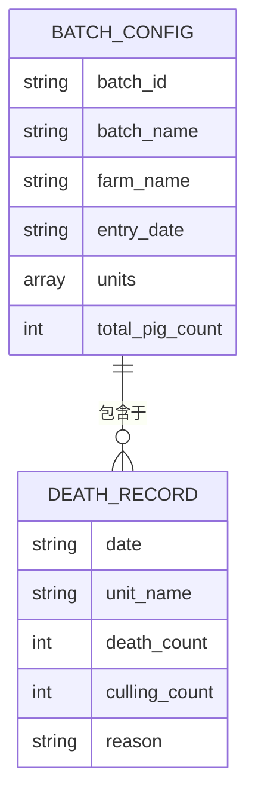
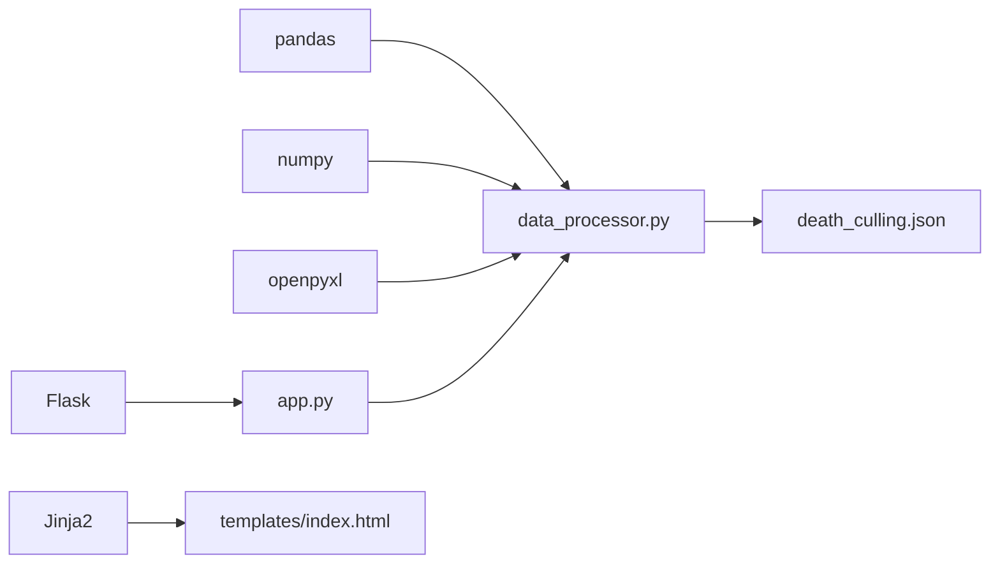

# 死亡淘汰关联分析

<cite>
**本文档引用的文件**
- [app.py](file://app.py)
- [data_processor.py](file://data_processor.py)
- [death_culling.json](file://death_culling.json)
- [analyze_units.py](file://analyze_units.py)
- [test_report.py](file://test_report.py)
- [templates/index.html](file://templates/index.html)
- [20251218/环控数据导出字段清单.md](file://20251218/环控数据导出字段清单.md)
</cite>

## 目录
1. [简介](#简介)
2. [项目结构](#项目结构)
3. [核心组件](#核心组件)
4. [架构总览](#架构总览)
5. [详细组件分析](#详细组件分析)
6. [依赖关系分析](#依赖关系分析)
7. [性能考虑](#性能考虑)
8. [故障排除指南](#故障排除指南)
9. [结论](#结论)
10. [附录](#附录)

## 简介
本项目是一个针对育肥猪批次的死亡淘汰关联分析系统，旨在通过整合环境数据与死亡淘汰数据，构建从数据导入、清洗、标准化到关联分析与可视化展示的完整流程。系统支持：
- Excel文件解析与数据清洗
- 环境参数与设备运行状态的统计分析
- 死亡淘汰与环境因素的关联分析与风险因素识别
- 多维度趋势分析与组合风险评估
- JSON数据存储与API接口服务

## 项目结构
项目采用前后端分离的结构，后端基于Flask提供REST API，前端使用HTML模板渲染报表页面。核心文件组织如下：
- 后端应用入口：app.py
- 核心数据处理器：data_processor.py
- 死亡淘汰数据存储：death_culling.json
- 环境参数字段定义：20251218/环控数据导出字段清单.md
- 前端模板：templates/index.html
- 示例脚本：analyze_units.py、test_report.py

**图表来源**
- [app.py:1-133](file://app.py#L1-L133)
- [data_processor.py:1-1559](file://data_processor.py#L1-L1559)
- [death_culling.json:1-27](file://death_culling.json#L1-L27)
- [20251218/环控数据导出字段清单.md:1-140](file://20251218/环控数据导出字段清单.md#L1-L140)
- [templates/index.html:1-800](file://templates/index.html#L1-L800)
- [analyze_units.py:1-105](file://analyze_units.py#L1-L105)
- [test_report.py:1-48](file://test_report.py#L1-L48)

**章节来源**
- [app.py:1-133](file://app.py#L1-L133)
- [data_processor.py:1-1559](file://data_processor.py#L1-L1559)
- [templates/index.html:1-800](file://templates/index.html#L1-L800)

## 核心组件
- Flask应用与路由：提供批号查询、报表生成、深度分析、趋势数据、缓存清理等API。
- 数据处理器：负责环境数据与设备数据的加载、清洗、聚合与分析，生成综合报告。
- 死亡淘汰数据管理：支持从Excel导入、本地JSON存储、编辑与查询。
- 前端模板：提供交互式报表界面，展示KPI、风险等级、异常列表、推荐措施等。

**章节来源**
- [app.py:42-133](file://app.py#L42-L133)
- [data_processor.py:54-296](file://data_processor.py#L54-L296)
- [death_culling.json:1-27](file://death_culling.json#L1-L27)

## 架构总览
系统采用“API + 数据处理 + 存储 + 前端模板”的分层架构。后端通过Flask暴露REST接口，数据处理模块负责业务逻辑，JSON文件作为轻量级持久化存储，前端模板负责数据可视化。

**图表来源**
- [app.py:104-133](file://app.py#L104-L133)
- [data_processor.py:148-296](file://data_processor.py#L148-L296)
- [death_culling.json:1-27](file://death_culling.json#L1-L27)

## 详细组件分析

### 死亡数据导入与处理流程
- Excel导入：从指定批次目录读取“批次猪死亡”工作表，过滤批次名称，清洗栋舍字段，合并相同日期/栋舍/原因的记录，写入death_culling.json。
- 本地存储：以批次ID为键，日期为键，存储死亡与淘汰记录数组。
- 编辑接口：支持POST提交更新后的记录，刷新缓存。

**图表来源**
- [app.py:116-124](file://app.py#L116-L124)
- [data_processor.py:165-223](file://data_processor.py#L165-L223)

**章节来源**
- [data_processor.py:148-223](file://data_processor.py#L148-L223)
- [app.py:104-124](file://app.py#L104-L124)

### 环境参数与设备数据处理
- 文件发现：根据批号与日期在数据根目录下查找对应单元的环境数据与设备数据文件。
- 表格加载：使用缓存机制读取Excel各工作表，支持单元信息、温度/湿度/压差/CO2明细、变频/定速风机、告警阈值、设备信息等。
- 统计分析：计算温度、湿度、CO2、压差等指标的均值、最大/最小值、标准差、偏差、比例等。
- 设备健康：统计传感器在线数量、配置与实际安装差异、进风幕帘/水帘状态等。
- 异常检测：基于动态阈值（按日龄调整）与设备逻辑规则识别异常。

**图表来源**
- [data_processor.py:105-147](file://data_processor.py#L105-L147)
- [data_processor.py:303-838](file://data_processor.py#L303-L838)

**章节来源**
- [data_processor.py:105-838](file://data_processor.py#L105-L838)

### 关联分析与风险因素识别
- 死亡与环境关联：根据死亡原因关键词（如“苍白”、“胀气”等）结合异常类型（温度、压差等）给出可能关联的解释。
- 组合风险：同时超过多项阈值或在特定组合条件下（如高温高湿、高湿低通风等）的风险评分与优先级建议。
- 死亡趋势：按小时聚合环境参数，分析滞后效应（如过去6/12/24/48小时的平均环境条件与当日死亡的关系）。

**图表来源**
- [data_processor.py:1116-1192](file://data_processor.py#L1116-L1192)
- [data_processor.py:1397-1424](file://data_processor.py#L1397-L1424)

**章节来源**
- [data_processor.py:840-863](file://data_processor.py#L840-L863)
- [data_processor.py:1116-1424](file://data_processor.py#L1116-L1424)

### 报表生成与可视化
- 综合报告：包含批次摘要、单元报告、交叉对比、趋势数据、风扇时间线、死亡分析、设备异常、小时分析、推荐措施等。
- 前端模板：提供KPI卡片、风险等级徽章、异常列表、推荐措施等UI组件，支持图表切换与打印优化。

**图表来源**
- [app.py:59-75](file://app.py#L59-L75)
- [data_processor.py:238-295](file://data_processor.py#L238-L295)
- [templates/index.html:1-800](file://templates/index.html#L1-L800)

**章节来源**
- [app.py:42-102](file://app.py#L42-L102)
- [data_processor.py:238-295](file://data_processor.py#L238-L295)
- [templates/index.html:1-800](file://templates/index.html#L1-L800)

### 数据结构与JSON存储格式
- 死亡淘汰数据结构（death_culling.json）
  - 键：批次ID（字符串）
  - 值：日期（字符串）到记录数组的映射
  - 记录字段：date、unit_name、death_count、culling_count、reason
- 批次配置结构（默认/加载自配置文件）
  - batches：批次数组，包含batch_id、batch_name、farm_name、entry_date、units、total_pig_count等

**图表来源**
- [data_processor.py:70-82](file://data_processor.py#L70-L82)
- [death_culling.json:1-27](file://death_culling.json#L1-L27)

**章节来源**
- [death_culling.json:1-27](file://death_culling.json#L1-L27)
- [data_processor.py:70-82](file://data_processor.py#L70-L82)

### API接口定义
- 获取所有批次：GET /api/batches
- 获取批次信息：GET /api/batch/{batch_id}
- 生成报告：GET /api/report?batch_id&date
- 仪表盘数据：GET /api/dashboard?batch_id&date
- 深度分析：GET /api/deep-analysis?batch_id&date
- 趋势数据：GET /api/trend?batch_id&date&page&page_size
- 保存死亡淘汰：POST /api/death-culling
- 导入死亡数据：POST /api/import-death
- 清理缓存：POST /api/cache/clear

**章节来源**
- [app.py:47-129](file://app.py#L47-L129)

## 依赖关系分析
- 外部库：pandas、numpy、openpyxl、flask
- 内部模块：data_processor.py（核心业务）、app.py（路由与缓存）、templates/index.html（前端渲染）

**图表来源**
- [app.py:1-10](file://app.py#L1-L10)
- [data_processor.py:1-12](file://data_processor.py#L1-L12)
- [templates/index.html:1-10](file://templates/index.html#L1-L10)

**章节来源**
- [app.py:1-10](file://app.py#L1-L10)
- [data_processor.py:1-12](file://data_processor.py#L1-L12)

## 性能考虑
- 缓存策略：全局内存缓存与TTL（秒），用于报告与趋势数据，减少重复计算。
- 文件缓存：Excel工作表缓存，避免重复读取。
- 分页与采样：趋势数据按时间步长采样，限制显示点数，提升图表渲染性能。
- 动态阈值：按日龄调整温度/CO2阈值，减少误报，提高分析效率。

**章节来源**
- [app.py:15-40](file://app.py#L15-L40)
- [data_processor.py:12-48](file://data_processor.py#L12-L48)
- [data_processor.py:1026-1080](file://data_processor.py#L1026-L1080)

## 故障排除指南
- Excel读取失败：检查文件路径与工作表名称是否正确，确保编码为UTF-8。
- 死亡数据为空：确认Excel中“批次号”与“栋舍”字段清洗后可匹配批次配置。
- 报表为空：检查环境数据文件是否存在且包含所需列。
- 告警阈值不一致：跨单元阈值差异可能导致告警不一致，建议统一标准。
- 缓存问题：调用清理缓存接口或重启服务。

**章节来源**
- [data_processor.py:130-141](file://data_processor.py#L130-L141)
- [app.py:126-129](file://app.py#L126-L129)
- [data_processor.py:1194-1249](file://data_processor.py#L1194-L1249)

## 结论
该系统通过标准化的环境数据与死亡淘汰数据处理流程，实现了从数据导入到关联分析与可视化的闭环。其核心优势在于：
- 易于扩展的Excel解析与JSON存储
- 基于动态阈值与设备逻辑的异常检测
- 多维度趋势与组合风险分析
- 前后端分离的可维护架构

## 附录

### 环境参数字段清单（节选）
- 单元信息：装猪数量、猪只体重、日龄、目标温度/湿度、通风季节/模式、工作模式、舍内温度/湿度、CO2均值、压差均值、通风等级、料肉比、日增重、日采食量、时间
- 温度/湿度/压差/CO2明细：各传感器数据与时间
- 变频/定速风机：运行状态（百分比/状态）、类型、模式、时间
- 告警阈值：温度高低限、湿度高限、CO2高限
- 设备信息：设备型号、IP地址、固件版本、内存使用率、累计运行时长、安装日期
- 传感器配置：温度/湿度/CO2传感器实际安装数量
- 进风幕帘/水帘：当前开度、目标开度、工作模式、工作状态

**章节来源**
- [20251218/环控数据导出字段清单.md:1-140](file://20251218/环控数据导出字段清单.md#L1-L140)

### 使用示例
- 导入死亡数据：POST /api/import-death {batch_id: "20251218"}
- 生成报告：GET /api/report?batch_id=20251218&date=2026-03-10
- 深度分析：GET /api/deep-analysis?batch_id=20251218&date=2026-03-10
- 趋势数据：GET /api/trend?batch_id=20251218&date=2026-03-10&page=1&page_size=7
- 保存死亡淘汰：POST /api/death-culling {batch_id, date, records: [...]}
- 清理缓存：POST /api/cache/clear

**章节来源**
- [app.py:59-129](file://app.py#L59-L129)