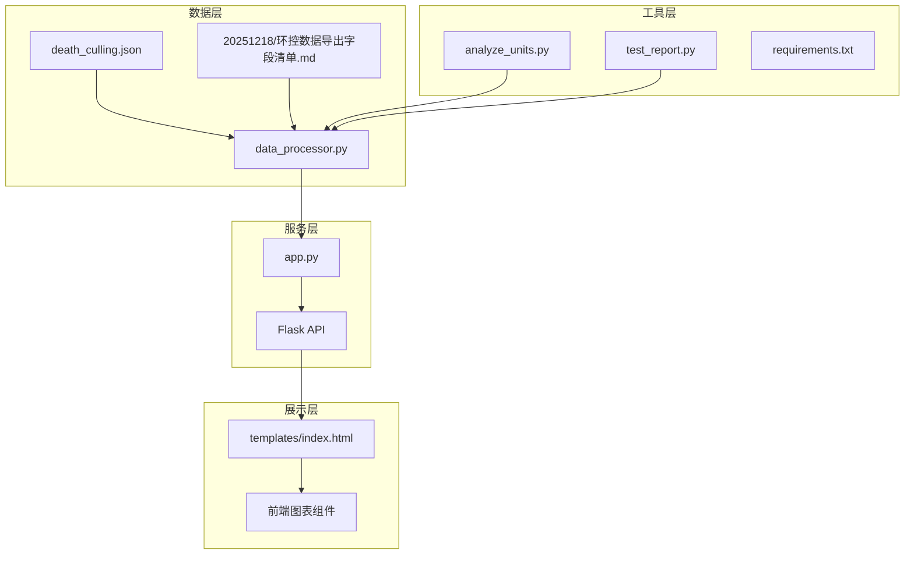
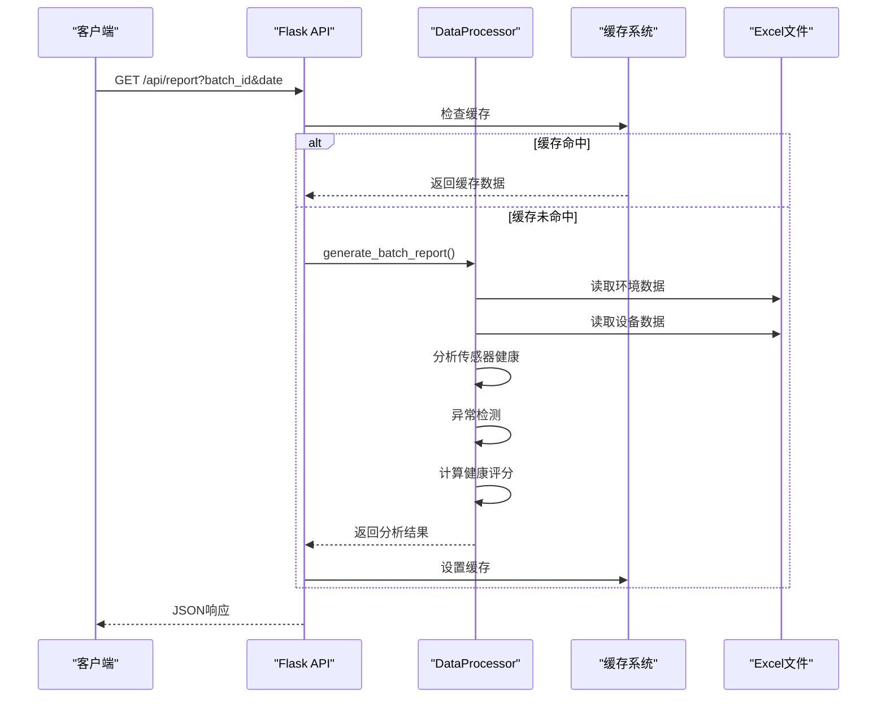
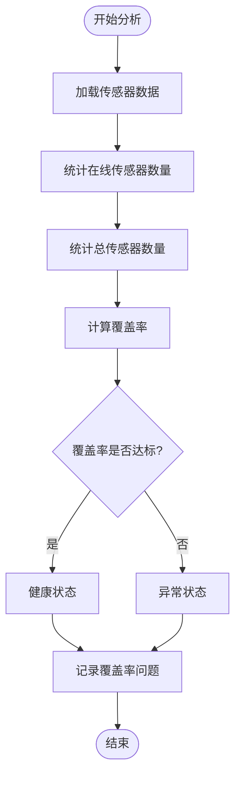
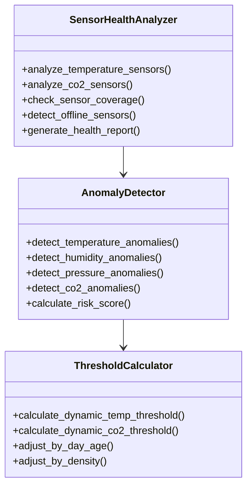
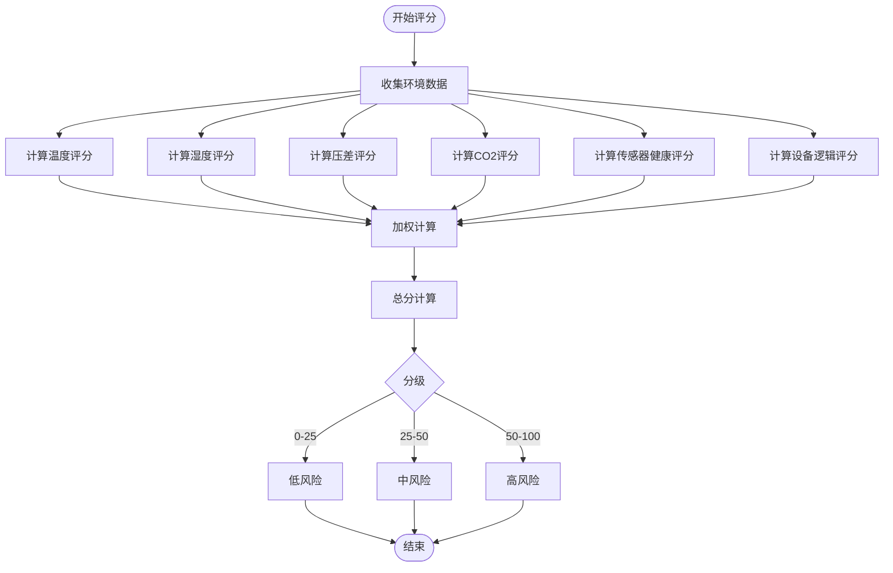
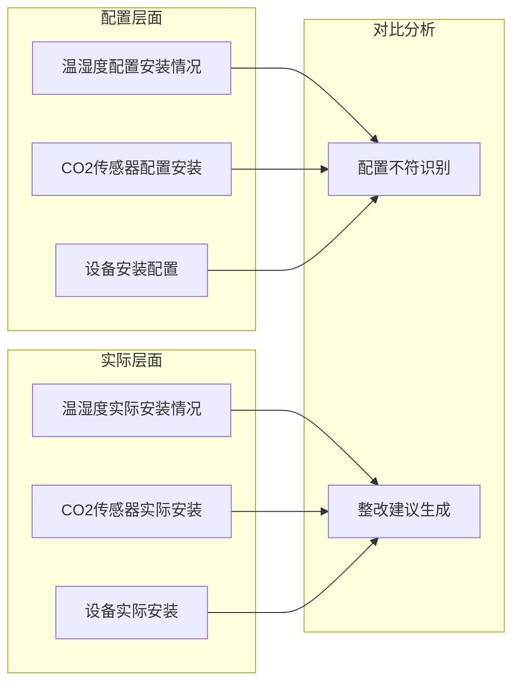
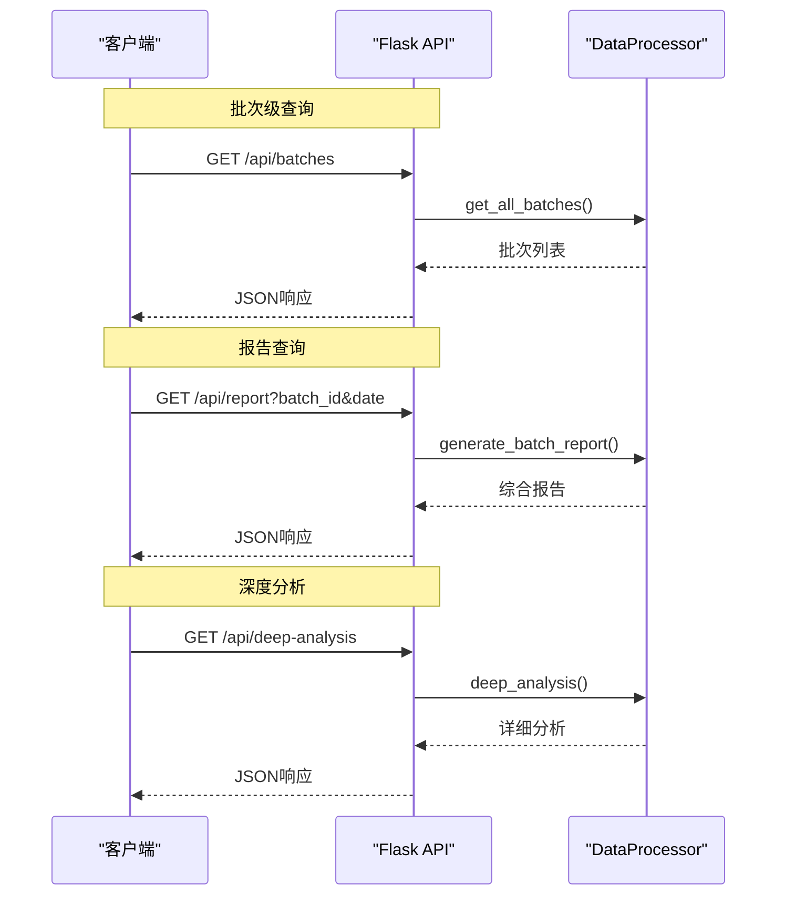
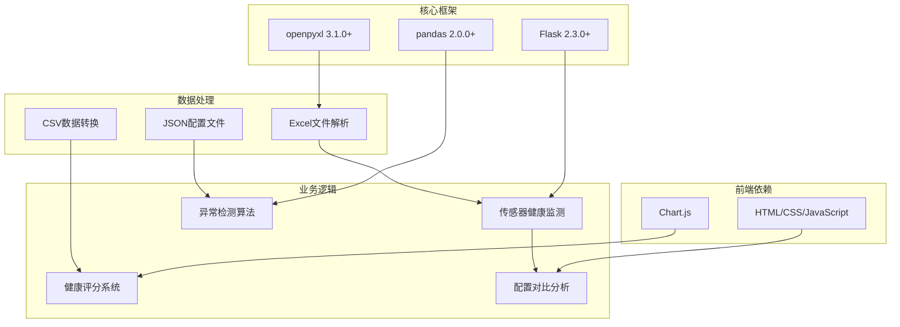

# 传感器健康监测

<cite>
**本文引用的文件**
- [app.py](file://app.py)
- [data_processor.py](file://data_processor.py)
- [analyze_units.py](file://analyze_units.py)
- [test_report.py](file://test_report.py)
- [death_culling.json](file://death_culling.json)
- [templates/index.html](file://templates/index.html)
- [requirements.txt](file://requirements.txt)
- [20251218/环控数据导出字段清单.md](file://20251218/环控数据导出字段清单.md)
</cite>

## 目录
1. [简介](#简介)
2. [项目结构](#项目结构)
3. [核心组件](#核心组件)
4. [架构概览](#架构概览)
5. [详细组件分析](#详细组件分析)
6. [依赖分析](#依赖分析)
7. [性能考虑](#性能考虑)
8. [故障排除指南](#故障排除指南)
9. [结论](#结论)
10. [附录](#附录)

## 简介
本项目是一个针对育肥猪批次环境控制的数据分析系统，重点实现了传感器健康监测功能。系统通过分析温度传感器、CO2传感器等关键环境传感器的在线状态，提供覆盖率计算、异常检测、健康评分和配置对比分析等功能，帮助用户及时发现和解决环境控制问题。

## 项目结构
项目采用典型的Python Web应用结构，包含数据处理层、Web服务层和前端展示层：

**图表来源**
- [app.py:1-133](file://app.py#L1-L133)
- [data_processor.py:54-1559](file://data_processor.py#L54-L1559)

**章节来源**
- [app.py:1-133](file://app.py#L1-L133)
- [data_processor.py:54-1559](file://data_processor.py#L54-L1559)

## 核心组件
系统的核心由以下关键组件构成：

### 数据处理器(DataProcessor)
负责加载、解析和分析环境数据，实现传感器健康监测的主要逻辑：
- 传感器覆盖率统计和计算
- 异常检测算法实现
- 健康评分系统设计
- 配置对比分析功能

### Web服务(Flask API)
提供RESTful接口，支持批量查询、趋势分析和深度分析：
- 批次级报告生成
- 单元级详细分析
- 实时数据缓存机制

### 前端展示
基于Chart.js的可视化界面，展示环境参数趋势、传感器状态和健康评分。

**章节来源**
- [data_processor.py:54-1559](file://data_processor.py#L54-L1559)
- [app.py:42-133](file://app.py#L42-L133)

## 架构概览
系统采用分层架构设计，确保了良好的可维护性和扩展性：

**图表来源**
- [app.py:32-40](file://app.py#L32-L40)
- [data_processor.py:238-295](file://data_processor.py#L238-L295)

系统的关键特性包括：
- **实时缓存机制**：5分钟TTL的智能缓存，提升响应速度
- **动态阈值计算**：根据猪只日龄调整环境参数阈值
- **多层次异常检测**：涵盖传感器状态、设备运行和环境参数
- **可视化展示**：支持趋势图、仪表盘和详细报表

## 详细组件分析

### 传感器健康监测系统

#### 传感器覆盖率计算
系统实现了精确的传感器覆盖率统计机制：

**图表来源**
- [data_processor.py:611-637](file://data_processor.py#L611-L637)

覆盖率计算的具体实现：
- **温度传感器**：统计温度传感器明细表中的非空列数
- **CO2传感器**：统计CO2传感器数据表中的有效数据列
- **覆盖率公式**：在线传感器数量 ÷ 总传感器数量 × 100%

#### 传感器异常检测算法

系统实现了多层次的异常检测机制：

**图表来源**
- [data_processor.py:611-838](file://data_processor.py#L611-L838)

异常检测算法的核心逻辑：

1. **温度传感器异常检测**
   - 在线传感器数量不足（建议≥4个）
   - 传感器掉线检测（配置数量与实际在线数量对比）

2. **CO2传感器异常检测**
   - 动态阈值计算：基于日龄和猪只密度
   - 中位数阈值：1000ppm，高值阈值：2000ppm
   - 超标比例分析：>1000ppm和>2000ppm的时间占比

3. **设备逻辑异常检测**
   - 变频风机全天0%运行
   - 温度超标但风机未满负荷
   - 负压事件频发（>10%时段）

#### 健康评分系统设计

系统采用综合评分机制，将多种因素量化为可操作的健康等级：

**图表来源**
- [data_processor.py:830-837](file://data_processor.py#L830-L837)

健康等级划分标准：
- **低风险**：0-25分，环境参数基本正常
- **中风险**：25-50分，存在轻度异常需要关注
- **高风险**：50-100分，存在严重异常需要立即处理

#### 传感器配置对比分析

系统提供详细的配置与实际安装情况对比功能：

**图表来源**
- [data_processor.py:626-636](file://data_processor.py#L626-L636)

配置对比的具体实现：
- **温湿度传感器**：配置数量 vs 实际在线数量
- **CO2传感器**：配置数量 vs 实际在线数量  
- **设备安装**：安装情况检查和缺失设备识别

**章节来源**
- [data_processor.py:611-838](file://data_processor.py#L611-L838)

### API接口设计

系统提供完整的RESTful API接口，支持多种查询场景：

**图表来源**
- [app.py:47-102](file://app.py#L47-L102)

主要API接口包括：
- `/api/batches`：获取所有批次信息
- `/api/report`：获取综合报告
- `/api/dashboard`：获取仪表板数据
- `/api/deep-analysis`：获取深度分析
- `/api/trend`：获取趋势数据

**章节来源**
- [app.py:47-102](file://app.py#L47-L102)

## 依赖分析

系统的技术栈和依赖关系如下：

**图表来源**
- [requirements.txt:1-4](file://requirements.txt#L1-L4)

**章节来源**
- [requirements.txt:1-4](file://requirements.txt#L1-L4)

## 性能考虑

系统在性能方面采用了多项优化措施：

### 缓存策略
- **智能缓存**：5分钟TTL的全局缓存系统
- **多级缓存**：报告缓存和趋势数据缓存分离
- **缓存失效**：数据变更时自动清除相关缓存

### 数据处理优化
- **延迟加载**：Excel文件按需读取和缓存
- **内存管理**：及时清理临时数据结构
- **批处理**：支持大数据量的分页处理

### 前端性能
- **图表懒加载**：按需渲染复杂图表
- **数据压缩**：传输过程中进行数据压缩
- **响应式设计**：适配不同设备性能

## 故障排除指南

### 常见问题及解决方案

#### 传感器数据异常
**问题现象**：传感器数据显示异常或缺失
**诊断步骤**：
1. 检查Excel文件格式是否正确
2. 验证传感器数据列命名规范
3. 确认数据时间戳完整性

**解决方案**：
- 按照字段清单规范重新导出数据
- 检查传感器硬件连接状态
- 验证数据采集系统的正常运行

#### API接口错误
**问题现象**：API返回错误或超时
**诊断步骤**：
1. 检查服务器日志获取详细错误信息
2. 验证数据文件路径和权限
3. 确认数据库连接状态

**解决方案**：
- 重启Flask服务进程
- 检查防火墙和网络配置
- 验证依赖包版本兼容性

#### 性能问题
**问题现象**：页面加载缓慢或响应超时
**诊断步骤**：
1. 检查服务器资源使用情况
2. 分析慢查询和内存泄漏
3. 评估数据量增长趋势

**解决方案**：
- 优化数据查询和索引
- 增加服务器资源配置
- 实施数据归档和清理策略

**章节来源**
- [app.py:126-129](file://app.py#L126-L129)
- [data_processor.py:40-48](file://data_processor.py#L40-L48)

## 结论

本传感器健康监测系统通过集成化的数据分析和可视化展示，为育肥猪环境控制提供了全面的技术支撑。系统的核心优势包括：

1. **全面的传感器监测**：覆盖温度、湿度、CO2等关键环境参数
2. **智能化异常检测**：基于动态阈值和机器学习算法的异常识别
3. **可视化的健康评分**：直观反映环境质量状况
4. **实用的配置对比**：帮助用户及时发现和纠正配置问题

系统采用模块化设计，具有良好的可扩展性和维护性，能够适应不同规模养殖场的环境监测需求。通过持续的数据积累和算法优化，系统将为提升养殖效益和动物福利水平发挥重要作用。

## 附录

### 最佳实践建议

#### 传感器部署最佳实践
- **温度传感器**：建议每个区域至少配置4个传感器，确保温度分布的代表性
- **CO2传感器**：根据猪只密度合理配置，一般每1000头猪配置1个CO2传感器
- **传感器位置**：避免直吹风和热源附近，确保测量准确性

#### 数据管理最佳实践
- **定期校准**：建立传感器定期校准制度
- **数据备份**：实施多级数据备份策略
- **版本控制**：对配置文件和分析脚本进行版本管理

#### 维护建议
- **预防性维护**：制定设备预防性维护计划
- **故障响应**：建立快速故障响应机制
- **人员培训**：定期对操作人员进行技术培训

### 常用配置参数参考

| 参数类别 | 正常范围 | 警告阈值 | 异常阈值 |
|---------|---------|---------|---------|
| 温度(℃) | 18-26 | >28或<16 | >30或<14 |
| 湿度(%) | 55-75 | >80或<50 | >85或<45 |
| CO2(ppm) | 800-1200 | >1500 | >2000 |
| 压差(Pa) | -50到50 | <-100或>100 | <-200或>200 |