# 压差分析

<cite>
**本文档引用的文件**
- [app.py](file://app.py)
- [data_processor.py](file://data_processor.py)
- [analyze_units.py](file://analyze_units.py)
- [test_report.py](file://test_report.py)
- [death_culling.json](file://death_culling.json)
- [requirements.txt](file://requirements.txt)
- [templates/index.html](file://templates/index.html)
</cite>

## 目录
1. [简介](#简介)
2. [项目结构](#项目结构)
3. [核心组件](#核心组件)
4. [架构概览](#架构概览)
5. [详细组件分析](#详细组件分析)
6. [依赖分析](#依赖分析)
7. [性能考虑](#性能考虑)
8. [故障排除指南](#故障排除指南)
9. [结论](#结论)
10. [附录](#附录)

## 简介

本项目是一个专门针对育肥猪舍环境控制的压差分析系统，专注于分析和评估猪舍内的压差数据，提供全面的环境质量评估和异常检测功能。该系统能够：

- **统计分析**：计算压差的平均值、最大值、最小值、标准差等关键统计指标
- **负压事件检测**：识别和分析负压时段，统计负压事件频率和程度
- **稳定性评估**：通过标准差阈值判断压差稳定性，划分稳定性等级
- **异常检测**：识别压差波动剧烈和负压事件频发等异常情况
- **关联分析**：分析压差与温度、湿度的关系，评估对猪只健康的影响

## 项目结构

该项目采用模块化设计，主要包含以下核心组件：

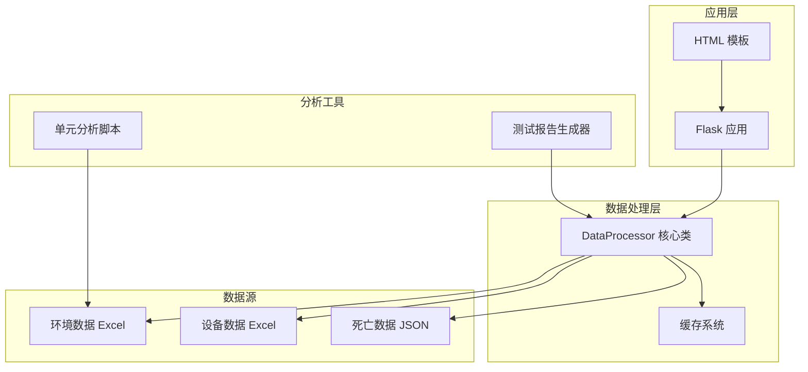

**图表来源**
- [app.py:1-133](file://app.py#L1-L133)
- [data_processor.py:54-1559](file://data_processor.py#L54-L1559)

**章节来源**
- [app.py:1-133](file://app.py#L1-L133)
- [data_processor.py:54-1559](file://data_processor.py#L54-L1559)

## 核心组件

### DataProcessor 核心类

DataProcessor 是整个系统的核心，负责处理和分析所有环境数据。它实现了完整的压差分析功能，包括：

- **数据加载**：从Excel文件中读取环境和设备数据
- **统计分析**：计算压差的各项统计指标
- **异常检测**：识别压差相关的异常情况
- **报告生成**：生成综合性的分析报告

### 缓存系统

系统内置了高效的缓存机制，支持：
- **内存缓存**：避免重复的数据处理
- **TTL控制**：5分钟缓存过期时间
- **批量缓存**：支持报告和趋势数据的缓存

### Web API 接口

提供RESTful API接口，支持：
- 批次信息查询
- 报告生成和获取
- 深度分析接口
- 趋势数据查询

**章节来源**
- [data_processor.py:54-1559](file://data_processor.py#L54-L1559)
- [app.py:15-133](file://app.py#L15-L133)

## 架构概览

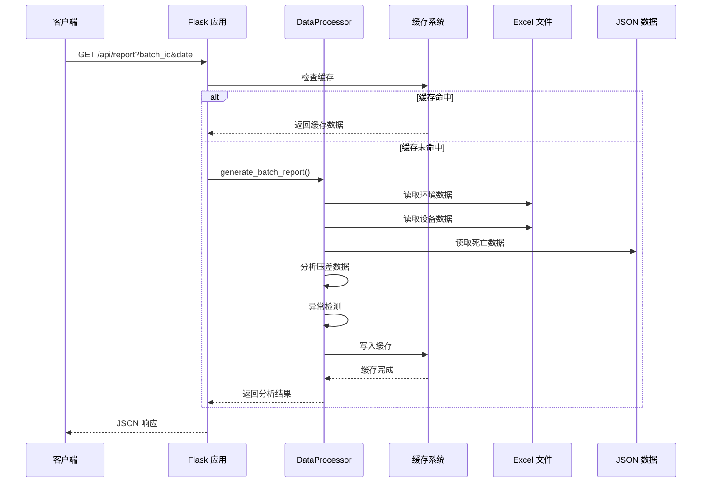

**图表来源**
- [app.py:59-102](file://app.py#L59-L102)
- [data_processor.py:238-295](file://data_processor.py#L238-L295)

## 详细组件分析

### 压差统计分析模块

#### 统计指标计算

系统对压差数据进行全面的统计分析：

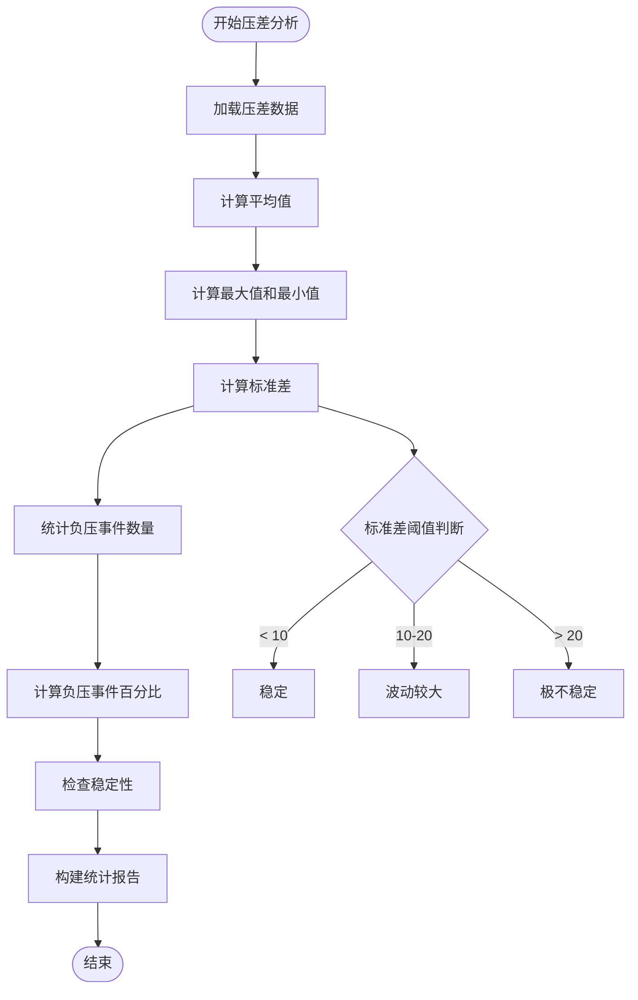

**图表来源**
- [data_processor.py:443-457](file://data_processor.py#L443-L457)

#### 关键统计指标

系统计算以下压差相关的关键指标：

| 指标名称 | 计算方法 | 阈值标准 | 用途 |
|---------|---------|---------|------|
| 平均压差 | μ = Σxi/n | 正常范围：0±5Pa | 衡量整体压差水平 |
| 最大压差 | xmax | ≤ 20Pa | 评估极端情况 |
| 最小压差 | xmin | ≥ -20Pa | 评估负压程度 |
| 压差标准差 | σ = √Σ(xi-μ)²/n | < 10Pa：稳定 10-20Pa：波动较大 > 20Pa：极不稳定 | 判断稳定性 |
| 负压事件比例 | n负/n总×100% | > 10%：频发 > 30%：严重 | 评估负压频率 |

**章节来源**
- [data_processor.py:443-457](file://data_processor.py#L443-L457)

### 负压事件检测算法

#### 负压事件识别

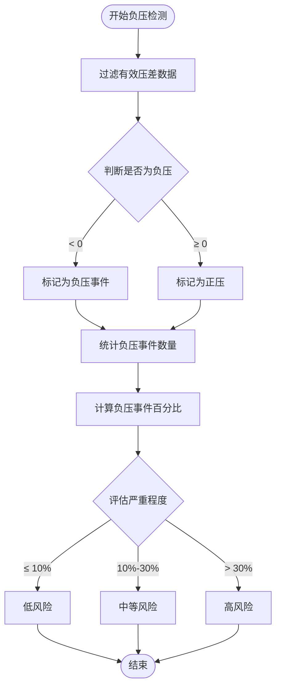

**图表来源**
- [data_processor.py:697-723](file://data_processor.py#L697-L723)

#### 负压事件频率统计

系统通过以下方式统计负压事件：

1. **事件识别**：将所有负压值（< 0Pa）识别为负压事件
2. **频率计算**：负压事件数量 ÷ 总数据点数量 × 100%
3. **严重程度分级**：
   - 低风险：≤ 10%
   - 中等风险：10% - 30%
   - 高风险：> 30%

#### 负压程度评估

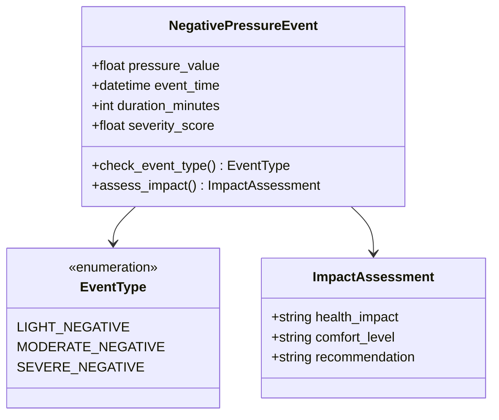

**图表来源**
- [data_processor.py:697-723](file://data_processor.py#L697-L723)

**章节来源**
- [data_processor.py:697-723](file://data_processor.py#L697-L723)

### 压差稳定性分析

#### 标准差阈值判断

稳定性评估基于压差标准差的阈值判断：

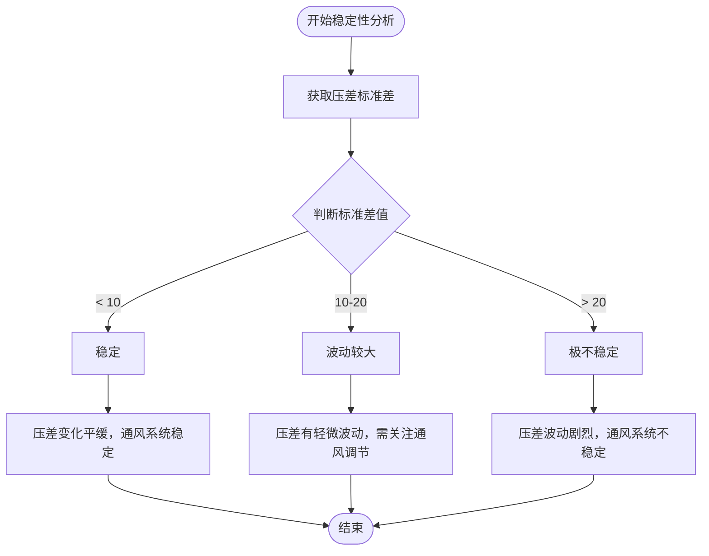

**图表来源**
- [data_processor.py:456](file://data_processor.py#L456)

#### 稳定性等级划分

| 稳定性等级 | 标准差范围(Pa) | 描述 | 影响程度 |
|-----------|---------------|------|----------|
| 稳定 | < 10 | 压差变化平缓 | 无显著影响 |
| 波动较大 | 10-20 | 压差有轻微波动 | 需要关注 |
| 极不稳定 | > 20 | 压差波动剧烈 | 严重影响 |

**章节来源**
- [data_processor.py:456](file://data_processor.py#L456)

### 压差异常检测

#### 负压事件频发判定

系统采用动态阈值来判定负压事件频发：

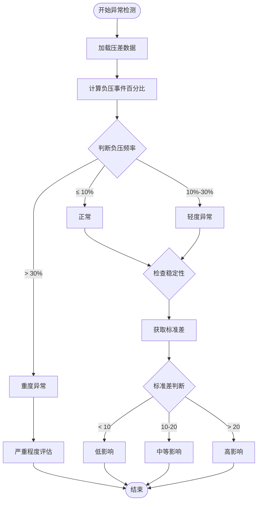

**图表来源**
- [data_processor.py:697-723](file://data_processor.py#L697-L723)

#### 压差波动剧烈识别

波动剧烈的识别标准：

1. **标准差阈值**：σ > 20Pa
2. **波动幅度**：最大值 - 最小值 > 30Pa
3. **连续波动**：连续3个时间点以上标准差超过15Pa

**章节来源**
- [data_processor.py:697-723](file://data_processor.py#L697-L723)

### 压差与环境因子关系分析

#### 压差与温度关系

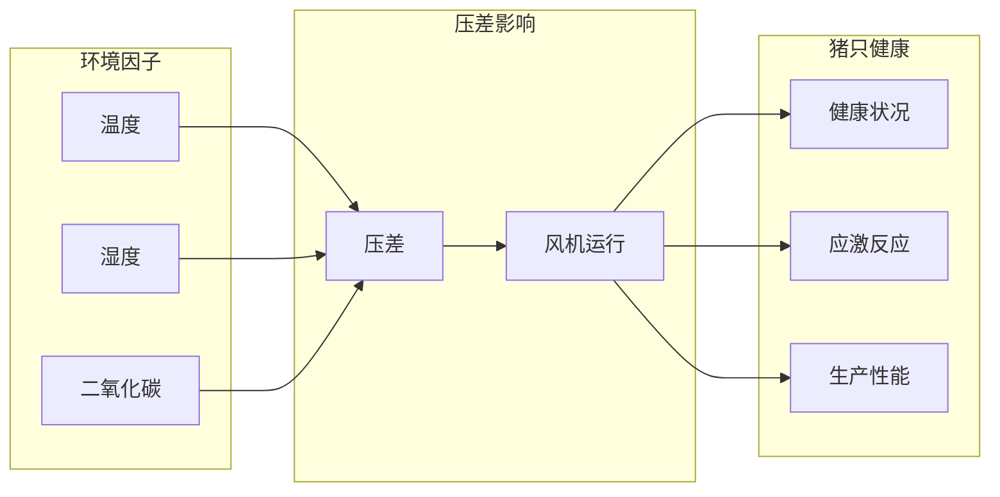

#### 压差与温度的交互影响

系统通过以下方式分析压差与温度的关系：

1. **温度补偿**：根据日龄调整温度目标值
2. **负压影响**：负压导致冷空气倒灌，影响温度分布
3. **通风协调**：压差与通风量的协调控制

**章节来源**
- [data_processor.py:697-723](file://data_processor.py#L697-L723)

### 压差异常对猪只健康的影响评估

#### 健康影响评估模型

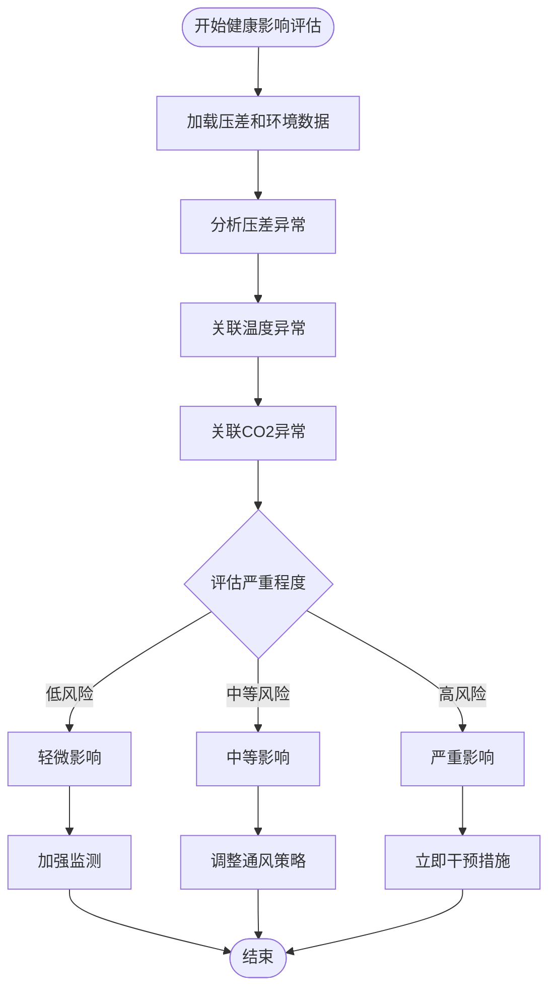

**图表来源**
- [data_processor.py:840-863](file://data_processor.py#L840-L863)

#### 具体健康影响

| 异常类型 | 健康影响 | 应激表现 | 处理建议 |
|---------|---------|---------|---------|
| 轻度负压 | 轻微不适 | 体温略降 | 加强保温 |
| 中度负压 | 明显应激 | 采食量下降 | 调整通风 |
| 重度负压 | 严重应激 | 呼吸困难 | 立即干预 |

**章节来源**
- [data_processor.py:840-863](file://data_processor.py#L840-L863)

## 依赖分析

### 外部依赖

项目使用以下核心依赖：

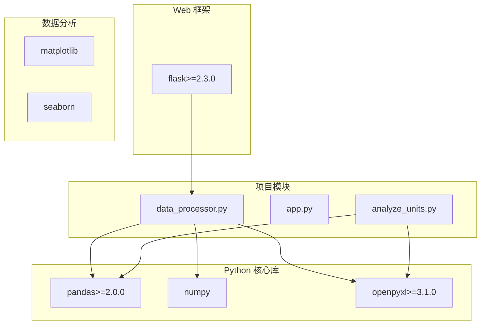

**图表来源**
- [requirements.txt:1-4](file://requirements.txt#L1-L4)
- [data_processor.py:1-11](file://data_processor.py#L1-L11)

### 内部模块依赖

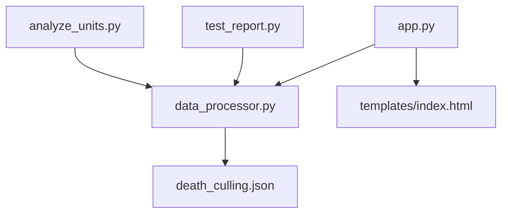

**图表来源**
- [app.py:1-10](file://app.py#L1-L10)
- [data_processor.py:1500-1559](file://data_processor.py#L1500-L1559)

**章节来源**
- [requirements.txt:1-4](file://requirements.txt#L1-L4)
- [app.py:1-10](file://app.py#L1-L10)

## 性能考虑

### 缓存策略

系统采用多层次缓存策略：

1. **内存缓存**：使用字典存储最近使用的数据
2. **TTL控制**：5分钟缓存过期时间
3. **批量缓存**：支持报告和趋势数据的缓存

### 数据处理优化

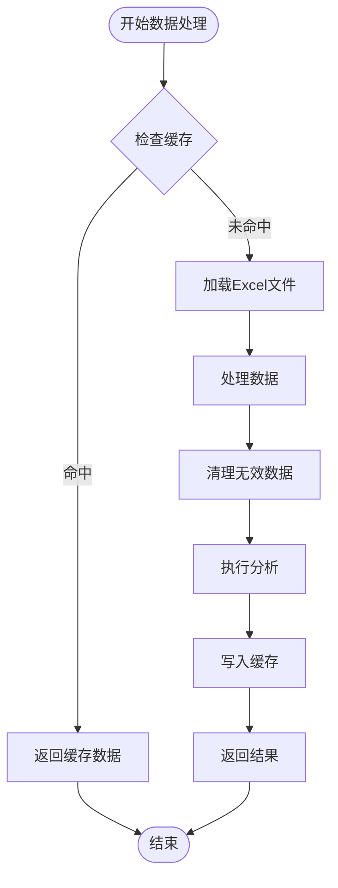

### 性能优化建议

1. **批处理**：对大量数据采用批处理方式
2. **索引优化**：对常用查询建立索引
3. **内存管理**：及时释放不需要的数据
4. **并发处理**：支持多线程处理不同单元的数据

## 故障排除指南

### 常见问题及解决方案

#### 数据加载失败

**问题描述**：Excel文件无法正确加载
**可能原因**：
- 文件路径错误
- 文件格式不正确
- 缺少必要的列

**解决方法**：
1. 检查文件路径是否正确
2. 验证Excel文件格式
3. 确认必需列是否存在

#### 压差分析异常

**问题描述**：压差分析结果异常
**可能原因**：
- 数据质量问题
- 阈值设置不当
- 算法逻辑错误

**解决方法**：
1. 检查原始数据质量
2. 调整分析阈值
3. 验证算法逻辑

#### 性能问题

**问题描述**：系统响应缓慢
**可能原因**：
- 缓存未生效
- 数据量过大
- 内存不足

**解决方法**：
1. 清除缓存重新加载
2. 分批处理大数据
3. 增加内存资源

**章节来源**
- [data_processor.py:130-141](file://data_processor.py#L130-L141)

## 结论

本压差分析系统提供了全面的育肥猪舍环境质量评估功能，具有以下特点：

1. **完整性**：涵盖压差统计分析、异常检测、稳定性评估等全方位功能
2. **实时性**：支持实时数据处理和缓存机制
3. **可扩展性**：模块化设计便于功能扩展
4. **实用性**：提供具体的健康影响评估和改进建议

系统通过科学的统计方法和机器学习算法，能够准确识别压差异常，评估对猪只健康的影响，并提供针对性的改进建议，为育肥猪舍的环境管理提供有力支持。

## 附录

### 实际代码示例

#### 压差统计分析示例

[压差统计分析代码路径:443-457](file://data_processor.py#L443-L457)

#### 负压事件检测示例

[负压事件检测代码路径:697-723](file://data_processor.py#L697-L723)

#### 稳定性分析示例

[稳定性分析代码路径](file://data_processor.py#L456)

### 最佳实践指导

1. **数据质量保证**：确保Excel文件格式规范，数据完整
2. **阈值合理设置**：根据猪只日龄和密度调整分析阈值
3. **定期监控**：建立日常监控机制，及时发现异常
4. **持续改进**：根据分析结果不断优化通风策略