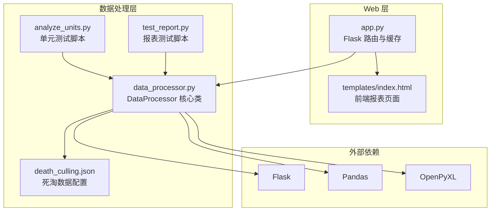
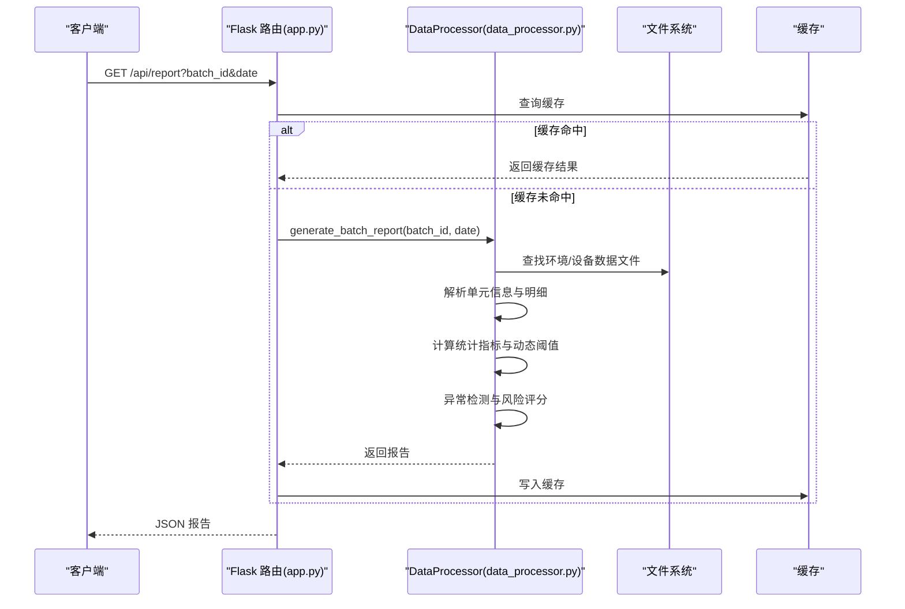
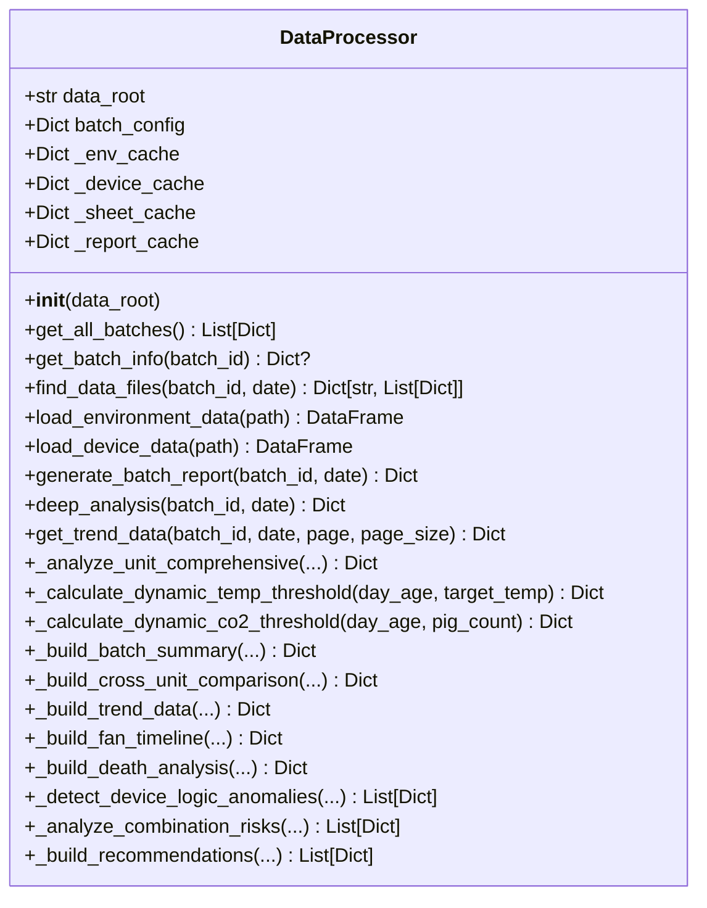
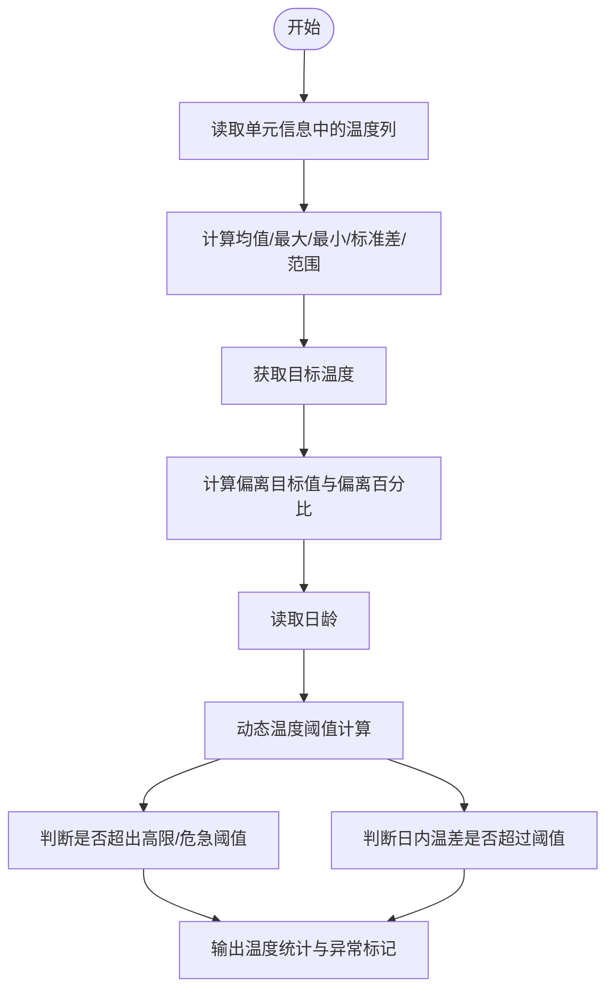
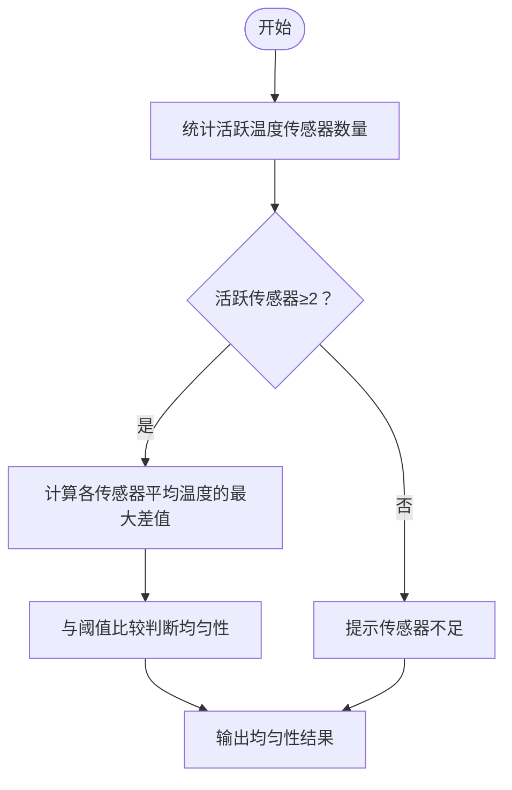
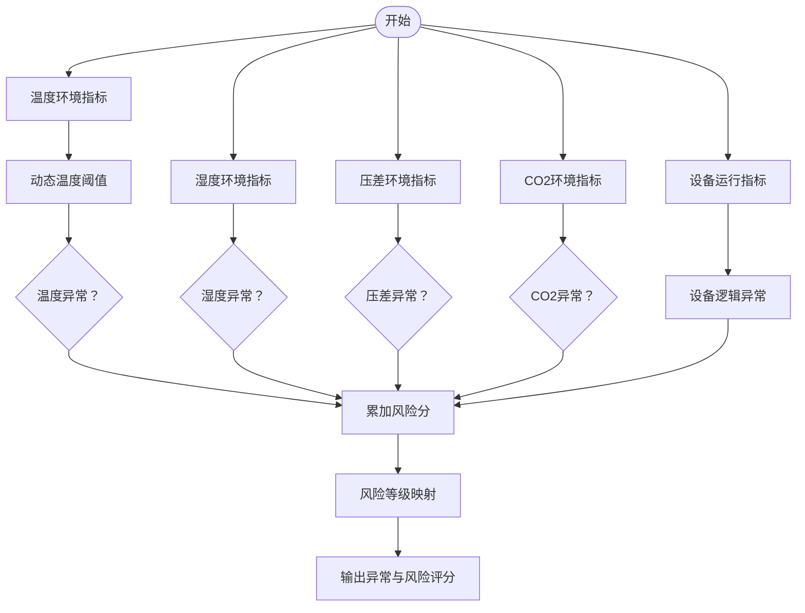
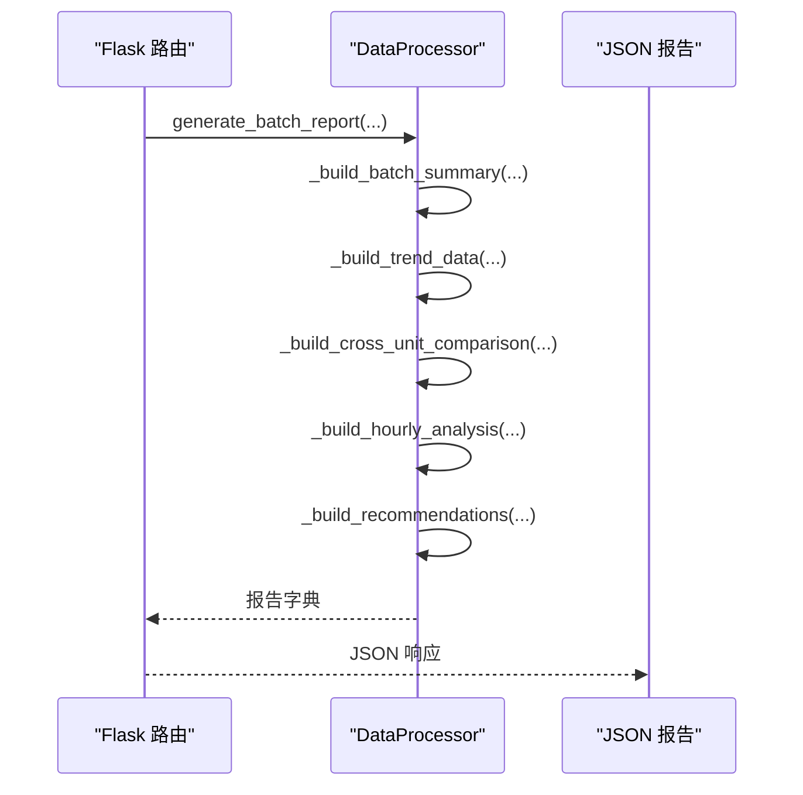
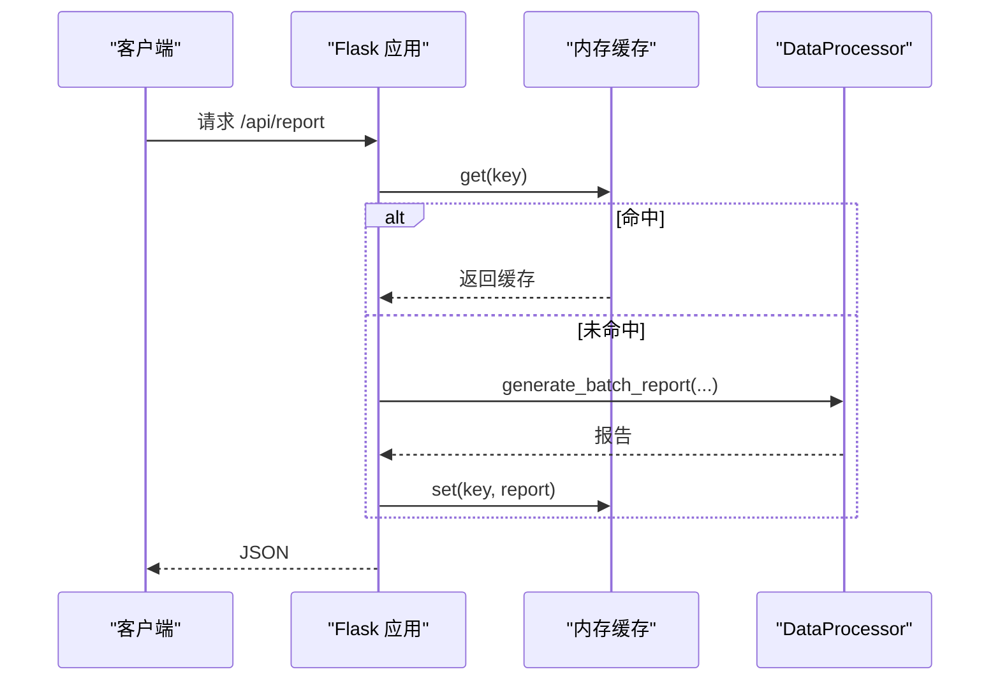
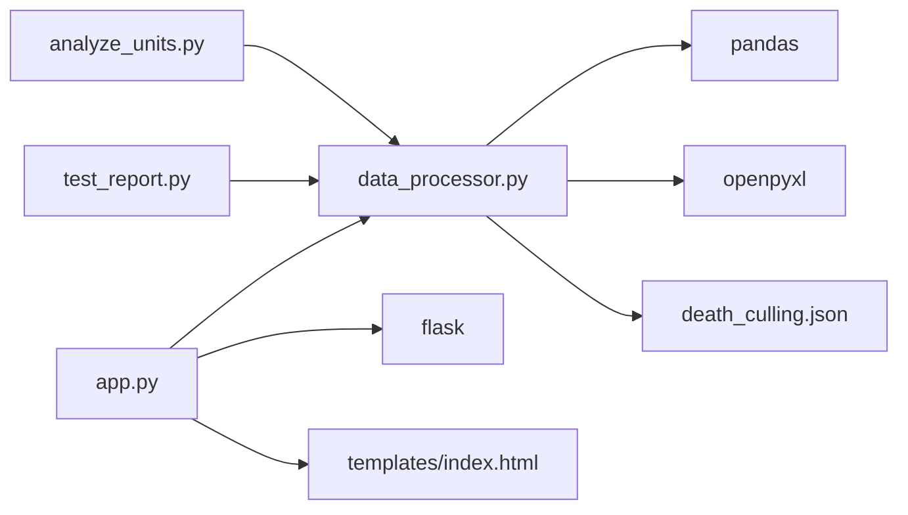

# 温度分析

<cite>
**本文引用的文件**
- [app.py](file://app.py)
- [data_processor.py](file://data_processor.py)
- [analyze_units.py](file://analyze_units.py)
- [test_report.py](file://test_report.py)
- [death_culling.json](file://death_culling.json)
- [templates/index.html](file://templates/index.html)
- [requirements.txt](file://requirements.txt)
</cite>

## 目录
1. [简介](#简介)
2. [项目结构](#项目结构)
3. [核心组件](#核心组件)
4. [架构总览](#架构总览)
5. [详细组件分析](#详细组件分析)
6. [依赖分析](#依赖分析)
7. [性能考虑](#性能考虑)
8. [故障排除指南](#故障排除指南)
9. [结论](#结论)
10. [附录](#附录)

## 简介
本项目围绕“温度分析”主题，提供从原始环控数据到综合报表的完整分析链路。系统通过批处理方式聚合多个育肥舍的数据，计算温度统计指标（平均、最高、最低、标准差、日内范围等），并引入动态阈值调整机制（基于日龄、猪只体重等参数）以适配不同生长阶段的温度目标。同时，系统实现了温度均匀性分析（多传感器差异评估）、异常检测（温度偏离目标、日内温差过大、负压事件等），并提供趋势图、交叉对比、组合风险分析与推荐措施，帮助用户快速定位问题并指导优化。

## 项目结构
项目采用“Flask Web + 数据处理器”的分层架构：
- Web 层：提供 REST 接口与前端页面，负责请求路由、缓存与响应包装
- 数据处理层：封装数据加载、清洗、统计、异常检测与报告生成
- 模板层：前端 HTML 页面，用于展示报表与图表
- 配置与工具：JSON 死淘数据、脚本化单元测试与分析

**图表来源**
- [app.py:1-133](file://app.py#L1-L133)
- [data_processor.py:54-1559](file://data_processor.py#L54-L1559)
- [requirements.txt:1-4](file://requirements.txt#L1-L4)

**章节来源**
- [app.py:1-133](file://app.py#L1-L133)
- [data_processor.py:54-1559](file://data_processor.py#L54-L1559)
- [requirements.txt:1-4](file://requirements.txt#L1-L4)

## 核心组件
- DataProcessor：核心数据处理类，负责文件发现、Excel 表格加载、统计计算、异常检测、报告构建与缓存
- Flask 应用：提供批处理报表、深度分析、趋势数据、缓存清理等接口
- 前端模板：展示批次汇总、单元详情、异常列表、推荐措施与图表
- 死淘数据：支持按日期与单元统计死淘记录，并参与环境相关性分析

关键职责与输出：
- 批次级汇总：总猪数、平均体重、平均日龄、批次平均温度/湿度/CO2、风险等级与评分
- 单元级分析：温度统计、传感器健康、设备运行、异常检测、风险评分
- 动态阈值：根据日龄调整温度与CO2阈值，提升阈值的阶段性适应性
- 统计指标：平均温度、最高/最低温度、标准差、日内范围、偏离目标百分比等
- 异常检测：温度偏离目标、日内温差过大、负压事件、CO2偏高等
- 报表与可视化：趋势数据、交叉对比、组合风险分析、推荐措施

**章节来源**
- [data_processor.py:238-295](file://data_processor.py#L238-L295)
- [data_processor.py:303-838](file://data_processor.py#L303-L838)
- [data_processor.py:865-914](file://data_processor.py#L865-L914)
- [app.py:42-129](file://app.py#L42-L129)

## 架构总览
系统采用“数据驱动 + 动态阈值 + 多维异常检测”的分析架构。核心流程如下：
- 输入：按批次组织的 Excel 文件（环境数据、设备数据）
- 处理：解析单元信息、温度/湿度/CO2/压差等明细，计算统计指标
- 分析：动态阈值调整、温度均匀性评估、异常检测、组合风险分析
- 输出：批次与单元级报告、趋势数据、交叉对比、推荐措施

**图表来源**
- [app.py:59-66](file://app.py#L59-L66)
- [app.py:32-40](file://app.py#L32-L40)
- [data_processor.py:238-295](file://data_processor.py#L238-L295)

**章节来源**
- [app.py:18-40](file://app.py#L18-L40)
- [data_processor.py:238-295](file://data_processor.py#L238-L295)

## 详细组件分析

### 数据处理器 DataProcessor
DataProcessor 是整个系统的中枢，负责：
- 文件发现与解析：按批次与单元匹配环境/设备数据文件
- 数据加载：使用 pandas 读取 Excel 的多个工作表
- 统计计算：温度、湿度、CO2、压差等指标的均值、最大/最小、标准差、范围等
- 动态阈值：基于日龄调整温度与CO2阈值，使阈值随猪只生长阶段变化
- 异常检测：温度偏离目标、日内温差过大、负压事件、CO2偏高等
- 报告构建：批次汇总、单元报告、交叉对比、趋势数据、设备逻辑异常、小时分析、组合风险与推荐

**图表来源**
- [data_processor.py:54-1559](file://data_processor.py#L54-L1559)

**章节来源**
- [data_processor.py:54-1559](file://data_processor.py#L54-L1559)

### 温度统计与动态阈值
- 温度统计：从单元信息表读取温度列，计算平均、最高、最低、标准差、日内范围、偏离目标百分比等
- 动态温度阈值：根据日龄分段调整“高限/危急/日间波动”阈值，使阈值更贴合不同阶段的生理需求
- 动态CO2阈值：在日龄基础上叠加密度因子，使阈值随猪群密度变化而调整

**图表来源**
- [data_processor.py:352-401](file://data_processor.py#L352-L401)
- [data_processor.py:643-678](file://data_processor.py#L643-L678)
- [data_processor.py:865-891](file://data_processor.py#L865-L891)

**章节来源**
- [data_processor.py:352-401](file://data_processor.py#L352-L401)
- [data_processor.py:643-678](file://data_processor.py#L643-L678)
- [data_processor.py:865-891](file://data_processor.py#L865-L891)

### 温度均匀性分析
- 传感器健康：统计活跃温度传感器数量与总数，不足时提示监测覆盖面
- 均匀性评估：当活跃传感器≥2时，计算各传感器平均温度的最大差值，并以固定阈值判断是否均匀
- 结果输出：包含最大差值与是否均匀的布尔值

**图表来源**
- [data_processor.py:369-401](file://data_processor.py#L369-L401)
- [data_processor.py:619-637](file://data_processor.py#L619-L637)

**章节来源**
- [data_processor.py:369-401](file://data_processor.py#L369-L401)
- [data_processor.py:619-637](file://data_processor.py#L619-L637)

### 异常检测与风险评分
- 温度异常：基于动态阈值判断温度偏离目标与日内温差过大
- 湿度异常：固定阈值判断偏离目标
- 压差异常：负压事件占比与波动幅度
- CO2异常：基于动态阈值判断偏高
- 设备逻辑异常：变频风机全天为零、温度超目标但风机未满负荷
- 死淘相关：结合死淘记录与环境异常进行相关性评估
- 风险评分：按异常严重程度累加，映射为低/中/高风险等级

**图表来源**
- [data_processor.py:639-838](file://data_processor.py#L639-L838)
- [data_processor.py:840-863](file://data_processor.py#L840-L863)

**章节来源**
- [data_processor.py:639-838](file://data_processor.py#L639-L838)
- [data_processor.py:840-863](file://data_processor.py#L840-L863)

### 报表与可视化数据
- 批次汇总：总猪数、平均体重/日龄、批次平均温度/湿度/CO2、风险等级与评分、今日/总死亡与致死率
- 趋势数据：时间标签与各单元的温度/湿度/CO2/压差/通风等级序列
- 交叉对比：单元间温度、压差稳定性、风机平均频率、异常数量与死亡数对比
- 小时分析：按小时聚合温度/湿度/CO2/通风等级，分析滞后效应
- 推荐措施：基于异常类型与严重程度生成优先级建议

**图表来源**
- [data_processor.py:916-963](file://data_processor.py#L916-L963)
- [data_processor.py:1026-1080](file://data_processor.py#L1026-L1080)
- [data_processor.py:965-1024](file://data_processor.py#L965-L1024)
- [data_processor.py:1341-1395](file://data_processor.py#L1341-L1395)
- [data_processor.py:1426-1497](file://data_processor.py#L1426-L1497)

**章节来源**
- [data_processor.py:916-963](file://data_processor.py#L916-L963)
- [data_processor.py:1026-1080](file://data_processor.py#L1026-L1080)
- [data_processor.py:965-1024](file://data_processor.py#L965-L1024)
- [data_processor.py:1341-1395](file://data_processor.py#L1341-L1395)
- [data_processor.py:1426-1497](file://data_processor.py#L1426-L1497)

### Web 接口与缓存
- 接口：/api/report、/api/deep-analysis、/api/trend、/api/batch/*、/api/dashboard、/api/death-culling、/api/import-death、/api/cache/clear
- 缓存：基于内存的 TTL 缓存，支持报告与趋势数据缓存，写入数据后自动清空缓存

**图表来源**
- [app.py:18-40](file://app.py#L18-L40)
- [app.py:59-66](file://app.py#L59-L66)

**章节来源**
- [app.py:18-40](file://app.py#L18-L40)
- [app.py:59-66](file://app.py#L59-L66)

## 依赖分析
- Flask：提供 Web 服务与路由
- Pandas：数据读取、清洗与统计
- OpenPyXL：读取 Excel 工作表
- 本地模块：data_processor.py 提供核心分析能力；app.py 提供接口与缓存；templates/index.html 提供前端展示；analyze_units.py/test_report.py 提供脚本化测试与演示

**图表来源**
- [requirements.txt:1-4](file://requirements.txt#L1-L4)
- [app.py:1-10](file://app.py#L1-L10)
- [data_processor.py:1-11](file://data_processor.py#L1-L11)
- [analyze_units.py:1-105](file://analyze_units.py#L1-L105)
- [test_report.py:1-48](file://test_report.py#L1-L48)
- [death_culling.json:1-27](file://death_culling.json#L1-L27)

**章节来源**
- [requirements.txt:1-4](file://requirements.txt#L1-L4)
- [app.py:1-10](file://app.py#L1-L10)
- [data_processor.py:1-11](file://data_processor.py#L1-L11)

## 性能考虑
- 缓存策略：内存缓存（TTL=5分钟），显著降低重复查询成本
- 数据分页：趋势数据支持分页，避免一次性传输大量历史数据
- 列裁剪：按需读取列，避免不必要的数据加载
- 向量化计算：使用 pandas/numpy 进行向量化统计，提升速度
- 文件缓存：Excel 工作表在进程内缓存，减少重复 IO

优化建议：
- 对于大规模历史数据，可考虑磁盘缓存或数据库持久化
- 前端图表渲染可采用虚拟滚动或分段加载
- 异常检测规则可预编译正则或阈值，减少重复计算

[本节为通用性能讨论，无需特定文件来源]

## 故障排除指南
常见问题与解决思路：
- 报表为空或缺失：检查数据文件是否存在、列名是否正确、日期是否匹配
- 阈值异常：确认日龄与目标温度是否正确传入，动态阈值函数是否被调用
- 传感器不足：检查活跃传感器数量，确保覆盖≥3个
- 负压事件：检查压差明细与阈值，关注负压占比与波动
- 死淘相关：核对死淘数据 JSON 格式与日期匹配，确认相关性评估逻辑
- 缓存问题：使用 /api/cache/clear 清空缓存后重试

**章节来源**
- [data_processor.py:619-637](file://data_processor.py#L619-L637)
- [data_processor.py:697-723](file://data_processor.py#L697-L723)
- [app.py:126-129](file://app.py#L126-L129)

## 结论
本项目通过“动态阈值 + 多维异常检测 + 统计分析 + 可视化”的闭环设计，提供了针对育肥舍温度管理的完整解决方案。系统能够：
- 自动计算温度统计指标与均匀性
- 基于日龄与密度动态调整阈值
- 快速识别温度偏离、日内温差过大、负压事件、CO2偏高等异常
- 生成批次与单元级报告、趋势图与推荐措施
- 支持脚本化测试与前端可视化展示

建议在实际部署中结合现场设备与管理策略，持续优化阈值与异常规则，并定期校准传感器，以提升分析准确性与预警效果。

[本节为总结性内容，无需特定文件来源]

## 附录

### 使用场景与示例路径
- 生成批次报告：访问 /api/report?batch_id=20251218&date=2026-03-10
- 深度分析：访问 /api/deep-analysis?batch_id=20251218&date=2026-03-10
- 获取趋势数据：访问 /api/trend?batch_id=20251218&date=2026-03-10&page=1&page_size=7
- 导入死淘数据：POST /api/import-death，body 包含 batch_id
- 清空缓存：POST /api/cache/clear

**章节来源**
- [app.py:59-84](file://app.py#L59-L84)
- [app.py:116-124](file://app.py#L116-L124)
- [app.py:126-129](file://app.py#L126-L129)

### 代码示例路径
- 温度统计与动态阈值：[data_processor.py:352-401](file://data_processor.py#L352-L401)、[data_processor.py:865-891](file://data_processor.py#L865-L891)
- 异常检测与风险评分：[data_processor.py:639-838](file://data_processor.py#L639-L838)
- 报告构建：[data_processor.py:238-295](file://data_processor.py#L238-L295)
- 趋势数据：[data_processor.py:1026-1080](file://data_processor.py#L1026-L1080)
- 交叉对比：[data_processor.py:965-1024](file://data_processor.py#L965-L1024)
- 推荐措施：[data_processor.py:1426-1497](file://data_processor.py#L1426-L1497)