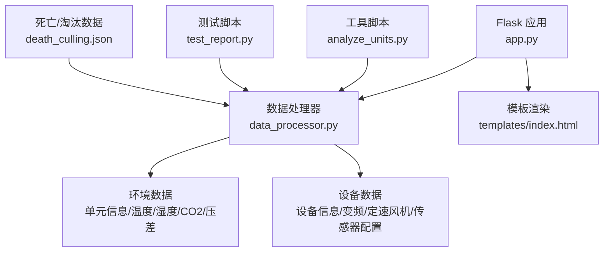
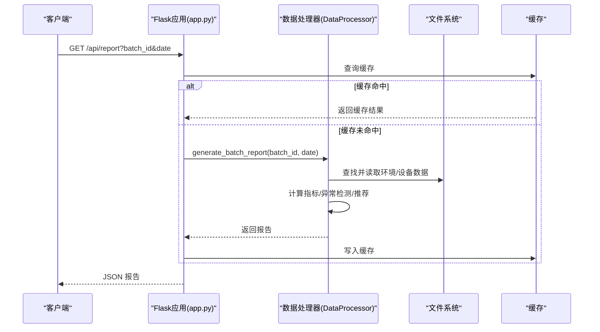
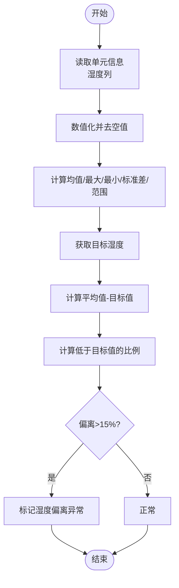
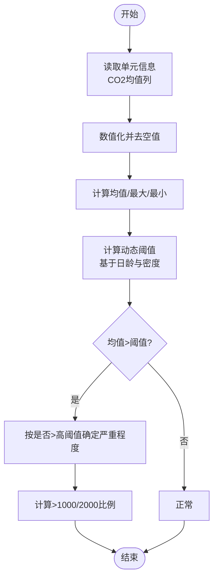
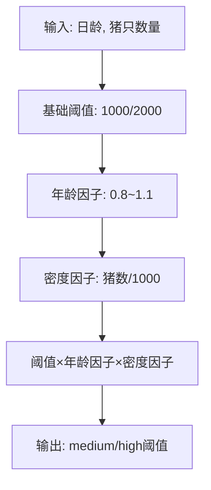
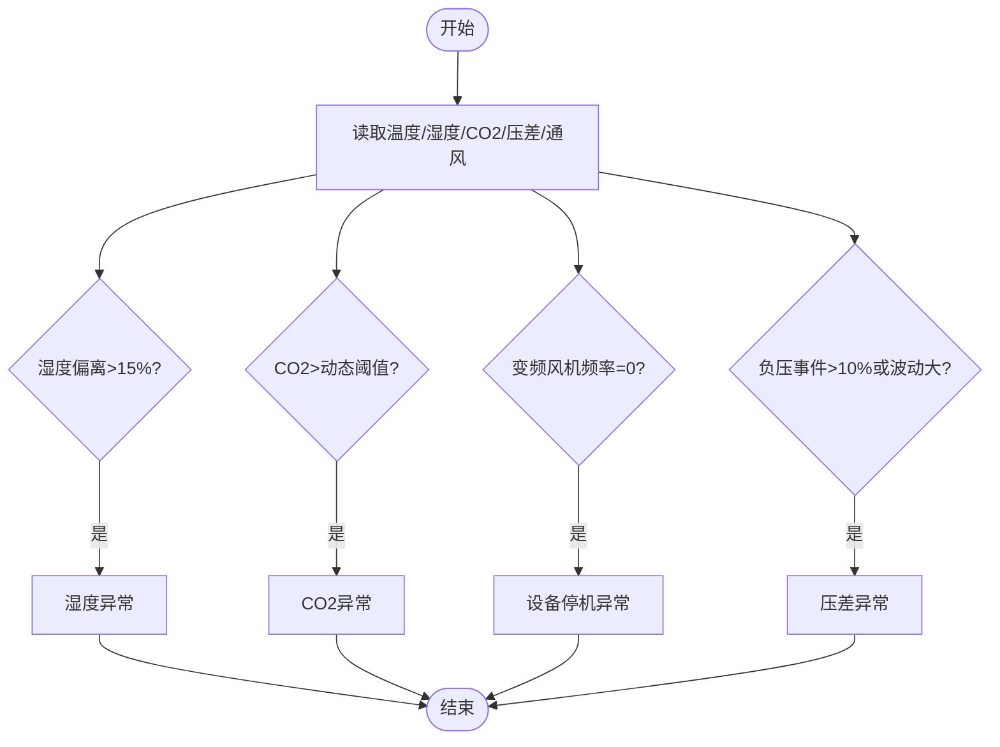
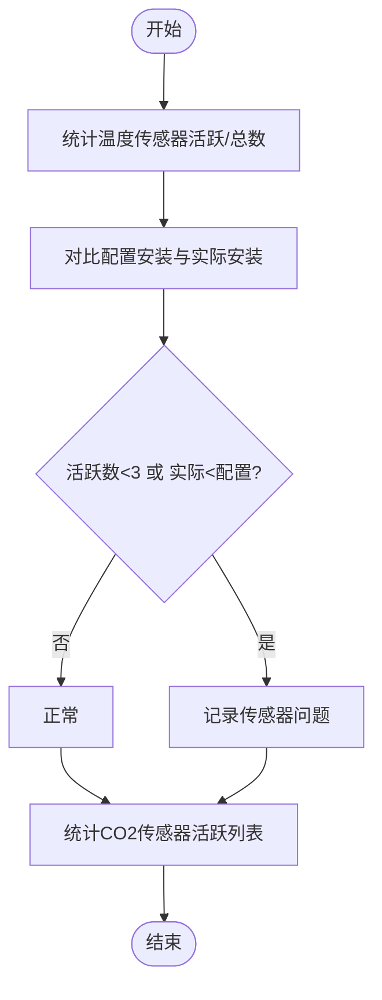
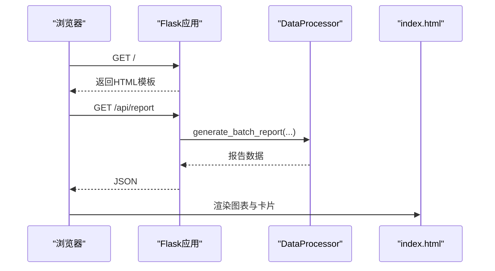
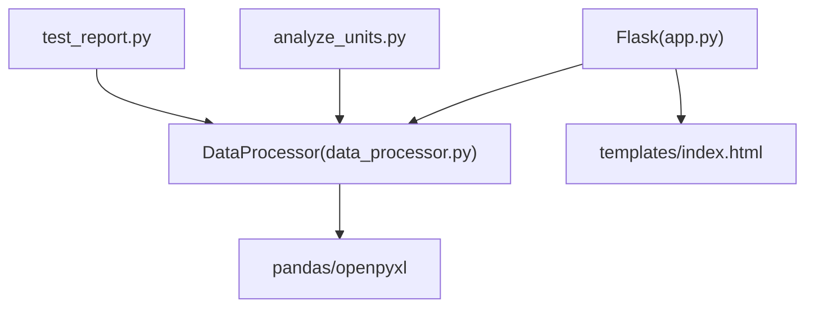

# 湿度与CO2分析

<cite>
**本文引用的文件列表**
- [app.py](file://app.py)
- [data_processor.py](file://data_processor.py)
- [analyze_units.py](file://analyze_units.py)
- [test_report.py](file://test_report.py)
- [death_culling.json](file://death_culling.json)
- [requirements.txt](file://requirements.txt)
- [templates/index.html](file://templates/index.html)
</cite>

## 目录
1. [简介](#简介)
2. [项目结构](#项目结构)
3. [核心组件](#核心组件)
4. [架构总览](#架构总览)
5. [详细组件分析](#详细组件分析)
6. [依赖关系分析](#依赖关系分析)
7. [性能考虑](#性能考虑)
8. [故障排查指南](#故障排查指南)
9. [结论](#结论)
10. [附录](#附录)

## 简介
本项目围绕“湿度与CO2分析”构建了完整的环控数据分析能力，涵盖：
- 湿度统计分析：平均值、最高值、最低值、偏离目标值比例等
- CO2浓度分析：平均值、最高值、超过阈值比例、动态阈值调整
- 异常检测：基于目标值偏离、阈值超标的判定逻辑
- 传感器健康监测：CO2传感器在线状态与覆盖率分析
- 实时接口与可视化：Flask API与前端模板渲染

项目通过批处理方式聚合多个育肥舍的数据，输出批次级汇总、单元级报告、趋势图谱与改进建议，支撑环控策略优化与生产管理决策。

## 项目结构
- 后端服务：Flask 应用提供REST接口，缓存机制提升响应速度
- 数据处理：DataProcessor 负责读取Excel、清洗与聚合、生成报告
- 前端模板：HTML模板用于展示批次汇总、单元详情、趋势图表
- 工具脚本：独立分析脚本与测试脚本辅助验证与演示

**图表来源**
- [app.py:1-133](file://app.py#L1-L133)
- [data_processor.py:54-300](file://data_processor.py#L54-L300)
- [templates/index.html:1-800](file://templates/index.html#L1-L800)

**章节来源**
- [app.py:1-133](file://app.py#L1-L133)
- [data_processor.py:54-300](file://data_processor.py#L54-L300)
- [templates/index.html:1-800](file://templates/index.html#L1-L800)

## 核心组件
- Flask 应用与路由：提供批次查询、报告生成、趋势数据、缓存清理等接口
- DataProcessor：核心分析引擎，负责文件发现、数据加载、指标计算、异常检测、推荐生成
- 前端模板：基于Chart.js渲染趋势图与KPI卡片，支持Tab切换与交互
- 工具与测试：独立脚本用于快速验证与演示

**章节来源**
- [app.py:42-133](file://app.py#L42-L133)
- [data_processor.py:54-300](file://data_processor.py#L54-L300)
- [templates/index.html:1-800](file://templates/index.html#L1-L800)

## 架构总览
系统采用“接口层-业务层-数据层”的分层设计：
- 接口层：Flask路由接收请求，调用DataProcessor生成报告并返回JSON
- 业务层：DataProcessor封装所有分析逻辑，包含缓存、异常检测、推荐生成
- 数据层：读取Excel文件，按单元与时间序列组织数据，支持跨单元比较与趋势分析

**图表来源**
- [app.py:59-66](file://app.py#L59-L66)
- [data_processor.py:238-295](file://data_processor.py#L238-L295)

## 详细组件分析

### 湿度统计分析
- 指标计算
  - 平均湿度、最高湿度、最低湿度：基于单元信息表中的“舍内湿度(%)”列
  - 偏离目标值：平均值与目标湿度的差值
  - 低于目标值的比例：统计低于目标值的时间段占比
- 数据来源与处理
  - 从“单元信息”表提取湿度列，数值化后剔除空值
  - 计算均值、最大值、最小值、标准差、范围等
- 异常判定
  - 固定阈值：当偏离绝对值超过15%时标记为异常
  - 影响评估：提示需检查加湿设备或调整目标值

**图表来源**
- [data_processor.py:402-416](file://data_processor.py#L402-L416)
- [data_processor.py:679-696](file://data_processor.py#L679-L696)

**章节来源**
- [data_processor.py:402-416](file://data_processor.py#L402-L416)
- [data_processor.py:679-696](file://data_processor.py#L679-L696)

### CO2浓度分析与动态阈值调整
- 指标计算
  - 平均CO2、最高CO2、最低CO2：基于“二氧化碳均值(ppm)”列
  - 超过阈值比例：统计高于阈值的时间段占比（1000ppm、2000ppm）
- 动态阈值调整
  - 基于日龄与猪只数量调整阈值
  - 年轻猪：阈值相对更低，更严格
  - 成年猪：阈值相对更高，适应更高的产气量
  - 密度因子：按每1000头猪的规模进行归一化调整
- 异常判定
  - 当平均CO2超过中等阈值时，按是否超过高阈值确定严重程度
  - 结合通风等级与温度、湿度进行组合风险评估

**图表来源**
- [data_processor.py:417-428](file://data_processor.py#L417-L428)
- [data_processor.py:893-914](file://data_processor.py#L893-L914)
- [data_processor.py:725-742](file://data_processor.py#L725-L742)

**章节来源**
- [data_processor.py:417-428](file://data_processor.py#L417-L428)
- [data_processor.py:893-914](file://data_processor.py#L893-L914)
- [data_processor.py:725-742](file://data_processor.py#L725-L742)

### 动态CO2阈值调整机制
- 参数输入
  - 日龄：区分不同生长阶段的CO2容忍度
  - 猪只数量：反映密度对CO2浓度的影响
- 阈值模型
  - 基础阈值：中等阈值1000ppm，高阈值2000ppm
  - 年龄因子：随日龄增长适度上调
  - 密度因子：按每1000头猪进行缩放
- 输出
  - 返回“medium”和“high”两个阈值，供异常判定使用

**图表来源**
- [data_processor.py:893-914](file://data_processor.py#L893-L914)

**章节来源**
- [data_processor.py:893-914](file://data_processor.py#L893-L914)

### 湿度与CO2异常检测
- 湿度异常
  - 偏离目标值绝对值>15%即触发异常
  - 提示检查加湿设备或调整目标值
- CO2异常
  - 使用动态阈值，超过中等阈值即异常
  - 超过高阈值为高严重性
  - 结合温度、压差、通风等级进行组合风险评估
- 设备逻辑异常
  - 变频风机全天频率为0，提示设备停机或配置问题
  - 负压事件占比>10%或波动剧烈，提示通风策略问题

**图表来源**
- [data_processor.py:679-742](file://data_processor.py#L679-L742)
- [data_processor.py:743-774](file://data_processor.py#L743-L774)
- [data_processor.py:697-724](file://data_processor.py#L697-L724)

**章节来源**
- [data_processor.py:679-742](file://data_processor.py#L679-L742)
- [data_processor.py:743-774](file://data_processor.py#L743-L774)
- [data_processor.py:697-724](file://data_processor.py#L697-L724)

### 传感器健康监测
- 温度传感器
  - 统计活跃/总数量，若活跃数<3则提示监测覆盖面不足
  - 对照“传感器配置安装情况”与“实际安装情况”，若实际<配置，提示掉线
- CO2传感器
  - 统计活跃CO2传感器列表，包含名称、平均值、最大值
  - 作为覆盖率与健康度的参考

**图表来源**
- [data_processor.py:611-637](file://data_processor.py#L611-L637)
- [data_processor.py:430-441](file://data_processor.py#L430-L441)

**章节来源**
- [data_processor.py:611-637](file://data_processor.py#L611-L637)
- [data_processor.py:430-441](file://data_processor.py#L430-L441)

### API与前端集成
- 接口
  - 批次列表、批次信息、报告、仪表盘、深度分析、趋势、缓存清理
- 前端
  - 使用Chart.js绘制温度/湿度/CO2/压差趋势图
  - 单元卡片展示KPI与风险等级
  - 支持Tab切换与交互式筛选

**图表来源**
- [app.py:42-75](file://app.py#L42-L75)
- [templates/index.html:1-800](file://templates/index.html#L1-L800)

**章节来源**
- [app.py:42-75](file://app.py#L42-L75)
- [templates/index.html:1-800](file://templates/index.html#L1-L800)

## 依赖关系分析
- 外部依赖
  - Flask：Web框架
  - pandas/openpyxl：Excel读取与数据处理
- 内部模块
  - app.py 依赖 data_processor.py 的 DataProcessor
  - templates/index.html 依赖 Chart.js 进行可视化
  - analyze_units.py/test_report.py 作为独立脚本直接调用 DataProcessor

**图表来源**
- [requirements.txt:1-4](file://requirements.txt#L1-L4)
- [app.py:1-10](file://app.py#L1-L10)
- [data_processor.py:1-11](file://data_processor.py#L1-L11)

**章节来源**
- [requirements.txt:1-4](file://requirements.txt#L1-L4)
- [app.py:1-10](file://app.py#L1-L10)
- [data_processor.py:1-11](file://data_processor.py#L1-L11)

## 性能考虑
- 缓存策略
  - 全局字典缓存与TTL（默认5分钟）减少重复计算
  - 报告与趋势数据均启用缓存
- 数据加载
  - Excel按需读取，带sheet缓存，避免重复I/O
- 数值处理
  - 使用pandas向量化操作，减少循环
- 建议
  - 大批量历史数据可分页加载
  - 对高频查询可引入Redis缓存

**章节来源**
- [app.py:15-40](file://app.py#L15-L40)
- [data_processor.py:12-48](file://data_processor.py#L12-L48)

## 故障排查指南
- 常见问题
  - 报告为空：检查Excel文件是否存在、列名是否匹配
  - 阈值异常：确认日龄与猪只数量是否正确传入
  - 传感器缺失：检查“传感器配置安装情况”与实际在线数
  - 负压倒风：检查进风/排风配合与密封性
- 排查步骤
  - 使用 test_report.py 快速验证生成流程
  - 使用 analyze_units.py 对单个单元进行指标核对
  - 清理缓存后重试：POST /api/cache/clear

**章节来源**
- [test_report.py:1-48](file://test_report.py#L1-L48)
- [analyze_units.py:1-105](file://analyze_units.py#L1-L105)
- [app.py:126-129](file://app.py#L126-L129)

## 结论
本项目提供了面向育肥舍的湿度与CO2分析能力，通过动态阈值、异常检测与传感器健康监测，形成闭环的环控质量保障体系。结合趋势图与推荐建议，可有效指导通风策略优化与设备运维，提升生产性能与动物福利。

## 附录
- 示例场景
  - 场景A：日龄较小的保育阶段，CO2阈值下调，确保空气质量
  - 场景B：高密度育肥阶段，CO2阈值上调，同时加强通风
  - 场景C：湿度长期低于目标值，提示检查加湿系统
- 关键API
  - GET /api/report：生成批次报告
  - GET /api/trend：获取趋势数据
  - POST /api/cache/clear：清理缓存
- 死亡/淘汰数据
  - 通过 death_culling.json 管理与导入，支持与环境因素关联分析

**章节来源**
- [app.py:59-102](file://app.py#L59-L102)
- [death_culling.json:1-27](file://death_culling.json#L1-L27)