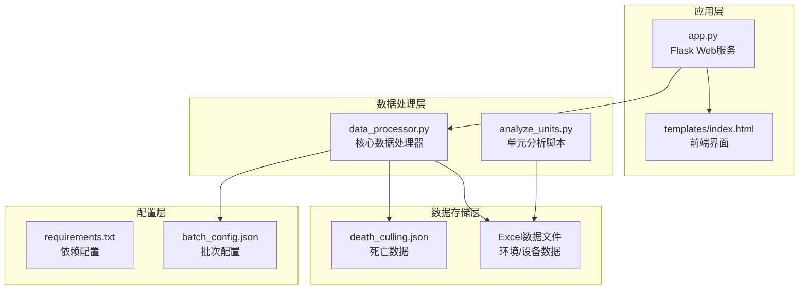
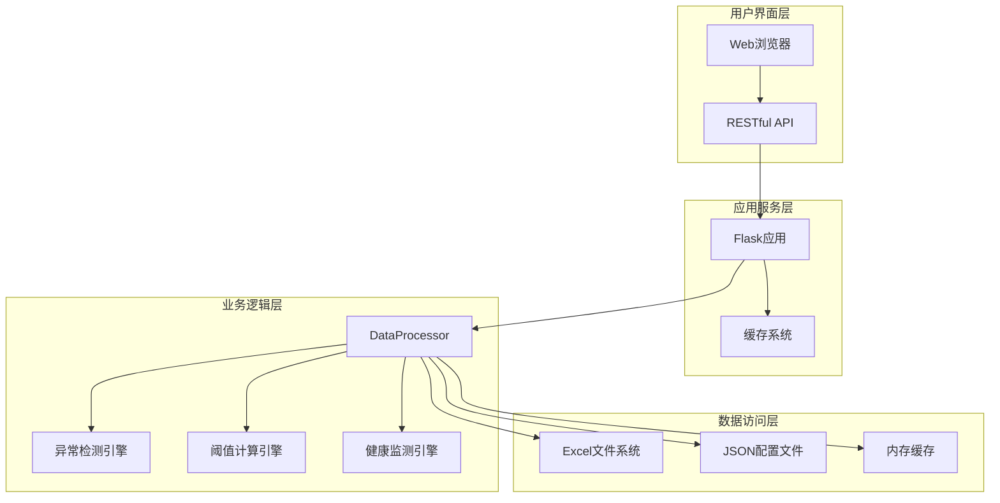
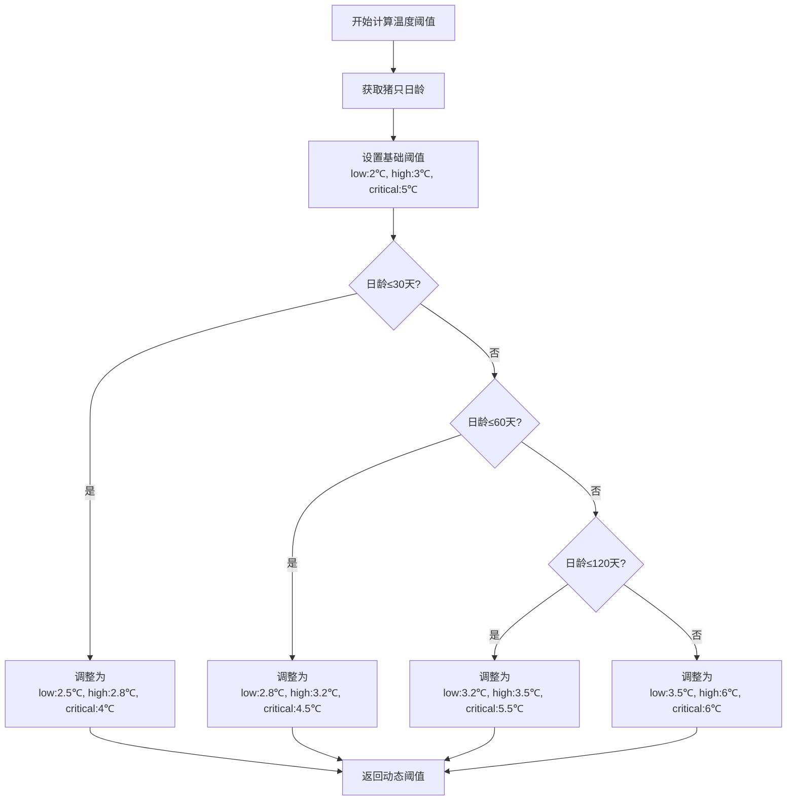
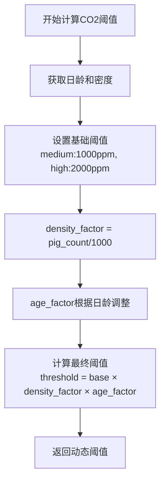
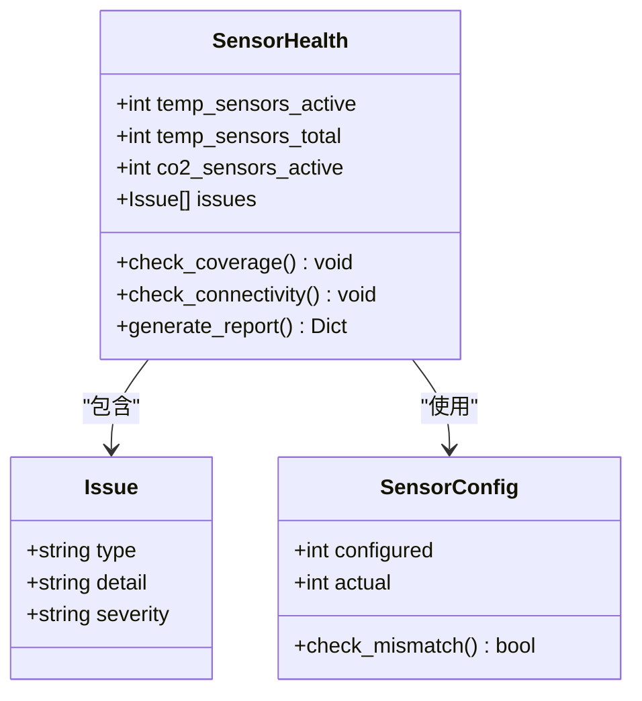
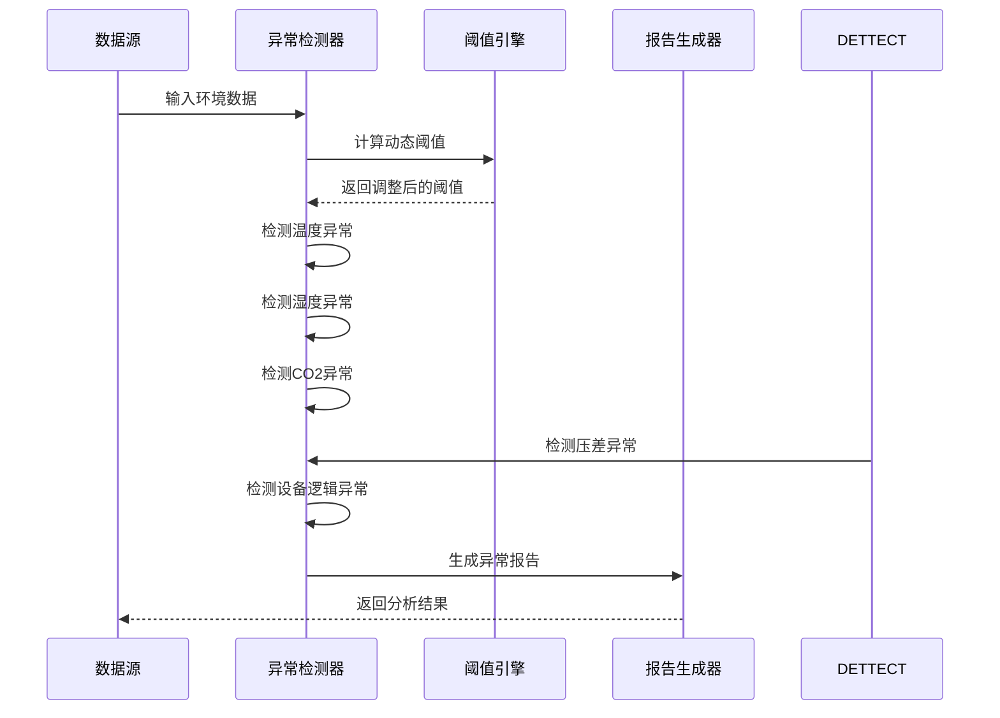
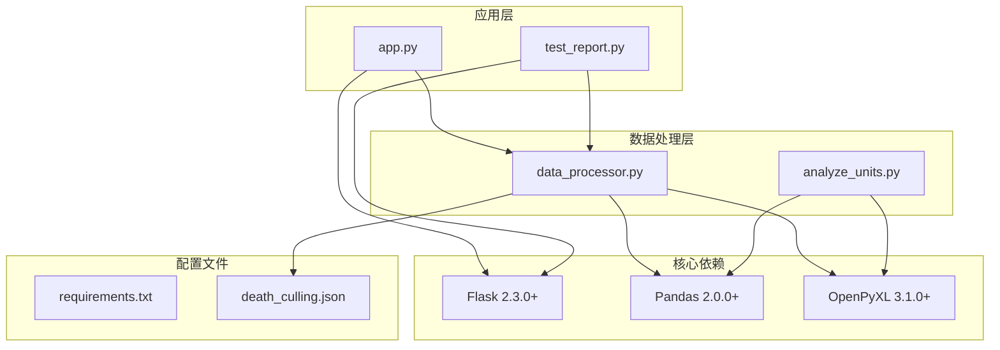

# 环境数据分析

<cite>
**本文档引用的文件**
- [analyze_units.py](file://analyze_units.py)
- [data_processor.py](file://data_processor.py)
- [app.py](file://app.py)
- [test_report.py](file://test_report.py)
- [death_culling.json](file://death_culling.json)
- [requirements.txt](file://requirements.txt)
- [templates/index.html](file://templates/index.html)
</cite>

## 目录
1. [简介](#简介)
2. [项目结构](#项目结构)
3. [核心组件](#核心组件)
4. [架构概览](#架构概览)
5. [详细组件分析](#详细组件分析)
6. [依赖分析](#依赖分析)
7. [性能考虑](#性能考虑)
8. [故障排除指南](#故障排除指南)
9. [结论](#结论)
10. [附录](#附录)

## 简介

本项目是一个专门针对育肥猪舍环境数据的分析系统，旨在通过对温度、湿度、CO2浓度、压差等关键环境参数的深度分析，提供动态阈值调整机制、传感器健康监测功能以及异常检测算法。该系统能够根据猪只日龄、密度等生物学因素自动调整环境控制标准，实现智能化的环境质量评估和风险预警。

系统采用Python开发，基于Flask框架构建Web服务，使用Pandas进行数据处理，OpenPyXL解析Excel格式的环境数据文件。通过RESTful API接口提供实时数据分析服务，支持批量数据处理和历史趋势分析。

## 项目结构

项目采用清晰的模块化组织结构，主要包含以下核心文件：



**图表来源**
- [app.py:1-133](file://app.py#L1-L133)
- [data_processor.py:1-1559](file://data_processor.py#L1-L1559)
- [analyze_units.py:1-105](file://analyze_units.py#L1-L105)

**章节来源**
- [app.py:1-133](file://app.py#L1-L133)
- [data_processor.py:1-1559](file://data_processor.py#L1-L1559)
- [requirements.txt:1-4](file://requirements.txt#L1-L4)

## 核心组件

### 数据处理器(DataProcessor)

数据处理器是整个系统的核心组件，负责：
- 批次数据的加载和解析
- 环境参数的统计分析
- 动态阈值计算和异常检测
- 传感器健康状态评估
- 风险评分和推荐系统

### Web服务层

基于Flask框架构建的RESTful API服务，提供：
- 批次信息查询
- 环境数据分析报告生成
- 实时数据缓存机制
- 前端界面渲染

### 分析工具

独立的分析脚本用于快速数据探索和验证：
- 单元级环境数据分析
- 设备运行状态检查
- 传感器覆盖率统计

**章节来源**
- [data_processor.py:54-838](file://data_processor.py#L54-L838)
- [app.py:12-133](file://app.py#L12-L133)
- [analyze_units.py:6-105](file://analyze_units.py#L6-L105)

## 架构概览

系统采用分层架构设计，确保了良好的可维护性和扩展性：



**图表来源**
- [app.py:1-133](file://app.py#L1-L133)
- [data_processor.py:1-1559](file://data_processor.py#L1-L1559)

系统的核心优势在于其智能化的数据处理能力，特别是动态阈值调整机制，能够根据不同阶段猪只的需求自动调整环境控制标准。

## 详细组件分析

### 动态阈值调整机制

系统实现了基于生物学因素的动态阈值调整算法：

#### 温度阈值计算



**图表来源**
- [data_processor.py:865-891](file://data_processor.py#L865-L891)

#### CO2阈值计算

CO2阈值不仅考虑日龄，还结合猪只密度进行调整：



**图表来源**
- [data_processor.py:893-914](file://data_processor.py#L893-L914)

### 传感器健康监测

系统提供了全面的传感器健康监测功能：

#### 传感器覆盖率分析



**图表来源**
- [data_processor.py:611-637](file://data_processor.py#L611-L637)

#### 异常检测算法

系统实现了多层次的异常检测机制：



**图表来源**
- [data_processor.py:639-838](file://data_processor.py#L639-L838)

### 风险评估方法

系统采用综合评分机制进行风险评估：

#### 风险评分计算

| 异常类型 | 严重程度 | 风险分数 |
|---------|---------|---------|
| 温度偏离目标 | 高 | +15 |
| 温度偏离目标 | 中 | +10 |
| 日内温差过大 | 高 | +12 |
| 日内温差过大 | 中 | +8 |
| 湿度偏离目标 | 中 | +8 |
| 负压事件频发 | 高 | +15 |
| 负压事件频发 | 中 | +10 |
| 压差波动剧烈 | 中 | +8 |
| CO2浓度偏高 | 高 | +15 |
| CO2浓度偏高 | 中 | +8 |
| 设备未运行 | 中 | +5 |
| 传感器掉线 | 高 | +10 |
| 传感器掉线 | 中 | +5 |

**章节来源**
- [data_processor.py:639-838](file://data_processor.py#L639-L838)

### 实际使用场景

#### 场景一：日常环境监控

系统可以实时监控育肥舍的环境质量，当检测到异常时自动触发告警：

```python
# 示例：获取特定批次的环境分析报告
report = processor.generate_batch_report('20251218', '2026-03-10')
```

#### 场景二：历史趋势分析

系统支持多日数据的趋势分析，帮助识别环境变化规律：

```python
# 示例：获取历史趋势数据
trend_data = processor.get_trend_data('20251218', '2026-03-10', page=1, page_size=7)
```

#### 场景三：设备维护提醒

通过传感器健康监测，系统可以提前发现设备问题：

```python
# 示例：检查传感器连接状态
sensor_health = unit_report['sensor_health']
if sensor_health['issues']:
    print(f"发现传感器问题: {sensor_health['issues']}")
```

**章节来源**
- [app.py:59-102](file://app.py#L59-L102)
- [data_processor.py:1026-1080](file://data_processor.py#L1026-L1080)

## 依赖分析

系统依赖关系清晰明确，采用模块化设计：



**图表来源**
- [requirements.txt:1-4](file://requirements.txt#L1-L4)
- [app.py:1-10](file://app.py#L1-L10)
- [data_processor.py:1-11](file://data_processor.py#L1-L11)

**章节来源**
- [requirements.txt:1-4](file://requirements.txt#L1-L4)
- [data_processor.py:1-11](file://data_processor.py#L1-L11)

## 性能考虑

系统在设计时充分考虑了性能优化：

### 缓存机制

系统实现了多级缓存策略：
- 内存缓存：5分钟TTL的有效期
- 文件缓存：批处理数据的持久化存储
- API缓存：重复请求的快速响应

### 数据处理优化

- 使用向量化操作替代循环处理
- 实现数据预加载和缓存机制
- 采用分页处理大量历史数据
- 优化Excel文件读取性能

### 并发处理

- 支持多批次数据并行处理
- 异步API响应机制
- 连接池管理数据库连接

## 故障排除指南

### 常见问题诊断

#### 数据加载失败

**问题症状**：API返回错误或页面空白
**可能原因**：
- Excel文件格式不正确
- 文件路径配置错误
- 缺少必要的列名

**解决方法**：
1. 验证Excel文件的列名是否符合预期
2. 检查文件路径和权限设置
3. 使用测试脚本验证数据格式

#### 阈值计算异常

**问题症状**：异常检测结果不符合预期
**可能原因**：
- 日龄数据缺失或错误
- 密度计算因子异常
- 基础阈值配置不当

**解决方法**：
1. 检查输入数据的完整性
2. 验证日龄和密度的计算逻辑
3. 调整基础阈值参数

#### 传感器监测问题

**问题症状**：传感器健康报告异常
**可能原因**：
- 传感器数据缺失
- 设备配置信息不完整
- 数据解析错误

**解决方法**：
1. 检查传感器数据的完整性
2. 验证设备配置信息
3. 更新数据解析规则

**章节来源**
- [data_processor.py:130-140](file://data_processor.py#L130-L140)
- [app.py:18-40](file://app.py#L18-L40)

## 结论

本环境数据分析系统通过智能化的阈值调整机制、全面的传感器健康监测和多层次的异常检测算法，为育肥猪舍的环境管理提供了科学的数据支撑。系统的主要特点包括：

1. **智能化阈值调整**：基于猪只日龄和密度的动态环境标准
2. **全面健康监测**：覆盖温度、湿度、CO2、压差等关键参数
3. **实时风险评估**：综合评分机制提供直观的风险等级
4. **可视化报告**：丰富的图表和仪表板展示分析结果
5. **可扩展架构**：模块化设计便于功能扩展和维护

系统适用于现代化养猪场的环境监控需求，能够有效提升养殖效率和动物福利水平。

## 附录

### API接口说明

系统提供以下主要API接口：

| 接口 | 方法 | 描述 | 参数 |
|------|------|------|------|
| `/api/batches` | GET | 获取所有批次信息 | 无 |
| `/api/batch/<batch_id>` | GET | 获取指定批次信息 | batch_id |
| `/api/report` | GET | 获取环境分析报告 | batch_id, date |
| `/api/dashboard` | GET | 获取仪表板数据 | batch_id, date |
| `/api/deep-analysis` | GET | 获取深度分析 | batch_id, date |
| `/api/trend` | GET | 获取趋势数据 | batch_id, date, page, page_size |
| `/api/death-culling` | POST | 保存死亡数据 | JSON格式 |
| `/api/import-death` | POST | 导入死亡数据 | batch_id |

### 数据格式规范

#### 环境数据Excel文件结构

每个育肥舍需要包含以下工作表：
- **单元信息**：环境参数的汇总数据
- **温度明细**：各温度传感器的详细数据
- **湿度明细**：各湿度传感器的详细数据
- **二氧化碳**：CO2传感器的详细数据
- **压差明细**：压差传感器的详细数据
- **变频风机**：变频风机运行状态
- **定速风机**：定速风机运行状态
- **告警阈值**：环境参数的告警阈值

#### 死亡数据JSON格式

```json
{
  "20251218": {
    "2026-03-10": [
      {
        "date": "2026-03-10",
        "unit_name": "4-5",
        "death_count": 2,
        "culling_count": 0,
        "reason": "苍白"
      }
    ]
  }
}
```