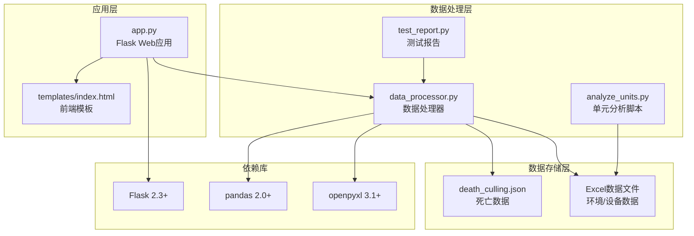
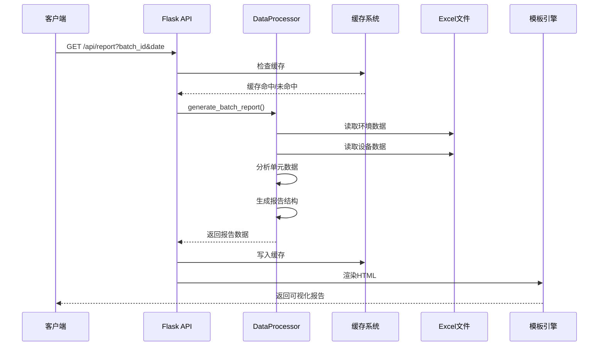
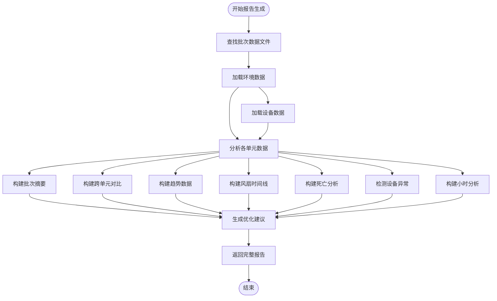
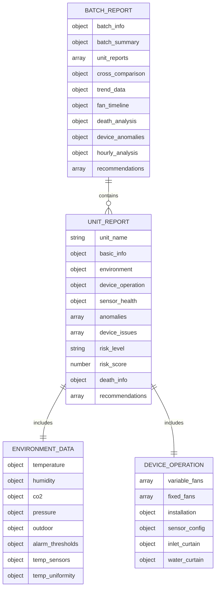
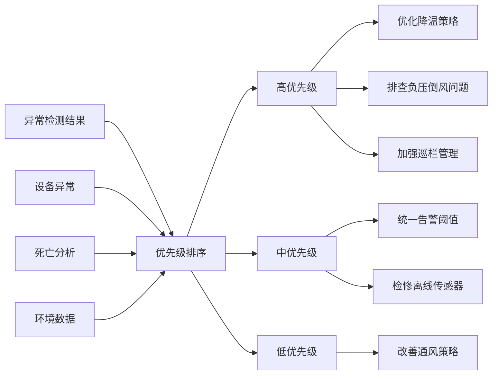
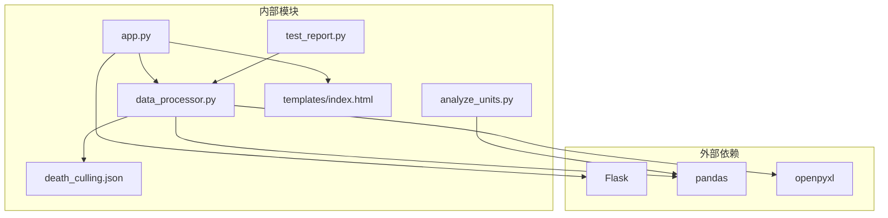

# 综合报告生成功能技术文档

<cite>
**本文档引用的文件**
- [app.py](file://app.py)
- [data_processor.py](file://data_processor.py)
- [analyze_units.py](file://analyze_units.py)
- [test_report.py](file://test_report.py)
- [death_culling.json](file://death_culling.json)
- [templates/index.html](file://templates/index.html)
- [requirements.txt](file://requirements.txt)
</cite>

## 目录
1. [简介](#简介)
2. [项目结构](#项目结构)
3. [核心组件](#核心组件)
4. [架构概览](#架构概览)
5. [详细组件分析](#详细组件分析)
6. [依赖关系分析](#依赖关系分析)
7. [性能考虑](#性能考虑)
8. [故障排除指南](#故障排除指南)
9. [结论](#结论)
10. [附录](#附录)

## 简介

本项目是一个基于Python的综合报告生成功能系统，专门用于育肥猪批次环境控制数据分析。该系统能够从Excel数据文件中提取环境参数、设备运行状态、传感器健康状况等信息，生成包含单元报告汇总、跨单元对比分析、趋势数据整合等功能的综合报告。

系统采用Flask框架构建RESTful API服务，支持实时数据处理和缓存机制，提供Web界面展示和JSON格式的数据输出。报告内容涵盖环境质量评估、设备运行分析、风险评估、优化建议等多个维度。

## 项目结构

项目采用模块化设计，主要包含以下核心文件：

**图表来源**
- [app.py:1-133](file://app.py#L1-L133)
- [data_processor.py:1-1559](file://data_processor.py#L1-L1559)
- [requirements.txt:1-4](file://requirements.txt#L1-L4)

**章节来源**
- [app.py:1-133](file://app.py#L1-L133)
- [data_processor.py:1-1559](file://data_processor.py#L1-L1559)
- [requirements.txt:1-4](file://requirements.txt#L1-L4)

## 核心组件

### 数据处理器(DataProcessor)

数据处理器是整个系统的核心组件，负责：
- 批次数据文件的自动发现和解析
- 单元级环境数据的深度分析
- 跨单元对比和趋势数据构建
- 风险评估和优化建议生成
- 缓存机制的实现和管理

### Flask Web应用

提供RESTful API接口：
- 批次数据查询接口
- 报告生成接口
- 实时分析接口
- 趋势数据接口
- 死亡数据管理接口

### 前端模板

基于Chart.js的可视化展示：
- 实时环境参数图表
- 趋势分析图表
- 风扇运行状态可视化
- 风险评估仪表板

**章节来源**
- [data_processor.py:54-1559](file://data_processor.py#L54-L1559)
- [app.py:1-133](file://app.py#L1-L133)
- [templates/index.html:1-800](file://templates/index.html#L1-L800)

## 架构概览

系统采用分层架构设计，确保了良好的可维护性和扩展性：

**图表来源**
- [app.py:59-102](file://app.py#L59-L102)
- [data_processor.py:238-295](file://data_processor.py#L238-L295)

系统架构特点：
- **模块化设计**：每个组件职责明确，便于独立开发和测试
- **缓存机制**：双重缓存（应用层和数据层）提升响应性能
- **异步处理**：支持大数据量的批处理分析
- **可扩展性**：易于添加新的分析维度和报告类型

## 详细组件分析

### 报告生成流程

综合报告生成包含以下关键步骤：

**图表来源**
- [data_processor.py:238-295](file://data_processor.py#L238-L295)
- [data_processor.py:303-838](file://data_processor.py#L303-L838)

### 数据结构设计

报告数据采用层次化的JSON结构：

**图表来源**
- [data_processor.py:284-295](file://data_processor.py#L284-L295)
- [data_processor.py:315-327](file://data_processor.py#L315-L327)

### 风险评估算法

系统实现了多层次的风险评估机制：

#### 动态阈值计算
- **温度阈值**：根据猪只日龄动态调整
  - 幼猪(≤30天)：±2.5°C
  - 中猪(31-60天)：±2.8°C  
  - 中后期(61-120天)：±3.2°C
  - 成猪(>120天)：±3.5°C

- **CO2阈值**：综合考虑日龄和猪只密度
  - 基础阈值：1000ppm/2000ppm
  - 密度因子：每1000头猪×系数
  - 年龄因子：随日龄变化

#### 组合风险分析
系统识别多种环境参数的组合风险：
- 高温高湿组合风险
- 多参数同时超标的复合风险
- 通风不足与环境参数不匹配的风险

**章节来源**
- [data_processor.py:865-914](file://data_processor.py#L865-L914)
- [data_processor.py:1251-1330](file://data_processor.py#L1251-L1330)

### 推荐系统算法

推荐系统基于以下原则生成优化建议：

**图表来源**
- [data_processor.py:1426-1497](file://data_processor.py#L1426-L1497)

推荐算法特点：
- **层次化优先级**：根据风险严重程度分级
- **针对性建议**：针对具体问题提供解决方案
- **预期效果**：量化建议的预期改善效果
- **可执行性**：确保建议具有可操作性

### 报告模板设计

前端模板采用响应式设计，支持多种设备访问：

#### 关键组件
- **KPI卡片**：显示核心指标和风险等级
- **图表区域**：使用Chart.js展示趋势数据
- **表格组件**：展示详细的单元对比数据
- **建议面板**：突出显示优化建议
- **交互导航**：支持标签页切换和筛选

#### 可视化特性
- **实时更新**：支持动态数据刷新
- **颜色编码**：通过颜色直观显示风险等级
- **响应式布局**：适配不同屏幕尺寸
- **打印友好**：优化打印格式

**章节来源**
- [templates/index.html:1-800](file://templates/index.html#L1-L800)

## 依赖关系分析

系统依赖关系清晰，遵循单一职责原则：

**图表来源**
- [requirements.txt:1-4](file://requirements.txt#L1-L4)
- [app.py:1-10](file://app.py#L1-L10)

**章节来源**
- [requirements.txt:1-4](file://requirements.txt#L1-L4)
- [app.py:1-10](file://app.py#L1-L10)

## 性能考虑

### 缓存策略

系统实现了双重缓存机制：

1. **应用层缓存**：5分钟TTL的内存缓存
2. **数据层缓存**：Sheet级别的缓存，避免重复读取

### 性能优化措施

- **批量数据处理**：支持大规模数据集的高效处理
- **延迟加载**：按需加载Excel数据，减少内存占用
- **索引优化**：对常用查询建立索引
- **并发处理**：支持多线程数据处理

### 内存管理

- **垃圾回收**：定期清理缓存和临时数据
- **数据类型优化**：使用合适的数据类型减少内存占用
- **分块处理**：大文件采用分块读取方式

## 故障排除指南

### 常见问题及解决方案

#### 数据加载失败
**问题**：Excel文件读取错误
**解决方案**：
1. 检查文件路径和权限
2. 验证Excel文件格式完整性
3. 确认文件未被其他程序占用

#### 报告生成缓慢
**问题**：大批量数据处理耗时过长
**解决方案**：
1. 检查缓存配置和TTL设置
2. 优化数据文件结构
3. 考虑分批处理大数据集

#### API响应错误
**问题**：HTTP 500错误
**解决方案**：
1. 查看服务器日志获取详细错误信息
2. 验证数据文件的完整性和一致性
3. 检查网络连接和防火墙设置

### 调试工具

系统提供了多种调试和测试工具：

- **单元测试**：验证核心算法的正确性
- **集成测试**：测试完整的数据处理流程
- **性能测试**：评估系统在大数据量下的表现
- **可视化调试**：通过Web界面查看中间结果

**章节来源**
- [test_report.py:1-48](file://test_report.py#L1-L48)
- [app.py:126-129](file://app.py#L126-L129)

## 结论

本综合报告生成功能系统提供了完整的育肥猪批次环境控制数据分析解决方案。系统具有以下优势：

1. **全面的数据分析能力**：涵盖环境参数、设备运行、传感器健康等多个维度
2. **智能的风险评估**：基于动态阈值和组合分析的多层级风险评估
3. **实用的优化建议**：针对性强、可执行的优化方案
4. **良好的用户体验**：直观的可视化界面和响应式设计
5. **高性能的架构**：支持大规模数据处理和实时分析

系统为养殖场管理者提供了科学决策支持，有助于提高养殖效率和动物福利水平。

## 附录

### API接口规范

系统提供以下主要API接口：

- `GET /api/batches` - 获取所有批次信息
- `GET /api/batch/<batch_id>` - 获取指定批次详情
- `GET /api/report` - 获取综合报告
- `GET /api/dashboard` - 获取仪表板数据
- `GET /api/deep-analysis` - 获取深度分析
- `GET /api/trend` - 获取趋势数据
- `POST /api/death-culling` - 保存死亡数据
- `POST /api/import-death` - 导入死亡数据

### 配置选项

系统支持以下配置选项：
- 批次配置文件：`batch_config.json`
- 死亡数据配置：`death_culling.json`
- 缓存配置：TTL设置、缓存大小限制
- 数据文件路径：自动发现和解析规则

### 扩展建议

为进一步完善系统，建议考虑：
- 添加机器学习算法进行预测分析
- 支持更多数据源和格式
- 增强移动端访问体验
- 集成通知和告警功能