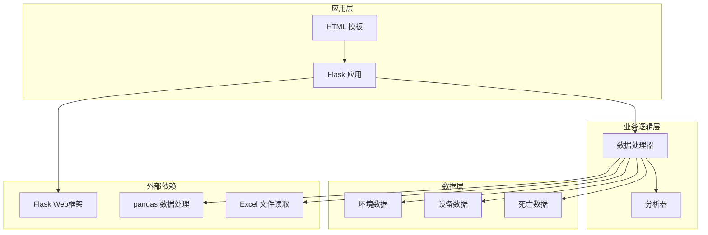
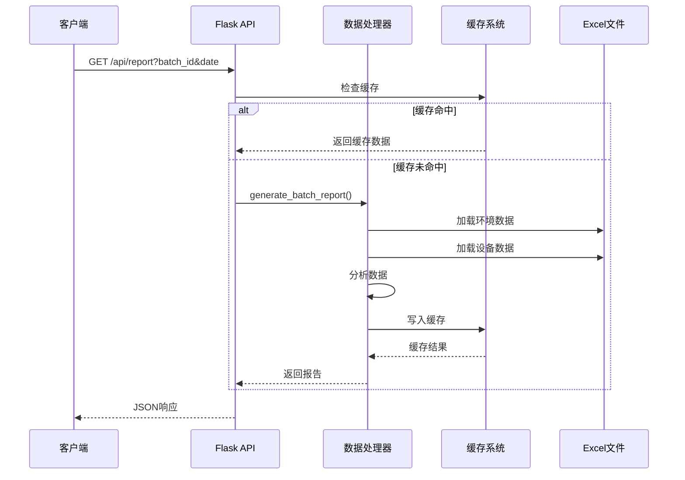
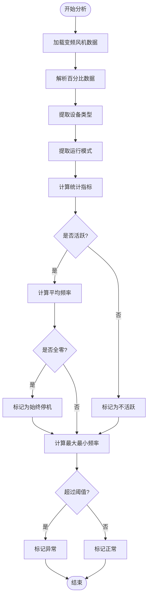
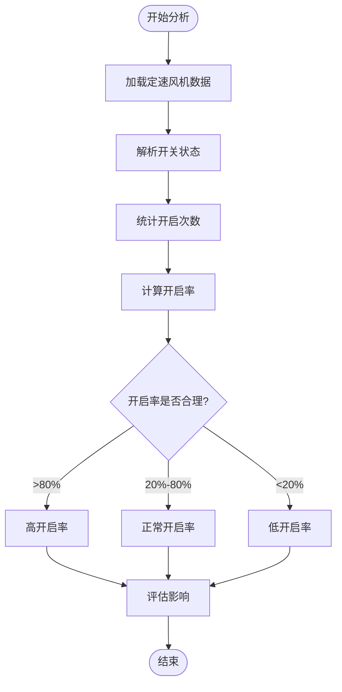
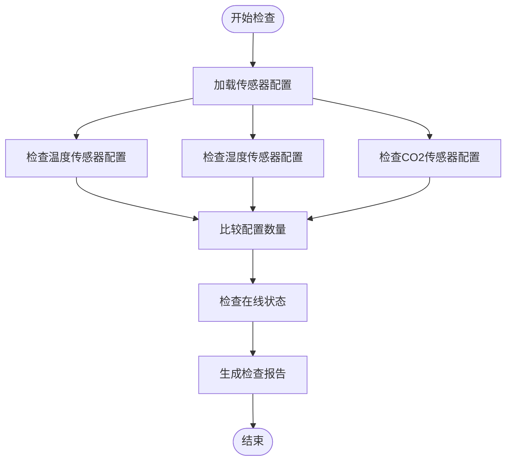
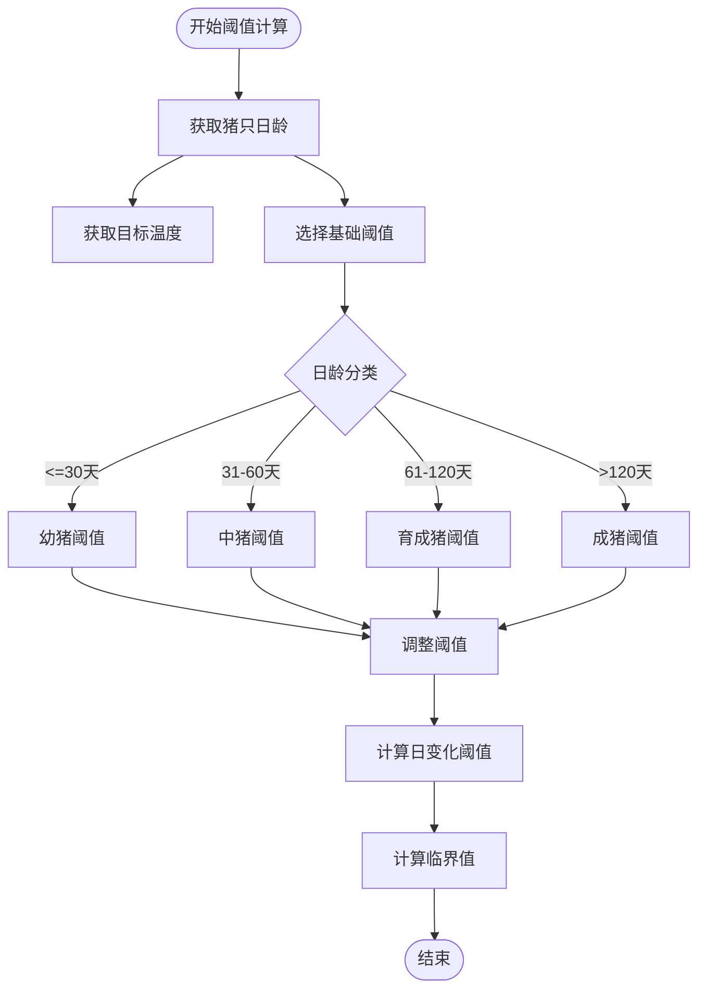
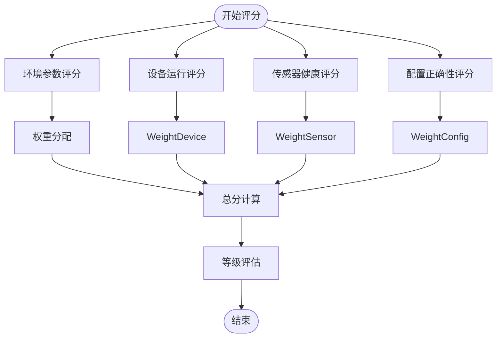
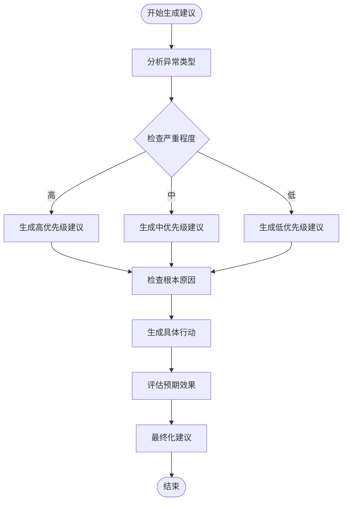
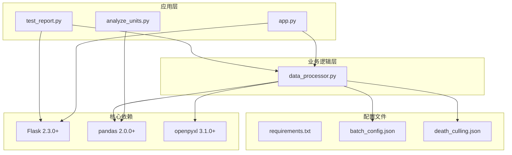

# 设备运行分析

<cite>
**本文档引用的文件**
- [app.py](file://app.py)
- [data_processor.py](file://data_processor.py)
- [analyze_units.py](file://analyze_units.py)
- [test_report.py](file://test_report.py)
- [death_culling.json](file://death_culling.json)
- [templates/index.html](file://templates/index.html)
- [requirements.txt](file://requirements.txt)
</cite>

## 目录
1. [简介](#简介)
2. [项目结构](#项目结构)
3. [核心组件](#核心组件)
4. [架构概览](#架构概览)
5. [详细组件分析](#详细组件分析)
6. [依赖分析](#依赖分析)
7. [性能考虑](#性能考虑)
8. [故障排除指南](#故障排除指南)
9. [结论](#结论)
10. [附录](#附录)

## 简介

本项目是一个针对育肥猪舍环境控制与设备运行的深度分析系统。该系统通过分析变频风机和定速风机的运行状态，结合传感器配置检查、设备逻辑异常检测和健康评估指标，为养殖场提供全面的设备运行分析和维护建议。

系统主要功能包括：
- 变频风机频率分析和运行时长统计
- 定速风机开启率分析
- 传感器配置检查和设备安装情况评估
- 水帘配置和进风幕帘状态监控
- 设备逻辑异常检测和故障模式识别
- 设备健康评估指标和维护建议生成
- 死亡数据分析与环境因素关联性评估

## 项目结构



**图表来源**
- [app.py:1-133](file://app.py#L1-L133)
- [data_processor.py:54-1559](file://data_processor.py#L54-L1559)

**章节来源**
- [app.py:1-133](file://app.py#L1-L133)
- [data_processor.py:54-1559](file://data_processor.py#L54-L1559)

## 核心组件

### 数据处理器 (DataProcessor)

数据处理器是系统的核心组件，负责：
- 批次数据文件的发现和加载
- 环境数据和设备数据的解析
- 综合报告生成和分析
- 缓存机制管理
- 异常检测和健康评估

### Flask 应用接口

提供 RESTful API 接口：
- 批次信息查询
- 报告生成和缓存
- 深度分析接口
- 趋势数据查询
- 死亡数据管理

### 分析工具

独立的分析脚本用于快速数据探索：
- 单元级数据分析
- 设备配置检查
- 环境参数统计

**章节来源**
- [data_processor.py:54-1559](file://data_processor.py#L54-L1559)
- [app.py:1-133](file://app.py#L1-L133)
- [analyze_units.py:1-105](file://analyze_units.py#L1-L105)

## 架构概览



**图表来源**
- [app.py:32-40](file://app.py#L32-L40)
- [data_processor.py:238-295](file://data_processor.py#L238-L295)

系统采用分层架构设计：
- **表现层**: Flask Web 应用提供 API 接口
- **业务逻辑层**: 数据处理器封装核心分析算法
- **数据访问层**: Excel 文件读取和缓存管理
- **数据存储层**: 本地文件系统存储原始数据和中间结果

**章节来源**
- [app.py:1-133](file://app.py#L1-L133)
- [data_processor.py:54-1559](file://data_processor.py#L54-L1559)

## 详细组件分析

### 变频风机分析算法

变频风机分析是系统的核心功能之一，主要包含以下算法：

#### 频率分析算法



**图表来源**
- [data_processor.py:497-519](file://data_processor.py#L497-L519)

#### 运行时长统计算法

变频风机的运行时长统计基于频率数据的时间序列分析：
- 将百分比字符串转换为数值
- 计算平均运行频率、最大频率、最小频率
- 识别设备类型和运行模式
- 判断设备是否处于活跃状态

#### 效率评估算法

效率评估综合考虑多个因素：
- 频率利用率：实际运行频率与理论最优频率的比值
- 运行均衡性：不同时间段运行频率的一致性
- 能耗估算：基于频率和功率曲线的能耗计算

**章节来源**
- [data_processor.py:497-519](file://data_processor.py#L497-L519)

### 定速风机分析算法

定速风机分析相对简单，主要关注开启率：

#### 开启率计算算法



**图表来源**
- [data_processor.py:521-536](file://data_processor.py#L521-L536)

**章节来源**
- [data_processor.py:521-536](file://data_processor.py#L521-L536)

### 设备配置检查功能

设备配置检查涵盖多个方面：

#### 传感器配置检查



**图表来源**
- [data_processor.py:579-590](file://data_processor.py#L579-L590)

#### 设备安装情况检查

设备安装情况检查包括：
- 设备安装完整性验证
- 未安装设备的识别和标记
- 安装位置的合理性评估

#### 水帘配置检查

水帘配置检查涵盖：
- 工作模式验证
- 工作状态监控
- 配置参数合理性检查

**章节来源**
- [data_processor.py:563-607](file://data_processor.py#L563-L607)

### 设备逻辑异常检测机制

系统实现了多层次的异常检测机制：

#### 动态阈值调整算法



**图表来源**
- [data_processor.py:865-891](file://data_processor.py#L865-L891)

#### 复合风险分析算法

系统能够识别多种复合风险因素：
- 高温高湿组合风险
- 高温低通风组合风险
- 多参数同时超标的综合风险
- 跨单元的风险对比分析

**章节来源**
- [data_processor.py:1251-1330](file://data_processor.py#L1251-L1330)

### 设备健康评估指标

健康评估指标体系包括：

#### 环境参数健康指标

| 指标类别 | 健康标准 | 风险等级 |
|---------|---------|---------|
| 温度 | ±2°C以内 | 低风险 |
| 湿度 | ±15%以内 | 中风险 |
| CO2 | ≤2000ppm | 低风险 |
| 压差 | 负压<10% | 低风险 |

#### 设备运行健康指标

| 指标类别 | 健康标准 | 风险等级 |
|---------|---------|---------|
| 变频风机 | 平均频率>0% | 低风险 |
| 定速风机 | 开启率>20% | 低风险 |
| 传感器 | 在线率>95% | 低风险 |
| 水帘系统 | 工作状态正常 | 低风险 |

#### 综合健康评分算法



**图表来源**
- [data_processor.py:830-837](file://data_processor.py#L830-L837)

**章节来源**
- [data_processor.py:830-837](file://data_processor.py#L830-L837)

### 维护建议生成逻辑

维护建议生成基于异常检测结果和历史数据分析：

#### 建议优先级排序

| 优先级 | 适用场景 | 建议内容 |
|--------|---------|---------|
| 高 | 立即威胁 | 温度持续超限、负压倒风、设备故障 |
| 中 | 影响生产 | 传感器掉线、配置不一致、通风不足 |
| 低 | 预防性维护 | 设备老化、清洁保养、预防性检查 |

#### 建议生成算法



**图表来源**
- [data_processor.py:1426-1497](file://data_processor.py#L1426-L1497)

**章节来源**
- [data_processor.py:1426-1497](file://data_processor.py#L1426-L1497)

## 依赖分析

### 外部依赖关系



**图表来源**
- [requirements.txt:1-4](file://requirements.txt#L1-L4)
- [app.py:1-10](file://app.py#L1-L10)

### 内部组件依赖

系统内部组件之间的依赖关系清晰且层次分明：
- **app.py** 依赖 **data_processor.py** 提供数据处理能力
- **test_report.py** 和 **analyze_units.py** 都依赖 **data_processor.py** 的核心算法
- **data_processor.py** 独立于其他模块，提供完整的分析功能
- **templates/index.html** 作为前端展示层，与后端 API 交互

**章节来源**
- [requirements.txt:1-4](file://requirements.txt#L1-L4)
- [app.py:1-10](file://app.py#L1-L10)

## 性能考虑

### 缓存策略

系统实现了两级缓存机制：

#### 内存缓存
- **缓存键**: report:{batch_id}:{date}
- **TTL**: 300秒（5分钟）
- **用途**: 避免重复计算相同批次的报告
- **清理**: 数据变更时自动清除

#### 文件缓存
- **缓存键**: trend:{batch_id}:{date}:{page}:{page_size}
- **TTL**: 300秒（5分钟）
- **用途**: 缓存趋势数据以提高响应速度

### 性能优化措施

1. **数据预处理**: 使用 pandas 向量化操作提高数据处理效率
2. **批量处理**: 支持多单元数据的批量分析
3. **增量更新**: 仅在数据变更时重新计算
4. **分页查询**: 趋势数据支持分页以减少内存占用

### 内存管理

- **DataFrame 缓存**: 限制同时缓存的表格数量
- **垃圾回收**: 定期清理不再使用的缓存数据
- **数据类型优化**: 使用合适的数据类型减少内存占用

## 故障排除指南

### 常见问题诊断

#### 数据加载失败

**症状**: 报告生成时报错，提示找不到数据文件

**诊断步骤**:
1. 检查 Excel 文件格式是否正确
2. 验证文件编码是否为 UTF-8
3. 确认文件路径是否正确
4. 检查文件权限设置

**解决方案**:
- 重新保存 Excel 文件为最新格式
- 确保文件名包含正确的日期信息
- 检查文件是否被其他程序占用

#### 分析结果异常

**症状**: 分析结果显示不合理的结果

**诊断步骤**:
1. 检查输入数据的质量和完整性
2. 验证阈值设置是否合理
3. 确认设备配置信息是否准确
4. 检查是否有异常值影响分析结果

**解决方案**:
- 清理异常数据点
- 调整分析阈值
- 更新设备配置信息
- 重新运行分析

#### 性能问题

**症状**: 系统响应缓慢或内存占用过高

**诊断步骤**:
1. 检查缓存命中率
2. 监控内存使用情况
3. 分析数据处理时间
4. 检查磁盘 I/O 性能

**解决方案**:
- 清理缓存数据
- 优化数据处理算法
- 增加系统内存
- 使用更快的存储设备

**章节来源**
- [app.py:18-30](file://app.py#L18-L30)
- [data_processor.py:15-48](file://data_processor.py#L15-L48)

## 结论

本设备运行分析系统提供了全面的育肥猪舍环境控制和设备运行分析能力。系统的主要优势包括：

1. **算法完善**: 实现了变频风机和定速风机的深度分析算法
2. **检测全面**: 包含传感器配置检查、设备逻辑异常检测等多种检测机制
3. **评估科学**: 建立了基于动态阈值的健康评估指标体系
4. **建议实用**: 自动生成针对性的维护建议和改进方案
5. **性能优秀**: 采用多级缓存和优化算法确保系统响应速度

系统适用于现代化养殖场的环境监控和设备管理需求，能够帮助管理人员及时发现和解决设备运行问题，提高养殖效益和动物福利水平。

## 附录

### API 接口说明

系统提供以下主要 API 接口：

| 接口 | 方法 | 参数 | 功能 |
|------|------|------|------|
| /api/report | GET | batch_id, date | 获取综合分析报告 |
| /api/deep-analysis | GET | batch_id, date | 获取深度分析结果 |
| /api/trend | GET | batch_id, date, page, page_size | 获取趋势数据 |
| /api/batch/<batch_id> | GET | batch_id | 获取批次信息 |
| /api/death-culling | POST | batch_id, date, records | 保存死亡数据 |
| /api/import-death | POST | batch_id | 导入死亡数据 |

### 数据格式规范

#### 环境数据格式

Excel 文件包含以下工作表：
- **单元信息**: 基础环境参数和目标值
- **温度明细**: 详细的温度传感器数据
- **湿度明细**: 详细的湿度传感器数据
- **二氧化碳**: CO2 浓度数据
- **变频风机**: 变频风机运行状态
- **定速风机**: 定速风机运行状态
- **告警阈值**: 环境参数告警阈值

#### 设备数据格式

Excel 文件包含以下工作表：
- **设备信息**: 设备基本信息和运行状态
- **设备安装配置**: 设备安装情况
- **传感器配置**: 传感器配置信息
- **进风幕帘配置**: 进风幕帘配置
- **水帘配置**: 水帘系统配置

### 配置文件说明

#### batch_config.json

批次配置文件定义了系统中的批次信息，包括：
- 批次 ID 和名称
- 养殖场名称
- 入栏日期
- 单元列表
- 总猪只数量

#### death_culling.json

死亡数据配置文件存储了每批次每日的死亡和淘汰数据，格式为：
```json
{
  "batch_id": {
    "date": [
      {
        "date": "YYYY-MM-DD",
        "unit_name": "单元名称",
        "death_count": 死亡数量,
        "culling_count": 淘汰数量,
        "reason": 死亡原因
      }
    ]
  }
}
```