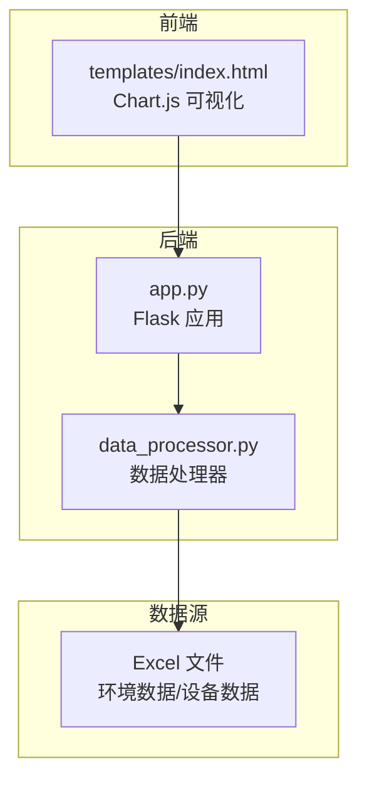
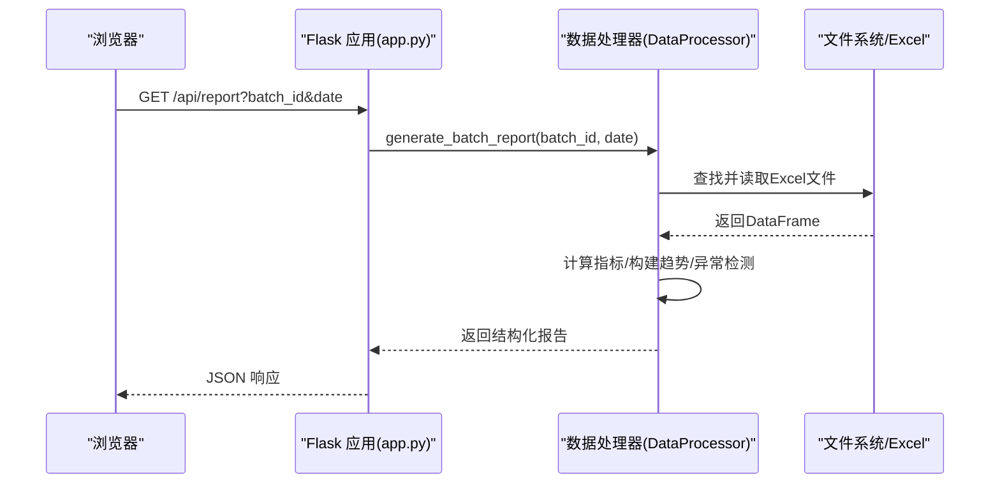
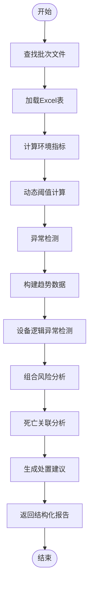
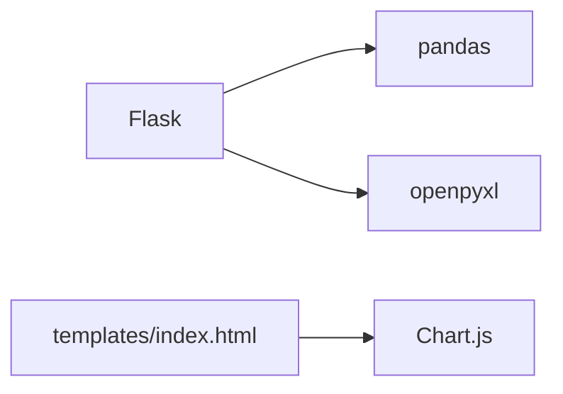

# 趋势预测分析

<cite>
**本文引用的文件**
- [app.py](file://app.py)
- [data_processor.py](file://data_processor.py)
- [analyze_units.py](file://analyze_units.py)
- [test_report.py](file://test_report.py)
- [requirements.txt](file://requirements.txt)
- [templates/index.html](file://templates/index.html)
</cite>

## 目录
1. [简介](#简介)
2. [项目结构](#项目结构)
3. [核心组件](#核心组件)
4. [架构总览](#架构总览)
5. [详细组件分析](#详细组件分析)
6. [依赖分析](#依赖分析)
7. [性能考虑](#性能考虑)
8. [故障排除指南](#故障排除指南)
9. [结论](#结论)
10. [附录](#附录)

## 简介
本项目围绕“趋势预测分析”主题，提供基于时间序列的环境数据（温度、湿度、CO2、压差等）的采集、清洗、聚合与可视化展示能力。系统通过批处理方式汇总多个育肥单元的数据，构建趋势图谱与设备运行时间线，支持按日期与批次筛选，辅助用户进行环境质量与设备运行的深度分析与决策。

## 项目结构
- 后端服务：Flask 应用，提供 REST 接口与模板渲染
- 数据处理：核心数据处理器负责 Excel 文件解析、指标计算、趋势构建与缓存
- 前端界面：基于 Chart.js 的可视化页面，支持趋势图、设备运行图、对比分析等
- 测试与示例：命令行脚本用于快速验证与演示

图表来源
- [app.py:1-133](file://app.py#L1-L133)
- [data_processor.py:1-1559](file://data_processor.py#L1-L1559)
- [templates/index.html:1-1983](file://templates/index.html#L1-L1983)

章节来源
- [app.py:1-133](file://app.py#L1-L133)
- [data_processor.py:1-1559](file://data_processor.py#L1-L1559)
- [templates/index.html:1-1983](file://templates/index.html#L1-L1983)

## 核心组件
- Flask 应用与路由：提供首页、批次列表、报告、仪表盘、深度分析、趋势、缓存清理等接口
- 数据处理器：负责文件发现、Excel 解析、指标统计、趋势构建、设备逻辑异常检测、组合风险分析、推荐建议等
- 前端模板：集成 Chart.js，渲染趋势图、设备运行图、对比分析、死亡关联与处置建议

章节来源
- [app.py:42-133](file://app.py#L42-L133)
- [data_processor.py:54-1559](file://data_processor.py#L54-L1559)
- [templates/index.html:838-1983](file://templates/index.html#L838-L1983)

## 架构总览
系统采用前后端分离的轻量架构：
- 前端通过 AJAX 请求后端接口获取 JSON 数据，动态渲染图表与表格
- 后端在内存中维护简单缓存，提升重复请求的响应速度
- 数据处理层专注于时间序列的抽取、聚合与统计，输出标准化的结构化数据

图表来源
- [app.py:59-66](file://app.py#L59-L66)
- [data_processor.py:238-295](file://data_processor.py#L238-L295)

## 详细组件分析

### 后端应用与路由
- 首页与模板渲染：返回 index.html 并注入批次列表
- 批次与报告接口：提供批次列表、批次详情、报告、仪表盘、深度分析、趋势等接口
- 缓存机制：全局字典缓存与 TTL 控制，支持按参数组合缓存
- 死亡/导入接口：支持保存与从 Excel 导入死亡/淘汰数据，并触发缓存清理

章节来源
- [app.py:42-133](file://app.py#L42-L133)

### 数据处理器（核心）
- 文件发现与解析：根据批次与日期定位单元文件，解析“单元信息”、“温度明细”、“湿度明细”、“二氧化碳”、“变频/定速风机”、“告警阈值”、“设备信息”、“进风幕帘配置”、“水帘配置”等表
- 指标计算：温度、湿度、CO2、压差、通风等级等的均值、极值、标准差、占比等
- 动态阈值：基于日龄与密度的温度与 CO2阈值动态调整
- 趋势构建：按时间序列抽取标签与各单元数值序列，支持室外温度与多指标对比
- 设备逻辑异常检测：跨单元阈值不一致、风机长期停机、通风模式不统一等
- 组合风险分析：多参数同时超标的复合风险评估
- 死亡关联分析：死亡事件与环境指标的关联评估
- 推荐建议：按优先级输出处置建议

图表来源
- [data_processor.py:1026-1559](file://data_processor.py#L1026-L1559)

章节来源
- [data_processor.py:54-1559](file://data_processor.py#L54-L1559)

### 前端可视化与交互
- 趋势图：温度、湿度、CO2、压差四类指标的单元对比折线图，支持室外温度叠加
- 设备运行图：变频风机频率时间线，按单元与风机类型分组
- 对比分析：跨单元指标对比与差异分析
- 死亡关联：死亡事件与环境上下文的关联评估
- 快捷键：R 刷新、D 昨天、N 明天、T 今天、? 帮助

章节来源
- [templates/index.html:1517-1624](file://templates/index.html#L1517-L1624)
- [templates/index.html:1629-1761](file://templates/index.html#L1629-L1761)
- [templates/index.html:1766-1846](file://templates/index.html#L1766-L1846)
- [templates/index.html:1877-1983](file://templates/index.html#L1877-L1983)

### 示例与测试
- analyze_units.py：演示如何读取指定单元的 Excel 表并打印关键指标
- test_report.py：直接调用数据处理器生成报告并打印关键摘要

章节来源
- [analyze_units.py:1-105](file://analyze_units.py#L1-L105)
- [test_report.py:1-48](file://test_report.py#L1-L48)

## 依赖分析
- Python 依赖：Flask、pandas、openpyxl
- 前端依赖：Chart.js（CDN 引入）

图表来源
- [requirements.txt:1-4](file://requirements.txt#L1-L4)
- [templates/index.html:8](file://templates/index.html#L8)

章节来源
- [requirements.txt:1-4](file://requirements.txt#L1-L4)

## 性能考虑
- 内存缓存：全局字典缓存与 TTL（默认 300 秒），显著降低重复请求的计算与 IO 成本
- 数据抽样：趋势构建时按步长抽样（约 10 分钟间隔），减少数据点数量，提升图表渲染性能
- 批处理：一次请求聚合多单元数据，避免多次 IO
- 前端虚拟滚动：在大量单元场景下，通过虚拟滚动减少 DOM 节点数量
- I/O 优化：Excel 表缓存（sheet 缓存），避免重复读取同一表

章节来源
- [app.py:15-40](file://app.py#L15-L40)
- [data_processor.py:12-52](file://data_processor.py#L12-L52)
- [data_processor.py:1047-1056](file://data_processor.py#L1047-L1056)
- [templates/index.html:1352-1390](file://templates/index.html#L1352-L1390)

## 故障排除指南
- 报告为空或异常
  - 检查批次 ID 与日期是否正确，确认对应目录存在且包含预期 Excel 文件
  - 使用测试脚本验证数据读取是否正常
- 图表空白
  - 确认时间列格式正确，确保能被解析为时间序列
  - 检查是否存在缺失列（如温度、湿度、CO2、压差等）
- 缓存问题
  - 使用缓存清理接口清除缓存后重试
- Excel 读取错误
  - 确认 openpyxl 版本满足要求，检查文件是否损坏或被占用

章节来源
- [test_report.py:1-48](file://test_report.py#L1-L48)
- [app.py:126-129](file://app.py#L126-L129)
- [data_processor.py:130-140](file://data_processor.py#L130-L140)

## 结论
本项目提供了完整的“趋势预测分析”闭环：从数据采集、指标计算、异常检测、趋势构建到可视化展示。通过动态阈值、组合风险与设备逻辑异常检测，系统能够帮助用户更准确地识别潜在问题并制定优先处置建议。前端采用 Chart.js 实现直观的趋势与对比分析，适合在生产环境中进行日常监控与深度分析。

## 附录
- 时间序列处理要点
  - 时间列解析与抽样：确保时间列可解析，按步长抽样以平衡精度与性能
  - 多指标对比：统一时间轴，按单元分组绘制，支持叠加室外温度
  - 设备运行时间线：按风机类型与单元分组，展示频率变化趋势
- 预测模型建议（概念性）
  - 线性回归：适用于单一变量随时间的线性趋势预测
  - 移动平均：平滑短期波动，突出长期趋势
  - 指数平滑：对近期观测赋予更高权重，适合非平稳序列
  - 季节性分解：若存在日/周/月等周期性，可先分解再建模
  - 注意：当前仓库未实现预测模型，以上为最佳实践建议
- 参数调优建议
  - 抽样步长：根据数据粒度与图表分辨率权衡
  - 阈值动态化：结合日龄与密度调整环境阈值
  - 异常检测：合理设置严重程度阈值，避免误报与漏报
  - 缓存 TTL：根据数据更新频率与访问压力调整