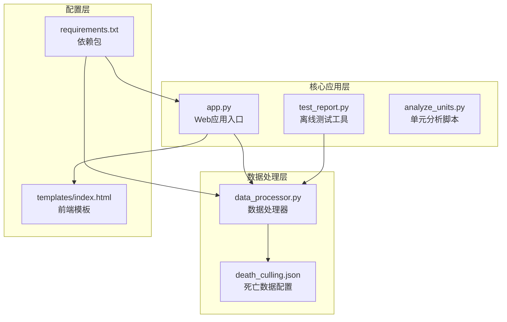
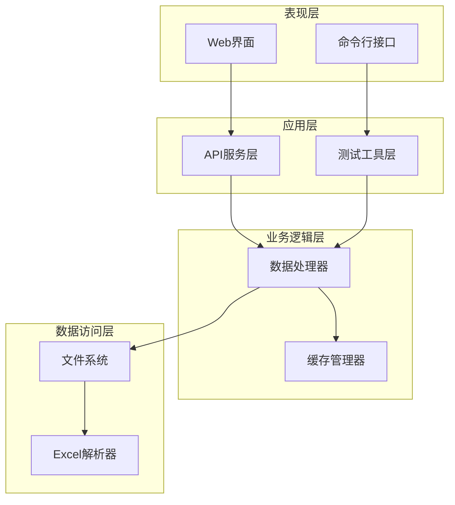
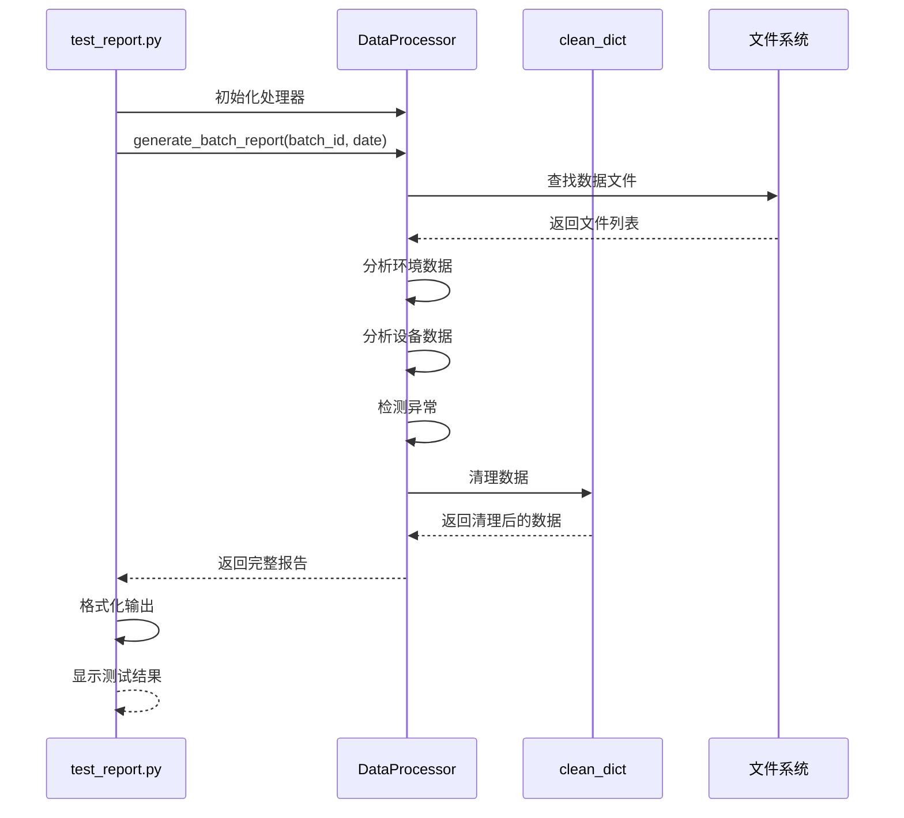
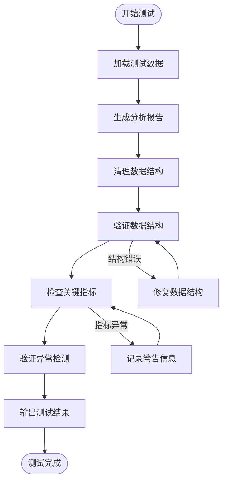
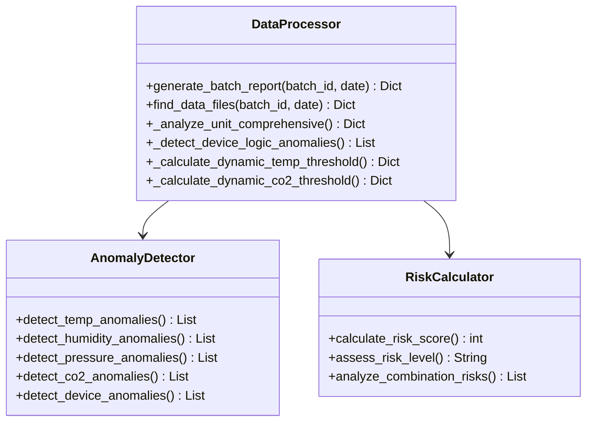
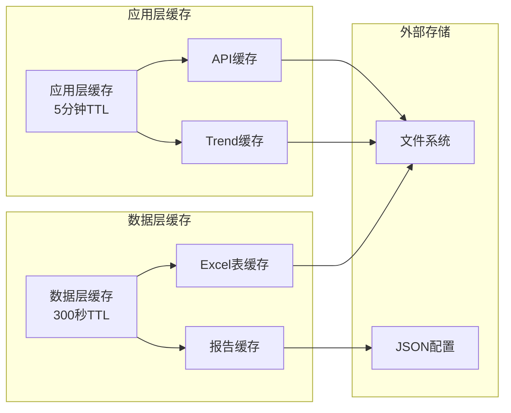
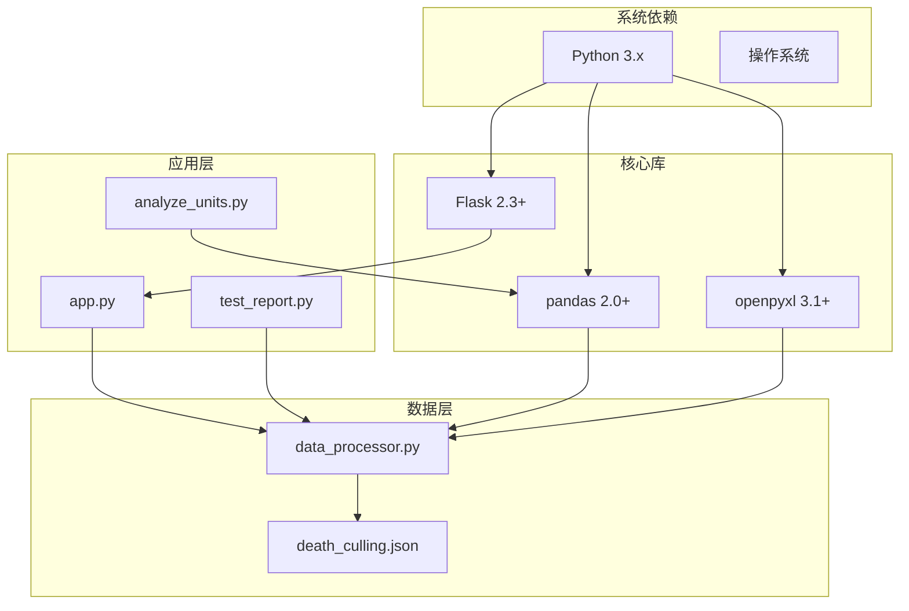

# 测试与验证

<cite>
**本文档引用的文件**
- [test_report.py](file://test_report.py)
- [app.py](file://app.py)
- [data_processor.py](file://data_processor.py)
- [analyze_units.py](file://analyze_units.py)
- [requirements.txt](file://requirements.txt)
- [templates/index.html](file://templates/index.html)
- [death_culling.json](file://death_culling.json)
</cite>

## 目录
1. [简介](#简介)
2. [项目结构](#项目结构)
3. [核心组件](#核心组件)
4. [架构概览](#架构概览)
5. [详细组件分析](#详细组件分析)
6. [依赖关系分析](#依赖关系分析)
7. [性能考虑](#性能考虑)
8. [故障排除指南](#故障排除指南)
9. [结论](#结论)
10. [附录](#附录)

## 简介

本测试与验证文档针对猪场环控数据分析系统，重点介绍离线测试工具test_report.py的功能和使用方法。该系统是一个基于Python的数据分析平台，用于分析育肥猪批次的环境控制数据，提供实时监控、异常检测、风险评估和智能推荐等功能。

系统采用Flask框架构建Web服务，通过Excel文件格式存储和处理大量环境监测数据。test_report.py作为离线测试工具，能够独立于Web界面运行，直接调用数据处理器生成完整的分析报告。

## 项目结构

该项目采用模块化设计，主要包含以下核心文件：



**图表来源**
- [test_report.py:1-48](file://test_report.py#L1-L48)
- [app.py:1-133](file://app.py#L1-L133)
- [data_processor.py:1-1559](file://data_processor.py#L1-L1559)

**章节来源**
- [test_report.py:1-48](file://test_report.py#L1-L48)
- [app.py:1-133](file://app.py#L1-L133)
- [data_processor.py:1-1559](file://data_processor.py#L1-L1559)

## 核心组件

### 数据处理器(DataProcessor)

数据处理器是系统的核心组件，负责所有数据的加载、清洗、分析和报告生成。其主要功能包括：

- **数据文件发现**: 自动扫描指定批次的Excel数据文件
- **环境数据分析**: 分析温度、湿度、CO2、压差等环境参数
- **设备运行分析**: 监控风机、水帘等设备的运行状态
- **异常检测**: 基于动态阈值算法识别环境异常
- **风险评估**: 计算每个单元的风险评分和等级
- **报告生成**: 构建完整的批次分析报告

### 离线测试工具(test_report.py)

test_report.py是一个专门的离线测试工具，提供以下功能：

- **批量报告生成**: 直接调用数据处理器生成完整报告
- **数据清理**: 使用clean_dict函数清理NaN和Inf值
- **结果展示**: 格式化输出批次摘要、单元报告、设备异常等
- **趋势数据验证**: 验证时间序列数据的完整性

**章节来源**
- [data_processor.py:54-295](file://data_processor.py#L54-L295)
- [test_report.py:1-48](file://test_report.py#L1-L48)

## 架构概览

系统采用分层架构设计，确保各组件职责清晰、耦合度低：



**图表来源**
- [app.py:9-133](file://app.py#L9-L133)
- [data_processor.py:12-52](file://data_processor.py#L12-L52)

## 详细组件分析

### test_report.py 组件分析

test_report.py实现了完整的离线测试流程，包含以下关键步骤：

#### 主要功能流程



**图表来源**
- [test_report.py:7-48](file://test_report.py#L7-L48)
- [data_processor.py:238-295](file://data_processor.py#L238-L295)

#### 数据验证方法

test_report.py提供了多层次的数据验证机制：

1. **批处理验证**: 验证整个批次的完整性
2. **单元级验证**: 检查每个单元的环境指标
3. **设备验证**: 确认设备运行状态的合理性
4. **异常检测验证**: 验证异常识别的准确性

#### 结果验证流程



**图表来源**
- [test_report.py:11-48](file://test_report.py#L11-L48)
- [data_processor.py:31-38](file://data_processor.py#L31-L38)

**章节来源**
- [test_report.py:1-48](file://test_report.py#L1-L48)

### DataProcessor 组件分析

DataProcessor类实现了复杂的数据处理逻辑，包含以下核心功能：

#### 异常检测算法

系统实现了多种异常检测机制：



**图表来源**
- [data_processor.py:238-838](file://data_processor.py#L238-L838)

#### 动态阈值计算

系统采用基于猪只日龄的动态阈值算法：

| 日龄阶段 | 温度阈值 | CO2阈值 | 日内温差 |
|---------|---------|--------|---------|
| ≤30天 | ±2.5°C | 800-1200ppm | 4°C |
| 31-60天 | ±2.8°C | 900-1400ppm | 4.5°C |
| 61-120天 | ±3.2°C | 1000-1600ppm | 5.5°C |
| >120天 | ±3.5°C | 1100-1800ppm | 6°C |

**章节来源**
- [data_processor.py:865-914](file://data_processor.py#L865-L914)

### 缓存系统分析

系统实现了两级缓存机制来提升性能：



**图表来源**
- [app.py:15-40](file://app.py#L15-L40)
- [data_processor.py:12-52](file://data_processor.py#L12-L52)

**章节来源**
- [app.py:15-40](file://app.py#L15-L40)
- [data_processor.py:12-52](file://data_processor.py#L12-L52)

## 依赖关系分析

系统依赖关系相对简单，主要依赖于标准库和第三方库：



**图表来源**
- [requirements.txt:1-4](file://requirements.txt#L1-L4)
- [app.py:1-5](file://app.py#L1-L5)

**章节来源**
- [requirements.txt:1-4](file://requirements.txt#L1-L4)

## 性能考虑

### 缓存策略

系统采用了多级缓存策略来优化性能：

1. **应用层缓存**: 5分钟TTL，适用于API响应和趋势数据
2. **数据层缓存**: 300秒TTL，适用于Excel文件解析结果
3. **文件系统缓存**: 利用pandas的内置缓存机制

### 内存优化

- 使用生成器模式处理大型Excel文件
- 实施数据类型优化，减少内存占用
- 及时清理不再使用的缓存数据

### 并发处理

- 支持多单元并行分析
- 异步文件I/O操作
- 线程安全的缓存管理

## 故障排除指南

### 常见问题及解决方案

#### 1. Excel文件读取失败

**问题症状**: 系统提示找不到Excel文件或读取错误

**解决步骤**:
1. 检查文件路径是否正确
2. 验证Excel文件格式是否符合要求
3. 确认文件权限设置
4. 检查文件编码格式

#### 2. 数据分析异常

**问题症状**: 分析结果异常或出现NaN值

**解决步骤**:
1. 使用clean_dict函数清理数据
2. 检查输入数据的完整性
3. 验证数据类型转换
4. 确认阈值设置的合理性

#### 3. 缓存问题

**问题症状**: 数据更新后显示过期数据

**解决步骤**:
1. 调用缓存清理接口
2. 检查TTL设置是否合理
3. 验证缓存键的唯一性
4. 确认缓存失效机制

### 调试技巧

#### 1. 日志记录

系统支持详细的日志记录，包括：
- 数据处理过程的日志
- 错误信息的详细描述
- 性能指标的监控数据

#### 2. 数据验证

```python
# 示例：数据验证函数
def validate_data_structure(data):
    """验证数据结构的完整性"""
    required_fields = ['batch_info', 'unit_reports', 'trend_data']
    for field in required_fields:
        if field not in data:
            raise ValueError(f"缺少必需字段: {field}")
    return True
```

#### 3. 性能监控

- 监控Excel文件读取时间
- 跟踪数据处理耗时
- 分析内存使用情况
- 统计缓存命中率

**章节来源**
- [data_processor.py:15-38](file://data_processor.py#L15-L38)
- [app.py:126-129](file://app.py#L126-L129)

## 结论

猪场环控数据分析系统通过test_report.py提供了强大的离线测试能力，能够独立验证系统的各项功能。系统采用模块化设计，具有良好的可扩展性和维护性。

test_report.py作为核心测试工具，不仅验证了数据处理的准确性，还提供了完整的报告生成功能。通过合理的缓存策略和异常处理机制，系统能够在保证性能的同时提供可靠的数据分析服务。

建议在实际部署中：
1. 建立完善的测试流程和验证标准
2. 定期更新阈值参数以适应不同生长阶段
3. 监控系统性能指标，及时优化缓存策略
4. 建立数据备份和恢复机制

## 附录

### 测试环境搭建

#### 环境要求
- Python 3.8+
- Flask 2.3.0+
- pandas 2.0.0+
- openpyxl 3.1.0+

#### 安装步骤
1. 创建虚拟环境
2. 安装依赖包
3. 准备测试数据文件
4. 配置数据库连接

#### 测试数据准备

**章节来源**
- [requirements.txt:1-4](file://requirements.txt#L1-L4)
- [death_culling.json:1-27](file://death_culling.json#L1-L27)

### 自动化测试流程

#### 单元测试策略

1. **数据处理单元测试**
   - 测试数据加载功能
   - 验证数据清洗逻辑
   - 检查异常处理机制

2. **分析算法单元测试**
   - 验证阈值计算准确性
   - 测试异常检测算法
   - 确认风险评估逻辑

3. **接口测试**
   - 验证API响应格式
   - 测试缓存机制
   - 检查错误处理

#### 边界条件测试

- **空数据测试**: 验证系统对空数据的处理
- **异常数据测试**: 测试包含异常值的数据集
- **缺失数据测试**: 验证系统对缺失数据的处理
- **超大数据测试**: 测试系统处理大量数据的能力

#### 性能测试

- **响应时间测试**: 测量不同规模数据的处理时间
- **内存使用测试**: 监控内存占用情况
- **并发处理测试**: 验证多线程处理能力
- **缓存效果测试**: 评估缓存对性能的影响

### 预期结果验证

#### 正常情况预期结果

| 指标类型 | 预期范围 | 验证方法 |
|---------|---------|---------|
| 温度 | 22-28°C | 检查平均值和标准差 |
| 湿度 | 60-80% | 验证湿度分布 |
| CO2 | ≤2000ppm | 确认峰值控制 |
| 压差 | -50到50Pa | 监控负压事件 |
| 风机效率 | ≥80% | 检查运行时间 |

#### 异常情况处理

- **温度异常**: 系统应标记为高风险并给出处理建议
- **设备故障**: 应识别设备逻辑异常并提出维修建议
- **数据缺失**: 系统应自动跳过缺失数据并记录警告
- **阈值超限**: 应根据严重程度分级处理

通过以上测试和验证方法，可以确保猪场环控数据分析系统的准确性和可靠性，为猪场管理提供科学的数据支持。