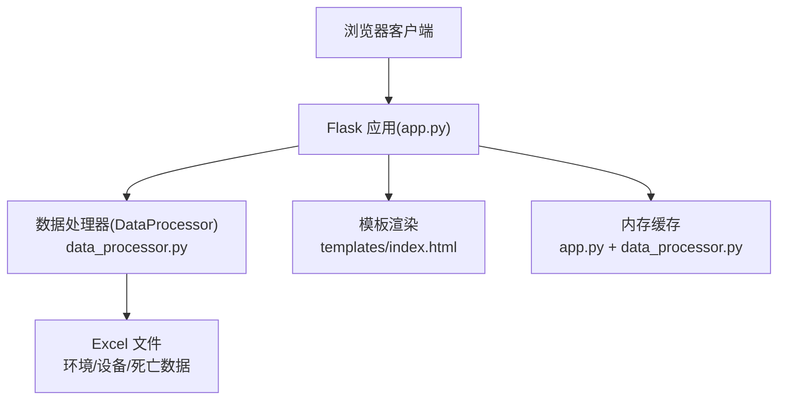
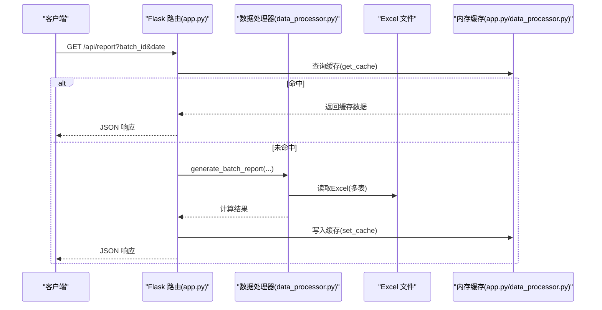
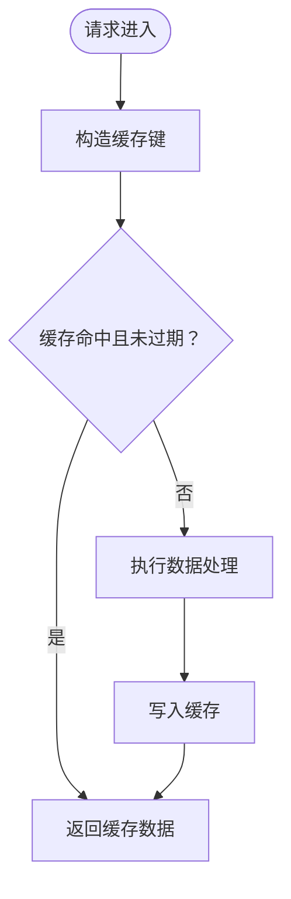
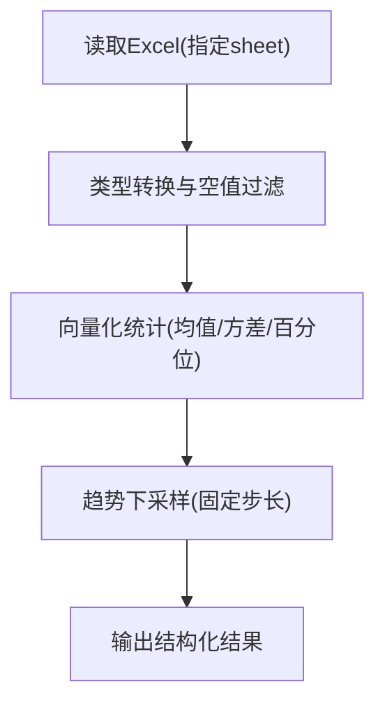
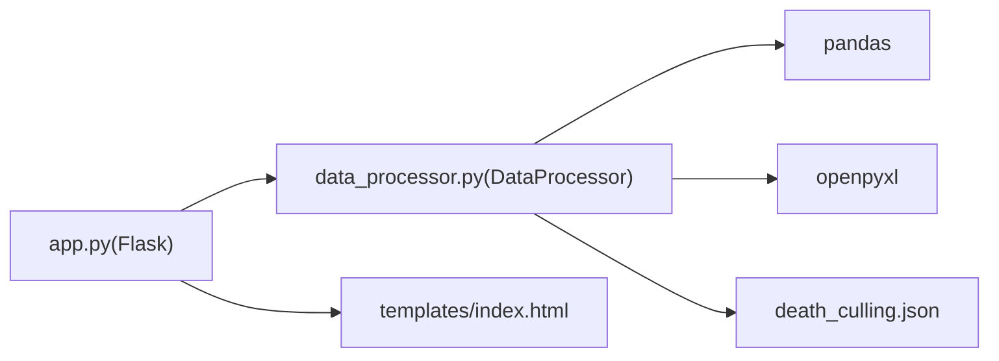

# 性能优化

<cite>
**本文引用的文件列表**
- [app.py](file://app.py)
- [data_processor.py](file://data_processor.py)
- [analyze_units.py](file://analyze_units.py)
- [test_report.py](file://test_report.py)
- [requirements.txt](file://requirements.txt)
- [templates/index.html](file://templates/index.html)
- [death_culling.json](file://death_culling.json)
</cite>

## 目录
1. [简介](#简介)
2. [项目结构](#项目结构)
3. [核心组件](#核心组件)
4. [架构总览](#架构总览)
5. [详细组件分析](#详细组件分析)
6. [依赖关系分析](#依赖关系分析)
7. [性能考虑](#性能考虑)
8. [故障排查指南](#故障排查指南)
9. [结论](#结论)
10. [附录](#附录)

## 简介
本指南围绕“猪场环控数据分析系统”的性能优化展开，重点覆盖：
- 缓存系统：内存缓存策略、TTL设置、缓存失效机制与调优建议
- 数据处理性能：Pandas数据处理优化、Excel文件读取优化、大数据量处理策略
- 并发处理配置：基于当前Flask应用的并发与部署建议
- 性能监控与瓶颈识别：指标定义、定位方法与效果评估

本指南同时给出可操作的最佳实践，帮助在生产环境中提升响应速度、降低资源占用并增强稳定性。

## 项目结构
该系统采用轻量级Web服务架构，前端模板通过Flask渲染，后端数据处理集中在数据处理器模块中，核心文件如下：
- Web入口与路由：app.py
- 数据处理与缓存：data_processor.py
- 单元测试与报告验证：test_report.py
- 示例脚本：analyze_units.py
- 前端模板：templates/index.html
- 死亡/淘汰数据：death_culling.json
- 依赖声明：requirements.txt

图表来源
- [app.py:1-133](file://app.py#L1-L133)
- [data_processor.py:54-1559](file://data_processor.py#L54-L1559)
- [templates/index.html:1-800](file://templates/index.html#L1-L800)

章节来源
- [app.py:1-133](file://app.py#L1-L133)
- [data_processor.py:54-1559](file://data_processor.py#L54-L1559)
- [templates/index.html:1-800](file://templates/index.html#L1-L800)

## 核心组件
- Web层（Flask）：负责路由、请求参数解析、缓存命中与返回JSON结果
- 数据处理器（DataProcessor）：封装Excel读取、数据清洗、聚合计算、趋势构建、异常检测与推荐生成
- 缓存层：两处内存缓存
  - 应用层缓存：app.py中的全局字典与TTL
  - 处理器层缓存：data_processor.py中的全局字典与TTL
- 前端模板：提供可视化展示与交互入口

章节来源
- [app.py:12-40](file://app.py#L12-L40)
- [data_processor.py:12-52](file://data_processor.py#L12-L52)

## 架构总览
系统采用“请求-缓存-处理-返回”的典型Web流程。请求到达后，先尝试从缓存获取结果；若未命中，则调用数据处理器执行复杂计算，完成后写入缓存并返回。

图表来源
- [app.py:32-40](file://app.py#L32-L40)
- [app.py:18-26](file://app.py#L18-L26)
- [data_processor.py:238-295](file://data_processor.py#L238-L295)

## 详细组件分析

### 缓存系统实现与配置
- 实现位置
  - 应用层缓存：app.py中定义全局字典与TTL常量，提供get_cache/set_cache/clear_cache函数
  - 处理器层缓存：data_processor.py中定义全局字典与TTL常量，提供get_cached/clear_cache函数
- TTL设置
  - 统一为300秒（5分钟）
- 缓存键设计
  - 报告缓存键：report:{batch_id}:{date}
  - 趋势缓存键：trend:{batch_id}:{date}:{page}:{page_size}
- 失效机制
  - 手动清除：保存死亡/淘汰数据或手动调用清理接口
  - 自然过期：超过TTL后重新计算

图表来源
- [app.py:18-40](file://app.py#L18-L40)
- [app.py:94-102](file://app.py#L94-L102)
- [data_processor.py:40-48](file://data_processor.py#L40-L48)

章节来源
- [app.py:12-40](file://app.py#L12-L40)
- [app.py:94-102](file://app.py#L94-L102)
- [data_processor.py:12-52](file://data_processor.py#L12-L52)
- [data_processor.py:40-48](file://data_processor.py#L40-L48)

### 数据处理性能优化（Pandas与Excel）
- Excel读取优化
  - 使用openpyxl引擎，按需读取指定sheet，避免全表扫描
  - 对重复读取的sheet进行进程内缓存（_sheet_cache）
- 数据清洗与类型转换
  - 使用向量化操作（pd.to_numeric等）替代循环
  - 预过滤空值后再计算统计量，减少无效数据参与运算
- 时间序列与分页
  - 趋势数据按固定步长下采样，限制图表点数
  - 支持分页趋势历史数据，避免一次性加载过多历史
- 异常检测与聚合
  - 动态阈值根据日龄、密度等参数调整，避免硬编码阈值带来的误报与漏报
  - 聚合计算前先过滤缺失值，保证统计稳健性

图表来源
- [data_processor.py:130-146](file://data_processor.py#L130-L146)
- [data_processor.py:1026-1080](file://data_processor.py#L1026-L1080)
- [data_processor.py:1536-1555](file://data_processor.py#L1536-L1555)

章节来源
- [data_processor.py:130-146](file://data_processor.py#L130-L146)
- [data_processor.py:1026-1080](file://data_processor.py#L1026-L1080)
- [data_processor.py:1536-1555](file://data_processor.py#L1536-L1555)

### 并发处理配置建议
- 当前运行方式
  - app.py直接使用Flask开发服务器运行，未启用多进程或多线程
- 生产部署建议
  - 使用WSGI服务器（如Gunicorn）承载Flask应用
  - Worker数量：CPU核数×2+1（经验公式），结合内存占用与I/O特性微调
  - 线程池：默认单进程单线程；若存在阻塞I/O（如大量文件读写），可考虑多线程worker或异步框架
  - 注意：当前代码未显式使用多进程/多线程，部署时需通过WSGI配置生效

章节来源
- [app.py:131-133](file://app.py#L131-L133)

## 依赖关系分析
- Flask应用依赖数据处理器模块进行数据聚合与分析
- 数据处理器依赖pandas/openpyxl进行Excel读取与数值计算
- 前端模板依赖Chart.js进行可视化展示
- 死亡/淘汰数据作为外部输入，经处理器整合到最终报告

图表来源
- [app.py:1-10](file://app.py#L1-L10)
- [data_processor.py:1-11](file://data_processor.py#L1-L11)
- [requirements.txt:1-4](file://requirements.txt#L1-L4)
- [death_culling.json:1-27](file://death_culling.json#L1-L27)

章节来源
- [app.py:1-10](file://app.py#L1-L10)
- [data_processor.py:1-11](file://data_processor.py#L1-L11)
- [requirements.txt:1-4](file://requirements.txt#L1-L4)
- [death_culling.json:1-27](file://death_culling.json#L1-L27)

## 性能考虑

### 缓存策略与调优
- TTL设置
  - 当前为300秒，适合中等更新频率的数据
  - 建议：按业务更新周期动态调整；高频更新场景可缩短TTL，低频场景可延长
- 缓存粒度
  - 报告与趋势分别缓存，避免无关数据互相污染
  - 建议：对热点查询（如最近一次报告）可额外增加本地缓存
- 失效策略
  - 数据变更后主动清空缓存，确保一致性
  - 建议：引入更细粒度的失效键（如按日期/单位），减少全量清空
- 内存占用
  - 全局字典无容量上限，建议引入LRU或容量上限策略，防止内存膨胀
- 并发安全
  - 当前为单进程单线程，无需锁保护
  - 若改为多线程或多进程，需引入线程安全或进程间共享缓存（如Redis）

章节来源
- [app.py:12-40](file://app.py#L12-L40)
- [app.py:112-129](file://app.py#L112-L129)
- [data_processor.py:12-52](file://data_processor.py#L12-L52)

### 数据处理性能优化
- Excel读取
  - 指定sheet名称，避免全表扫描
  - 对重复读取的sheet进行进程内缓存
- Pandas优化
  - 向量化替换循环
  - 使用dropna/astype等预处理减少无效计算
  - 分块处理超大数据集（如历史趋势）
- 时间序列
  - 固定步长下采样，限制图表点数
  - 分页加载历史趋势，避免一次性渲染
- 异常检测
  - 动态阈值减少误报
  - 聚合前过滤缺失值，提升稳定性

章节来源
- [data_processor.py:130-146](file://data_processor.py#L130-L146)
- [data_processor.py:1026-1080](file://data_processor.py#L1026-L1080)
- [data_processor.py:1536-1555](file://data_processor.py#L1536-L1555)

### 并发与部署
- 当前为开发服务器，未启用多进程/多线程
- 生产建议
  - Gunicorn：worker数量≈CPU核数×2+1，结合内存与I/O调优
  - 若存在阻塞I/O，可考虑多线程worker或异步框架
  - 配置进程/线程重启策略，避免内存泄漏

章节来源
- [app.py:131-133](file://app.py#L131-L133)

### 性能监控与瓶颈识别
- 指标建议
  - 响应时间（P50/P95/P99）、吞吐量（QPS）、错误率
  - 缓存命中率、缓存失效次数、缓存大小
  - Excel读取耗时、Pandas计算耗时、趋势下采样耗时
  - 内存占用、CPU使用率
- 瓶颈识别
  - 使用性能剖析工具（如cProfile）定位慢函数
  - 观察缓存命中率与失效频率，判断TTL与粒度是否合理
  - 监控Excel读取与Pandas计算的占比，优先优化热点路径
- 效果评估
  - A/B对比：调整TTL、缓存粒度、下采样策略后的指标变化
  - 用户侧反馈：页面加载时间、图表渲染流畅度

[本节为通用指导，不直接分析具体文件]

## 故障排查指南
- 缓存相关
  - 现象：返回旧数据
  - 排查：确认TTL是否过短；检查是否正确调用清理接口；确认缓存键是否匹配
  - 处理：延长TTL或主动清理缓存
- Excel读取失败
  - 现象：读取异常或空DataFrame
  - 排查：确认文件路径与sheet名称；检查openpyxl版本兼容性
  - 处理：修正路径/表名；升级openpyxl
- 数据为空或异常
  - 现象：统计值异常或NaN
  - 排查：检查数据清洗步骤；确认列名与数据类型
  - 处理：补充缺失值或过滤异常值
- 死亡/淘汰数据变更未生效
  - 现象：报告未反映最新数据
  - 排查：确认保存接口是否触发缓存清理
  - 处理：确保变更后调用清理缓存

章节来源
- [app.py:112-129](file://app.py#L112-L129)
- [data_processor.py:165-223](file://data_processor.py#L165-L223)

## 结论
本系统通过双层内存缓存与Pandas向量化处理，在中小规模数据场景下具备较好的响应能力。为进一步提升性能与稳定性，建议：
- 明确缓存策略与TTL，引入容量上限与失效粒度
- 优化Excel读取与Pandas计算路径，减少不必要的数据转换
- 在生产环境采用WSGI服务器并合理配置并发参数
- 建立完善的性能监控体系，持续评估与迭代

[本节为总结性内容，不直接分析具体文件]

## 附录

### API与缓存键对照
- 获取报告：GET /api/report?batch_id&date → 缓存键：report:{batch_id}:{date}
- 获取趋势：GET /api/trend?batch_id&date&page&page_size → 缓存键：trend:{batch_id}:{date}:{page}:{page_size}
- 清理缓存：POST /api/cache/clear → 清空全局缓存

章节来源
- [app.py:59-66](file://app.py#L59-L66)
- [app.py:86-102](file://app.py#L86-L102)
- [app.py:126-129](file://app.py#L126-L129)

### 依赖版本参考
- Flask、Pandas、openpyxl版本要求见requirements.txt

章节来源
- [requirements.txt:1-4](file://requirements.txt#L1-L4)