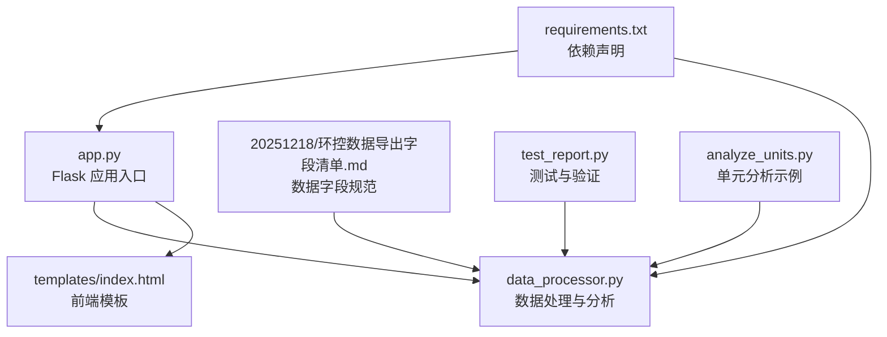
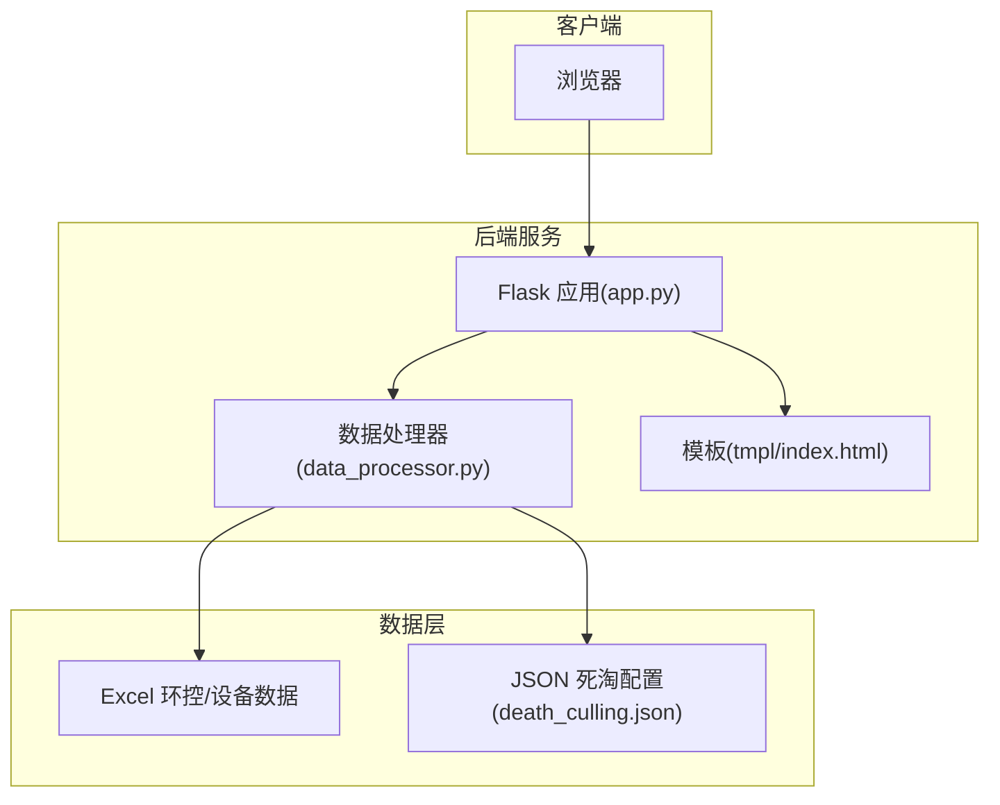
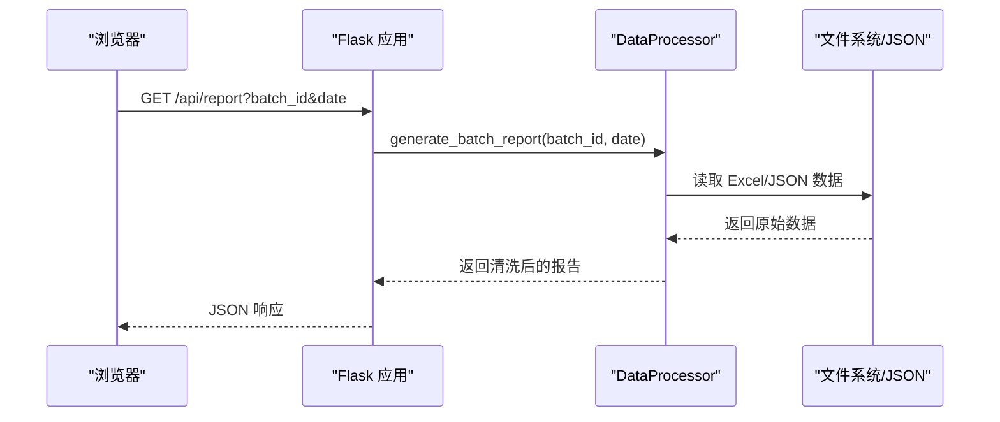
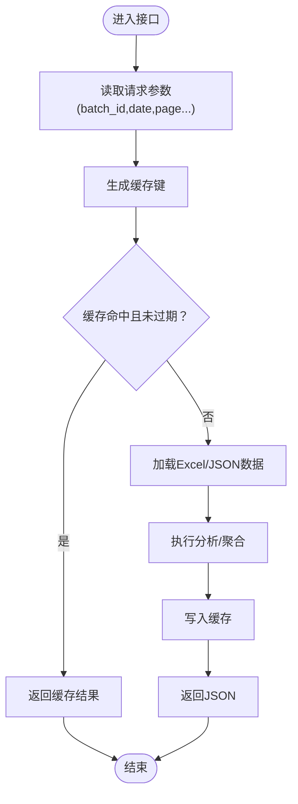
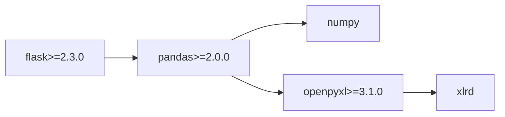

# 环境配置

<cite>
**本文引用的文件**
- [requirements.txt](file://requirements.txt)
- [app.py](file://app.py)
- [data_processor.py](file://data_processor.py)
- [templates/index.html](file://templates/index.html)
- [20251218/环控数据导出字段清单.md](file://20251218/环控数据导出字段清单.md)
- [test_report.py](file://test_report.py)
- [analyze_units.py](file://analyze_units.py)
</cite>

## 目录
1. [简介](#简介)
2. [项目结构](#项目结构)
3. [核心组件](#核心组件)
4. [架构总览](#架构总览)
5. [详细组件分析](#详细组件分析)
6. [依赖分析](#依赖分析)
7. [性能考虑](#性能考虑)
8. [故障排查指南](#故障排查指南)
9. [结论](#结论)
10. [附录](#附录)

## 简介
本指南面向“猪场环控数据分析系统”的环境搭建与运行，覆盖以下内容：
- Python 版本要求与虚拟环境创建
- 依赖包安装与版本兼容性说明
- Flask 应用配置要点（模板自动重载、静态文件处理）
- 不同操作系统（Windows、Linux、macOS）的差异与注意事项
- 常见环境问题的解决方案与调试技巧

该系统通过读取 Excel 环控与设备数据，生成批次维度的深度分析报告，支持 Web 界面展示与 API 访问。

## 项目结构
项目采用“应用层 + 数据处理层 + 模板渲染 + 数据源”的组织方式，核心文件如下：
- 入口应用：app.py
- 数据处理：data_processor.py
- 模板：templates/index.html
- 依赖声明：requirements.txt
- 示例数据字段说明：20251218/环控数据导出字段清单.md
- 测试脚本：test_report.py、analyze_units.py

图表来源
- [app.py:1-133](file://app.py#L1-L133)
- [data_processor.py:1-800](file://data_processor.py#L1-L800)
- [templates/index.html:1-800](file://templates/index.html#L1-L800)
- [requirements.txt:1-4](file://requirements.txt#L1-L4)
- [20251218/环控数据导出字段清单.md:1-140](file://20251218/环控数据导出字段清单.md#L1-L140)
- [test_report.py:1-48](file://test_report.py#L1-L48)
- [analyze_units.py:1-105](file://analyze_units.py#L1-L105)

章节来源
- [app.py:1-133](file://app.py#L1-L133)
- [data_processor.py:1-800](file://data_processor.py#L1-L800)
- [templates/index.html:1-800](file://templates/index.html#L1-L800)
- [requirements.txt:1-4](file://requirements.txt#L1-L4)
- [20251218/环控数据导出字段清单.md:1-140](file://20251218/环控数据导出字段清单.md#L1-L140)
- [test_report.py:1-48](file://test_report.py#L1-L48)
- [analyze_units.py:1-105](file://analyze_units.py#L1-L105)

## 核心组件
- Flask 应用
  - 自动重载模板：app.config['TEMPLATES_AUTO_RELOAD'] = True
  - 开发模式运行：app.run(debug=True, host='0.0.0.0', port=5000)
- 数据处理器
  - 使用 pandas 读取 Excel，openpyxl 作为引擎
  - 提供批次、单元、趋势、异常检测、推荐等分析接口
- 前端模板
  - 使用 Chart.js 展示图表，响应式布局与主题色变量

章节来源
- [app.py:6-133](file://app.py#L6-L133)
- [data_processor.py:1-800](file://data_processor.py#L1-L800)
- [templates/index.html:1-800](file://templates/index.html#L1-L800)

## 架构总览
系统采用“后端 API + 前端模板”的经典 Web 架构，数据从 Excel 文件读取并缓存，通过 Flask 提供 REST 接口与页面渲染。

图表来源
- [app.py:1-133](file://app.py#L1-L133)
- [data_processor.py:1-800](file://data_processor.py#L1-L800)
- [templates/index.html:1-800](file://templates/index.html#L1-L800)

## 详细组件分析

### Flask 应用配置
- 模板自动重载
  - 在应用初始化后设置 TEMPLATES_AUTO_RELOAD = True，开发阶段可实时看到模板变更效果
- 开发服务器
  - debug=True 启用调试模式
  - host='0.0.0.0' 允许外部访问
  - port=5000 绑定端口
- 路由与接口
  - 首页渲染：GET /
  - 批次列表：GET /api/batches
  - 批次详情：GET /api/batch/<batch_id>
  - 报告接口：GET /api/report、/api/dashboard
  - 深度分析：GET /api/deep-analysis
  - 趋势数据：GET /api/trend（带分页）
  - 死淘数据：POST /api/death-culling、POST /api/import-death
  - 缓存管理：POST /api/cache/clear

图表来源
- [app.py:42-125](file://app.py#L42-L125)
- [data_processor.py:238-295](file://data_processor.py#L238-L295)

章节来源
- [app.py:6-133](file://app.py#L6-L133)
- [app.py:42-125](file://app.py#L42-L125)
- [data_processor.py:238-295](file://data_processor.py#L238-L295)

### 数据处理与缓存
- 依赖
  - pandas、openpyxl、numpy、xlrd（通过 openpyxl 引入）
- 缓存策略
  - 进程内缓存（字典 + TTL），用于报告与趋势数据
  - 缓存键包含 batch_id、date、分页参数等
- 数据读取
  - 通过 openpyxl 读取 Excel 的多个 Sheet
  - 支持单元解析、文件查找、设备文件匹配
- 输出清理
  - clean_dict 将 NaN/Inf/NumPy 类型转换为安全的 Python 值

图表来源
- [app.py:32-102](file://app.py#L32-L102)
- [data_processor.py:40-48](file://data_processor.py#L40-L48)

章节来源
- [app.py:15-40](file://app.py#L15-L40)
- [data_processor.py:40-48](file://data_processor.py#L40-L48)

### 前端模板与静态资源
- 模板
  - index.html 使用 Chart.js 渲染图表，包含响应式布局与主题变量
- 静态资源
  - 项目未显式配置 static folder；默认情况下，Flask 会在根目录寻找 static 文件夹
  - 若需要自定义静态目录，请在 Flask 初始化时指定 static_folder 参数

章节来源
- [templates/index.html:1-800](file://templates/index.html#L1-L800)
- [app.py:6-10](file://app.py#L6-L10)

## 依赖分析
- 依赖声明
  - flask>=2.3.0
  - pandas>=2.0.0
  - openpyxl>=3.1.0
- 运行时依赖
  - numpy（由 pandas 间接引入）
  - xlrd（openpyxl 读取 .xlsx 时的依赖）

图表来源
- [requirements.txt:1-4](file://requirements.txt#L1-L4)

章节来源
- [requirements.txt:1-4](file://requirements.txt#L1-L4)

## 性能考虑
- 缓存
  - 进程内缓存（TTL=300 秒）显著降低重复计算成本
  - 建议在生产环境中替换为分布式缓存（Redis/Memcached）
- 数据读取
  - 多 Sheet 读取与正则匹配会带来 IO 与 CPU 开销
  - 建议对大型 Excel 文件启用增量读取与分页
- 图表渲染
  - 前端使用 Chart.js，建议限制一次性渲染的数据点数量或采用分页展示

[本节为通用指导，无需具体文件引用]

## 故障排查指南
- 启动失败（端口占用）
  - 现象：端口 5000 被占用
  - 解决：修改 app.run 中的 port 或释放占用进程
- 模板未更新
  - 现象：修改 templates/index.html 后未生效
  - 解决：确认已设置 TEMPLATES_AUTO_RELOAD = True
- Excel 读取错误
  - 现象：报错提示无法读取 .xlsx
  - 解决：确保安装 openpyxl>=3.1.0；检查文件路径与编码
- 数据缺失或列名不一致
  - 现象：分析结果为空或异常
  - 解决：对照“环控数据导出字段清单.md”核对列名与数据类型
- 死淘数据导入失败
  - 现象：导入接口返回失败
  - 解决：确认存在对应 Excel 文件与正确的批次名称；检查 JSON 写入权限

章节来源
- [app.py:6-133](file://app.py#L6-L133)
- [data_processor.py:165-223](file://data_processor.py#L165-L223)
- [20251218/环控数据导出字段清单.md:1-140](file://20251218/环控数据导出字段清单.md#L1-L140)

## 结论
本指南提供了从 Python 环境到 Flask 应用运行的完整配置路径，并结合项目特性给出性能与故障排查建议。按照本指南完成环境准备后，即可运行 Web 应用并访问 API 获取分析结果。

[本节为总结性内容，无需具体文件引用]

## 附录

### Python 环境搭建步骤
- 版本要求
  - Python 版本：建议使用 Python 3.9–3.11（与 pandas 2.x 兼容）
- 创建虚拟环境
  - Windows/Linux/macOS 均可使用 venv 创建隔离环境
- 安装依赖
  - 使用 requirements.txt 安装 flask、pandas、openpyxl
- 验证安装
  - 运行 test_report.py 或启动 app.py 并访问 http://localhost:5000

章节来源
- [requirements.txt:1-4](file://requirements.txt#L1-L4)
- [test_report.py:1-48](file://test_report.py#L1-L48)
- [app.py:131-133](file://app.py#L131-L133)

### Flask 配置要点
- 模板自动重载
  - 在应用初始化后设置 TEMPLATES_AUTO_RELOAD = True
- 静态文件处理
  - 默认静态目录为根目录下的 static；如需自定义，需在 Flask 初始化时指定 static_folder
- 开发服务器
  - debug=True、host='0.0.0.0'、port=5000

章节来源
- [app.py:6-133](file://app.py#L6-L133)

### 不同操作系统差异与注意事项
- Windows
  - 使用 PowerShell 或 CMD；注意路径分隔符
  - 安装 openpyxl 时可能需要 Microsoft Visual C++ Build Tools
- Linux
  - 使用发行版包管理器安装 Python 与 pip
  - 注意字体与中文字体渲染（Chart.js 依赖）
- macOS
  - 使用 Homebrew 安装 Python 3.9–3.11
  - 如遇 openpyxl 编译问题，可尝试升级 setuptools 与 wheel

[本节为通用指导，无需具体文件引用]

### 依赖安装命令与版本兼容性
- 基础安装
  - pip install flask pandas openpyxl
- 版本兼容性
  - flask>=2.3.0
  - pandas>=2.0.0
  - openpyxl>=3.1.0
- 验证
  - python -c "import flask, pandas, openpyxl; print('依赖可用')"

章节来源
- [requirements.txt:1-4](file://requirements.txt#L1-L4)

### 数据准备与字段规范
- 环控数据与设备数据需按“环控数据导出字段清单.md”提供的字段与格式导出
- 文件命名需遵循规范，确保系统能正确识别批次与单元

章节来源
- [20251218/环控数据导出字段清单.md:1-140](file://20251218/环控数据导出字段清单.md#L1-L140)

### 调试技巧
- 使用 Flask debug 模式（app.run(debug=True)）
- 通过 /api/report、/api/dashboard 等接口直接验证数据
- 使用 test_report.py 快速验证批处理流程
- 分步打印中间结果，定位数据读取与清洗问题

章节来源
- [app.py:131-133](file://app.py#L131-L133)
- [test_report.py:1-48](file://test_report.py#L1-L48)
- [data_processor.py:31-38](file://data_processor.py#L31-L38)