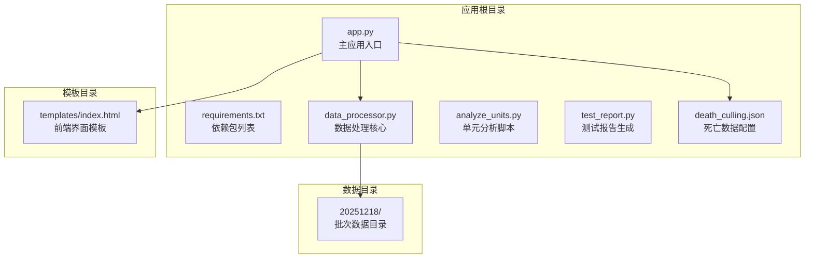
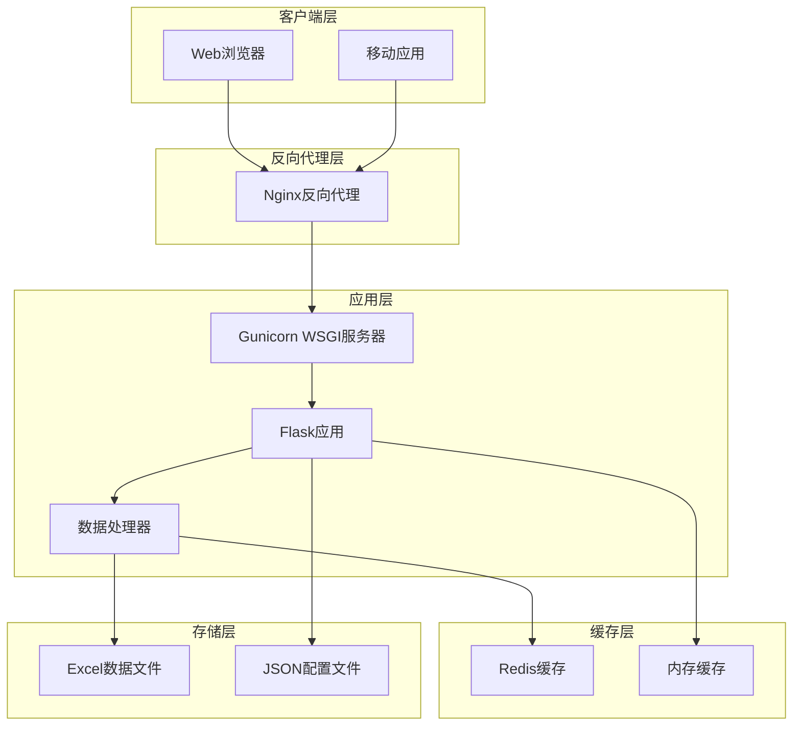
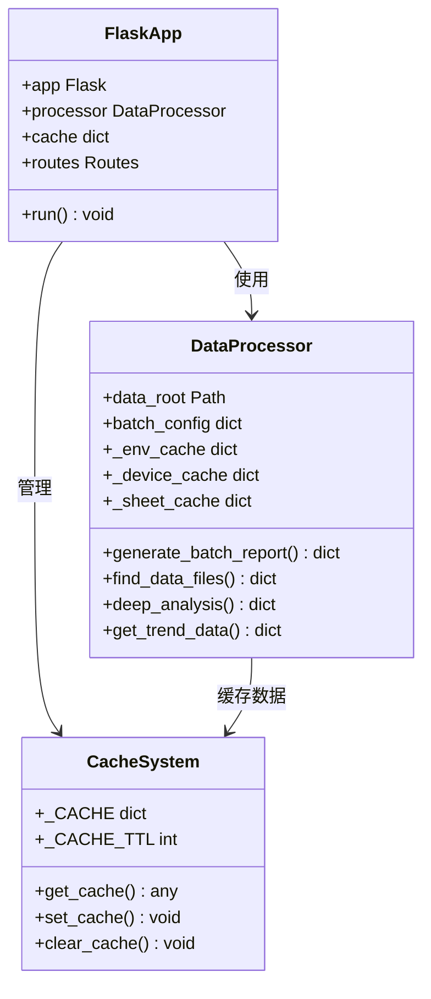
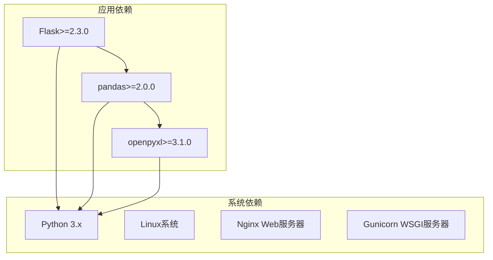
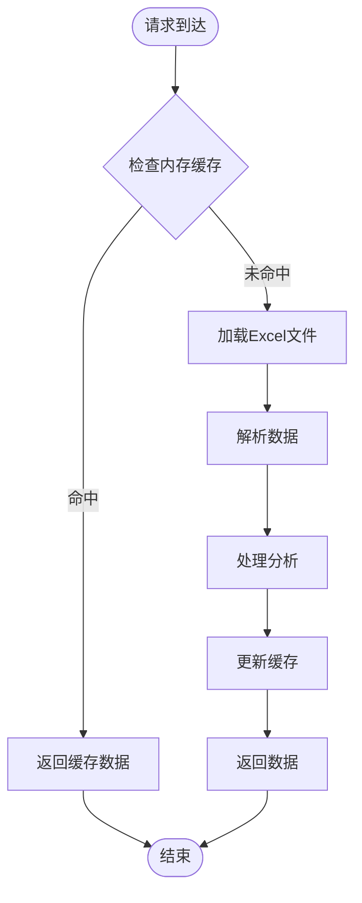

# 生产部署

<cite>
**本文档引用的文件**
- [app.py](file://app.py)
- [requirements.txt](file://requirements.txt)
- [data_processor.py](file://data_processor.py)
- [templates/index.html](file://templates/index.html)
- [death_culling.json](file://death_culling.json)
- [test_report.py](file://test_report.py)
</cite>

## 目录
1. [简介](#简介)
2. [项目结构](#项目结构)
3. [核心组件](#核心组件)
4. [架构概览](#架构概览)
5. [详细组件分析](#详细组件分析)
6. [依赖关系分析](#依赖关系分析)
7. [性能考虑](#性能考虑)
8. [故障排除指南](#故障排除指南)
9. [结论](#结论)
10. [附录](#附录)

## 简介

本指南面向猪场环控数据分析系统，提供从开发环境到生产环境的完整部署方案。该系统基于Flask框架构建，用于分析育肥猪批次的环境控制数据，提供实时监控、历史趋势分析和深度诊断报告功能。

系统主要特点：
- 实时环境数据监控（温度、湿度、CO2、压差）
- 批次级数据分析和风险评估
- 设备运行状态监测
- 死亡数据分析和环境关联性评估
- 可视化仪表板和趋势图表

## 项目结构

**图表来源**
- [app.py:1-133](file://app.py#L1-L133)
- [data_processor.py:1-1559](file://data_processor.py#L1-L1559)
- [templates/index.html:1-800](file://templates/index.html#L1-L800)

**章节来源**
- [app.py:1-133](file://app.py#L1-L133)
- [requirements.txt:1-4](file://requirements.txt#L1-L4)

## 核心组件

### Flask Web应用
系统的核心是基于Flask的Web应用，提供RESTful API接口和HTML模板渲染功能。

### 数据处理器
负责处理Excel格式的环境数据和设备数据，执行复杂的统计分析和风险评估算法。

### 缓存系统
实现内存级缓存机制，提升重复查询的响应速度。

**章节来源**
- [app.py:12-40](file://app.py#L12-L40)
- [data_processor.py:40-52](file://data_processor.py#L40-L52)

## 架构概览

**图表来源**
- [app.py:1-133](file://app.py#L1-L133)
- [data_processor.py:1-1559](file://data_processor.py#L1-L1559)

## 详细组件分析

### Flask应用架构

**图表来源**
- [app.py:6-40](file://app.py#L6-L40)
- [data_processor.py:54-62](file://data_processor.py#L54-L62)
- [data_processor.py:12-13](file://data_processor.py#L12-L13)

### API路由设计

系统提供以下主要API端点：

| 路由 | 方法 | 功能描述 | 响应类型 |
|------|------|----------|----------|
| `/` | GET | 主页面渲染 | HTML模板 |
| `/api/batches` | GET | 获取批次列表 | JSON |
| `/api/batch/<batch_id>` | GET | 获取批次详情 | JSON |
| `/api/report` | GET | 获取综合报告 | JSON |
| `/api/dashboard` | GET | 获取仪表板数据 | JSON |
| `/api/deep-analysis` | GET | 获取深度分析 | JSON |
| `/api/trend` | GET | 获取趋势数据 | JSON |
| `/api/death-culling` | POST | 保存死亡数据 | JSON |
| `/api/import-death` | POST | 导入死亡数据 | JSON |
| `/api/cache/clear` | POST | 清空缓存 | JSON |

**章节来源**
- [app.py:42-129](file://app.py#L42-L129)

### 数据处理流程

```mermaid
sequenceDiagram
participant Client as 客户端
participant Flask as Flask应用
participant Processor as 数据处理器
participant Cache as 缓存系统
participant Files as Excel文件
Client->>Flask : GET /api/report?batch_id&date
Flask->>Cache : 检查缓存
alt 缓存命中
Cache-->>Flask : 返回缓存数据
else 缓存未命中
Flask->>Processor : generate_batch_report()
Processor->>Files : 读取环境数据
Processor->>Files : 读取设备数据
Processor->>Processor : 执行数据分析
Processor-->>Flask : 返回分析结果
Flask->>Cache : 写入缓存
end
Flask-->>Client : 返回JSON响应
```

**图表来源**
- [app.py:32-40](file://app.py#L32-L40)
- [data_processor.py:238-295](file://data_processor.py#L238-L295)

**章节来源**
- [app.py:32-102](file://app.py#L32-L102)
- [data_processor.py:238-295](file://data_processor.py#L238-L295)

## 依赖关系分析

### Python依赖关系

**图表来源**
- [requirements.txt:1-4](file://requirements.txt#L1-L4)

### 外部数据源

系统依赖以下外部数据源：
- Excel格式的环境数据文件
- Excel格式的设备数据文件
- JSON格式的死亡数据配置
- 批次配置文件

**章节来源**
- [requirements.txt:1-4](file://requirements.txt#L1-L4)
- [data_processor.py:63-82](file://data_processor.py#L63-L82)

## 性能考虑

### 缓存策略

系统实现了两级缓存机制：

1. **内存缓存**：应用级别的内存缓存，TTL为300秒
2. **文件缓存**：Excel文件内容的缓存，避免重复解析

**图表来源**
- [app.py:18-30](file://app.py#L18-L30)
- [data_processor.py:40-48](file://data_processor.py#L40-L48)

### 性能优化建议

1. **数据库迁移**：考虑将Excel文件迁移到数据库存储，提升查询性能
2. **异步处理**：对于大数据量的分析任务，考虑使用异步队列
3. **CDN加速**：静态资源可使用CDN加速
4. **连接池**：数据库连接使用连接池管理

## 故障排除指南

### 常见问题及解决方案

| 问题类型 | 症状 | 可能原因 | 解决方案 |
|----------|------|----------|----------|
| 应用启动失败 | 启动报错 | 依赖包缺失 | 运行pip install -r requirements.txt |
| Excel文件读取错误 | 文件读取异常 | 文件格式不正确 | 检查Excel文件格式和编码 |
| 内存溢出 | 内存使用过高 | 数据量过大 | 优化数据处理逻辑，增加内存限制 |
| 缓存失效 | 数据更新不及时 | 缓存TTL过期 | 调整缓存TTL或手动清理缓存 |

### 日志监控

建议配置以下日志级别：
- 错误日志：ERROR级别，记录所有错误信息
- 访问日志：INFO级别，记录HTTP请求信息
- 性能日志：DEBUG级别，记录性能指标

**章节来源**
- [app.py:131-133](file://app.py#L131-L133)

## 结论

本部署指南提供了猪场环控数据分析系统从开发到生产的完整解决方案。系统采用模块化设计，具有良好的扩展性和维护性。通过合理的缓存策略和性能优化，能够满足生产环境的高并发需求。

建议在生产环境中进一步完善：
1. 数据库化改造
2. 微服务架构升级
3. 完善的监控和告警系统
4. 自动化测试和CI/CD流程

## 附录

### 部署清单

- [ ] Python 3.8+
- [ ] pip包管理器
- [ ] Nginx Web服务器
- [ ] Gunicorn WSGI服务器
- [ ] Redis缓存服务器
- [ ] Supervisor进程管理
- [ ] SSL证书

### 监控指标

- 应用响应时间
- 内存使用率
- CPU使用率
- 缓存命中率
- 错误率
- 用户并发数