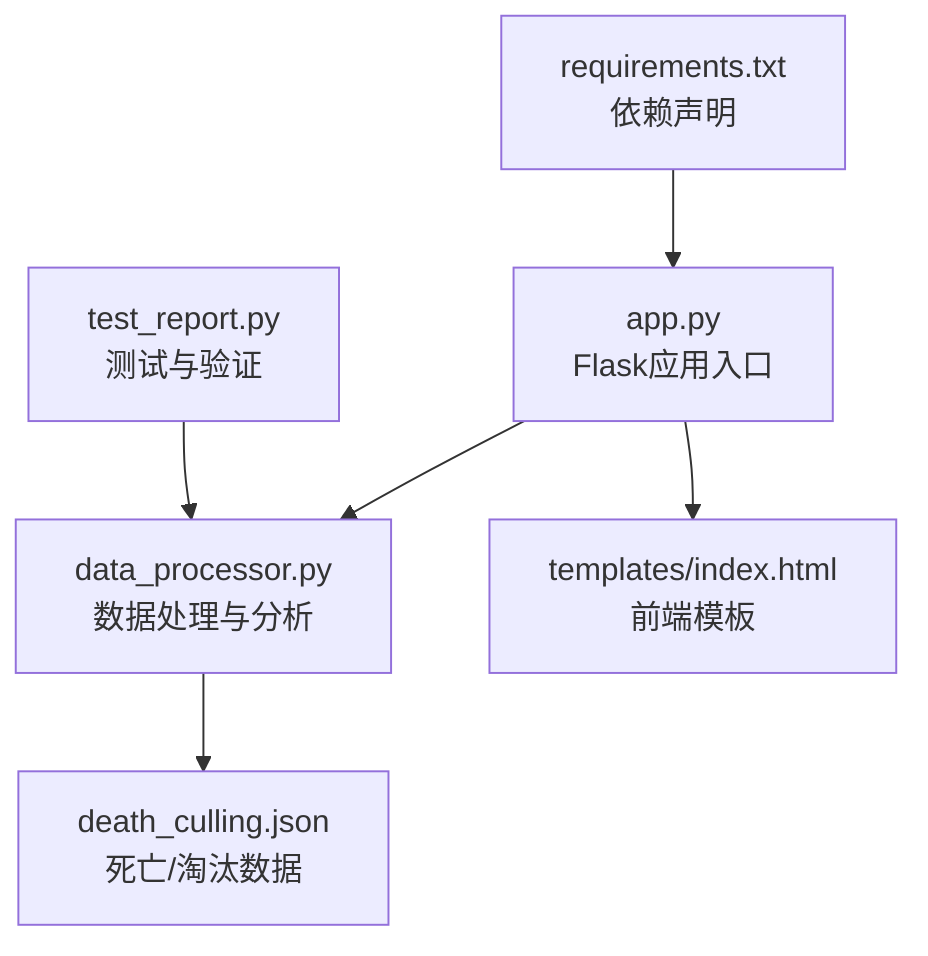
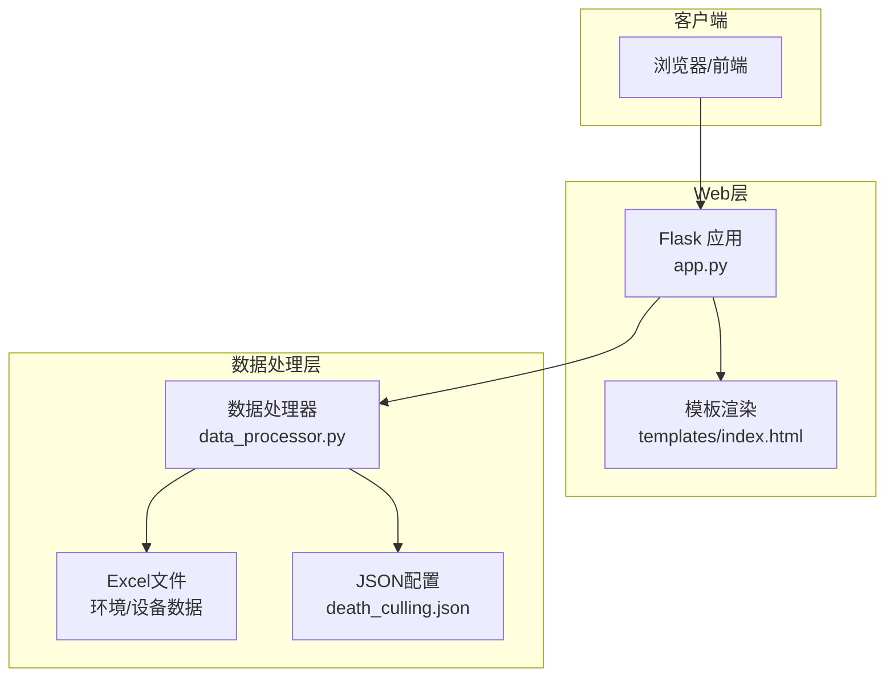
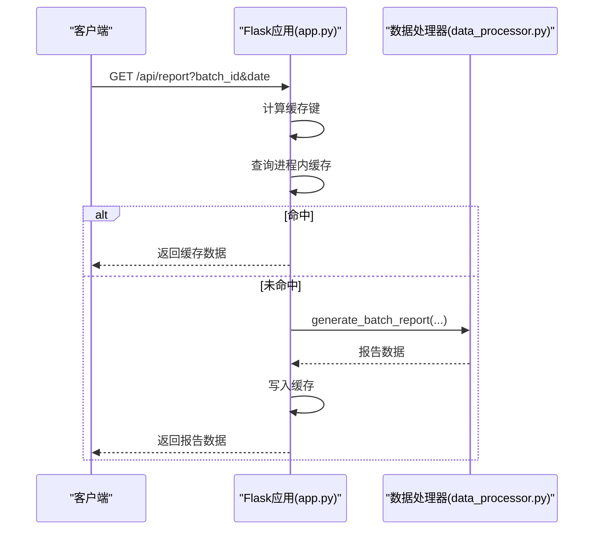
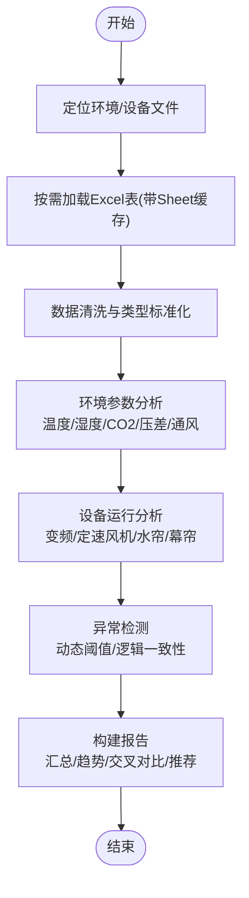
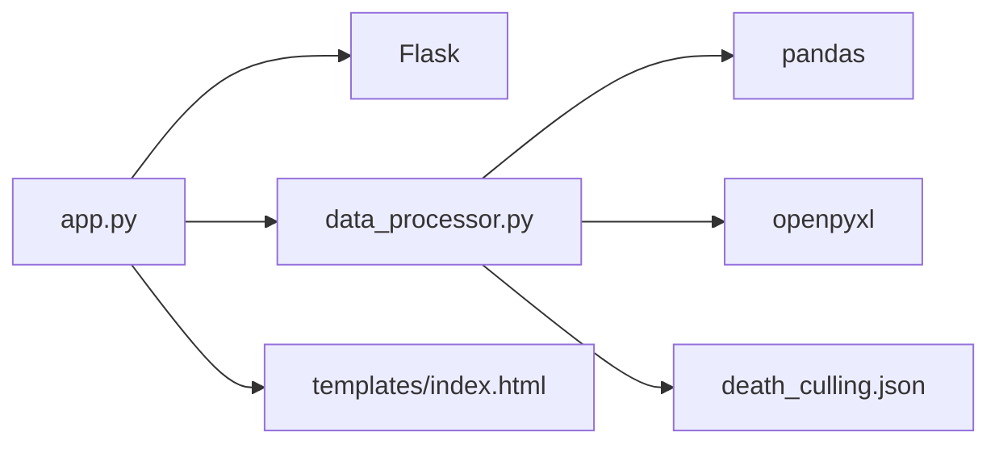

# 监控与日志

<cite>
**本文引用的文件**
- [app.py](file://app.py)
- [data_processor.py](file://data_processor.py)
- [requirements.txt](file://requirements.txt)
- [templates/index.html](file://templates/index.html)
- [death_culling.json](file://death_culling.json)
- [test_report.py](file://test_report.py)
</cite>

## 目录
1. [简介](#简介)
2. [项目结构](#项目结构)
3. [核心组件](#核心组件)
4. [架构总览](#架构总览)
5. [详细组件分析](#详细组件分析)
6. [依赖分析](#依赖分析)
7. [性能考虑](#性能考虑)
8. [故障排查指南](#故障排查指南)
9. [结论](#结论)
10. [附录](#附录)

## 简介
本指南面向“猪场环控数据分析系统”的监控与日志管理，围绕Flask应用在生产环境中的运行监控、日志配置与管理、缓存与性能监控、健康检查与告警机制等方面，提供可操作的实施方案。系统通过API接口对外提供环控数据的查询、趋势分析、深度报告生成等功能，前端采用HTML模板渲染可视化界面。

## 项目结构
系统采用典型的Flask单体应用结构：
- 应用入口与路由：app.py
- 数据处理与分析：data_processor.py
- 前端模板：templates/index.html
- 死亡/淘汰数据：death_culling.json
- 测试与验证脚本：test_report.py
- 依赖声明：requirements.txt

图表来源
- [app.py:1-133](file://app.py#L1-L133)
- [data_processor.py:1-1559](file://data_processor.py#L1-L1559)
- [requirements.txt:1-4](file://requirements.txt#L1-L4)
- [templates/index.html:1-800](file://templates/index.html#L1-L800)
- [death_culling.json:1-27](file://death_culling.json#L1-L27)
- [test_report.py:1-48](file://test_report.py#L1-L48)

章节来源
- [app.py:1-133](file://app.py#L1-L133)
- [data_processor.py:1-1559](file://data_processor.py#L1-L1559)
- [requirements.txt:1-4](file://requirements.txt#L1-L4)
- [templates/index.html:1-800](file://templates/index.html#L1-L800)
- [death_culling.json:1-27](file://death_culling.json#L1-L27)
- [test_report.py:1-48](file://test_report.py#L1-L48)

## 核心组件
- Flask应用与路由：提供首页、批次列表、报告、仪表盘、趋势、深度分析、缓存清空等API。
- 数据处理器：负责Excel数据读取、缓存、清洗、统计分析、异常检测、推荐生成等。
- 前端模板：提供可视化界面，支持图表渲染与交互。
- 配置与数据：批次配置、死亡/淘汰数据持久化。

章节来源
- [app.py:42-133](file://app.py#L42-L133)
- [data_processor.py:54-1559](file://data_processor.py#L54-L1559)
- [templates/index.html:1-800](file://templates/index.html#L1-L800)
- [death_culling.json:1-27](file://death_culling.json#L1-L27)

## 架构总览
系统采用“Web服务 + 数据处理引擎 + 前端模板”的三层结构。Flask路由将请求转发到数据处理器，后者从Excel文件加载并分析数据，返回JSON结果给前端或API调用方。

图表来源
- [app.py:1-133](file://app.py#L1-L133)
- [data_processor.py:1-1559](file://data_processor.py#L1-L1559)
- [templates/index.html:1-800](file://templates/index.html#L1-L800)
- [death_culling.json:1-27](file://death_culling.json#L1-L27)

## 详细组件分析

### Flask应用与路由监控
- 路由设计：提供首页、批次查询、报告生成、仪表盘、趋势、深度分析、缓存清空等接口。
- 缓存策略：内置进程内缓存（字典）与TTL，用于减轻重复计算与IO压力。
- 错误处理：对未找到批次返回404，对异常导入返回错误信息。
- 性能要点：缓存键包含批次ID、日期、页面参数，避免跨请求污染；清空缓存在数据变更后触发。

图表来源
- [app.py:32-40](file://app.py#L32-L40)
- [app.py:59-66](file://app.py#L59-L66)
- [data_processor.py:238-295](file://data_processor.py#L238-L295)

章节来源
- [app.py:42-133](file://app.py#L42-L133)
- [app.py:15-31](file://app.py#L15-L31)

### 数据处理器与分析引擎
- Excel读取与缓存：按文件路径+表名缓存Sheet，避免重复解析。
- 数据清洗：统一NaN/Inf处理，确保输出JSON安全。
- 综合报告：构建批次汇总、单元级分析、交叉对比、趋势、设备逻辑异常、小时分析、推荐等。
- 动态阈值：根据日龄动态调整温度、CO2阈值，提升适配性。
- 异常检测：温度、湿度、压差、CO2、设备逻辑一致性等多维检测。
- 推荐生成：基于异常与风险评分生成优先级建议。

图表来源
- [data_processor.py:105-141](file://data_processor.py#L105-L141)
- [data_processor.py:238-295](file://data_processor.py#L238-L295)
- [data_processor.py:865-914](file://data_processor.py#L865-L914)

章节来源
- [data_processor.py:130-141](file://data_processor.py#L130-L141)
- [data_processor.py:238-295](file://data_processor.py#L238-L295)
- [data_processor.py:865-914](file://data_processor.py#L865-L914)

### 前端模板与可视化
- 使用Chart.js渲染图表，支持温度、湿度、CO2、压差、风机频率等趋势图。
- 单元卡片展示风险等级、关键指标与异常摘要。
- 支持标签页切换、筛选器与打印优化。

章节来源
- [templates/index.html:1-800](file://templates/index.html#L1-L800)

### 死亡/淘汰数据管理
- JSON持久化：按批次+日期组织死亡/淘汰记录。
- 导入流程：从Excel提取数据，清洗后写入JSON。
- 分析联动：将死亡记录与环境异常进行关联评估。

章节来源
- [death_culling.json:1-27](file://death_culling.json#L1-L27)
- [data_processor.py:149-236](file://data_processor.py#L149-L236)

## 依赖分析
- Flask：Web框架，提供路由、模板渲染与JSON响应。
- pandas/openpyxl：Excel数据读取与处理。
- 本地依赖：无外部数据库，数据来自本地Excel文件与JSON配置。

图表来源
- [requirements.txt:1-4](file://requirements.txt#L1-L4)
- [app.py:1-6](file://app.py#L1-L6)
- [data_processor.py:1-11](file://data_processor.py#L1-L11)

章节来源
- [requirements.txt:1-4](file://requirements.txt#L1-L4)

## 性能考虑
- 进程内缓存与TTL：减少重复计算与IO，适合轻量并发场景。
- Sheet缓存：避免重复解析同一Excel表。
- 数据清洗：统一NaN/Inf，减少前端渲染异常。
- 建议优化
  - 引入Redis/本地磁盘缓存：提升并发与持久化能力。
  - 分页与限流：对趋势/历史数据分页，限制请求频率。
  - 并行解析：多线程/多进程解析不同单元文件。
  - CDN与静态资源：前端资源CDN化，减少服务器压力。

[本节为通用性能建议，不直接分析具体文件]

## 故障排查指南
- 缓存相关
  - 症状：接口返回旧数据
  - 处理：调用缓存清空接口或重启应用
  - 关联代码：缓存清空触发点
- Excel解析失败
  - 症状：加载表报错或空DataFrame
  - 处理：检查文件是否存在、表名是否匹配、编码格式
  - 关联代码：Sheet缓存与异常捕获
- 死亡数据导入失败
  - 症状：导入返回错误消息
  - 处理：检查Excel列名、批次名称一致性、日期格式
  - 关联代码：导入流程与异常捕获
- 健康检查与日志
  - 建议：添加/health端点返回服务状态；接入访问日志与错误日志

章节来源
- [app.py:126-129](file://app.py#L126-L129)
- [data_processor.py:130-141](file://data_processor.py#L130-L141)
- [data_processor.py:165-223](file://data_processor.py#L165-L223)

## 结论
本系统通过Flask提供简洁的API与可视化界面，数据处理引擎完成复杂的环控数据分析。建议在生产环境中引入进程外缓存、访问/错误日志、健康检查与告警机制，以提升稳定性与可观测性。同时，针对Excel解析与数据清洗进行健壮性增强，确保在大规模并发下的可靠运行。

[本节为总结性内容，不直接分析具体文件]

## 附录

### 监控与日志管理实施建议
- 应用性能监控
  - CPU/内存：使用系统监控工具（如top/htop、Windows任务管理器）观察进程资源占用。
  - 请求响应时间：在网关或反向代理层记录请求耗时，或在应用侧埋点统计。
- 访问日志
  - 记录：请求时间、方法、URL、状态码、用户代理、远程IP、响应大小、耗时。
  - 存储：按天滚动文件，保留7-30天；压缩归档。
- 错误日志
  - 记录：异常堆栈、上下文参数、时间戳、请求ID。
  - 存储：独立文件，便于检索与审计。
- 业务日志
  - 记录：报告生成、趋势查询、缓存命中/未命中、导入/保存操作。
  - 存储：按模块分文件，便于定位问题。
- 缓存命中率监控
  - 指标：缓存命中次数/总查询次数；TTL过期比例。
  - 展示：仪表盘显示命中率趋势与异常波动。
- 数据处理性能监控
  - 指标：Excel解析耗时、清洗耗时、报告生成耗时、异常检测耗时。
  - 展示：分模块耗时曲线，识别瓶颈。
- 健康检查与告警
  - 健康检查：/health返回服务可用性、缓存状态、关键依赖状态。
  - 告警：缓存命中率低于阈值、响应时间超时、错误率上升、资源占用过高。
  - 工具链：Prometheus + Grafana（指标）、ELK/EFK（日志）、Alertmanager（告警）。

[本节为通用实施建议，不直接分析具体文件]