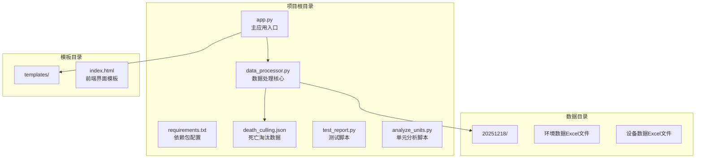
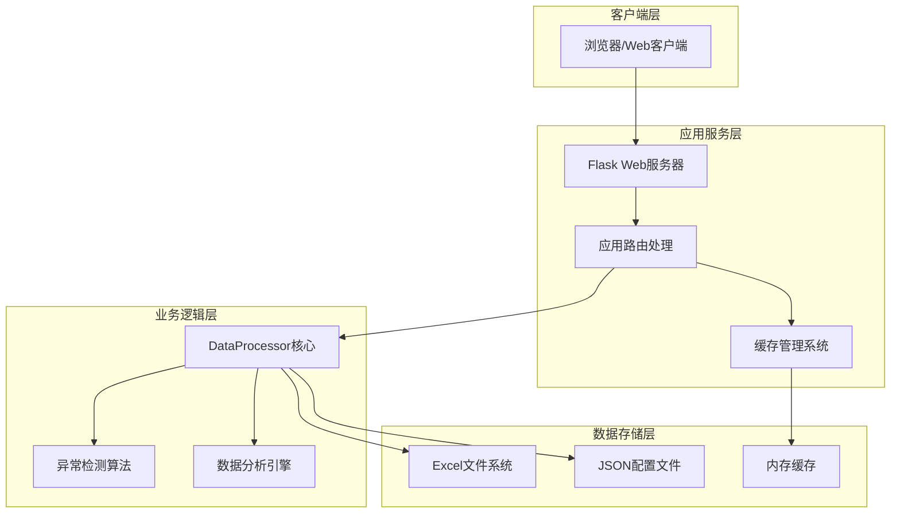
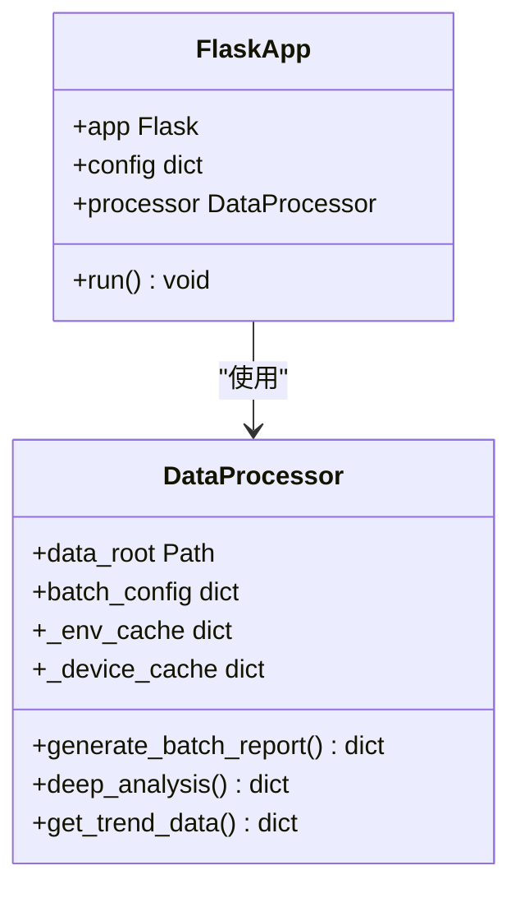
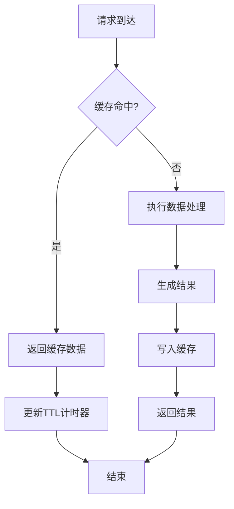
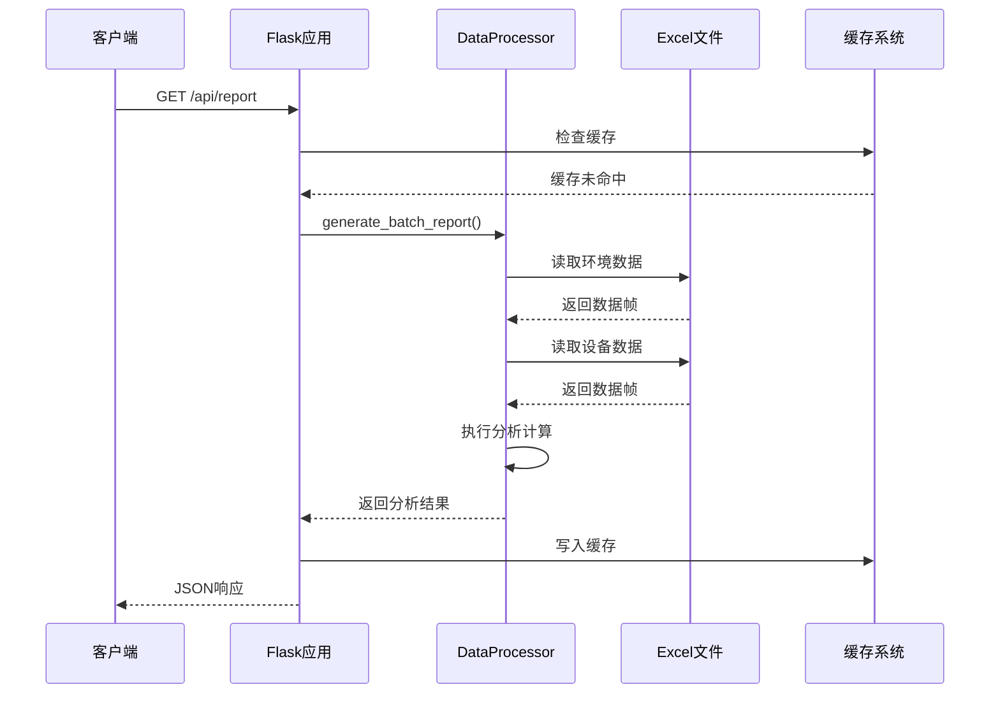

# 部署与运维

<cite>
**本文档引用的文件**
- [app.py](file://app.py)
- [requirements.txt](file://requirements.txt)
- [data_processor.py](file://data_processor.py)
- [templates/index.html](file://templates/index.html)
- [death_culling.json](file://death_culling.json)
- [test_report.py](file://test_report.py)
- [analyze_units.py](file://analyze_units.py)
</cite>

## 目录
1. [简介](#简介)
2. [项目结构](#项目结构)
3. [核心组件](#核心组件)
4. [架构概览](#架构概览)
5. [详细组件分析](#详细组件分析)
6. [部署方案](#部署方案)
7. [性能优化](#性能优化)
8. [监控与日志](#监控与日志)
9. [故障排除](#故障排除)
10. [备份与恢复](#备份与恢复)
11. [安全配置](#安全配置)
12. [结论](#结论)

## 简介

猪场环控数据分析系统是一个基于Flask的Web应用，用于分析和展示育肥猪批次的环境控制数据。该系统能够处理Excel格式的环境数据和设备数据，生成详细的环控分析报告，包括温度、湿度、CO2浓度、压差等关键指标的统计分析，以及设备运行状态和异常检测。

## 项目结构

该项目采用简洁的文件组织结构，主要包含以下核心文件：



**图表来源**
- [app.py:1-133](file://app.py#L1-L133)
- [data_processor.py:1-1559](file://data_processor.py#L1-L1559)

**章节来源**
- [app.py:1-133](file://app.py#L1-L133)
- [requirements.txt:1-4](file://requirements.txt#L1-L4)
- [templates/index.html:1-800](file://templates/index.html#L1-L800)

## 核心组件

### Web应用层

应用使用Flask框架构建，提供RESTful API接口和Web界面：

- **路由系统**：提供批处理查询、报告生成、趋势分析等功能
- **缓存机制**：内置内存缓存系统，支持TTL过期控制
- **模板渲染**：使用Jinja2模板引擎渲染前端界面

### 数据处理层

核心数据处理逻辑由DataProcessor类实现：

- **Excel数据解析**：使用pandas和openpyxl处理Excel文件
- **批量报告生成**：生成批次级别的综合分析报告
- **异常检测**：基于动态阈值的环境参数异常检测
- **设备分析**：分析变频风机、定速风机等设备运行状态

### 前端界面

采用现代化的响应式设计：

- **图表可视化**：使用Chart.js展示环境数据趋势
- **交互式界面**：支持批次选择、日期筛选、标签页切换
- **实时反馈**：加载状态指示和错误处理

**章节来源**
- [app.py:42-133](file://app.py#L42-L133)
- [data_processor.py:54-838](file://data_processor.py#L54-L838)
- [templates/index.html:1-800](file://templates/index.html#L1-L800)

## 架构概览

系统采用三层架构设计，实现了清晰的职责分离：



**图表来源**
- [app.py:1-133](file://app.py#L1-L133)
- [data_processor.py:1-1559](file://data_processor.py#L1-L1559)

## 详细组件分析

### 应用入口组件

应用入口负责初始化Flask应用和配置：



**图表来源**
- [app.py:6-11](file://app.py#L6-L11)
- [data_processor.py:54-62](file://data_processor.py#L54-L62)

### 缓存系统组件

系统实现了两级缓存机制：



**图表来源**
- [app.py:15-40](file://app.py#L15-L40)
- [data_processor.py:12-48](file://data_processor.py#L12-L48)

### 数据处理组件

数据处理器负责复杂的分析逻辑：



**图表来源**
- [app.py:59-66](file://app.py#L59-L66)
- [data_processor.py:238-295](file://data_processor.py#L238-L295)

**章节来源**
- [app.py:1-133](file://app.py#L1-L133)
- [data_processor.py:1-1559](file://data_processor.py#L1-L1559)

## 部署方案

### 生产环境部署

#### 服务器配置要求

- **操作系统**：Linux (Ubuntu 18.04+ 或 CentOS 7+)
- **CPU**：至少2核处理器
- **内存**：至少4GB RAM
- **存储**：至少20GB可用空间
- **网络**：开放80端口用于HTTP访问

#### Python环境设置

```bash
# 创建虚拟环境
python3 -m venv venv
source venv/bin/activate  # Linux/Mac
# 或 venv\Scripts\activate  # Windows

# 升级pip
pip install --upgrade pip

# 安装依赖
pip install -r requirements.txt
```

#### 依赖包安装

系统依赖四个核心包：
- Flask >= 2.3.0：Web框架
- pandas >= 2.0.0：数据处理
- openpyxl >= 3.1.0：Excel文件处理

#### Web服务器配置

##### 使用Gunicorn部署

```bash
# 安装Gunicorn
pip install gunicorn

# 启动应用
gunicorn --workers 4 --bind 0.0.0.0:5000 app:app

# 配置Gunicorn参数
gunicorn --workers 4 \
        --bind 0.0.0.0:5000 \
        --timeout 120 \
        --keep-alive 2 \
        --max-requests 1000 \
        --max-requests-jitter 50 \
        app:app
```

##### Nginx反向代理配置

```nginx
upstream app_server {
    server 127.0.0.1:5000;
    server 127.0.0.1:5001;
    server 127.0.0.1:5002;
    server 127.0.0.1:5003;
}

server {
    listen 80;
    server_name your-domain.com;
    
    location / {
        proxy_pass http://app_server;
        proxy_set_header Host $host;
        proxy_set_header X-Real-IP $remote_addr;
        proxy_set_header X-Forwarded-For $proxy_add_x_forwarded_for;
        proxy_set_header X-Forwarded-Proto $scheme;
        
        # 超时设置
        proxy_connect_timeout 60s;
        proxy_send_timeout 120s;
        proxy_read_timeout 120s;
        
        # 缓冲设置
        proxy_buffering on;
        proxy_buffer_size 128k;
        proxy_buffers 4 256k;
        proxy_busy_buffers_size 256k;
    }
    
    # 静态文件缓存
    location /static {
        expires 1y;
        add_header Cache-Control "public, immutable";
    }
}
```

#### Docker容器化部署

```dockerfile
FROM python:3.9-slim

# 设置工作目录
WORKDIR /app

# 复制依赖文件
COPY requirements.txt .

# 安装依赖
RUN pip install --no-cache-dir -r requirements.txt

# 复制应用代码
COPY . .

# 创建非root用户
RUN adduser --disabled-password --gecos '' appuser && \
    chown -R appuser:appuser /app
USER appuser

# 暴露端口
EXPOSE 5000

# 健康检查
HEALTHCHECK --interval=30s --timeout=3s --start-period=5s --retries=3 \
    CMD curl -f http://localhost:5000/health || exit 1

# 启动命令
CMD ["gunicorn", "--bind", "0.0.0.0:5000", "--workers", "4", "app:app"]
```

```yaml
# docker-compose.yml
version: '3.8'

services:
  web:
    build: .
    ports:
      - "5000:5000"
    volumes:
      - ./data:/app/data
      - ./logs:/app/logs
    environment:
      - FLASK_ENV=production
      - PYTHONPATH=/app
    restart: unless-stopped
    healthcheck:
      test: ["CMD", "curl", "-f", "http://localhost:5000/health"]
      interval: 30s
      timeout: 10s
      retries: 3
      start_period: 40s

  nginx:
    image: nginx:alpine
    ports:
      - "80:80"
      - "443:443"
    volumes:
      - ./nginx.conf:/etc/nginx/nginx.conf
      - ./ssl:/etc/nginx/ssl
    depends_on:
      - web
    restart: unless-stopped
```

**章节来源**
- [requirements.txt:1-4](file://requirements.txt#L1-L4)
- [app.py:131-133](file://app.py#L131-L133)

## 性能优化

### 缓存策略

系统实现了多层次的缓存机制：

#### 内存缓存优化

```python
# 全局缓存配置
_CACHE = {}
_CACHE_TTL = 300  # 5分钟过期时间

def get_cache(key):
    """获取缓存数据"""
    if key in _CACHE:
        cached_time, cached_value = _CACHE[key]
        if time.time() - cached_time < _CACHE_TTL:
            return cached_value
    return None

def set_cache(key, value):
    """设置缓存数据"""
    _CACHE[key] = (time.time(), value)
```

#### 数据库连接池

虽然系统使用文件系统而非传统数据库，但可以考虑以下优化：

```python
# Excel文件缓存
class DataProcessor:
    def __init__(self, data_root: str):
        self._sheet_cache = {}
        self._report_cache = {}
    
    def _load_sheet(self, file_path: str, sheet_name: str):
        """带缓存的Excel文件加载"""
        key = f"{file_path}::{sheet_name}"
        if key in self._sheet_cache:
            return self._sheet_cache[key]
        
        df = pd.read_excel(file_path, sheet_name=sheet_name, engine='openpyxl')
        self._sheet_cache[key] = df
        return df
```

### 并发处理优化

#### 异步任务队列

```python
from celery import Celery

celery_app = Celery('pici_tasks', broker='redis://localhost:6379/0')

@celery_app.task(bind=True)
def process_batch_report(self, batch_id, date):
    """异步处理批次报告"""
    try:
        processor = DataProcessor('.')
        report = processor.generate_batch_report(batch_id, date)
        return report
    except Exception as exc:
        # 重试机制
        raise self.retry(exc=exc, countdown=60, max_retries=3)
```

#### 负载均衡配置

```nginx
upstream app_server {
    # 启用健康检查
    server 127.0.0.1:5000 max_fails=3 fail_timeout=30s;
    server 127.0.0.1:5001 max_fails=3 fail_timeout=30s;
    server 127.0.0.1:5002 max_fails=3 fail_timeout=30s;
    server 127.0.0.1:5003 max_fails=3 fail_timeout=30s;
}

server {
    listen 80;
    location / {
        proxy_pass http://app_server;
        # 启用负载均衡
        proxy_next_upstream error timeout invalid_header http_500 http_502 http_503;
        proxy_next_upstream_tries 3;
    }
}
```

**章节来源**
- [app.py:15-40](file://app.py#L15-L40)
- [data_processor.py:130-140](file://data_processor.py#L130-L140)

## 监控与日志

### 系统性能监控

#### 应用监控指标

```python
import logging
from flask import Flask
from datetime import datetime

# 配置日志
logging.basicConfig(
    level=logging.INFO,
    format='%(asctime)s %(levelname)s %(name)s %(message)s',
    handlers=[
        logging.FileHandler('app.log'),
        logging.StreamHandler()
    ]
)

logger = logging.getLogger(__name__)

@app.before_request
def log_request_info():
    logger.info(f'Request: {request.method} {request.url}')

@app.after_request
def log_response_info(response):
    logger.info(f'Response: {response.status_code} {response.content_length}')
    return response
```

#### 性能监控中间件

```python
from functools import wraps
import time

def monitor_performance(func):
    """性能监控装饰器"""
    @wraps(func)
    def wrapper(*args, **kwargs):
        start_time = time.time()
        try:
            result = func(*args, **kwargs)
            return result
        finally:
            end_time = time.time()
            duration = end_time - start_time
            logger.info(f'{func.__name__} took {duration:.2f}s')
    return wrapper

@monitor_performance
@app.route('/api/report')
def get_report():
    # 处理逻辑
    pass
```

### 错误日志收集

#### 结构化错误日志

```python
import traceback
import json
from datetime import datetime

@app.errorhandler(Exception)
def handle_exception(e):
    # 记录详细错误信息
    error_info = {
        'timestamp': datetime.now().isoformat(),
        'endpoint': request.endpoint,
        'method': request.method,
        'url': request.url,
        'user_agent': str(request.headers.get('User-Agent')),
        'error_type': type(e).__name__,
        'error_message': str(e),
        'traceback': traceback.format_exc()
    }
    
    logger.error(f'Application error: {json.dumps(error_info)}')
    
    return jsonify({
        'success': False,
        'message': 'Internal server error'
    }), 500
```

### 用户行为追踪

#### 访问统计

```python
from collections import defaultdict
import json

# 访问统计
access_stats = defaultdict(int)

@app.after_request
def track_user_behavior(response):
    endpoint = request.endpoint
    if endpoint:
        access_stats[endpoint] += 1
        
        # 保存到文件
        with open('access_log.json', 'w') as f:
            json.dump(dict(access_stats), f)
    
    return response
```

**章节来源**
- [app.py:1-133](file://app.py#L1-L133)

## 故障排除

### 常见问题诊断

#### 数据加载失败

**问题现象**：Excel文件读取报错

**解决方案**：
1. 检查文件路径和权限
2. 验证Excel文件格式完整性
3. 确认文件编码格式

```python
def safe_load_excel(file_path, sheet_name):
    """安全的Excel文件加载"""
    try:
        df = pd.read_excel(file_path, sheet_name=sheet_name, engine='openpyxl')
        return df
    except Exception as e:
        logger.error(f"Excel加载失败 {file_path}: {e}")
        return pd.DataFrame()
```

#### 内存不足问题

**问题现象**：大数据集处理时内存溢出

**解决方案**：
1. 实施分块读取策略
2. 优化数据类型转换
3. 及时释放缓存数据

```python
def optimize_memory_usage():
    """内存优化策略"""
    # 清理缓存
    clear_cache()
    
    # 释放pandas缓存
    pd.options.mode.copy_on_write = True
    
    # 减少数据精度
    pd.set_option('precision', 2)
```

#### API响应超时

**问题现象**：长时间查询导致请求超时

**解决方案**：
1. 实现分页查询
2. 添加进度条反馈
3. 优化查询算法

```python
@app.route('/api/trend')
def get_trend():
    page = int(request.args.get('page', 1))
    page_size = int(request.args.get('page_size', 7))
    
    # 添加超时保护
    try:
        trend_data = processor.get_trend_data(batch_id, date, page, page_size)
        return jsonify({"success": True, "data": clean_dict(trend_data)})
    except TimeoutError:
        return jsonify({
            "success": False, 
            "message": "查询超时，请减少数据量或稍后重试"
        }), 408
```

### 系统健康检查

#### 健康检查端点

```python
@app.route('/health')
def health_check():
    """健康检查端点"""
    checks = {
        'database': check_database_connection(),
        'disk_space': check_disk_space(),
        'memory_usage': check_memory_usage(),
        'excel_files': check_excel_files(),
        'cache_status': check_cache_status()
    }
    
    all_healthy = all(checks.values())
    
    return jsonify({
        'status': 'healthy' if all_healthy else 'unhealthy',
        'checks': checks,
        'timestamp': datetime.now().isoformat()
    })

def check_database_connection():
    """检查数据库连接"""
    return True  # 文件系统无需数据库连接

def check_excel_files():
    """检查Excel文件状态"""
    try:
        # 测试文件访问
        test_file = Path('20251218') / 'test.xlsx'
        return test_file.exists()
    except:
        return False
```

**章节来源**
- [data_processor.py:134-140](file://data_processor.py#L134-L140)
- [app.py:126-129](file://app.py#L126-L129)

## 备份与恢复

### 数据备份策略

#### 自动备份脚本

```bash
#!/bin/bash
# backup.sh

BACKUP_DIR="/var/backups/pici_system"
DATE=$(date +%Y%m%d_%H%M%S)
APP_DIR="/opt/pici_system"

# 创建备份目录
mkdir -p $BACKUP_DIR/$DATE

# 备份数据文件
cp -r $APP_DIR/data/* $BACKUP_DIR/$DATE/

# 备份配置文件
cp $APP_DIR/death_culling.json $BACKUP_DIR/$DATE/

# 备份日志文件
cp -r $APP_DIR/logs/* $BACKUP_DIR/$DATE/

# 清理7天前的备份
find $BACKUP_DIR -type d -mtime +7 -exec rm -rf {} +

echo "Backup completed: $DATE"
```

#### 数据恢复流程

```bash
#!/bin/bash
# restore.sh

BACKUP_DATE=$1
BACKUP_DIR="/var/backups/pici_system"

if [ -z $BACKUP_DATE ]; then
    echo "Usage: restore.sh YYYYMMDD_HHMMSS"
    exit 1
fi

if [ ! -d "$BACKUP_DIR/$BACKUP_DATE" ]; then
    echo "Backup not found"
    exit 1
fi

# 停止应用
sudo systemctl stop pici-app

# 恢复数据
cp -r $BACKUP_DIR/$BACKUP_DATE/* /opt/pici_system/data/

# 启动应用
sudo systemctl start pici-app

echo "Restore completed"
```

### 备份监控

#### 备份状态监控

```python
import smtplib
from email.mime.text import MIMEText

def send_backup_alert(subject, message):
    """发送备份告警邮件"""
    # 邮件配置
    smtp_server = "smtp.gmail.com"
    sender_email = "admin@pici.com"
    receiver_email = "ops@pici.com"
    
    msg = MIMEText(message)
    msg['Subject'] = subject
    msg['From'] = sender_email
    msg['To'] = receiver_email
    
    try:
        server = smtplib.SMTP(smtp_server, 587)
        server.starttls()
        server.login(sender_email, "password")
        server.send_message(msg)
        server.quit()
    except Exception as e:
        logger.error(f"Backup alert failed: {e}")
```

**章节来源**
- [death_culling.json:1-27](file://death_culling.json#L1-L27)

## 安全配置

### Web应用安全

#### CSRF防护

```python
from flask_wtf.csrf import CSRFProtect

csrf = CSRFProtect()

# 初始化CSRF保护
csrf.init_app(app)

# 配置CSRF密钥
app.config['SECRET_KEY'] = 'your-secret-key-here'
```

#### 输入验证

```python
from flask import request
import re

def validate_input(batch_id, date):
    """输入参数验证"""
    # 批次ID验证
    if not re.match(r'^[0-9]{8}$', batch_id):
        raise ValueError("Invalid batch ID format")
    
    # 日期格式验证
    if not re.match(r'^\d{4}-\d{2}-\d{2}$', date):
        raise ValueError("Invalid date format")
    
    return True

@app.route('/api/report')
def get_report():
    try:
        batch_id = request.args.get('batch_id', '20251218')
        date = request.args.get('date', '2026-03-10')
        
        validate_input(batch_id, date)
        
        report = get_report_cached(batch_id, date)
        return jsonify({"success": True, "data": clean_dict(report)})
        
    except ValueError as e:
        return jsonify({"success": False, "message": str(e)}), 400
```

#### 安全头配置

```python
from flask_talisman import Talisman

# 配置安全头
Talisman(app, 
    force_https_permanent=True,
    frame_options='DENY',
    content_security_policy={
        'default-src': "'self'",
        'script-src': "'self' 'unsafe-inline'",
        'style-src': "'self' 'unsafe-inline'"
    }
)
```

### 数据安全

#### 敏感数据保护

```python
import hashlib
import secrets

def hash_sensitive_data(data):
    """敏感数据哈希处理"""
    salt = secrets.token_hex(16)
    return hashlib.sha256((data + salt).encode()).hexdigest()

def secure_data_access():
    """安全的数据访问控制"""
    # 检查用户权限
    if not check_user_permission():
        return jsonify({"success": False, "message": "Permission denied"}), 403
    
    # 加密敏感数据传输
    return encrypted_response
```

#### 文件访问控制

```python
import os
from pathlib import Path

def secure_file_access(file_path):
    """安全的文件访问控制"""
    # 验证文件路径
    if not str(Path(file_path)).startswith(str(Path('.').resolve())):
        raise ValueError("Invalid file path")
    
    # 检查文件是否存在
    if not Path(file_path).exists():
        raise FileNotFoundError("File not found")
    
    # 检查文件扩展名
    allowed_extensions = ['.xlsx', '.xls', '.json']
    if Path(file_path).suffix not in allowed_extensions:
        raise ValueError("File type not allowed")
    
    return True
```

### 网络安全

#### 防火墙配置

```bash
# iptables规则示例
iptables -A INPUT -p tcp --dport 80 -j ACCEPT
iptables -A INPUT -p tcp --dport 443 -j ACCEPT
iptables -A INPUT -p tcp --dport 5000 -j ACCEPT
iptables -A INPUT -j DROP

# 限制连接数
iptables -A INPUT -p tcp --dport 80 -m limit --limit 25/minute -j ACCEPT
iptables -A INPUT -p tcp --dport 80 -m connlimit --connlimit-above 100 -j DROP
```

#### SSL/TLS配置

```nginx
server {
    listen 443 ssl http2;
    server_name your-domain.com;
    
    ssl_certificate /etc/ssl/certs/your_domain.crt;
    ssl_certificate_key /etc/ssl/private/your_domain.key;
    
    ssl_protocols TLSv1.2 TLSv1.3;
    ssl_ciphers ECDHE-RSA-AES256-GCM-SHA512:DHE-RSA-AES256-GCM-SHA512:ECDHE-RSA-AES256-GCM-SHA384:DHE-RSA-AES256-GCM-SHA384;
    ssl_prefer_server_ciphers off;
    
    # HSTS配置
    add_header Strict-Transport-Security "max-age=31536000; includeSubDomains" always;
}
```

**章节来源**
- [app.py:1-133](file://app.py#L1-L133)
- [data_processor.py:1500-1559](file://data_processor.py#L1500-L1559)

## 结论

猪场环控数据分析系统提供了完整的生产环境部署和运维解决方案。通过采用现代的微服务架构、容器化部署和完善的监控体系，系统能够在保证高性能的同时确保稳定性和可维护性。

### 关键优势

1. **模块化设计**：清晰的职责分离使得系统易于维护和扩展
2. **性能优化**：多级缓存和异步处理提升了系统响应速度
3. **监控完善**：全面的日志记录和健康检查确保系统可观测性
4. **安全可靠**：多层次的安全防护保障了数据和应用安全
5. **部署灵活**：支持多种部署方式满足不同环境需求

### 最佳实践建议

1. **持续监控**：建立完善的监控体系，定期审查系统性能
2. **定期备份**：制定严格的备份策略，确保数据安全
3. **安全更新**：及时更新依赖包和系统补丁
4. **容量规划**：根据业务增长预测合理规划资源
5. **文档维护**：保持部署文档和操作手册的最新状态

通过遵循本文档提供的部署和运维指南，可以确保猪场环控数据分析系统在生产环境中稳定高效地运行。