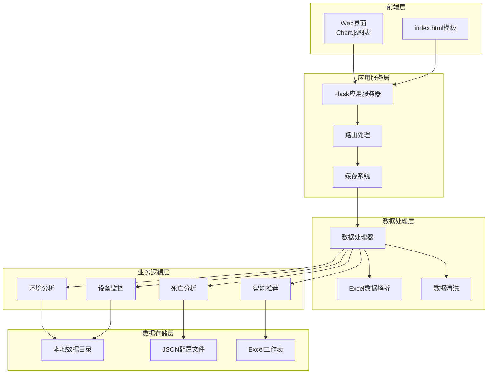

# 项目概述

<cite>
**本文档引用的文件**
- [app.py](file://app.py)
- [data_processor.py](file://data_processor.py)
- [analyze_units.py](file://analyze_units.py)
- [requirements.txt](file://requirements.txt)
- [templates/index.html](file://templates/index.html)
- [test_report.py](file://test_report.py)
- [death_culling.json](file://death_culling.json)
</cite>

## 目录
1. [项目简介](#项目简介)
2. [核心价值与目标用户](#核心价值与目标用户)
3. [系统架构设计](#系统架构设计)
4. [关键功能特性](#关键功能特性)
5. [技术栈概览](#技术栈概览)
6. [部署要求](#部署要求)
7. [规模化应用场景](#规模化应用场景)
8. [系统优势与创新点](#系统优势与创新点)
9. [总结](#总结)

## 项目简介

猪场环控数据分析系统是一个专为规模化猪场环境控制而设计的智能化分析平台。该系统通过整合环境监测数据、设备运行状态和生产性能指标，为农场管理者提供全面的环控分析报告和决策支持。系统能够实时监控温度、湿度、CO2浓度、压差等关键环境参数，同时跟踪设备运行状态和死亡淘汰数据，实现环境参数与生产结果的深度关联分析。

该系统特别针对育肥猪批次管理场景，提供从单个单元到整个批次的多层次分析能力，帮助农场实现精准化环控管理和科学化生产决策。

## 核心价值与目标用户

### 核心价值

**提升生产效益**
- 通过精准的环境控制，提高饲料转化率和日增重
- 减少因环境应激导致的发病率和死亡率
- 优化设备运行效率，降低运营成本

**降低管理风险**
- 实时预警环境异常，预防重大损失
- 提供数据驱动的决策支持
- 建立标准化的环控管理体系

**促进科学养殖**
- 基于大数据分析的环控优化建议
- 环境参数与生产性能的关联性分析
- 设备维护和故障预防指导

### 目标用户群体

**农场管理员**
- 负责日常环控操作和生产管理
- 需要直观的环境监控界面和报警提醒
- 关注生产指标和经济效益

**数据分析师**
- 负责深度分析环控数据和生产趋势
- 需要详细的数据报表和统计分析
- 关注环境参数与生产性能的关系

**技术支持人员**
- 负责设备维护和系统运维
- 需要设备状态监控和故障诊断
- 关注系统稳定性和数据准确性

## 系统架构设计

### 整体架构图



**架构图来源**
- [app.py:1-133](file://app.py#L1-L133)
- [data_processor.py:54-1559](file://data_processor.py#L54-L1559)

### 组件关系分析

系统采用分层架构设计，各组件职责明确，耦合度低，便于维护和扩展：

**Web应用层**：基于Flask框架构建RESTful API服务，提供HTTP接口和Web界面

**数据处理层**：核心业务逻辑，负责数据解析、清洗、分析和报告生成

**缓存层**：实现内存级缓存，提升数据访问性能和响应速度

**数据存储层**：本地文件系统存储，支持Excel格式的结构化数据

## 关键功能特性

### 环境参数监控分析

系统能够全面监控以下关键环境参数：

**温度控制**
- 实时温度监测和历史趋势分析
- 温度均匀性评估和热点识别
- 动态阈值调整适应不同生长阶段

**湿度管理**
- 湿度水平监测和异常预警
- 与温度的协同效应分析
- 加湿设备运行效果评估

**空气质量监测**
- CO2浓度实时监控和超标预警
- 通风效果与空气质量关联分析
- 氨气等有害气体风险评估

**压差控制**
- 舍内外压差监测和负压预警
- 通风系统运行状态分析
- 冷空气倒灌风险评估

### 设备运行状态监测

**风机系统监控**
- 变频风机运行频率和效率分析
- 定速风机开启率和运行时长统计
- 风机配置合理性评估

**设备健康状态**
- 设备安装配置完整性检查
- 传感器配置与实际安装对比
- 设备运行时长和维护周期提醒

### 死亡淘汰数据关联分析

系统提供深度的死亡数据关联分析：

**环境因素关联**
- 死亡事件与环境参数的时空关联
- 不同死亡原因的环境风险因素分析
- 环境应激与疾病发生的因果关系

**风险预警机制**
- 基于历史数据的死亡风险预测
- 异常环境条件下的预警提示
- 预防性管理建议生成

### 智能推荐系统

基于数据分析结果，系统提供个性化的优化建议：

**优先级排序**
- 高中低风险分级的处理优先级
- 成本效益最优的改进方案
- 紧急程度和重要性的综合评估

**针对性建议**
- 具体的操作步骤和执行标准
- 预期效果和实施时限
- 监测验证的方法和指标

## 技术栈概览

### 后端技术栈

**Python生态系统**
- Flask 2.3.0+：轻量级Web框架，提供RESTful API服务
- Pandas 2.0.0+：强大的数据处理和分析库
- OpenPyXL 3.1.0+：Excel文件读写和解析

**核心库功能**
- 数据结构化处理：Excel工作表的自动解析和转换
- 数值计算：统计分析、趋势预测和异常检测
- 文件操作：本地数据存储和配置管理

### 前端技术栈

**现代化Web界面**
- Chart.js：交互式图表展示，支持多维度数据可视化
- 响应式设计：适配桌面和移动设备访问
- 实时数据更新：WebSocket或轮询机制确保数据新鲜度

**用户体验优化**
- 卡片式布局：清晰的信息层次和视觉引导
- 风险等级标识：颜色编码的直观状态显示
- 交互式筛选：按批次、日期、单元等维度筛选数据

### 数据存储架构

**文件系统存储**
- Excel格式：天然的表格数据格式，便于数据录入和编辑
- 结构化目录：按批次和日期组织数据文件
- JSON配置：灵活的配置管理和用户数据存储

**缓存策略**
- 内存缓存：5分钟TTL的短期缓存，平衡性能和数据新鲜度
- 多级缓存：应用层和系统层双重缓存保护
- 缓存失效：数据变更时自动清理相关缓存

## 部署要求

### 系统环境要求

**操作系统兼容性**
- Windows 10/11（推荐）
- Linux Ubuntu 18.04+
- macOS 10.15+

**硬件资源需求**
- CPU：Intel i5或同等性能的AMD处理器
- 内存：8GB RAM（推荐16GB）
- 存储空间：至少500MB可用空间
- 网络：稳定的局域网连接

### 软件依赖安装

**Python环境**
- Python 3.8或更高版本
- pip包管理器
- 虚拟环境（推荐）

**依赖包安装**
```bash
pip install -r requirements.txt
```

**依赖包说明**
- Flask：Web应用框架，提供HTTP服务
- pandas：数据处理和分析核心库
- openpyxl：Excel文件读写支持

### 部署步骤

**基础环境准备**
1. 安装Python 3.8+
2. 创建虚拟环境并激活
3. 安装依赖包
4. 准备数据目录结构

**数据准备**
1. 创建批次数据目录（如20251218）
2. 准备环境数据Excel文件
3. 准备设备数据Excel文件
4. 初始化配置文件

**启动服务**
```bash
python app.py
```
默认监听localhost:5000端口

## 规模化应用场景

### 大型猪场部署

**多批次管理**
- 支持同时监控多个育肥批次
- 批次间的横向对比分析
- 统一的管理标准和操作流程

**分布式数据采集**
- 多个数据采集点的集中管理
- 实时数据同步和备份
- 异地数据访问和共享

**自动化运维**
- 定时任务和批处理作业
- 自动化报表生成和发送
- 智能告警和通知机制

### 数据分析应用

**趋势预测**
- 基于历史数据的环境参数预测
- 生产性能的长期趋势分析
- 市场价格变化的影响评估

**优化建议**
- 基于机器学习的优化策略
- 成本效益分析和ROI评估
- 风险评估和应急预案制定

## 系统优势与创新点

### 技术创新

**动态阈值调整**
- 根据猪只日龄自动调整环境控制标准
- 考虑不同生长阶段的生理需求差异
- 提高环境控制的精准性和有效性

**多维度关联分析**
- 环境参数与生产性能的深度关联
- 设备状态与环境质量的相互影响
- 死亡数据与环境因素的因果关系

**智能预警机制**
- 基于统计模型的异常检测
- 多因子组合风险评估
- 预测性维护和故障预警

### 业务价值

**提升生产效率**
- 通过精准环控提高饲料转化率
- 减少因环境应激导致的生产损失
- 优化设备使用效率和维护成本

**降低运营风险**
- 实时监控和预警机制
- 标准化操作流程和管理制度
- 数据驱动的决策支持系统

**增强竞争优势**
- 基于数据的精细化管理
- 可复制的成功经验和最佳实践
- 持续改进和优化的能力

## 总结

猪场环控数据分析系统代表了现代智慧农业的发展方向，通过先进的数据分析技术和科学的管理理念，为规模化猪场提供了全方位的数字化解决方案。系统不仅能够满足当前的生产管理需求，更为未来的智能化升级奠定了坚实基础。

该系统的核心优势在于其高度的实用性、良好的可扩展性和优秀的用户体验。通过精确的环境控制、全面的数据分析和智能的决策支持，系统能够帮助农场实现从传统管理向现代化、智能化管理的转型，最终达到提升效益、降低成本、保障动物福利的目标。

随着技术的不断发展和完善，该系统将继续演进，为畜牧业的可持续发展贡献更大的价值。